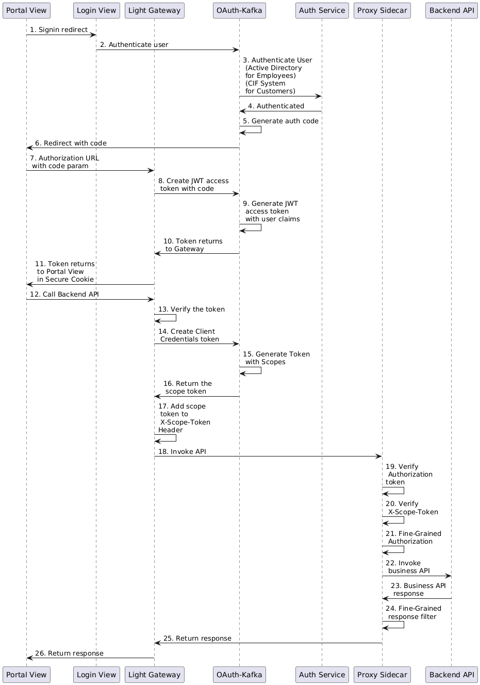

# Authentication & Authorization

Light-Portal is an single page application and it uses both OAuth 2.0 Authorization Code and Client Credentials flows. 

The below pattern depicts the end-to-end flow recommended by the Light Platform when SPA calls downstream APIs.

### Sequence Diagram

```
@startuml
participant "Portal View" as PortalView
participant "Login View" as LoginView
participant "Light Gateway" as Gateway
participant "OAuth-Kafka" as OAuthKafka
participant "Auth Service" as AuthService
participant "Backend API" as BackendAPI

PortalView -> LoginView: 1. Signin redirect
LoginView -> OAuthKafka: 2. Authenticate user
OAuthKafka -> AuthService: 3. Authenticate User\n(Active Directory\nfor Employees)\n(CIF System\nfor Customers)
AuthService -> OAuthKafka: 4. Authenticated
OAuthKafka -> OAuthKafka: 5. Generate auth code
OAuthKafka -> PortalView: 6. Redirect with code
PortalView -> Gateway: 7. Authorization URL \nwith code param
Gateway -> OAuthKafka: 8. Create JWT access \ntoken with code
OAuthKafka -> OAuthKafka: 9. Generate JWT \naccess token \nwith user claims
OAuthKafka -> Gateway: 10. Token returns \nto Gateway
Gateway -> PortalView: 11. Token returns \nto Portal View \nin Secure Cookie
PortalView -> Gateway: 12. Call Backend API
Gateway -> Gateway: 13. Verify the token
Gateway -> OAuthKafka: 14. Create Client \nCredentials token
OAuthKafka -> OAuthKafka: 15. Generate Token \nwith Scopes
OAuthKafka -> Gateway: 16. Return the \scope token
Gateway -> Gateway: 17. Add scope \ntoken to \nX-Scope-Token \nHeader
Gateway -> BackendAPI: 18. Invoke API
BackendAPI -> BackendAPI: 19. Verify \nAuthorization \ntoken
BackendAPI -> BackendAPI: 20. Verify \nX-Scope-Token
BackendAPI -> Gateway: 21. Return response
Gateway -> PortalView: 22. Return response

@enduml
```



1. When a user hit the website to access the single page application, the Light Gateway will serve the single page application on users browser. By default, the user is not logged in and he/she can only access limited features on the site. If the user want to access more features, he/she can click the user button on the header and click sign in menu. This will allow the browser to redirect from the Portal View to Login View which is served by the same instance of Light Gateway. 

2. On the Login View site, he/she can input the username/password or choose Google/Facebook for authentication. Once the Signin form is submitted, the request goes to the Light Gateway with user credentials. The Light Gateway will route the request to the OAuth Kafka service.

3. OAuth Kafka has many Authenticator implementations that can be used to authenticate the user credential. For example, use the Light Portal user database to authenticate, use Active Directory to authenticate employees or use CIF service to authenticate customers. 

4. Once authentication is completed successfully, it will response to the OAuth Kafka with the authentication result. 

5. Upon successful authentication, OAuth Kafka will generate an authorization code which is a UUID associated to the user profile. 

6. OAuth Kafka redirect the authorization code to the Portal View browser through Gateway. 

7. The Portal View single page application doesn't have this redirct route, so that request will be sent to the Gateway with the code as a query parameter. 

8. The StatelessAuthHandler on the Gateway will handle the request and send a token request to the OAuth Kafka to get a JWT access token. 

9. OAuth Kafka will generate an access token with user claims in the JWT custom claims and drop the code as it is used only once.

10. The authorization code token is returned to the Gateway. 

11. The StatelessAuthHandler on the Gateway will put the token into a secure cookie and send to the Portal View.

12. When Portal View access one of the Backend APIs, it sends the API request to the Gateway with the cookies. 

13. The StatelessAuthHandler on the Gateway will verify the token in the secure cookie and put it into the Authorization header of the request.

14. Once the token is verified successfully, the TokenHandler on the Gateway will issue a token request to get a client credentials token to the OAuth Kafka based on the path prefix of the API endpoint. 

15. OAuth Kafka generate a client credentials token with the scope that can access the downstream service. 

16. The client credentials token is returned to the Gateway. 

17. The TokenHandler on the Gateway will put this token into X-Scope-Token header of the original request. 

18. The Gateway router the original request to the downstream Backend API. 

19. The Backend API will verify the Authorization token for the signature and expiration etc. 

20. The Backend API will verify the X-Scope-Token for signature, expiration and scope etc. 

21. The Backend API retuns the response once both tokens are verified. 

22. The response returns to the Portal View to render the page. 

 
