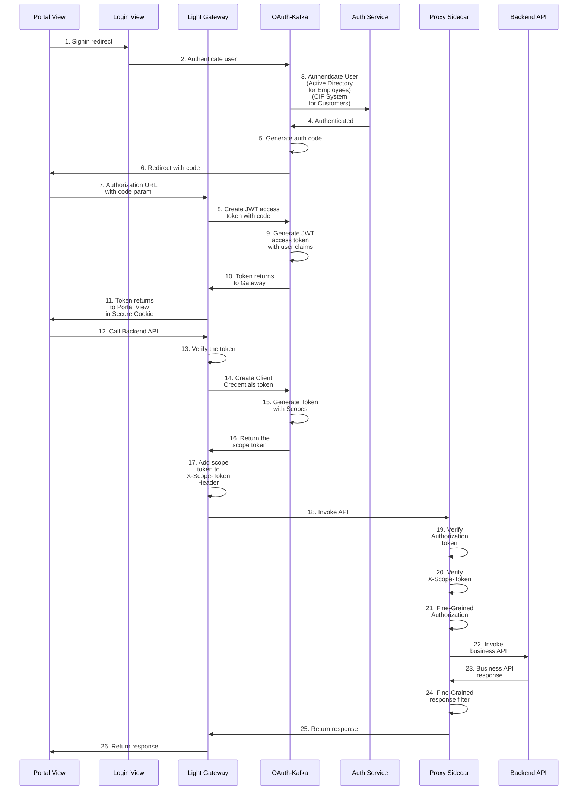

# Authentication & Authorization

Light-Portal is a single-page application (SPA) that utilizes both the OAuth 2.0 Authorization Code and Client Credentials flows.

The following pattern illustrates the end-to-end process recommended by the Light Platform for an SPA interacting with downstream APIs.

### Sequence Diagram

1. When a user visits the website to access the single-page application (SPA), the Light Gateway serves the SPA to the user's browser. Each single page application will have a dedicated Light Gateway instance acts as a BFF. By default, the user is not logged in and can only access limited site features. To unlock additional features, the user can click the `User` button in the header and select the `Sign In` menu. This action redirects the browser from the Portal View to the Login View, both served by the same Light Gateway instance.

2. On the Login View page, the user can either input a username and password or choose Google/Facebook for authentication. When the login form is submitted, the request is sent to the Light Gateway with the user's credentials. The Gateway forwards this request to the OAuth Kafka service.

3. OAuth Kafka supports multiple authenticator implementations to verify user credentials. Examples include authenticating via the Light Portal user database, Active Directory for employees, or CIF service for customers.

4. Once authentication is successfully completed, the OAuth Kafka responds with the authentication result.

5. Upon successful authentication, OAuth Kafka generates an authorization code (a UUID associated with the user's profile).

6. OAuth Kafka redirects the authorization code back to the browser at the Portal View via the Gateway.

7. Since the Portal View SPA lacks a dedicated redirect route for the authorization code, the browser sends the code as a query parameter in a request to the Gateway.

8. The `StatelessAuthHandler` in the Gateway processes this request, initiating a token request to OAuth Kafka to obtain a JWT access token.

9. OAuth Kafka generates an access token containing user claims in its custom JWT claims. The authorization code is then invalidated, as it is single-use.

10. The access token is returned to the Gateway.

11. The `StatelessAuthHandler` in the Gateway stores the access token in a secure cookie and sends it back to the Portal View.

12. When the Portal View SPA makes requests to backend APIs, it includes the secure cookie in the API request sent to the Gateway.

13. The `StatelessAuthHandler` in the Gateway validates the token in the secure cookie and places it in the `Authorization` header of the outgoing request.

14. If the token is successfully validated, the `TokenHandler` in the Gateway makes a request to OAuth Kafka for a client credentials token, using the path prefix of the API endpoint.

15. OAuth Kafka generates a client credentials token with the appropriate scope for accessing the downstream service.

16. The client credentials token is returned to the Gateway.

17. The `TokenHandler` in the Gateway inserts this token into the `X-Scope-Token` header of the original request.

18. The Gateway routes the original request, now containing both tokens, to the downstream `proxy sidecar`of the backend API.

19. The proxy sidecar validates the `Authorization` token, verifying its signature, expiration, and other attributes.  

20. The proxy sidecar also validates the `X-Scope-Token`, ensuring its signature, expiration, and scope are correct.  

21. Once both tokens are successfully validated, the proxy sidecar enforces fine-grained authorization rules based on the user's custom security profile contained in the `Authorization` token.  

22. If the fine-grained authorization checks are passed, the proxy sidecar forwards the request to the backend API.  

23. The backend API processes the request and sends the full response back to the `proxy sidecar`.  

24. The proxy sidecar applies fine-grained filters to the response, reducing the number of rows and/or columns based on the user's security profile or other policies.  

25. The proxy sidecar returns the filtered response to the Gateway.  

26. The Gateway forwards the response to the Portal View, allowing the SPA to render the page.  

