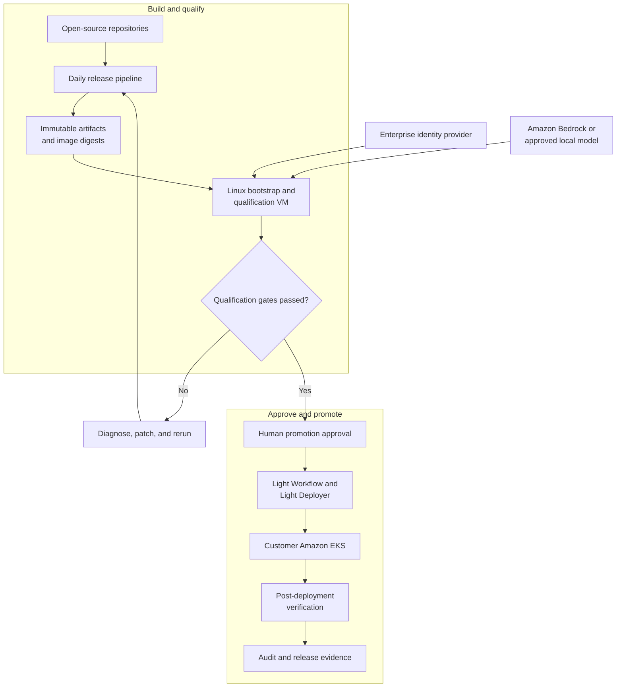
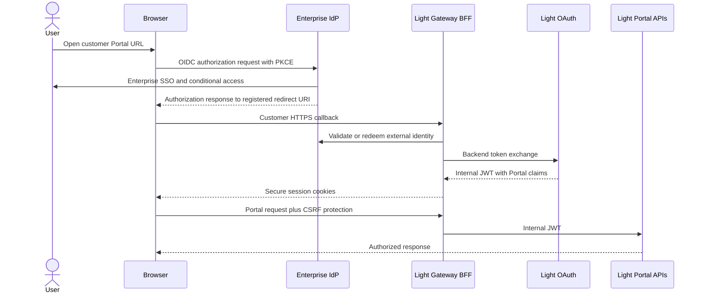
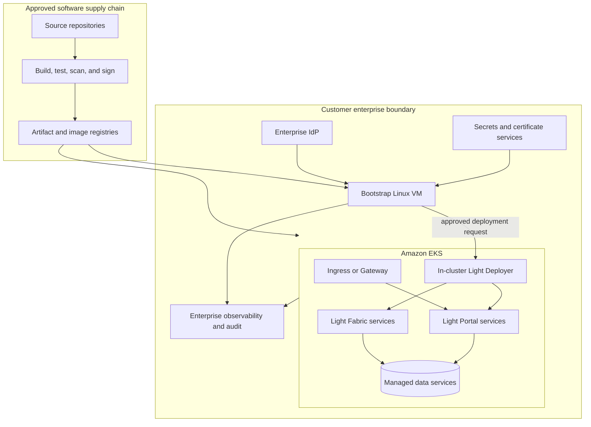
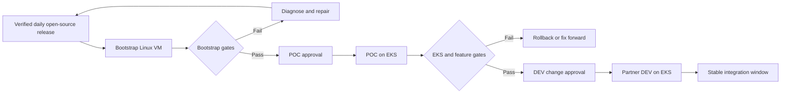
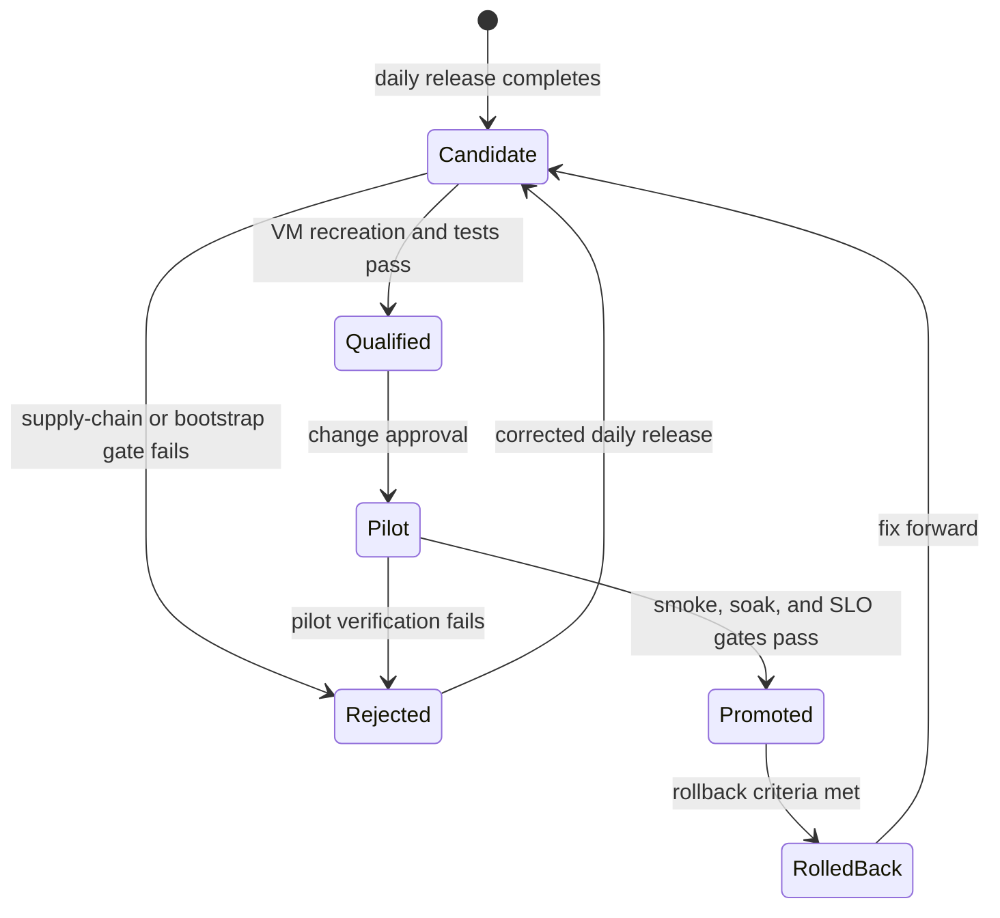
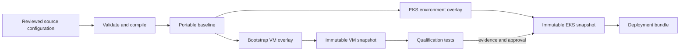
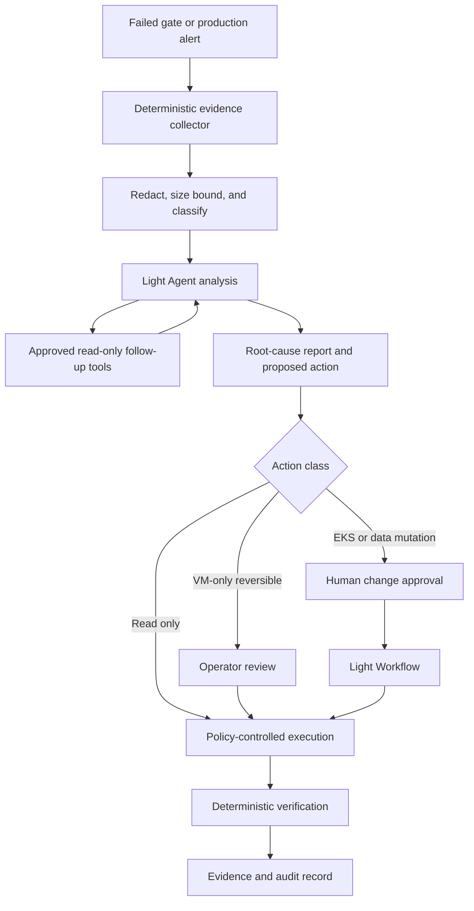
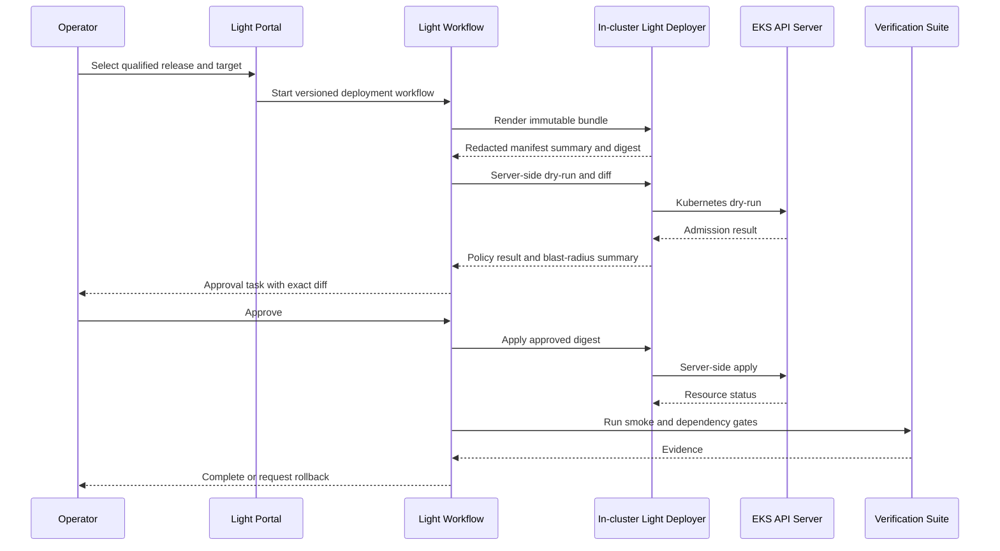

# Enterprise AI-Assisted Bootstrap and EKS Deployment

## Status

Proposed customer deployment and qualification design.

## Executive Decision

Create a dedicated Linux VM that continuously proves a complete Light Portal
and Light Fabric environment before promoting an immutable, reviewed release to
Amazon EKS. The VM should be based on the `portal-config-dev` topology, but its
complete installation and lifecycle must be owned by scripts in
`portal-config-bootstrap`. Operators should not copy files from a developer
workstation or run `portal-config-dev` deployment scripts against the customer
VM. The environment uses enterprise SSO, a customer-specific public hostname
and redirect URI, and an approved Amazon Bedrock or local model through the LLM
Gateway.

This is a good approach because it turns a complicated, multi-service EKS
installation into a repeatable promotion pipeline with a known-good reference
environment. It also gives developers and operators a safe place to build
deployment workflows, configuration snapshots, Kubernetes overlays, health
checks, and diagnostic automation before those assets can affect the cluster.

The design works only if the VM is treated as a disposable integration and
qualification environment. It is not the production control plane, a second
production database, or an unrestricted AI administration host. Production
changes remain immutable, policy checked, auditable, and approval gated.



## Business Value

The bootstrap environment reduces enterprise deployment risk and lead time in
four ways:

- Developers validate the complete service topology without waiting for an EKS
  change window.
- Customer-specific SSO, certificates, redirect URIs, DNS, configuration, and
  database bootstrap are tested as one release rather than as independent
  tickets.
- The same versioned snapshots and Kubernetes inputs that pass on the VM become
  the inputs promoted to EKS.
- AI-assisted diagnosis can correlate source, configuration, logs, health,
  Kubernetes state, and approved database queries while keeping every
  mutating action behind policy and approval.

This does not make the platform intrinsically simple. It makes the complexity
visible, repeatable, testable, and supportable.

## Goals

- Maintain a complete, customer-shaped Light Portal and Light Fabric reference
  environment on a Linux VM.
- Refresh and recreate that environment after a verified daily open-source
  release.
- Replace the local login experience with enterprise SSO while retaining Light
  OAuth tokens and fine-grained Light Portal authorization claims.
- Support Amazon Bedrock or an approved local model without exposing provider
  credentials to agents, workflows, source repositories, or logs.
- Generate immutable configuration snapshots, database bootstrap artifacts,
  Kubernetes manifests, and deployment evidence.
- Use `light-workflow` for durable orchestration and approval gates.
- Use `light-deployer` for bounded Kubernetes render, dry-run, diff, apply,
  status, and rollback operations.
- Use AI to accelerate diagnosis and propose bounded repairs.
- Preserve a conventional, fully documented operator path when AI is disabled
  or unavailable.

## Non-Goals

- Do not make the Linux VM a production runtime or production database.
- Do not deploy unverified output directly from the daily development branch.
- Do not give an LLM unrestricted shell, `kubectl`, AWS, Git, database, or
  secret-manager access.
- Do not grant `cluster-admin` to `light-deployer`.
- Do not let AI publish releases, change production data, approve its own
  patch, or bypass customer change management.
- Do not copy the VM database volume into EKS. Production is recreated from
  versioned schema, valid events, snapshots, and controlled migrations.
- Do not assume a successful container start proves application readiness.

## Important SSO Clarification

"SSO instead of OAuth authorization code" is not the precise protocol
boundary. Microsoft Entra ID, Okta, Ping Identity, and similar enterprise
identity providers normally use OIDC on top of OAuth 2.0, commonly with the
authorization-code flow and PKCE.

The recommended change is:

1. The enterprise identity provider authenticates the user through SSO.
2. The browser returns only to the customer-approved HTTPS redirect URI.
3. The Light Gateway BFF validates the external identity and performs a
   backend-mediated token exchange.
4. Light OAuth issues the internal token containing Light Portal host, user,
   role, group, environment, and fine-grained authorization claims.
5. The BFF keeps security tokens in secure cookies and protects mutations with
   CSRF controls.

This preserves enterprise authentication and Light Portal authorization as
separate concerns. It also avoids a second interactive login and avoids
putting tokens or client secrets in browser URLs.



The customer must provide the identity-provider tenant, issuer, client
registration, exact redirect and logout URIs, allowed groups, claim mapping,
conditional-access expectations, and a non-human test identity. Wildcard
redirect URIs should not be used.

## Recommended Architecture

### Management View



### Environment Topology and Promotion Order

Use three named environments with intentionally different stability and data
lifecycle contracts.

| Environment | Runtime | Audience | Update cadence | Database contract | Purpose |
|---|---|---|---|---|---|
| **Bootstrap** | Dedicated Linux VM | Platform engineers and selected customer engineers | Daily after the open-source release is verified | Disposable; recreate from the CDN baseline and a preserved customer-host package | Fast integration, feature validation, deployment authoring, and AI-assisted diagnosis |
| **POC** | Amazon EKS | Customer project team and approvers | Frequently, but only after Bootstrap qualification | Persistent by default; backup plus forward-only migration for every deployment | Official customer proving environment for EKS, SSO, networking, operations, and rollout |
| **DEV** | Amazon EKS | Customer developers and integration partners | Scheduled and less frequent than POC | Persistent; mandatory compatibility checks, backup, schema patches, and event deltas | Stable shared environment for instance authoring, application development, and integration |

The promotion direction is **Bootstrap -> POC -> DEV**. This naming is
deliberate: POC receives qualified changes earlier and proves the complete EKS
shape, while DEV favors partner stability. A future TEST, UAT, or production
environment can consume the same immutable release contract after the customer
accepts this operating model.



Bootstrap and POC must not automatically push every successful daily release
into DEV. DEV advances only when the selected POC release has completed its
stabilization window and the partner-impact review is approved.

The Portal host and the deployment environment are separate dimensions. In
Bootstrap, the database contains the canonical global entities and the default
`dev.lightapi.net` host from the CDN baseline, plus a customer-managed logical
host such as `dev.yourcompany.com`. Instances under that customer host carry
an explicit environment such as `bootstrap`, `poc`, or `dev`. Public runtime
URLs, SSO redirect URIs, certificates, Config Server environment tags, and
gateway instance identities remain environment-specific; they must not be
inferred from the logical host name or reused across simultaneous VM and EKS
runtimes.

### Bootstrap VM

The VM is a customer-specific integration appliance built from code and
automation. Name this environment **Bootstrap**. Its topology should start from
`portal-config-dev` and retain the default `dev.lightapi.net` host needed by the
published baseline. Add `dev.yourcompany.com` as the customer-managed logical
host, and create all customer-specific service instances under that host. It
contains:

- the Light Portal command, query, OAuth, configuration, controller, gateway,
  Portal UI, and database dependencies needed for an end-to-end test;
- the required Light Fabric gateway, LLM Gateway, Workflow, Agent, Knowledge,
  and Deployer development services selected for the customer scope;
- customer SSO configuration and test-only credentials;
- local copies of deployment repositories and generated artifacts;
- sandboxed workflow runners for builds, tests, rendering, and diagnostics;
- log and metric forwarding to the enterprise observability platform.

The VM should use internal DNS and an enterprise-issued certificate even when
it is accessible only inside the corporate network. The hostname, cookie
domain, issuer, audience, redirect URI, logout URI, CORS origin, CSRF origin,
and Portal host records must be configured as one reviewed set.

### EKS Runtime

POC and DEV run on EKS. Use separate namespaces and separate application data
stores at minimum; separate clusters or AWS accounts are preferred when the
customer's isolation policy requires them. Neither environment is a copy of
Docker Compose. Kubernetes resources should be intentionally designed for:

- namespaces and Kubernetes service accounts;
- Deployments, Services, ingress or Gateway API, ConfigMaps, and secret
  references;
- PodDisruptionBudgets, topology spread, resource requests and limits;
- readiness, liveness, and startup probes;
- network policies and approved egress;
- persistent storage and managed database connectivity;
- horizontal scaling, backup, restore, and disaster recovery;
- centralized logs, metrics, traces, alerts, and audit retention.

Stateful data should normally use customer-approved managed services such as
Amazon RDS for PostgreSQL and the enterprise Kafka offering. Exact products
and high-availability profiles are customer architecture decisions, but they
must be fixed before the production qualification run.

## Component Responsibilities

| Component | Responsibility | Explicit boundary |
|---|---|---|
| Daily release pipeline | Build, test, package, scan, and publish a candidate release | Does not authorize customer promotion |
| Bootstrap VM | Recreate and qualify the complete customer-shaped stack | Is disposable and contains no production authority |
| LLM Gateway | Route requests to Bedrock or a local model under model, cost, privacy, and audit policy | Provider credentials remain outside prompts and agent context |
| `light-agent` | Analyze evidence and propose bounded diagnostic or repair steps | Does not directly receive broad host or cluster credentials |
| `light-workflow` | Persist orchestration state, retries, evidence, and approvals | Delegates effectful work to approved runners or services |
| Workflow runner | Execute allowlisted command templates in an isolated workspace | No arbitrary command supplied by a model or workflow input |
| `light-deployer` | Render, policy check, dry-run, diff, apply, status, prune, and rollback | Enforces its own namespace, repository, registry, kind, and action policy |
| Enterprise IdP | Authenticate users and enforce corporate access policy | Does not define Light Portal resource authorization by itself |
| Light OAuth | Exchange trusted identity for internal Portal claims | Does not replace enterprise authentication |
| Human approver | Accept release, infrastructure diff, deployment, and rollback decisions | AI cannot approve its own work |

`light-deployer` already implements a useful Phase 1 Kubernetes slice,
including `kube-rs` server-side dry-run and apply. It remains a partial product:
controller integration, immutable config references, complete rollback
integration, EKS recovery, and production qualification must be closed in this
program. `light-workflow`, `light-agent`, and the LLM Gateway also remain under
staged production qualification. The pilot should prove them incrementally
rather than present all development functionality as production-ready.

## Release and Daily Rebuild Model

The daily recreation is valuable when it separates three states:

1. **Candidate:** Open-source daily output that has completed its normal build
   and test pipeline.
2. **Qualified:** An immutable candidate that passed the customer bootstrap VM
   gates.
3. **Promoted:** A qualified candidate approved for a named EKS environment.

Use image digests, repository commit SHAs, artifact checksums, schema version,
event-baseline checksum, workflow-definition version, configuration snapshot
IDs, and Kubernetes bundle digest as one release manifest. Never promote a
floating `latest` tag.

### Bootstrap Installer and Artifact Sources

`portal-config-bootstrap` is the installation authority for the Linux VM. It
may reuse release contracts and implementation patterns from
`portal-config-dev`, but every download, verification, extraction, Compose
operation, database initialization, import, readiness check, evidence capture,
and rollback invoked on the Bootstrap VM must be implemented by a reviewed
script in `portal-config-bootstrap`. The operator-facing path should converge
on one idempotent install or upgrade entry point; `scripts/sync-assets.sh` and
`scripts/restart-bootstrap-stack.sh` are current building blocks, not a reason
for an operator to assemble the installation manually.

The following inventory is the artifact contract for the Bootstrap VM. A
release manifest must resolve every version, SHA-256 checksum, OCI digest,
source commit, and signing identity before the installer changes the running
environment.

| Artifact | Authoritative publication source | Bootstrap destination or use | Required verification |
|---|---|---|---|
| `portal-config-bootstrap` scripts, Compose files, configuration templates, schema, migrations, and event deltas | The `lightapi/portal-config-bootstrap` GitHub repository, selected by an approved immutable commit or signed release tag | Bootstrap working tree and installer entry point | Compare the commit to the approved release manifest. Verify a signed tag or commit when the release process supplies one; otherwise the customer-approved manifest is the trust anchor. Reject a dirty installer tree. |
| Release manifest and `docker-images.env` | The Light daily-release output promoted through the approved release channel; these are deployment metadata, not handwritten VM configuration | Pins the exact source commits, CDN checksums, image references, and release evidence consumed by the installer | Verify the release-manifest signature first, then verify the manifest checksum of `docker-images.env`. A tag-only image file is insufficient for qualification. |
| Light Portal and Light Fabric images | Docker Hub organization [`networknt`](https://hub.docker.com/u/networknt): `portal-hybrid-command`, `portal-hybrid-query`, `config-server`, `light-oauth`, `portal-service`, `controller-rs`, `light-workflow`, `light-gateway`, `light-a2a`, `light-agent`, `light-knowledge`, `light-knowledge-worker`, `light-knowledge-admin`, the selected demo services, `event-exporter`, and `event-importer` | Pulled by Docker Compose or used as bounded export/import tools | Resolve each manifest entry to `networknt/<name>@sha256:<digest>` and compare the pulled `RepoDigest` with the signed release manifest. When OCI signatures are published, also verify them with the pinned NetworkNT signing identity before pull/use. Never qualify `latest` or a mutable tag alone. |
| PostgreSQL/TimescaleDB base image and any other third-party image | The upstream publisher's Docker Hub repository, currently `timescale/timescaledb` for the Bootstrap Compose baseline | Database runtime or explicitly approved dependency | Pin an approved OCI digest in the release manifest, verify publisher provenance or OCI signature when available, retain the SBOM and scan result, and reject an unexpected repository namespace. |
| `hybrid-command.zip` | `https://cdn.networknt.com/hybrid-command.zip` | Extracted into `hybrid-command/service/` | Verify the archive SHA-256 from the signed release manifest before extraction; then validate the ZIP and the expected file allowlist. |
| `hybrid-query.zip` | `https://cdn.networknt.com/hybrid-query.zip` | Extracted into `hybrid-query/service/` | Verify the archive SHA-256 from the signed release manifest before extraction; then validate the ZIP and the expected file allowlist. |
| `lightapi.zip` | `https://cdn.networknt.com/lightapi.zip` | Extracted into `light-gateway-rust/lightapi/` | Verify the archive SHA-256 from the signed release manifest before extraction; then validate the ZIP and expected Portal UI files. |
| `signin.zip` | `https://cdn.networknt.com/signin.zip` | Extracted into `light-gateway-rust/signin/` | Verify the archive SHA-256 from the signed release manifest before extraction; then validate the ZIP and expected Sign-in UI files. |
| Signed global environment bundle, `events.zip` | `https://cdn.networknt.com/events.zip` | The downloaded archive is verified once. Its `events.json` is then extracted as the editable global and `dev.lightapi.net` baseline and customized by the Bootstrap installer for customer configuration properties. | Verify the downloaded v2 bundle's Ed25519 signature and every member digest with the locally trusted release public key before extraction or any destructive action. Preserve the immutable archive and record its SHA-256 beside the extracted file. Do not require a signing key when the intentionally customized JSON is later imported with `--filename`. |
| Customer SSO Portal View | Built by `portal-config-bootstrap/scripts/build-portal-view-sso.sh` from an approved, pinned `portal-view` source revision and explicit Vite SSO inputs; it is not currently one of the four generic CDN UI archives | `portal-bff-sso/lightapi/dist/` | Record the source commit, lockfile digest, build inputs, and output digest in the release manifest. Prefer a CI-built signed archive for repeatable customer releases; do not accept an unrecorded local build. |
| Enterprise TLS chain, SSO registration values, client secret, bootstrap token, model credentials, and customer-host preservation package | Customer certificate/secret manager, identity-provider administration, and the previous qualified Bootstrap export | Mounted secrets and customer-specific restore inputs; never public release assets | Validate the certificate chain and hostname, retrieve secrets through the approved identity, verify the preservation-package checksum/signature and host identity, redact evidence, and never download these inputs from Docker Hub or the public CDN. |

The CDN is the publication endpoint for runtime ZIP archives; Docker Hub is the
container registry. HTTPS proves which endpoint answered, but it does not by
itself prove that the bytes are the intended Light release. Artifact
authenticity comes from a trusted signing key plus the signed manifest; content
integrity comes from the checksums and OCI digests bound by that manifest.

#### Establishing and Verifying the Signing-Key Trust Root

The platform-wide authority for signing-key custody, delivery, rotation,
revocation, and cross-repository qualification is
[Release Signing Key Management and Rotation](release-signing-key-management.md).
This section applies that contract to enterprise Bootstrap enrollment.

The trusted public key must arrive through a channel independent of the
artifact download. For example, the customer security team can install it from
an approved change record, internal PKI package, or secrets/configuration
service. Downloading `events.zip` and its public key from the same CDN location
without checking a previously approved fingerprint does not establish trust.
The private release-signing key remains in the release system and is never
copied to the VM.

For the current environment-bundle format, the release key is Ed25519 and the
bundle manifest names it as `signature.keyId`. Provision the approved public
key as `release-keys/<keyId>.pem`, calculate a stable SubjectPublicKeyInfo
fingerprint, and compare it with the fingerprint recorded in the customer
change ticket or trust store:

```bash
key_file="release-keys/${APPROVED_RELEASE_KEY_ID:?set the approved key ID}.pem"
openssl pkey -pubin -in "$key_file" -outform DER | sha256sum
```

The comparison must be performed over a second authenticated channel and must
match exactly before the installer is enabled. File permissions do not make an
unverified key trustworthy. The installer must also fail closed for an unknown
`keyId`, a manifest algorithm other than the approved algorithm, an expired or
revoked key, a member checksum mismatch, or a signature failure.

After the key is trusted, inspect the bundle identity and run the same
verification contract used by `portal-config-dev` before extraction. The
actual importer image must be the digest-pinned, verified image from the same
release manifest:

```bash
unzip -p data/events.zip bundle-manifest.json |
  jq -r '.signature | [.algorithm, .keyId, .file] | @tsv'

docker run --rm \
  -v "$PWD/data:/bundle:ro" \
  -v "$PWD/release-keys:/bundle-keys:ro" \
  "${EVENT_IMPORTER_IMAGE:?set a digest-pinned importer image}" \
  --verify-bundle \
  --bundle /bundle/events.zip \
  --bundle-key-dir /bundle-keys
```

This verification is a download gate, not an import-time constraint. The
workflow follows [event-importer issue #127](https://github.com/lightapi/event-importer/issues/127)
and the corresponding importer contract:

1. Download `events.zip` to a temporary path and atomically move it to
   `data/events.zip` only after the download completes.
2. Run `--verify-bundle` against the immutable archive and the independently
   trusted public key. Stop without touching the database if verification
   fails.
3. Extract the verified `events.json` to an editable staging file and write the
   SHA-256 of `data/events.zip` to
   `data/events.json.source-bundle.sha256`.
4. Let the `portal-config-bootstrap` installation script apply only the
   allowlisted customer changes, including the required Config Server property
   events, customer hostname, SSO redirect/callback values, and environment
   tags. Validate JSON structure, expected match counts, aggregate versions,
   duplicate aggregate/version pairs, and required parent references after the
   edit.
5. Record the customization inputs and the final customized JSON SHA-256 in the
   installation evidence, then import the editable file without a public key:

   ```bash
   docker run --rm \
     --network "${EVENT_IMPORT_NETWORK:?set the import network}" \
     -v "$PWD/data:/events:ro" \
     -e DB_JDBC_URL \
     -e DB_USERNAME \
     -e DB_PASSWORD \
     "${EVENT_IMPORTER_IMAGE:?set a digest-pinned importer image}" \
     --filename /events/events.json \
     --bootstrap-import
   ```

The release signature authenticates the downloaded global snapshot and its
members at the download boundary. It intentionally does not authenticate the
environment-specific `events.json` after customization, and the importer must
not re-run bundle verification during the filename import. The source-bundle
digest marker proves which verified archive supplied the editable baseline;
the recorded final JSON digest and customization evidence prove what the
installer actually imported. If a later run finds that the adjacent archive no
longer matches the source-bundle marker, it must prepare the editable file again
before import.

Key rotation requires an explicit release record containing the old and new
key IDs, fingerprints, activation release, overlap period, and revocation
date. The new key must be authorized by the previously trusted key or approved
through the same out-of-band customer process used for initial enrollment. An
artifact signed only by an unrecognized replacement key is rejected even when
it was downloaded successfully from `cdn.networknt.com`.

The current repositories do not yet provide this complete chain for every
artifact. There is no single signed top-level release manifest that binds every
CDN archive and image digest. `portal-config-dev` verifies the signed v2
`events.zip` download, while the current Bootstrap restart script only downloads
and extracts it; `scripts/sync-assets.sh` validates ZIP structure but does not
yet verify signed release-manifest checksums; and the current image file uses
tags rather than OCI digest references. Phase 1 must port the signed-bundle
download/preparation path and the intentional editable-JSON customization path,
add signed-manifest checksum verification for all other CDN archives, pin and
verify all image digests, and fail before any destructive action. Until those
gaps are closed, the Bootstrap VM is a development scaffold rather than a
qualified software-supply-chain installation.



### Daily VM Lifecycle

1. Invoke the `portal-config-bootstrap` installer to read the published release
   manifest, verify its enrolled signing key and signature, verify every CDN
   checksum and image digest, enforce the vulnerability policy, and stage all
   required artifacts. Stop before any mutation if an artifact is missing or
   untrusted.
2. Quiesce customer-host mutations and export an active, host-scoped global
   snapshot for the exact `dev.yourcompany.com` host UUID with
   `exportScope=host`. Record its source host, last-event consistency marker,
   table counts, warnings, checksum, export tool version, and schema version.
3. Convert and preflight the customer-host snapshot as a dependency-ordered
   event package. Reject the reset if conversion, portability checks, parent
   references, duplicate aggregate/version checks, or a disposable round-trip
   test fails.
4. Preserve the previous successful release manifest, customer-host snapshot,
   generated event package, qualification evidence, and database directory for
   rollback.
5. Destroy only the explicitly disposable Bootstrap data and runtime.
6. Recreate the database schema from the canonical release artifacts.
7. Verify the downloaded `events.zip` once, extract its editable `events.json`,
   record the source-bundle digest, apply and validate the allowlisted Bootstrap
   configuration-property customizations, and import that JSON without signing
   keys to recreate global and canonical `dev.lightapi.net` entities.
8. Wait for asynchronous projection consumers to reach the required cursors.
   Import completion alone is not Portal readiness.
9. Recreate the `dev.yourcompany.com` host root from its reviewed,
   version-controlled `HostCreatedEvent` bootstrap artifact, preserving its
   stable host UUID. Then import the validated host-scoped event package into
   that target host.
10. Wait for customer-host projections to converge, verify expected entity
    counts and relationships, refresh Config Server snapshots, and confirm that
    no unexplained DLQ entry exists.
11. Start services in dependency order and require service-specific readiness.
12. Apply the customer Bootstrap configuration snapshot.
13. Run SSO, API, gateway, workflow, agent, model, database, and observability
   tests.
14. Produce a signed qualification report and mark the manifest qualified only
    when every mandatory gate passes.

The current global snapshot contract supports `host`, `global`, and `both`
scopes. Use `host` for the customer preservation package. Do not use `both`
and then re-import shared rows already supplied by the CDN baseline. Host scope
selects active host-owned rows, including specialized user-membership and
relationship handling, but intentionally omits true global tables and tables
without `host_id`.

`host_t` is intentionally excluded from snapshot export and conversion, so the
customer host root is not silently included in the host package. Its stable,
reviewed creation event is a separate prerequisite imported after the CDN
baseline and before the host-owned package. This makes the parent identity and
import order explicit.

The snapshot is a portable representation of active event-backed projections,
not a copy of `event_store_t` and not a complete audit-history backup.
Operational or derived state such as authorization codes, refresh tokens,
outbox rows, notifications, projection cursors, runtime workflow state,
selected Knowledge state, and generated configuration snapshots is excluded or
rebuilt. The export manifest must list every excluded family so an operator
cannot mistake host preservation for a full database backup.

If the new release changes the schema or event contract so the prior day's
host package cannot pass conversion or import preflight, keep or restore the
previous Bootstrap database. Add a compatible converter, migration, or
forward event before retrying; never bypass the failed portability gate with
direct projection-table inserts.

Recreating the database every day is appropriate for this disposable VM and
is strong evidence that the deployment has no undocumented manual seed step.
It is not a POC or DEV upgrade strategy. Both EKS environments use forward-only
migrations, versioned event deltas, backups, compatibility gates, and tested
rollback or fix-forward procedures.

### POC and DEV Persistent Data Lifecycle

POC is official even though it changes frequently. DEV is partner-facing and
more stable. Both preserve their databases across normal deployments.

For every POC or DEV deployment:

1. Bind the target to an immutable release manifest and record the current
   schema, event-delta, configuration-snapshot, and deployment revisions.
2. Verify a recent backup and the restore procedure before crossing a schema
   boundary.
3. Run compatibility and migration preflight against a production-shaped copy
   of the target data.
4. Apply immutable, forward-only SQL patches before the dependent application
   version and record their checksums.
5. Import immutable, ordered Portal event deltas through the supported event
   path; never edit a delta after it has reached either environment.
6. Refresh or publish immutable configuration snapshots only after their
   underlying projections are ready.
7. Deploy services in dependency order, prove projection convergence, and run
   environment-specific smoke and authorization tests.
8. Observe the stabilization window and retain the exact migration and rollout
   evidence.

Database patches and event deltas must be safe for both upgrade paths: an
existing preserved database and a fresh database built from the current
baseline. The pipeline should test both paths before POC. A service release
that has no required data change still records an explicit no-migration result.

DEV should normally trail POC by a defined stabilization interval. Schedule
partner-impacting maintenance, publish release notes and compatibility changes,
and provide a rollback or fix-forward decision window. Partner-created
instances and integration data are durable DEV assets and must never be
replaced by Bootstrap exports.

## Configuration and Snapshot Authority

Configuration must not drift independently between the VM and EKS. Store
authoring inputs in version control and compile them into immutable,
environment-bound snapshots.



The portable baseline may contain product versions, API definitions, workflow
definitions, non-secret configuration, and schema/event bootstrap assets.
Overlays contain environment-specific hostnames, instance IDs, environment
tags, capacity, database endpoints, identity-provider references, certificate
references, and network policy.

Secrets are references, not snapshot values. Resolve them at runtime from the
customer-approved secret service, such as AWS Secrets Manager through an
approved Kubernetes integration. No generated bundle, workflow context,
diagnostic attachment, or AI prompt should contain secret values.

## Model Connectivity

Both Bedrock and a local model can work behind the LLM Gateway.

### Amazon Bedrock

- Prefer workload identity and short-lived AWS credentials rather than static
  access keys.
- Restrict IAM to approved model actions, model IDs, regions, and accounts.
- Use private connectivity when the customer requires it.
- Apply model allowlists, token and cost budgets, timeouts, retry policy,
  conformance tests, and audit policy in the LLM Gateway.

### Local Model

- Place the model endpoint in an approved network zone.
- Require an authenticated, encrypted endpoint unless a formally approved
  same-host loopback profile is used.
- Enforce destination allowlists, redirect blocking, DNS-rebinding protection,
  request-size limits, and health/conformance tests.
- Record the model artifact, server version, quantization, context window, and
  qualification result because "local model" is not a stable deployment
  identity.

The deployment workflow must not depend on a particular model to be correct.
If the model is unavailable, deterministic validation, deployment, rollback,
and operator diagnostics must remain functional.

## AI-Assisted Diagnosis

AI is most effective when it receives a structured evidence bundle instead of
open-ended infrastructure access. The bundle may include:

- release manifest, commit SHAs, image digests, and snapshot IDs;
- failed workflow task and bounded command output;
- redacted Kubernetes events, resource status, and selected logs;
- readiness, metrics, trace, and dependency-check results;
- schema version, projection cursors, and results from approved read-only SQL;
- relevant source files and configuration with secrets removed;
- the last-known-good deployment diff.



The first release should expose only allowlisted read operations to AI:

- `kubectl get`, `describe`, events, rollout status, and bounded logs through a
  wrapper or Kubernetes API tool;
- repository search and read access to an exact checkout;
- bounded health, metrics, and trace queries;
- named, parameterized, read-only database queries;
- configuration snapshot inspection with secret redaction.

Write operations should be invoked by a versioned workflow step or
`light-deployer`, never by passing model-produced shell text to Bash. A model
may propose a patch in an isolated branch, but tests, diff review, and human
approval decide whether it advances.

## EKS Deployment Workflow

The preferred production pattern runs `light-deployer` inside the EKS cluster
with a dedicated service account. It connects outbound to the control plane or
accepts requests through a private, authenticated endpoint. It should not
depend on a broad kubeconfig stored on the VM.



The approved digest must bind the template commit, rendered manifest,
configuration snapshot, image digests, target cluster, namespace, and deployer
policy. If any bound input changes after approval, approval is invalid and the
workflow returns to dry-run and diff.

### EKS Access Policy

- Use namespace-scoped `Role` and `RoleBinding` wherever possible.
- Separate deployer identities for development, test, and production.
- Allow only required resource kinds and verbs.
- Block cluster-scoped resources, CRDs, admission webhooks, RBAC changes, and
  namespace creation from the normal application deployer.
- Use a separately approved infrastructure pipeline for cluster foundations.
- Restrict Git hosts, repositories, refs, image registries, namespaces, and
  prune thresholds in deployer policy.
- Require server-side dry-run before apply.
- Redact Secret and sealed-secret data from diffs and logs.
- Record Kubernetes audit events and the Light Workflow request ID together.

## Qualification Gates

A customer release is qualified only when all mandatory gates are green.

| Gate | Required evidence |
|---|---|
| Supply chain | Signed/checksummed artifacts, pinned image digests, SBOM, vulnerability-policy result |
| Database bootstrap | Empty database recreated; schema validated; canonical events imported; projection cursors converged; no unexplained DLQ |
| Service topology | Every required service ready; dependency and registration checks pass; no placeholder health check accepted |
| Enterprise SSO | Login, token exchange, claim mapping, refresh, logout, CSRF, negative-user, and redirect-URI tests |
| Authorization | Host, user, role/group, environment, endpoint, workflow, tool, and row/field policy tests |
| Model | Provider conformance, timeout, fallback, budget, audit, privacy, and failure-mode tests |
| Configuration | Snapshot audience, service, environment, digest, validity, and rollback tests |
| Workflow | Persistence, retry, approval, runner fencing, idempotency, recovery, and audit tests |
| Deployment | Render, policy, server-side dry-run, diff, apply, prune protection, rollout, and rollback rehearsal |
| Reliability | Restart, dependency loss, database recovery, scaling, backup/restore, and selected soak tests |
| Operations | Logs, metrics, traces, alerts, dashboards, runbooks, ownership, and evidence retention |

Passing the VM gates does not automatically prove EKS networking, admission,
IAM, storage, autoscaling, or load-balancer behavior. The first EKS pilot must
repeat the EKS-specific gates in POC. DEV promotion occurs only after those
gates and the agreed POC stabilization interval pass.

## Rollback and Recovery

Rollback redeploys a previous immutable Light Portal deployment snapshot. It
must restore the compatible image set, runtime configuration, deployment
values, and manifests together. Kubernetes native Deployment rollback alone is
insufficient because it does not restore related ConfigMaps, secret references,
Services, or other resources.

Database changes require a separate recovery decision:

- prefer backward-compatible, forward-only migrations;
- take and verify backups before a production schema boundary;
- rehearse restore in an isolated environment;
- never automatically reverse a data migration merely because pods rolled
  back;
- define fix-forward and restore criteria in the change record.

The previous qualified release, its artifacts, snapshots, manifests, workflow
definition, and evidence must remain available for the customer retention
period.

## Failure Containment

| Failure | Containment and response |
|---|---|
| Daily release fails | Keep the previous qualified VM and EKS release; publish no candidate |
| VM recreation fails | Mark candidate rejected; collect evidence; do not deploy |
| SSO unavailable | Preserve break-glass operator procedure under customer control; do not weaken token validation |
| Model unavailable | Continue deterministic deployment and diagnostics; route to approved fallback only when policy allows |
| AI gives a wrong diagnosis | Deterministic gates and human approval prevent promotion; retain evidence for review |
| Dry-run or admission fails | Apply nothing; return exact redacted result to the workflow |
| Partial EKS rollout | Stop promotion, collect status, and invoke the approved rollback or fix-forward path |
| Projection lag | Hold readiness until cursors converge; investigate DLQ and consumer health |
| Secret appears in evidence | Stop the workflow, revoke or rotate as required, sanitize storage, and audit access |

## Delivery Phases

### Phase 0: Customer Decisions and Threat Model

- Confirm customer domains, redirect URIs, identity provider, claim mapping,
  AWS accounts, EKS clusters, namespaces, data services, network boundaries,
  certificate authority, secret service, registries, and observability stack.
- Classify data allowed to reach Bedrock or a local model.
- Define human approval roles, break-glass procedure, retention, and change
  management.
- Produce the initial threat model and responsibility matrix.

Exit: architecture and security owners approve the boundaries; no cluster
mutation is enabled.

### Phase 1: Reproducible Bootstrap VM

- Create the customer-specific `portal-config-dev` derivative without forking
  application code.
- Make `portal-config-bootstrap` scripts the only operator-facing installation,
  upgrade, database-recreation, verification, and rollback path; no manual file
  copying or invocation of `portal-config-dev` deployment scripts is permitted.
- Consume the signed release manifest, enroll and rotate trusted release keys,
  verify `events.zip` once after download, customize and import the extracted
  `events.json` without a signing key, verify every other CDN checksum, and pin
  every first-party and third-party image by OCI digest before changing the VM.
- Implement daily immutable release consumption and complete database
  recreation.
- Establish readiness, projection convergence, smoke tests, evidence capture,
  and rollback to the previous VM release.
- Keep AI read-only.

Exit: five consecutive daily recreations pass without manual database or
container repair.

### Phase 2: Enterprise SSO and Model

- Configure enterprise OIDC SSO and backend token exchange.
- Prove claim mapping, negative access, refresh, and logout.
- Connect the LLM Gateway to one approved Bedrock or local deployment.
- Prove provider conformance, privacy, budget, timeout, audit, and failure
  behavior.

Exit: security tests pass and provider credentials never appear in logs,
snapshots, workflow context, or prompts.

### Phase 3: Workflow and Diagnostic Automation

- Encode build, qualification, evidence, approval, and diagnosis flows in
  versioned Light Workflow definitions.
- Use allowlisted runner templates and structured diagnostic tools.
- Add bounded AI patch proposals in disposable branches.
- Retain a manual operator path and test model outage.

Exit: repeated injected failures produce actionable evidence and cannot bypass
approval or mutate EKS.

### Phase 4: Official EKS POC

- Install the namespace-scoped in-cluster deployer.
- Render the complete Kubernetes bundle and pass policy, dry-run, admission,
  apply, smoke, observability, restart, and rollback gates.
- Validate RDS/Kafka connectivity, ingress, DNS, TLS, IdP callbacks, storage,
  autoscaling, and network policy in EKS.
- Preserve the POC database and prove the forward-only patch and event-delta
  path against production-shaped data.

Exit: the customer accepts the official POC deployment, data migration, and
rollback rehearsal.

### Phase 5: Partner DEV Environment

- Create the isolated DEV namespaces and persistent data services.
- Promote the exact POC-qualified digests after the stabilization and
  partner-impact review.
- Prove partner SSO/access, instance authoring, integration endpoints,
  application workflows, migration compatibility, backup, and recovery.
- Establish a predictable maintenance calendar, release notes, and support
  channel for partners.

Exit: partners can develop and integrate without daily resets or unannounced
release movement.

### Phase 6: Future Production Promotion

- Promote the exact qualified digests through the customer change process.
- Use canary or staged rollout where service behavior permits.
- Observe the agreed stabilization window and SLOs.
- Transfer runbooks, dashboards, evidence, and ownership to operations.

Exit: production acceptance criteria and the support handoff are signed.

## Success Measures

- Five consecutive unattended VM recreations before the EKS pilot.
- One release manifest identifies every deployed artifact and configuration
  input without a floating tag.
- No undocumented manual database seed or post-start configuration step.
- Every Bootstrap reset preserves and verifies the customer host through a
  checksummed host-scoped package plus the explicit stable host-root event.
- POC and DEV pass both preserved-database upgrade and fresh-database tests for
  every promoted release.
- DEV advances only from a POC-qualified digest after the defined stabilization
  interval.
- Every EKS mutation maps to a workflow request, approval, deployer identity,
  manifest digest, and Kubernetes audit record.
- POC, DEV, and production deployer permissions are namespace scoped with documented
  exceptions.
- SSO success and negative tests cover the exact customer redirect URI and
  claim mappings.
- Mean time to produce a root-cause evidence bundle is measured and reduced.
- A model outage does not block deterministic deployment or rollback.
- Backup restore and immutable deployment rollback are both rehearsed.

## Customer Responsibilities

The customer supplies or approves:

- enterprise IdP application registration and test users;
- DNS, certificates, ingress, firewall, proxy, and private connectivity;
- AWS accounts, IAM roles, EKS baseline, managed data services, and backups;
- secrets management, container and artifact registries, and vulnerability
  policy;
- logging, monitoring, audit, SIEM, retention, and incident-response
  integration;
- data classification and model-use policy;
- change approvers, production operators, and support escalation paths.

The Light platform team supplies:

- versioned service artifacts and release manifest;
- bootstrap automation and database/event baseline;
- configuration and deployment snapshot generation;
- workflow definitions, deployment policies, tests, and runbooks;
- product-level defect diagnosis and fixes;
- evidence describing which capabilities are implemented, qualified, partial,
  or deferred.

## Recommendation

Proceed with the Linux VM bootstrap environment as the first delivery
milestone. It is the fastest practical way to discover enterprise-specific
SSO, network, certificate, configuration, database, and service-topology gaps
before EKS change windows become the debugging loop.

Do not sell the VM as proof that production is automatic. Sell it as a
repeatable qualification factory: the daily release creates a candidate, the
VM proves the candidate against the customer shape, humans approve an exact
immutable bundle, `light-workflow` preserves the process, and the in-cluster
`light-deployer` performs only the Kubernetes actions allowed by customer
policy. This gives developers speed while preserving the controls enterprise
security and operations teams require.

## Related Designs

- [Deployment Workflow](./deployment-workflow.md)
- [Release Workflow](./release-workflow.md)
- [MSAL Light OAuth Integration](./msal-light-oauth.md)
- [Rust Product And Portal Service Inventory](./rust-product-inventory.md)
- [Fast Snapshot-Derived Database Bootstrap](./light-portal/database-recreation-event-bootstrap.md)
- [LLM Gateway Topology Per Host And Environment](./light-portal/llm-gateway-topology.md)
- [Local Model Provider Transport For LLM Gateway](./light-gateway/local-model-provider-transport.md)
