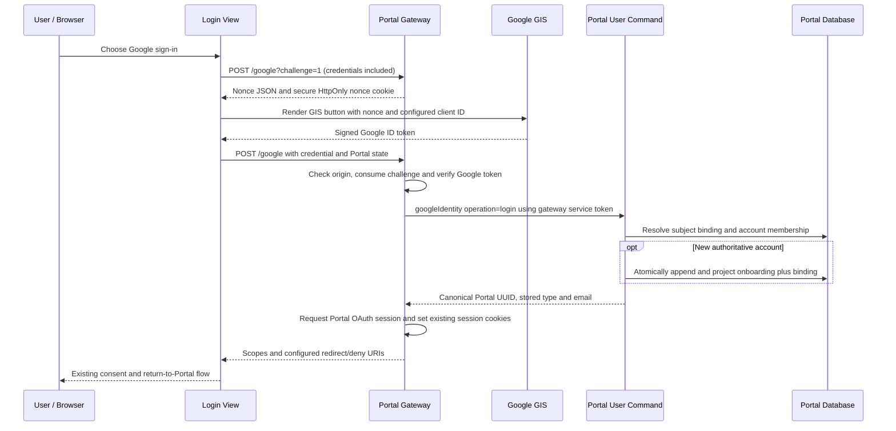

# Google Identity Services Sign-In and Portal Account Linking

## Purpose and implementation scope

Portal users can sign in with Google without registering an email/password credential in Portal. Google Identity Services (GIS) supplies a signed ID token to the browser; the gateway verifies it and resolves a durable Google subject binding to a Portal UUID. Portal continues to own the account, tenant membership, permissions and application session.

This design describes the implementation submitted on October 9, 2026:

| Component | Issue | Implementation PR | Responsibility |
| --- | --- | --- | --- |
| `light-spa-4j/stateless-auth` | [#171](https://github.com/networknt/light-spa-4j/issues/171) | [#172](https://github.com/networknt/light-spa-4j/pull/172) | Browser challenge, Google token verification, authenticated linking boundary, Portal session issuance |
| `login-view` | [#17](https://github.com/lightapi/login-view/issues/17) | [#18](https://github.com/lightapi/login-view/pull/18) | GIS button, nonce handling, credential submission and explicit linking screen |
| `light-portal` | [#865](https://github.com/lightapi/light-portal/issues/865) | [#866](https://github.com/lightapi/light-portal/pull/866) | Trusted identity command, durable binding, transactional onboarding, replay and snapshot support |

`portal-view` already redirects to `login-view`; this migration does not require a new Portal View authentication implementation. The PRs replace the Google authorization-code callback and remove the legacy Google API/HTTP client dependencies from `stateless-auth`. Other social providers and metrics dependencies are outside this migration.

The implementation and local qualification described here do not establish deployment, production activation or successful live Google sign-in.

## Identity model

Google's `sub` claim identifies a Google account. Portal's `user_id` identifies a shared Portal account and remains a UUID. The two identifiers have different owners and are stored separately.

The binding uses the canonical issuer `https://accounts.google.com` plus Google's numeric subject. Tokens with either accepted Google issuer spelling resolve to that same canonical binding. The subject, rather than email or display name, determines subsequent sign-in. The bound Portal account supplies its UUID, stored user type and email. The session grant uses the UUID and user type; email remains profile data.

Email equality does not prove ownership of an existing Portal account. An unbound Google identity whose email already exists must be linked through an authenticated Portal session. This also preserves the account's UUID, user type and existing permissions. Legacy social user IDs are not silently converted or bound by email.

### Account resolution rules

| Situation | Behavior |
| --- | --- |
| Subject already bound | Resolve its existing Portal UUID and stored email; require an active, unlocked user with active membership in the gateway principal's signed host |
| Unbound subject, existing Portal email | Reject sign-in with an explicit-link requirement; do not change or claim the existing account |
| Unbound subject, new authoritative Google email | Create a Portal UUID account and bind the subject in one transaction |
| Unbound subject, third-party Google email | Require explicit linking to an existing Portal account |
| Authenticated link to an unbound subject | Bind it to the verified session's Portal UUID without changing the account |
| Subject already bound to the same linking target | Return the existing binding successfully |
| Subject bound to a different user, or user already has another Google binding | Reject the conflict; do not reassign either binding |

New-account email is authoritative only when the verified address is Gmail or the signed Google token contains a Google Workspace hosted-domain claim (`hd`). `email_verified=true` alone does not authorize automatic registration for a third-party email address. Existing subject bindings continue to resolve independently of changed Google email or profile names.

## Sign-in flow

The Google ID token is an authentication assertion, not a Portal access token. The gateway uses the existing `ClientAuthenticatedUserRequest` social authentication path with the resolved Portal UUID and stored user type to obtain the application session. GIS does not grant access to Google APIs in this design.

The browser carries the existing Portal `state` through the JSON callback and the configured return route. The gateway URL-encodes it when constructing that route. The GIS nonce is a separate server-issued value and provides the Google-token replay and browser-challenge binding. Preservation of `state` is not a substitute for the nonce or for the application's existing state verification contract; see [OAuth State Parameter Design](oauth-state.md).

## Explicit account linking

An existing user signs in to Portal through an available authentication method, then follows the linking entry point in Login View or opens the login page with `?link_google=1`. The dedicated page explains that the selected Google account will be attached to the signed-in Portal account.

Both the challenge and callback use `/google/link`. Before either operation, the gateway verifies the existing `accessToken` cookie, including expiry, and reads its `uid` UUID. The issued challenge records that UUID. On callback, the verified current session must still identify the same user; switching accounts between challenge and callback rejects the attempt.

The browser submits only `credential`, `state` and `challengeId`. It cannot select `targetUserId`. The gateway adds the authenticated UUID to the trusted Portal command. Portal verifies account availability and host membership, then appends only `GoogleIdentityLinkedEvent`. Linking does not issue replacement session cookies or modify the account's email, user type or permissions. Success returns to the configured Portal route.

There is one Google binding per Portal user. Unlinking, reassignment, multiple Google accounts per user and administrator-provisioned direct database mappings are not implemented by this API.

## Browser and gateway contract

| Endpoint | Request | Result |
| --- | --- | --- |
| `POST /google?challenge=1` | Credentialed request from the configured login origin | Five-minute sign-in nonce and its cookie |
| `POST /google` | JSON `{ "credential": "<Google ID token>", "state": "<Portal state>", "challengeId": "<challenge ID>" }` | Resolve account and issue the existing Portal session |
| `POST /google/link?challenge=1` | Same origin plus a valid Portal session cookie | Five-minute nonce bound to the authenticated Portal UUID |
| `POST /google/link` | Same JSON shape plus the existing session and nonce cookies | Bind the Google subject; return `linked: true` and the configured redirect |

The handler also accepts GET challenges with exactly `challenge=1`; Login View uses POST. Legacy GET authorization-code callbacks are rejected. Callback credentials cannot be supplied in query parameters. OPTIONS passes to existing CORS middleware.

The challenge contains 32 random bytes encoded as a 43-character base64url value and a 22-character attempt ID. Its store is synchronized, bounded to 10,000 entries, and local to the gateway process. It expires after five minutes and can be consumed once. Consumption precedes token verification, so an invalid token also requires a fresh challenge. The cookie is `__Host-google_signin_nonce_<challengeId>` with `Secure`, `HttpOnly`, `SameSite=None`, `Path=/`, no Domain attribute and a matching lifetime; the callback clears only the selected attempt cookie.

The challenge response includes `nonce` and a 22-character `challengeId`. Each attempt has its own `__Host-google_signin_nonce_<challengeId>` cookie, so tabs do not overwrite each other. Callbacks must include `credential`, `state` and `challengeId`; only that cookie is consumed and cleared. Issuance is limited to 32 challenges per source address per five minutes, even when attempts are consumed, and returns 429 with Retry-After. Expiry cleanup visits the expired insertion-order prefix and uses a monotonic clock. The global 10,000-entry bound remains defense in depth. Direct connections use the peer IP and ignore forwarding headers. Behind proxies, configure exact numeric proxy IPs in `google-sign-in.trustedProxyAddresses`; trusted proxies must overwrite/append the actual connecting peer to `X-Forwarded-For`. The gateway walks the chain from right to left and uses the nearest untrusted IP, ignoring any caller-supplied prefix. Trusted peers with absent/malformed forwarding receive 400 without consuming a shared proxy budget. Invalid allowlist configuration returns 503. Shared NAT sources share the limit; distributed floods still require ingress protection. The store remains per-JVM and requires sticky routing; restart loses pending attempts. An HMAC-only cookie would not preserve single-use replay rejection.

The callback requires JSON, rejects duplicate or unknown fields, limits the request body to 16 KiB, limits credentials to 8,192 characters and limits state to 128 characters. Responses use `Cache-Control: no-store`. Google credentials belong only in POST bodies and must not enter URLs or application logs.

### Google token verification

`GoogleIdTokenVerifier` uses `jose4j` and a fixed HTTPS key endpoint, `https://www.googleapis.com/oauth2/v3/certs`. Token headers cannot choose a key-fetch URL. Verification requires:

- RS256 signature verification against Google's keys.
- Issuer `accounts.google.com` or `https://accounts.google.com`.
- The configured Google web client ID as an accepted audience.
- A matching authorized party (`azp`) when present; multi-audience tokens require it.
- Required expiration, issued-at and subject claims, with 30 seconds of clock skew and rejection of future issued-at beyond that tolerance.
- A numeric subject, a verified email and a nonce matching the consumed browser challenge.

Key fetching uses three-second connect/read timeouts and a default one-hour cache duration. Verification failure does not call the Portal identity command or mint a session. Invalid identity-service account responses also fail before session issuance.

## Portal command trust boundary

The RPC handler is `lightapi.net/user/googleIdentity/0.1.0`, reached through `/portal/command` with action `googleIdentity` and operation `login` or `link`.

This is a service-to-service API. Portal accepts assertions only when the verified gateway principal matches `gatewayClientId`, has no user principal, carries a signed host and has the dedicated `portal.google-identity.w` scope in its verified JWT claims. A browser user token cannot assert a Google subject or linking target directly.

The gateway's bootstrap credential stays on the server. Possession of this credential authorizes identity assertions and linking targets, so it must be issued to and protected by the approved gateway. Portal relies on that gateway to perform Google verification and authenticated-session verification; it does not accept unverified browser claims as an alternative.

Event audit identity is distinct from the account being created or linked. `gatewayActorUserId` names an existing Portal service audit user whose nonce the graph-aware appender can reserve. The target account UUID is stored in event data. A newly generated user cannot reserve its own event nonce before the user row exists.

## Persistence, atomicity and recovery

The migration `scripts/migrations/20261009-google-identity-binding.sql` adds `google_identity_t`:

| Column / constraint | Meaning |
| --- | --- |
| `google_identity_id UUID PRIMARY KEY` | Binding aggregate identity |
| `issuer` | Fixed canonical Google issuer |
| `subject` | Numeric Google subject, up to 255 characters |
| `user_id UUID REFERENCES user_t(user_id)` | Existing or newly onboarded shared Portal account |
| `aggregate_version > 0` | Projected binding event version |
| Unique `(issuer, subject)` | One target for each Google identity |
| Unique `user_id` | One Google binding per Portal user |

New registration generates UUIDv7 user, entity and binding identities, with a configured employee/customer user type. The existing password-nullable onboarding projection creates the shared user, host membership and user-type projection. The identity transaction then projects the binding on the same database connection.

`appendAndProjectGoogleIdentityEvents` accepts either onboarding followed by binding, or a single binding event. It uses the existing graph-aware event appender and holds append plus projections inside one physical transaction. A subject/user uniqueness conflict rolls back the appended events and any new user, membership and profile rows. Concurrent attempts cannot leave two accounts successfully bound to the same subject.

`GoogleIdentityLinkedEvent` carries `googleIdentityId`, `googleSubject`, `userId`, `hostId` and `newAggregateVersion`. Event extensions identify the service audit actor, host, `GoogleIdentity` aggregate, aggregate version and authoritative reserved nonce. The projection accepts an exact existing binding idempotently and rejects conflicting reassignment.

Replay policy `event-replay-policy-v8` registers the binding event with aggregate-version ordering. Historical v1-v7 inventories remain available and unchanged. The dispatcher recognizes the new event, and aggregate-ID derivation uses `googleIdentityId`.

Host snapshots export bindings only for active users with active membership in the requested host. The exported subject field is `googleSubject`, matching event replay data. Global-only export does not expose all Google bindings. Snapshot conversion emits the binding event; the foreign-key dependency orders the user before its binding. Preserve full event history and database backups, and qualify recovery with the deployed migration and rebuilt services.

## Configuration and rollout

| Owner | Setting | Requirement |
| --- | --- | --- |
| Login View build | `VITE_PORTAL_ORIGIN` | Absolute HTTPS gateway origin without credentials, path, query or fragment |
| Login View build | `VITE_GOOGLE_CLIENT_ID` | Deployment's Google OAuth web client ID; the historical public ID is only a compatibility fallback |
| Gateway `statelessAuth` | `googleClientId` | Same web client ID used by GIS |
| Gateway `google-sign-in.yml` | `allowedOrigin` | Exact HTTPS login origin without a trailing slash; blank disables sign-in |
| Gateway `google-sign-in.yml` | `portalCommandUrl` | HTTPS command endpoint without credentials, query or fragment; blank uses existing command-service discovery |
| Gateway credential | Bootstrap service token | Approved client ID, signed host and dedicated `portal.google-identity.w` scope |
| Portal `google-identity.yml` | `gatewayClientId` | Exact approved service client ID |
| Portal `google-identity.yml` | `gatewayActorUserId` | Existing Portal service audit user UUID |
| Portal `google-identity.yml` | `registrationUserType` | `E` or `C`; default `E` |

`googleClientSecret` and `googleRedirectUri` remain legacy configuration fields but are unused by GIS sign-in. No Google client secret is shipped to Login View.

Rollout requires the following sequence:

1. Back up account/binding data and event history. Include the binding migration in the canonical database/deployment migration bundle; a build alone does not apply it.
2. Provision the gateway client, dedicated permission and existing audit actor through supported Portal commands/events.
3. Apply the migration and rebuild both hybrid images plus the user-command service jar. Shared `common-util` and `db-provider` changes cannot be delivered by replacing only the thin handler jar.
4. Route `/google` and `/google/link` to the updated gateway handler. Configure exact-origin credentialed CORS for POST/OPTIONS and `Content-Type`; wildcard origins are unsuitable for credentialed requests.
5. Configure the Google authorized JavaScript origin, matching client IDs and the CSP script/frame/connect permissions required by GIS.
6. Configure sticky routing so the challenge and callback reach the same gateway process. Restarts require a fresh challenge. Verify cookies in supported browsers; third-party cookie blocking can require same-site Login View and Portal hosting.
7. Enable the paired gateway and Login View changes and qualify live sign-in, new registration, explicit linking, account conflicts, disabled accounts and tenant isolation before production activation.

Existing Google users must authenticate to their existing Portal account before linking. If they have no working authentication method, use the established account-recovery process; do not recover ownership through email equality or direct binding-table insertion.

Rollback must keep the binding table and event history. Gateway sign-in can be disabled by clearing `allowedOrigin`. Once v8 events exist, old components that do not recognize the binding event are not a safe replay/projection rollback target. Retain compatible shared services and recovery tooling even when the Google UI is disabled.

## Validation and remaining qualification

Local evidence collected for the implementation PRs:

| Gate | Result and scope |
| --- | --- |
| SPA reactor `mvn -o verify` | 61 tests, no failures/errors, one skipped; signed-token fixtures, real local HTTP callbacks and five actual Java OAuth/JWT contract checks |
| Portal selected reactor `mvn -o -pl command/user-command -am verify` | 1,274 tests, no failures/errors, 338 skipped; includes twelve command trust/linking/schema tests |
| Disposable PostgreSQL binding tests | Seven passed; actual migration, production projections and transaction boundary, rollback/concurrency/account guards and snapshot host isolation |
| Login View `npm run test:run` | 15 passed; GIS nonce readiness, renewal/abort behavior and POST transport |
| Login View build and scoped lint | Passed; repository-wide lint has existing messages with no introduced findings compared with `master` |

Google/OAuth services are local fixtures or mocks. The PostgreSQL tests use a simplified append ledger, so they prove the binding projection and physical transaction boundary rather than the complete production event-store appender. These gates are separate from GitHub CI, deployed schema compatibility, browser CORS/cookie behavior and live Google qualification.

Operational qualification must exercise the full deployed append/projection path and recovery through event history/snapshots, as well as Google login from supported browsers. No merge, database deployment or production activation is implied by this document.

## References

- [Google ID token verification](https://developers.google.com/identity/gsi/web/guides/verify-google-id-token)
- [GIS JavaScript API](https://developers.google.com/identity/gsi/web/reference/js-reference)
- [User Registration and Onboarding](registration-onboarding.md)
- [OAuth State Parameter Design](oauth-state.md)
- [Entity Creation Uniqueness](entity-creation-uniqueness.md)
- [SPA implementation and configuration](https://github.com/networknt/light-spa-4j/blob/06f59f84e2741a01370504d873f3a9ef12cac311/stateless-auth/GOOGLE_SIGN_IN.md)
- [Login View implementation and configuration](https://github.com/lightapi/login-view/blob/37289368fb64292fecc612a712b04a59a38cdd01/GOOGLE_SIGN_IN.md)
- [Portal binding implementation and migration requirements](https://github.com/lightapi/light-portal/blob/35484b8db10d4142fa74edd8541d5dc025b1fca1/command/user-command/GOOGLE_IDENTITY.md)

## Review correction and validation

The gateway session grant now uses the Portal UUID and stored type, and authenticated linking reads `uid`. Active host membership remains mandatory but need not be current. Malformed link targets return 400; database permission and gateway service-token failures return 503 instead of account/link messages. Linking navigates directly, and its back link removes the query mode. The atomic projection helper is shared with operational-store writes and both paths retain metrics and SQLState logging.

Local contract tests exercise actual Java OAuth serialization, JWT verification and session cookies against a TLS fixture enforcing current light-oauth fields. PostgreSQL tests execute the production projections and migration in disposable schemas. These are local component checks; live Google and deployed Portal qualification remain pending.

Trusted-proxy regression tests cover independent clients behind one proxy, multiple trusted hops, untrusted peer spoofing, injected prefixes, IPv6 and malformed forwarding/configuration. The default trusts no forwarding headers; proxy deployment must configure the allowlist before enabling sign-in.
