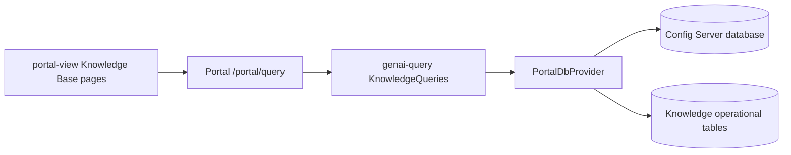
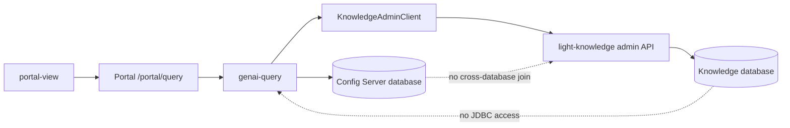

# Portal Operational Query Boundary For Light Knowledge

## Status

Proposed implementation design.

This page narrows the database-boundary decision in
[Global And Tenant Knowledge Bases For Shared Agent Retrieval](../light-portal/knowledge-base.md)
into an executable migration plan. It does not replace the broader Knowledge
Base design.

## Decision

Keep the browser-facing Knowledge Base administration contract in Light Portal,
but make `light-knowledge` the only application allowed to query its operational
tables.

The target request path is:

```text
portal-view -> /portal/query -> genai-query -> light-knowledge admin API
                                             -> knowledge database
```

The browser does not call `light-knowledge` directly. `genai-query` continues to
validate the authenticated Portal user, trusted host, environment, and
administrative capability, then calls `light-knowledge` with a short-lived,
scope-limited workload credential. This preserves the existing Portal query
surface while hiding internal service topology and knowledge-database
credentials from the browser.

Portal reads authoritative desired state from the Config Server database.
`light-knowledge` reads effective and operational state from the Knowledge
database. A mixed Portal response composes those two results in application
code; it never performs a cross-database join.

Maintain two canonical fresh-install DDLs:

- `portal-db/postgres/ddl.sql` contains Portal control-plane tables, functions,
  triggers, roles, and grants;
- `portal-db/postgres/knowledge/ddl.sql` contains Knowledge local projections,
  operational tables, functions, triggers, roles, grants, and extensions.

Knowledge upgrade patches live beside the Knowledge DDL. Historical Portal
patches remain immutable. Existing installations are migrated through new
forward patches and an explicit data-migration procedure rather than by editing
an already-released patch.

## Why This Change Is Required

The architecture already permits the Config Server and Knowledge databases to
run in different PostgreSQL instances. The current Portal query implementation
still assumes that both schemas are reachable through the Portal JDBC pool.
That assumption breaks the separate-instance deployment and gives the Portal
database role unnecessary access to high-volume operational state.

The local deployment already creates a `knowledge` database and configures
`LIGHT_KNOWLEDGE_DATABASE_URL` separately from
`LIGHT_KNOWLEDGE_CONTROL_EVENT_DATABASE_URL`. Its bootstrap currently derives
the Knowledge schema by cloning and filtering the Config Server schema. The two
canonical DDLs replace that temporary clone-and-delete process with explicit
ownership.

The change also reduces operational load. The Knowledge Base workspace
currently retrieves data for every tab on initial load and repeats the complete
load every three seconds while any synchronization is active.

## Current Request Path And Callers



`portal-view/src/pages/genai/knowledgeApi.ts` sends all Knowledge query actions
to `/portal/query`. `KnowledgeQueries` in `genai-query` validates trusted host
and role context and then delegates to `PortalDbProvider`.
`KnowledgePersistenceImpl` currently executes the operational SQL.

There are 23 Portal query actions that touch Knowledge operational state:

| Category | Count | Current callers |
| --- | ---: | --- |
| Generic operational collections | 18 | The Knowledge Base workspace eagerly calls 17. `getKnowledgeIndexSegments` has no current `portal-view` caller. |
| Operational computations | 2 | The workspace calls migration estimation and authorization simulation on demand. |
| Mixed control/effective queries | 3 | The list calls `getKnowledgeBases`; the workspace calls `getFreshKnowledgeBase` and `getKnowledgeSources`. |
| **Total** | **23** | **22 actions have a current production UI caller.** |

The production UI callers are limited to:

- `KnowledgeBases.tsx`, the Knowledge Base list and creation page;
- `KnowledgeBaseWorkspace.tsx`, the administrative detail workspace.

The Retrieval Playground is not a caller. Its input is currently disabled and
states that the Portal retrieval-test workflow has not been released.

On a workspace load, Portal issues 24 query actions in two `Promise.all`
groups. Nineteen touch operational state. When a synchronization is active, the
same load runs every three seconds. Successful workspace commands also trigger
the complete load. This behavior must not be preserved behind a network proxy.

## Query Inventory And Target Ownership

The Portal action names and response keys remain compatible during migration.
The target API may aggregate related resources so the migration does not turn
23 Portal actions into 23 remote round trips.

| Portal action | Current data | UI behavior | Target owner or composition |
| --- | --- | --- | --- |
| `getKnowledgeBases` | Control rows plus active pointer and generation | Knowledge Base list load | Portal control list plus one batched Knowledge summary request |
| `getFreshKnowledgeBase` | Control row plus active pointer and generation | Workspace load | Portal control detail plus one Knowledge summary |
| `getKnowledgeSources` | Control source rows plus successful sync status | Workspace load | Portal source configuration plus batched Knowledge source status |
| `getKnowledgeSyncRuns` | Sync runs | Workspace load and polling | Light Knowledge sync-runs API |
| `getKnowledgeDocuments` | Documents | Workspace load | Light Knowledge documents API |
| `getKnowledgeIndexGenerations` | Generations | Workspace load | Light Knowledge generations API |
| `getKnowledgeIndexSegments` | Segments | No current UI caller | Light Knowledge generation-segments API; retain only while the published Portal action remains supported |
| `getKnowledgeUploads` | Upload staging | Workspace load | Light Knowledge incremental-operations API |
| `getKnowledgeIncrementalChanges` | Source changes | Workspace load | Light Knowledge incremental-operations API |
| `getKnowledgePassageAnchors` | Passage anchors | Workspace load | Light Knowledge incremental-operations API |
| `getKnowledgeCompactionRuns` | Compaction runs | Workspace load | Light Knowledge incremental-operations API |
| `getKnowledgeAntiEntropyRuns` | Anti-entropy runs | Workspace load | Light Knowledge incremental-operations API |
| `getKnowledgeAclFreshness` | Source ACL state | Workspace load | Light Knowledge ACL-status API |
| `getKnowledgeAclReconciliations` | ACL reconciliations | Workspace load | Light Knowledge ACL-status API |
| `getKnowledgeAclTransitions` | ACL transitions | Workspace load | Light Knowledge ACL-status API |
| `getKnowledgeConnectorObjects` | Connector objects | Workspace load | Light Knowledge ACL-status API |
| `getKnowledgeBaseEmbeddingMigrations` | Embedding migrations | Workspace load | Light Knowledge production-operations API |
| `getKnowledgeMigrationEvaluations` | Migration evaluations | Workspace load | Light Knowledge production-operations API |
| `getKnowledgeGenerationRetention` | Generation retention | Workspace load | Light Knowledge production-operations API |
| `getKnowledgeBackupCheckpoints` | Backup checkpoints | Workspace load | Light Knowledge production-operations API |
| `getKnowledgePurgeEvidence` | Purge evidence | Workspace load | Light Knowledge production-operations API |
| `estimateKnowledgeBaseEmbeddingMigration` | Pointer, generation, chunks, profile, policy, and active migration | On demand | Light Knowledge migration-estimate API |
| `simulateKnowledgeAuthorization` | Documents, ACL revisions, normalized subjects, and source ACL state | On demand | Light Knowledge authorization-simulation API |

Control-only actions such as ingestion, retrieval, and embedding profile
queries and Agent bindings remain Portal queries. Their projected runtime forms
may also exist in the Knowledge database, but Portal does not treat those
derived rows as an administrative source of truth.

## Target Architecture



### Portal query adapter

Add a `KnowledgeAdminClient` abstraction to the Portal query runtime. The
adapter owns service discovery, workload-token acquisition, timeout and retry
policy, response validation, error mapping, and observability. It must not be
added to `PortalDbProvider`; that provider remains a database boundary.

Existing Portal query action names and top-level response keys remain stable in
the first cutover. Handlers either:

- return a Light Knowledge response transformed into the existing Portal
  collection shape;
- read Portal control state and merge a bounded Light Knowledge status result;
  or
- remain an unchanged control-plane database query.

The adapter retries only safe idempotent reads and only within the request
deadline. Estimation and simulation use POST because their inputs are
structured and sensitive, but they remain read-only and carry an idempotent
request ID. A retry must never create a migration, job, or audit identity other
than the required idempotent diagnostic audit.

### Light Knowledge administrative API

Add an `Administration` tag to the Light Knowledge OpenAPI document. The first
contract should expose bounded, typed resources rather than a SQL-like generic
query language:

| Method and path | Purpose |
| --- | --- |
| `POST /v1/knowledge/admin/knowledge-base-summaries:batch` | Return effective summary, active generation, pointer version, projection sequence, and freshness for an authorized set of Knowledge Base IDs. |
| `POST /v1/knowledge/admin/source-status:batch` | Return last successful synchronization and current source health keyed by source ID. |
| `GET /v1/knowledge/admin/knowledge-bases/{id}/sync-runs` | Return paginated synchronization runs. |
| `GET /v1/knowledge/admin/knowledge-bases/{id}/documents` | Return content-minimized document diagnostics. |
| `GET /v1/knowledge/admin/knowledge-bases/{id}/index-generations` | Return active and candidate generation evidence. |
| `GET /v1/knowledge/admin/knowledge-bases/{id}/index-generations/{generationId}/segments` | Return segment evidence when the caller explicitly opens generation detail. |
| `GET /v1/knowledge/admin/knowledge-bases/{id}/incremental-operations` | Return separately named upload, change, anchor, compaction, and anti-entropy collections. |
| `GET /v1/knowledge/admin/knowledge-bases/{id}/acl-status` | Return separately named freshness, reconciliation, transition, and connector-object collections. |
| `GET /v1/knowledge/admin/knowledge-bases/{id}/production-operations` | Return separately named migration, evaluation, retention, checkpoint, and purge-evidence collections. |
| `POST /v1/knowledge/admin/knowledge-bases/{id}/embedding-migration-estimates` | Calculate a read-only migration estimate for a qualified target profile. |
| `POST /v1/knowledge/admin/knowledge-bases/{id}/authorization-simulations` | Run an audited, content-safe authorization simulation. |

Grouped responses reduce remote calls while retaining distinct arrays and
schemas. They do not return a heterogeneous untyped `items` array.

Every collection is cursor-paginated with a server-owned stable ordering. The
initial maximum page size is 200, matching the current SQL limit, but the client
must request the data required by the selected tab rather than silently
truncating a complete administrative history. Responses include:

- `knowledgeBaseId`, `environment`, and the effective owner scope;
- `asOf` and a stable page cursor where applicable;
- applied projection sequence and projection freshness;
- resource-specific typed collections;
- an explicit `redactedFields` or capability marker when the caller receives a
  reduced global-Knowledge-Base view.

The API never returns document text, chunk text, vectors, connector secrets,
raw object locators, original filenames, provider evidence, raw principal
claims, or unrestricted error summaries through these administrative
endpoints.

### Authentication and authorization

The existing Agent retrieval delegation token is not reused as an
administrative token. Add a distinct short-lived Light Knowledge administration
credential with:

- audience fixed to `light-knowledge`;
- workload subject fixed to the approved Portal query service identity;
- trusted consumer host and environment;
- allowed Knowledge Base IDs or a bounded owner-scope capability;
- capability names for summary, operational diagnostics, migration estimate,
  or authorization simulation;
- platform-administrator scope only when it was derived from the authenticated
  Portal principal;
- original actor and correlation identifiers for audit, without forwarding a
  broad browser token;
- issued-at, expiry, nonce, issuer, and key ID.

`genai-query` continues to derive the host from trusted request context and
rejects a conflicting supplied `hostId`. Light Knowledge independently checks
the signed workload identity, capability, host, environment, Knowledge Base
visibility, and global-versus-tenant administration rule. Tenant callers see a
not-found response rather than confirmation that an inaccessible Knowledge
Base exists.

The Portal runtime has no JDBC credential for the Knowledge database. The
Light Knowledge API role has no permission to mutate Config Server desired
state. The projector uses a separate role and connection for ordered control
events.

### Mixed desired/effective responses

Three current queries combine ownership domains and require explicit
composition:

1. `getKnowledgeBases` reads the visible desired-state catalog from Config
   Server, sends the resulting IDs in one bounded summary request, and merges
   by `knowledgeBaseId`.
2. `getFreshKnowledgeBase` reads one desired-state record and merges one
   effective summary.
3. `getKnowledgeSources` reads source configuration from Config Server and
   merges status returned by source ID.

An unavailable Light Knowledge service does not make desired state disappear.
The list and detail responses return desired state with
`effectiveState: "UNAVAILABLE"`, a stable error code, and no fabricated active
generation. Any operation that requires current effective state remains
disabled. Security-removing workflows continue to fail closed until projection
acknowledgement is current.

### UI loading model

The workspace loads only the information required for the Overview tab plus
control-plane selector data. Other operational groups load when their tab is
first selected and can be refreshed independently.

While a sync is active, the UI polls only the sync-run or summary endpoint. The
default interval remains three seconds initially, uses request cancellation and
single-flight behavior, backs off when the page is hidden or failures occur,
and stops at a terminal state. A transition to terminal state invalidates the
specific affected tabs once; it does not start a second full-workspace polling
loop.

The Retrieval Playground, when implemented, calls the authorized runtime
retrieval contract. It does not query operational tables and does not become an
administrative SQL browser.

## Database And DDL Ownership

### Portal control-plane DDL

The root Portal DDL retains authoritative event-backed administration,
including:

- `knowledge_base_t` and `knowledge_source_t`;
- `agent_knowledge_base_t`;
- ingestion, retrieval, embedding, and strategy-qualification policy tables;
- portability manifest export/import and identity-map tables;
- Portal event-store, aggregate, projection, and acknowledgement state owned by
  the control plane.

Control-plane foreign keys to Host, Agent, Alias, and other Portal resources
remain local to Config Server.

### Knowledge DDL

The Knowledge DDL owns:

- content-minimized local projections of Knowledge Bases, sources, profiles,
  policies, qualifications, and Agent bindings needed by runtime constraints;
- projection inbox, cursor, heartbeat, acknowledgement, and promotion-outbox
  state;
- jobs, synchronization, source cursor/change, uploads, documents, versions,
  ACLs, chunks, embeddings, segments, generations, and pointers;
- connector, compaction, anti-entropy, migration, retention, checkpoint, purge,
  audit, admission, quota, and usage records;
- Knowledge-only extensions, indexes, functions, procedures, triggers, roles,
  grants, and cascade-policy metadata.

Local projection roots must have names and constraints that do not imply they
are an independently writable administrative model. No Knowledge function,
view, trigger, or foreign key may resolve a Config Server relation.

### Fresh install and upgrade

Fresh installation applies the two DDLs to their respective database targets.
It does not `pg_dump` Config Server into Knowledge and then delete unrelated
relations.

For an upgrade, the migration first identifies the database referenced by the
running Light Knowledge service as the authoritative operational source. It
must never merge two independently changing operational databases. If moving a
legacy single database to a new Knowledge database, stop writers, take a
checkpoint, copy the owned relations and sequences, validate counts and
digests, replay control events to rebuild local projections, and then start
Light Knowledge against the new target.

Removing operational tables from the canonical Portal DDL affects new
installations only. Existing Config Server copies are not dropped during the
application cutover. A later cleanup patch may remove them only after the API
cutover, backup retention, rollback window, dependency scan, and separate-
instance qualification have completed.

## Implementation Phases

### Phase 0: Freeze inventory and contracts

Owners: `light-portal-doc`, `implementation`, `genai-query`, `portal-view`,
`light-portal`, `light-fabric`, `portal-db`, and deployment repositories.

- Freeze the 23-action inventory and existing Portal response fixtures.
- Record the two production UI callers and prove that the Playground is not a
  caller.
- Inventory every SQL function, view, trigger, foreign key, cascade policy,
  role grant, schema gate, deployment script, snapshot rule, and command/event
  projector that references a Knowledge-owned relation.
- Freeze the administration OpenAPI paths, schemas, error codes, capability
  names, pagination contract, redaction contract, and service identity.
- Capture request count and latency baselines for the list and every workspace
  tab.
- Add a two-PostgreSQL-instance test topology in which the Portal network and
  credential cannot connect to the Knowledge database.

Exit gate:

- all 23 actions have an owner, target contract, caller, fixture, and rollback
  classification;
- the database ownership manifest has no unclassified `knowledge_*` relation;
- security review approves the workload-token and global-administrator model;
- no implementation begins with an unresolved mixed-query contract.

### Phase 1: Split the canonical DDL without runtime cutover

Owner: `portal-db`, with deployment and Light Knowledge review.

- Create `postgres/knowledge/ddl.sql` from the final owned Knowledge schema.
- Separate Knowledge patches, roles, grants, extensions, functions, triggers,
  and cascade policies from Portal artifacts.
- Keep the current root DDL behavior temporarily for compatibility while fresh
  Knowledge-schema parity tests are established.
- Replace clone-and-filter bootstrap in local/development fixtures with direct
  application of the Knowledge DDL.
- Add fresh-schema, upgraded-schema, function-dependency, trigger-dependency,
  role-isolation, and two-instance gates.
- Preserve user changes and immutable historical patches; use a new forward
  patch for any upgraded environment change.

Exit gate:

- Config Server and Knowledge can each be created from an empty database using
  only their own canonical DDL and bootstrap data;
- the Knowledge database contains no Portal event store or unrelated Portal
  catalog table;
- every Knowledge routine resolves only local relations;
- current application behavior is unchanged.

### Phase 2: Implement the Light Knowledge administration API

Owner: `light-fabric/apps/light-knowledge`.

- Add the OpenAPI administration tag, typed request/response models, routes,
  handlers, repository queries, pagination, redaction, and stable errors.
- Add the distinct administration-token verifier and capability checks.
- Reuse the same host, environment, owner-scope, local projection, and
  fail-closed rules used by runtime authorization; do not duplicate an
  inconsistent visibility model.
- Implement grouped incremental, ACL, and production-operation reads.
- Implement audited migration estimation and authorization simulation without
  operational mutation.
- Add per-route request, latency, result-count, denial, redaction, timeout, and
  database-pool metrics without high-cardinality tenant or Knowledge Base
  labels.

Exit gate:

- OpenAPI and implementation conformance tests cover every status code and
  response field;
- cross-tenant, global read-only, expired token, wrong audience, wrong
  capability, stale projection, pagination, redaction, and injection tests pass;
- response bodies are bounded to 1 MiB and page size to 200;
- p99 handler latency is below two seconds in the qualification corpus, and no
  route performs an unbounded table scan.

### Phase 3: Add Portal client and shadow comparison

Owners: `genai-query` and Portal runtime configuration.

- Add `KnowledgeAdminClient`, service discovery, workload-token acquisition,
  deadlines, safe-read retry, circuit breaking, metrics, and stable error
  mapping.
- Keep the existing `/portal/query` action names and response keys.
- Implement the three mixed-query composition paths with batched summary and
  source-status calls.
- In compatibility environments only, add a shadow mode that returns the
  current response while comparing a normalized Light Knowledge response.
  Shadow mode must not be used when the legacy Config Server copy is stale or
  non-authoritative.
- Compare deterministic fixtures and normalized live results while excluding
  expected observation-time fields. Record mismatches without logging content,
  object locators, principals, or secrets.

Exit gate:

- all 23 actions pass legacy response-contract tests;
- deterministic fixtures have exact semantic equality;
- the canary records zero authorization-scope mismatches and zero missing
  records after reconciliation;
- the remote path adds no more than 100 ms to current p95 query latency and its
  p99 remains below two seconds;
- failure tests prove that mixed catalog responses show unavailable effective
  state and operational-only actions return a stable service-unavailable error.

### Phase 4: Cut over Portal reads and fix UI request behavior

Owners: `genai-query` and `portal-view`.

- Switch the 20 purely operational actions to the Light Knowledge client.
- Switch the three mixed actions to application-level composition.
- Load workspace operational data by selected tab.
- Replace full-workspace polling with one sync-status request and targeted
  invalidation at terminal transition.
- Add cancellation, single-flight behavior, visibility-aware backoff, explicit
  stale indicators, independent tab errors, and manual refresh.
- Keep the Playground on the runtime retrieval API when that feature is
  released.

Exit gate:

- source scans find no Portal production SQL read of a Knowledge operational
  table;
- all list, workspace, global/tenant, on-demand estimate, and simulation UI
  tests pass;
- active-sync polling generates at least 80 percent fewer Portal query actions
  than the current 24-query reload loop;
- no hidden tab fetches operational data before first selection except the
  bounded Overview summary;
- canary authorization mismatches remain zero.

### Phase 5: Enforce physical separation and remove compatibility code

Owners: `portal-db`, `light-portal`, `genai-query`, `light-fabric`, Portal
configuration, installer, and deployment repositories.

- Remove operational query methods from `KnowledgePersistence`,
  `PortalDbProvider`, and their implementations after callers are gone.
- Remove Knowledge operational relations from the fresh Config Server DDL and
  make `postgres/knowledge/ddl.sql` the only fresh-schema owner.
- Update local, development, installer, and production templates to take
  explicit Config Server and Knowledge database targets.
- Remove clone-and-filter bootstrap and any snapshot/export discovery that
  treats operational rows as Portal aggregate state.
- Run the complete suite with two PostgreSQL instances and network isolation.
- Retain old Config Server operational copies, if present, as inaccessible
  rollback evidence for the declared retention window; do not keep them in
  dual-write synchronization.

Exit gate:

- Portal starts and serves all non-Knowledge functions when the Knowledge
  database is unreachable;
- Portal has no credential or network route to the Knowledge database;
- Light Knowledge has no desired-state write permission in Config Server;
- fresh install, upgrade, backup/restore, projection replay, and rollback gates
  pass in colocated, separate-database, and separate-instance profiles;
- schema dependency scans find zero cross-boundary function, trigger, view,
  foreign-key, or cascade-policy references.

### Phase 6: Production qualification and cleanup

Owners: operations and the participating service teams.

- Roll out by tenant/environment allowlist, then expand after latency,
  availability, denial, redaction, projection-lag, and pool-saturation review.
- Hold the old Config Server operational copies through one declared rollback
  and backup cycle.
- Remove disabled JDBC compatibility configuration, shadow comparison, obsolete
  SQL fixtures, and retained tables only after the rollback window.
- Publish the operational runbook for API outage, projection staleness,
  database restore, credential rotation, and service rollback.

Exit gate:

- seven consecutive days meet the Portal query and Light Knowledge service
  SLOs with zero authorization-scope mismatch;
- restore evidence proves compatible Portal event watermark, Knowledge
  projection cursor, database checkpoint, and object manifest;
- rollback uses versioned service/API deployment and database restore artifacts,
  not a stale Config Server operational mirror.

## Test And Qualification Matrix

| Layer | Required evidence |
| --- | --- |
| Portal action contract | All existing action names, parameters, top-level keys, field types, nullability, redaction, and errors remain compatible through cutover. |
| Light Knowledge OpenAPI | Schema validation plus router/operation parity and negative authentication tests. |
| Database | Fresh and upgraded schema parity, table ownership manifest, function/trigger dependency scan, grants, local foreign keys, and no cross-boundary relation. |
| Two-instance integration | Portal can reach Config Server but not Knowledge PostgreSQL; Light Knowledge can reach Knowledge and read ordered control events with separate credentials. |
| Mixed composition | Missing, stale, delayed, global, tenant, deleted, and unavailable effective summaries merge without fabricating state or leaking existence. |
| UI | Tab-scoped loading, independent errors, cancellation, one polling loop, terminal invalidation, manual refresh, and zero Playground operational calls. |
| Security | Wrong host/environment/audience/capability, tenant-to-global mutation, tenant-to-tenant access, redaction, token replay/expiry, and content-safe simulation. |
| Performance | Request-count reduction, page bounds, query plans, pool saturation, p50/p95/p99 latency, timeout, circuit breaker, and recovery. |
| Rollout | Disabled, shadow, canary, full cutover, service rollback, database restore, and retained-table cleanup. |

## Failure And Rollback Rules

- Before Portal cutover, disabling the new read path returns to JDBC only when
  that database is still verified as the authoritative operational source.
- After Portal cutover, an API outage produces explicit unavailable effective
  state or a stable operational-query failure. Portal must not silently read a
  stale Config Server copy.
- Before physical migration, rollback restores the previous application path
  and verified database target.
- After physical separation, rollback deploys the previous compatible
  `genai-query`/Light Knowledge versions or restores the Knowledge database. It
  does not reconnect Portal JDBC to Knowledge or merge operational databases.
- No rollback may broaden tenant visibility, bypass projection freshness, omit
  redaction, or treat desired state as effective state.

## Major Risks And Mitigations

| Risk | Mitigation |
| --- | --- |
| A proxy preserves the current 24-query polling storm | Group remote contracts, load by tab, and poll only sync status before enabling broad traffic. |
| Portal and Light Knowledge disagree on tenant visibility | Sign scoped workload claims and independently enforce host, environment, capability, global scope, and local projection freshness in Light Knowledge. |
| Mixed queries hide a Light Knowledge outage | Return desired state with explicit unavailable effective state; disable operations requiring current runtime evidence. |
| Generic operational APIs expose new tables accidentally | Publish typed grouped contracts and explicit fields; do not accept arbitrary table, column, ordering, or predicate input. |
| Schema split breaks functions, triggers, or cascade policy | Gate fresh and upgraded schemas with dependency scans and run the separate-instance profile. |
| Existing installations have two diverging operational copies | Select one authoritative configured Knowledge database, stop writers for any move, and never merge independently changing rows. |
| Service rollback depends on removed Config Server tables | Complete API canary and retain versioned Knowledge backups; after separation, rollback the service/API rather than the ownership boundary. |
| Administrative diagnostics leak content or identity | Use explicit projections, field allowlists, redaction markers, bounded audited simulation, and negative response scans. |

## Definition Of Done

The migration is complete when:

- all 23 Portal actions preserve their supported browser contract without any
  Portal production SQL read of Knowledge operational tables;
- `portal-view` has only the Knowledge Base list and workspace as operational
  administration callers, and the workspace loads by tab;
- `genai-query` reaches Knowledge state only through the authenticated Light
  Knowledge administration API;
- Config Server and Knowledge fresh schemas are created from separate canonical
  DDLs with isolated roles and no cross-database dependency;
- local, development, installer, and production profiles support different
  PostgreSQL instances without schema cloning;
- authorization, redaction, pagination, latency, request-count, backup/restore,
  rollout, and rollback gates pass; and
- obsolete JDBC queries, clone-and-filter bootstrap, compatibility
  configuration, and retained operational copies are removed after the
  declared rollback window.
