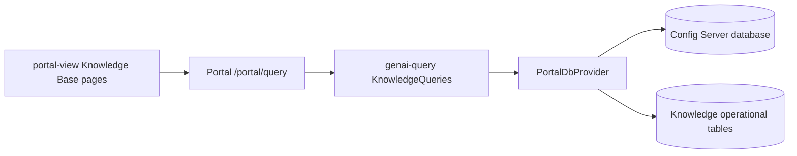
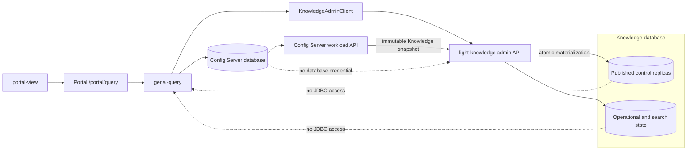

# Portal Operational Access Boundary For Light Knowledge

## Status

Proposed implementation design.

This page narrows the read, command, and database-boundary decision in
[Global And Tenant Knowledge Bases For Shared Agent Retrieval](../light-portal/knowledge-base.md)
into an executable migration plan. It does not replace the broader Knowledge
Base design.

## Decision

Keep the browser-facing Knowledge Base administration contract in Light Portal,
but make the `light-knowledge` runtime and its approved build/job execution
identity the only application boundary allowed to query its operational tables.

The target request path is:

```text
portal-view -> /portal/query -> genai-query -> light-knowledge admin API
                                             -> knowledge database
```

The browser does not call `light-knowledge` directly. `genai-query` continues to
validate the authenticated Portal user, trusted host, environment, and
administrative capability, then forwards the same authenticated bearer token
to `light-knowledge-admin`. This preserves the existing Portal query
surface while hiding internal service topology and knowledge-database
credentials from the browser.

Portal reads authoritative desired state from the Config Server database.
`light-knowledge` reads effective and operational state from the Knowledge
database. A mixed Portal response composes those two results in application
code; it never performs a cross-database join.

The Knowledge database has two kinds of Light Knowledge-managed local state:

- published control replicas materialized from one validated immutable Config
  Server Knowledge snapshot; and
- service-owned operational state and derived search/index projections.

Published control replicas are not independent authoring models and are not
fed by a Portal-event listener. The Config Server snapshot loader is their only
writer. The replicas give database constraints and operational queries local
Knowledge Base, source, profile, policy, qualification, and Agent-binding
identities without giving Light Knowledge a Config Server database credential.

Maintain two canonical fresh-install DDLs:

- `portal-db/postgres/ddl.sql` contains Portal control-plane tables, functions,
  triggers, roles, and grants;
- `portal-db/postgres/knowledge/ddl.sql` contains published control replicas,
  Knowledge operational state, derived search projections, functions,
  triggers, roles, grants, and extensions.

Knowledge upgrade patches live beside the Knowledge DDL. Historical Portal
patches remain immutable. Existing installations are migrated through new
forward patches and an explicit data-migration procedure rather than by editing
an already-released patch.

## Why This Change Is Required

The architecture already permits the Config Server and Knowledge databases to
run in different PostgreSQL instances. The current Portal query implementation
still assumes that both schemas are reachable through the Portal JDBC pool.
That assumption breaks the separate-instance deployment and gives the Portal
database role unnecessary access to high-volume operational state.

The local deployment already creates a `knowledge` database. Its predecessor
event-consumer topology also configures
`LIGHT_KNOWLEDGE_CONTROL_EVENT_DATABASE_URL`, and its bootstrap currently
derives the Knowledge schema by cloning and filtering the Config Server schema.
The target removes that control-event credential and replaces the temporary
clone-and-delete process with two canonical DDLs and explicit ownership.

The change also reduces operational load. The Knowledge Base workspace
currently retrieves data for every tab on initial load and repeats the complete
load every three seconds while any synchronization is active.

The current command path also crosses this boundary. Portal projection code
inserts `knowledge_promotion_ack_t`, updates `knowledge_base_t`, and queries
`knowledge_promotion_outbox_t` while authorizing a promotion acknowledgement.
Those accesses are part of this migration; physical separation cannot be
declared complete by moving reads alone.

## Current Request Path And Callers



`portal-view/src/pages/genai/knowledgeApi.ts` sends all Knowledge query actions
to `/portal/query`. `KnowledgeQueries` in `genai-query` validates trusted host
and role context and then delegates to `PortalDbProvider`.
`KnowledgePersistenceImpl` currently executes the operational SQL.

There are 23 Portal query actions that touch Knowledge operational state:

| Category | Count | Current callers |
| --- | ---: | --- |
| Generic operational collections | 18 | The Knowledge Base workspace eagerly calls 17. `getKnowledgeIndexSegments` has no current `portal-view` caller. |
| Operational computations | 2 | The workspace calls migration estimation and authorization simulation on demand. |
| Mixed control/effective queries | 3 | The list calls `getKnowledgeBases`; the workspace calls `getFreshKnowledgeBase` and `getKnowledgeSources`. |
| **Total** | **23** | **22 actions have a current production UI caller.** |

The production UI callers are limited to:

- `KnowledgeBases.tsx`, the Knowledge Base list and creation page;
- `KnowledgeBaseWorkspace.tsx`, the administrative detail workspace.

The Retrieval Playground is not a caller. Its input is currently disabled and
states that the Portal retrieval-test workflow has not been released.

`getKnowledgeBaseImport` and `getKnowledgeBaseImportLineage` also have no
current `portal-view` caller. They are excluded from the 23 because they read
Portal control-plane import tables rather than Knowledge operational state;
the frozen caller inventory records them explicitly so that absence of a UI
caller is not mistaken for operational ownership.

On a workspace load, Portal issues 24 query actions in two `Promise.all`
groups. Nineteen touch operational state. When a synchronization is active, the
same load runs every three seconds. Successful workspace commands also trigger
the complete load. This behavior must not be preserved behind a network proxy.

## Query Inventory And Target Ownership

The Portal action names and response keys remain compatible during migration.
The target API may aggregate related resources so the migration does not turn
23 Portal actions into 23 remote round trips.

| Portal action | Current data | UI behavior | Target owner or composition |
| --- | --- | --- | --- |
| `getKnowledgeBases` | Control rows plus active pointer and generation | Knowledge Base list load | Portal control list plus one batched Knowledge summary request |
| `getFreshKnowledgeBase` | Control row plus active pointer and generation | Workspace load | Portal control detail plus one Knowledge summary |
| `getKnowledgeSources` | Control source rows plus successful sync status | Workspace load | Portal source configuration plus batched Knowledge source status |
| `getKnowledgeSyncRuns` | Sync runs | Workspace load and polling | Light Knowledge sync-runs API |
| `getKnowledgeDocuments` | Documents | Workspace load | Light Knowledge documents API |
| `getKnowledgeIndexGenerations` | Generations | Workspace load | Light Knowledge generations API |
| `getKnowledgeIndexSegments` | Segments | No current UI caller | Light Knowledge generation-segments API; retain only while the published Portal action remains supported |
| `getKnowledgeUploads` | Upload staging | Workspace load | Light Knowledge incremental-operations API |
| `getKnowledgeIncrementalChanges` | Source changes | Workspace load | Light Knowledge incremental-operations API |
| `getKnowledgePassageAnchors` | Passage anchors | Workspace load | Light Knowledge incremental-operations API |
| `getKnowledgeCompactionRuns` | Compaction runs | Workspace load | Light Knowledge incremental-operations API |
| `getKnowledgeAntiEntropyRuns` | Anti-entropy runs | Workspace load | Light Knowledge incremental-operations API |
| `getKnowledgeAclFreshness` | Source ACL state | Workspace load | Light Knowledge ACL-status API |
| `getKnowledgeAclReconciliations` | ACL reconciliations | Workspace load | Light Knowledge ACL-status API |
| `getKnowledgeAclTransitions` | ACL transitions | Workspace load | Light Knowledge ACL-status API |
| `getKnowledgeConnectorObjects` | Connector objects | Workspace load | Light Knowledge ACL-status API |
| `getKnowledgeBaseEmbeddingMigrations` | Embedding migrations | Workspace load | Light Knowledge production-operations API |
| `getKnowledgeMigrationEvaluations` | Migration evaluations | Workspace load | Light Knowledge production-operations API |
| `getKnowledgeGenerationRetention` | Generation retention | Workspace load | Light Knowledge production-operations API |
| `getKnowledgeBackupCheckpoints` | Backup checkpoints | Workspace load | Light Knowledge production-operations API |
| `getKnowledgePurgeEvidence` | Purge evidence | Workspace load | Light Knowledge production-operations API |
| `estimateKnowledgeBaseEmbeddingMigration` | Pointer, generation, chunks, profile, policy, and active migration | On demand | Light Knowledge migration-estimate API |
| `simulateKnowledgeAuthorization` | Documents, ACL revisions, normalized subjects, and source ACL state | On demand | Light Knowledge authorization-simulation API |

Control-only actions such as ingestion, retrieval, and embedding profile
queries and Agent bindings remain Portal queries. Their least-privilege runtime
forms are published in the immutable Config Server Knowledge audience snapshot;
the snapshot loader materializes only the fields needed by Light Knowledge as
published control replicas, never as an independently writable administrative
model.

## Target Architecture



### Deployment and scaling boundary

`light-knowledge` and `light-knowledge-admin` are separate production
services and separate containers. They are one versioned Light Knowledge
product, may share repository crates and one release manifest, and connect to
the same Knowledge database, but they do not share a process or listener.

This is a deliberate scaling and security boundary:

- `light-knowledge` serves latency-sensitive Agent retrieval and may require
  substantially more replicas as Agent query traffic grows;
- `light-knowledge-admin` is called only by the approved Light Portal query
  workload and normally requires fewer replicas;
- each service has its own database login and pool, workload identity,
  configuration, resource limits, health checks, autoscaling policy, and
  rollout/rollback control;
- administration query load, JWKS failure, replay-cache pressure, or an admin
  deployment failure must not consume retrieval capacity or make the retrieval
  service unavailable; and
- the administration service remains reachable only on its private Service
  and listener. It is not exposed by the public retrieval Service or runtime
  OpenAPI.

Production does not combine the two executables into one container. A shared
Helm chart or Compose profile may deploy them together, but replica counts are
independent. A same-Pod sidecar layout is permitted only for constrained local
or test profiles because it couples scheduling, restart, and scaling; it is not
the production topology. Simply merging `admin_router` into
`knowledge_router` is prohibited because it would place administration routes
on the runtime listener and collapse the database-credential and resource
failure domains.

### Portal query adapter

Add a `KnowledgeAdminClient` abstraction to the Portal query runtime. The
adapter owns service discovery, delegated-user-token forwarding, timeout and retry
policy, response validation, error mapping, and observability. It must not be
added to `PortalDbProvider`; that provider remains a database boundary.

Existing Portal query action names and top-level response keys remain stable in
the first cutover. Handlers either:

- return a Light Knowledge response transformed into the existing Portal
  collection shape;
- read Portal control state and merge a bounded Light Knowledge status result;
  or
- remain an unchanged control-plane database query.

The adapter retries only safe idempotent reads and only within the request
deadline. Estimation and simulation use POST because their inputs are
structured and sensitive, but they remain read-only and carry an idempotent
request ID. A retry must never create a migration, job, or audit identity other
than the required idempotent diagnostic audit.

### Light Knowledge administrative API

Create a separately versioned Light Knowledge administration OpenAPI document
with an `Administration` tag. The existing
`light-fabric/apps/light-knowledge/openapi.yaml` remains the runtime contract;
its current eight routes do not become the administrative surface. The first
private contract exposes bounded, typed resources rather than a SQL-like
generic query language:

| Method and path | Purpose |
| --- | --- |
| `POST /v1/knowledge/admin/knowledge-base-summaries:batch` | Return effective summary, active generation, pointer version, active-sync/job indicator, applied configuration snapshot, and freshness for an authorized set of Knowledge Base IDs. |
| `POST /v1/knowledge/admin/source-status:batch` | Return last successful synchronization and current source health keyed by source ID. |
| `GET /v1/knowledge/admin/knowledge-bases/{id}/sync-runs` | Return paginated synchronization runs. |
| `GET /v1/knowledge/admin/knowledge-bases/{id}/documents` | Return content-minimized document diagnostics. |
| `GET /v1/knowledge/admin/knowledge-bases/{id}/index-generations` | Return active and candidate generation evidence. |
| `GET /v1/knowledge/admin/knowledge-bases/{id}/index-generations/{generationId}/segments` | Return segment evidence when the caller explicitly opens generation detail. |
| `GET /v1/knowledge/admin/knowledge-bases/{id}/incremental-operations` | Return separately named upload, change, anchor, compaction, and anti-entropy collections. |
| `GET /v1/knowledge/admin/knowledge-bases/{id}/acl-status` | Return separately named freshness, reconciliation, transition, and connector-object collections. |
| `GET /v1/knowledge/admin/knowledge-bases/{id}/production-operations` | Return separately named migration, evaluation, retention, checkpoint, and purge-evidence collections. |
| `POST /v1/knowledge/admin/knowledge-bases/{id}/embedding-migration-estimates` | Calculate a read-only migration estimate for a qualified target profile. |
| `POST /v1/knowledge/admin/knowledge-bases/{id}/authorization-simulations` | Run an audited, content-safe authorization simulation. |

Grouped responses reduce remote calls while retaining distinct arrays and
schemas. They do not return a heterogeneous untyped `items` array.

Every collection is cursor-paginated with a server-owned stable ordering. The
initial maximum page size is 200, matching the current SQL limit, but the client
must request the data required by the selected tab rather than silently
truncating a complete administrative history. The current silent 200-row limit
is a defect, not the target contract. Every collection returns `hasMore` and a
next cursor, and the UI exposes **Load more** or equivalent continuation.

Phase 0 freezes these descending cursor keys; every timestamp tie is broken by
the complete primary key:

| Resource | Cursor ordering |
| --- | --- |
| Sync runs | `(requested_ts, sync_run_id)` |
| Documents | `(update_ts, document_id)` |
| Index generations | `(created_ts, index_generation_id)` |
| Index segments | `(created_ts, index_segment_id)` |
| Uploads | `(staged_ts, upload_id)` |
| Incremental changes | `(observed_ts, source_change_id)` |
| Passage anchors | `(created_ts, passage_anchor_id, document_version_id)` |
| Compaction runs | `(created_ts, compaction_run_id)` |
| Anti-entropy runs | `(started_ts, anti_entropy_run_id)` |
| ACL freshness | `(update_ts, source_id)` |
| ACL reconciliations | `(started_ts, reconciliation_id)` |
| ACL transitions | `(recorded_ts, acl_transition_id)` |
| Connector objects | `(observed_ts, connector_object_id)` |
| Embedding migrations | `(created_ts, migration_id)` |
| Migration evaluations | `(created_ts, evaluation_evidence_id)` |
| Generation retention | `(update_ts, index_generation_id)` |
| Backup checkpoints | `(created_ts, checkpoint_id)` |
| Purge evidence | `(created_ts, purge_evidence_id)` |

Responses include:

- `knowledgeBaseId`, `environment`, and the effective owner scope;
- `asOf` and a stable page cursor where applicable;
- applied configuration snapshot/publication identity and configuration
  freshness;
- `hasActiveSync`, bounded active-job counts, and the latest applicable job
  state in Knowledge Base summaries;
- resource-specific typed collections;
- an explicit `redactedFields` or capability marker when the caller receives a
  reduced global-Knowledge-Base view.

Phase 0 freezes a per-resource field allowlist from the current residual column
set produced by `jsonb_populate_record(...)-ARRAY[...]` plus the existing
explicit column overrides. Shadow equality is evaluated only over that frozen
allowlist and its declared normalization rules; it is not equality over every
physical table column. `syncRuns.errorSummary` remains supported as the bounded
shape `{code, message?}`, with a 64-character code and a 512-character
content-safe message. `backupCheckpoints.verificationEvidence` retains its
existing top-level field but is reduced to a frozen safe sub-schema; raw
provider evidence is never returned. `migrationEvaluations.authorizedBy`,
which is an explicit current SQL override, is replaced by a non-reversible
opaque actor reference of at most 128 characters; the raw principal identifier
is not returned. `migrationEvaluations.metrics` retains its top-level field but
is reduced to a frozen typed metric sub-schema with at most 64 entries and 32
KiB serialized per row. `indexGenerations.evidence` likewise retains its
top-level field only as a frozen safe release-evidence sub-schema of at most 32
KiB per row; it cannot contain raw provider evidence, principal claims,
content, or object locators. Disallowed or truncated members are reported by
`redactedFields`. `purgeEvidence.authorizedBy`, which is exposed by the current
generic residual-column selection, uses the same non-reversible opaque actor
reference as `migrationEvaluations.authorizedBy`; its raw principal identifier
is withheld. Any intentional narrowing is versioned in the frozen contract
and its Portal UI fixture before shadow comparison begins because `JsonRows`
currently renders every returned field.

The API never returns document text, chunk text, vectors, connector secrets,
raw object locators, original filenames, unrestricted provider evidence, raw
principal claims, or unrestricted error summaries through these administrative
endpoints.

The embedding-migration estimate resolves target-profile qualification and
alias identity from the applied Config Server snapshot and its local published
replica. It never queries the Config Server definition of
`knowledge_embedding_profile_runtime_v`; `knowledge_operational_policy_t` is
explicitly Knowledge-owned operational state and supplies only the local cost,
retention, backup, anti-entropy, and concurrency inputs assigned to it.

### Authentication and authorization

Portal query and command handlers forward the same bearer token that the UI
presented. They never persist it in an event, outbox, log, metric, or database.
`light-knowledge-admin` is built on `light-axum` and uses the reusable
`light-security` JWT verifier to validate the signature, configured issuer and
audience, expiry policy, and JWKS rotation. It then independently requires
`portal.r` for reads (`portal.w` for operational commands), a Knowledge
administrator role, and a valid host claim. Global visibility is derived only
from `admin` or `platformKnowledgeBaseAdmin`; it is never accepted as a request
flag. Tenant visibility is rechecked by host/environment predicates in the
Knowledge database. The development-only `ignoreJwtExpiry` setting does not
weaken production, where expiry remains enforced.

The Portal-selected environment is sent on the private service request after
`genai-query` has removed conflicting untrusted input. Because the UI token has
no environment claim, this header is trusted only across the network-restricted
Portal-to-admin listener and is always combined with the signed host claim and
database visibility checks. No administration route is exposed through the
public gateway. Placing both Knowledge services behind `light-gateway` remains
optional defense-in-depth; gateway verification and coarse access control do
not replace service-side JWT verification or row-level tenant enforcement.

The delegated UI token does not cover unattended startup or refresh. The one
backend credential required by this design is for the designated Light
Knowledge snapshot loader (packaged with `light-knowledge-admin` or run as its
deployment job) to call the Config Server workload API. That identity is
read-only, audience-bound to Config Server, and limited to fetching and
acknowledging the immutable Light Knowledge audience snapshot. It is never used
for Portal query/command forwarding or by `light-knowledge-worker`.

`genai-query` continues to derive the host from trusted request context and
rejects a conflicting supplied `hostId`. Light Knowledge independently checks
the signed user identity, scope, role, host, environment, Knowledge Base
visibility, global-versus-tenant administration rule, and its currently
applied Config Server policy snapshot. Tenant callers see a not-found response
rather than confirmation that an inaccessible Knowledge Base exists.

The Portal runtime has no JDBC credential for the Knowledge database. The
Light Knowledge API role has no permission to mutate Config Server desired
state. Light Knowledge has no Portal event-store or Config Server database
credential; `light-runtime` obtains its audience-specific immutable
configuration through the Config Server API.

Administration routes are not exposed on the public retrieval listener. The
target deployment binds them to an internal listener reachable only from the
Portal query workload and still verifies the delegated user credential. A
temporary single-listener implementation must be network-restricted to that
identity and cannot pass the physical-separation exit gate until listener
isolation is qualified. The runtime OpenAPI and administration OpenAPI remain
independently versioned and route-parity tested.

### Mixed desired/effective responses

Three current queries combine ownership domains and require explicit
composition:

1. `getKnowledgeBases` reads the visible desired-state catalog from Config
   Server, sends the resulting IDs in one bounded summary request, and merges
   by `knowledgeBaseId`.
2. `getFreshKnowledgeBase` reads one desired-state record and merges one
   effective summary.
3. `getKnowledgeSources` reads source configuration from Config Server and
   merges status returned by source ID.

An unavailable Light Knowledge service does not make desired state disappear.
The list and detail responses return desired state with
`effectiveState: "UNAVAILABLE"`, a stable error code, and no fabricated active
generation. Any operation that requires current effective state remains
disabled. Security-removing workflows continue to fail closed until every
required Light Knowledge instance acknowledges application of the published
configuration snapshot.

`NOT_YET_APPLIED` is distinct from both `UNAVAILABLE` and `NOT_FOUND`. It means
that Portal has authorized and signed the Knowledge Base ID for this request,
but the applied Knowledge snapshot/control replica does not yet contain the
requested control version. The signed Portal ID allowlist is authoritative for
disclosure: an ID outside that allowlist is still not-found, while an allowed
but not-yet-applied ID returns the typed pending state without fabricating an
active generation. Creation, replay, snapshot refresh, and backfill tests cover
this state transition.

For `getFreshKnowledgeBase`, `version`, `projectionState`, and every optimistic-
concurrency field come only from the Config Server control-plane result. They
are returned unchanged even when the Knowledge summary is `UNAVAILABLE` or
`NOT_YET_APPLIED`; the merge cannot replace, null, or downgrade them and thereby
cause a subsequent command-version conflict.

### UI loading model

The workspace loads only the information required for the Overview tab plus
control-plane selector data. Other operational groups load when their tab is
first selected and can be refreshed independently.

While a sync is active, the UI polls only the sync-run or summary endpoint. The
default interval remains three seconds initially, uses request cancellation and
single-flight behavior, backs off when the page is hidden or failures occur,
and stops at a terminal state. A transition to terminal state invalidates the
specific affected tabs once; it does not start a second full-workspace polling
loop. The Overview summary's `hasActiveSync`/active-job fields start polling even
when the Sync Runs tab has never been opened.

Phase 0 freezes the command-to-invalidation map. Source mutations invalidate
Overview and Sources; upload and synchronization commands invalidate Overview,
Sync Runs, and Incremental, then Documents and Index Generations once terminal;
ACL commands invalidate Overview and Access Policy; generation, compaction,
migration, promotion, rollback, retention, backup, and purge commands invalidate
Overview plus their specific Index Generations, Incremental, or Production
Operations data; binding commands invalidate Overview, Agent Bindings, and
Access Policy. A command must not fall back to the former complete `load()`.

The Retrieval Playground, when implemented, calls the authorized runtime
retrieval contract. It does not query operational tables and does not become an
administrative SQL browser.

## Database And DDL Ownership

### Portal control-plane DDL

The root Portal DDL retains authoritative event-backed administration,
including:

- `knowledge_base_t` and `knowledge_source_t`;
- `agent_knowledge_base_t`;
- ingestion, retrieval, embedding, and strategy-qualification policy tables;
- portability manifest export/import and identity-map tables;
- Portal event-store, aggregate, projection, and acknowledgement state owned by
  the control plane.

Control-plane foreign keys to Host, Agent, Alias, and other Portal resources
remain local to Config Server.

Where the runtime needs them, these authoritative relations also exist as
content-minimized, read-only published replicas in the Knowledge database; see
the three-category ownership manifest below. A shared relation name does not
imply shared authority or an identical schema.

### Knowledge DDL

The Knowledge DDL owns:

- content-minimized published control replicas for Knowledge Bases, sources,
  profiles, policies, qualifications, and Agent bindings required by local
  constraints and runtime queries;
- applied configuration publication/snapshot identity, validation result,
  source event watermark, load time, and last-known-good evidence needed for
  ordering and runtime diagnostics;
- jobs, synchronization, source cursor/change, uploads, documents, versions,
  ACLs, chunks, embeddings, segments, generations, and pointers;
- connector, compaction, anti-entropy, migration, retention, checkpoint, purge,
  audit, admission, quota, and usage records;
- Knowledge-only extensions, indexes, functions, procedures, triggers, roles,
  grants, and cascade-policy metadata.

Published replicas and derived search/operational projections must have names
and constraints that do not imply they are independently writable
administrative models. No Knowledge function, view, trigger, or foreign key may
resolve a Config Server relation. The snapshot loader is the only writer of
published control replicas; API, builder, and job roles receive read-only access
to them.

### Three-category ownership manifest

Phase 0 creates a machine-checked relation manifest with these columns for
every `knowledge_*` relation and `agent_knowledge_base_t`: category,
authoritative database, replica database if any, writer identity, delivery
mechanism, source version/watermark, local version gate, schema-definition
digest, and rollback disposition. The initial classifications include:

| Relation family | Category and authority | Knowledge-side writer and version rule |
| --- | --- | --- |
| `knowledge_base_t`, `knowledge_source_t` | Portal control authority; published control replica in Knowledge | Config Server snapshot loader only; apply a complete snapshot atomically and reject an older release/control version. |
| `agent_knowledge_base_t` | Portal control authority; published control replica required by retrieval | Snapshot loader only; host/environment/binding version must match the applied publication. |
| `knowledge_embedding_profile_t`, ingestion/retrieval policy, and qualification replicas | Portal control authority; content-minimized published control replicas | Snapshot loader only; identity, immutable digest, qualification, and compatibility generation are version gated. |
| `knowledge_embedding_profile_runtime_v` | Database-local runtime view, not one portable cross-database definition | Canonical Knowledge DDL owns its local definition and schema digest. |
| `knowledge_operational_policy_t` | Knowledge-owned operational policy | Light Knowledge operational role; never confused with Portal-authored ingestion/retrieval policy. |
| `knowledge_promotion_outbox_t`, `knowledge_promotion_ack_t`, jobs, documents, ACLs, chunks, segments, generations, pointers, quota, audit, and evidence | Knowledge-owned operational state | Light Knowledge API/job roles under local transactions and idempotency rules. |

The manifest explicitly permits a published control replica; it never permits
two authorities or a Light Knowledge write to the Portal-authored relation.

### Global snapshot export and database recreation

The Portal global snapshot is the canonical database-recreation boundary for
Config Server control-plane state. It must export the authoritative,
event-backed Knowledge configuration held in Config Server and convert it back
to the same control-plane birth events used by normal commands. A fresh Config
Server rebuilt from the resulting `events.json` must therefore retain active
Knowledge Bases and their complete usable configuration.

The portable Knowledge control-plane set is:

- `knowledge_embedding_profile_t`;
- `knowledge_ingestion_policy_t`;
- `knowledge_retrieval_profile_t`;
- `knowledge_base_t`;
- `knowledge_source_t`; and
- `agent_knowledge_base_t`.

Snapshot conversion emits `KnowledgeEmbeddingProfileCreatedEvent`,
`KnowledgeIngestionPolicyCreatedEvent`,
`KnowledgeRetrievalProfileCreatedEvent`, `KnowledgeBaseCreatedEvent`,
`KnowledgeSourceCreatedEvent`, and `AgentKnowledgeBaseBoundEvent` in dependency
order. Aggregate subjects use the same owner, environment, and identity
composition as the production Knowledge command handlers. Source host and
environment ownership is inherited from the exported parent Knowledge Base;
it is never inferred from an unscoped Source scan. Global embedding profiles
and global policies are included only by `global` or `both` scope, while
host-owned rows are included only for the selected host.

This global snapshot is distinct from the Knowledge audience snapshot below.
The global snapshot recreates authoritative Config Server aggregates. The
Knowledge audience snapshot publishes content-minimized runtime replicas from
those already-recreated aggregates into the Knowledge database.

No Knowledge operational relation is portable through the Portal global
snapshot. Jobs, documents, ACLs, chunks, embeddings, generations, pointers,
sync state, operational policy, promotion state, audit/usage, evidence, and
projection-consumer coordination remain excluded from both global snapshot
export and row-to-event conversion. Snapshot classification uses an explicit
control-plane allowlist plus an operational deny-by-default rule for every
other `knowledge_*` relation; adding a Config Server Knowledge control table
requires an event mapping, ownership/scoping rule, dependency rule, and CI
fixture before it becomes exportable.

Every full global snapshot reports the portable Knowledge control inventory
and an operator-visible indication that operational state was intentionally
excluded. CI rebuilds an empty Config Server from the converted events and
compares every portable Knowledge identity, aggregate version, owner,
environment, profile revision, and active configuration field with the source.
The gate fails if an active Knowledge Base disappears, a Source crosses host or
environment scope, an Agent binding loses its profile, or any operational row
appears in the snapshot.

### Same-name divergence register

Same-named relations in the two databases are not presumed schema-identical.
Phase 0 freezes a divergence register with both definitions, constraints,
owners, consumers, and definition digests. At minimum it records the current
differences created by `light-portal-install/postgres-db/init-knowledge.sh` and
`portal-db/postgres/patch_20260818_01_light_knowledge_single_container.sql`:

- the Config Server `knowledge_embedding_profile_runtime_v` joins
  `knowledge_qualified_embedding_alias_v` and the LLM Alias/deployment/model
  relations, while the Knowledge-local view reads the replica's `alias_name`
  without those joins; and
- `knowledge_embedding_profile_qualification_trg` exists on the Config Server
  authoring table but is deliberately absent from the Knowledge replica.

Embedding-alias qualification is therefore enforced by Portal before
publication. The immutable Knowledge snapshot carries the qualified alias name,
profile identity/revision, expected space identity/revision, qualification
digest, and compatibility generation. The Knowledge loader validates and
records those values; it does not rerun Config Server LLM joins or silently
weaken qualification. Any additional intentional divergence requires a register
entry and gate update; unregistered divergence fails schema qualification.

### Config Server snapshot application

There are two distinct snapshot contracts. The existing Config Server
`config_snapshot_t` artifact supplies effective runtime configuration for a
service instance. The Knowledge audience artifact described below supplies the
versioned Knowledge Base, source, profile, policy, qualification, binding, and
tombstone replicas required inside the Knowledge database. A runtime
configuration snapshot does not become a Knowledge audience snapshot merely
because its target service is `light-knowledge`; the second artifact requires
its own manifest, signature, inventory, watermark, and materialization
acknowledgement.

The current development runtime configuration checkpoint is snapshot
`01a01a32-9f34-7fe6-b505-68f2b3d58230`, for service
`com.networknt.light-knowledge-1.0.0` in environment `dev`. It is retained as
the reproducible bootstrap input for the development service, but it is not
accepted as Phase 2 control-replica evidence until the Knowledge audience
publisher produces and signs the separate artifact and the loader records a
successful applied-snapshot acknowledgement.

Replacing the event-store tail is an explicit migration, not a consequence of
splitting the DDL. The Knowledge audience artifact is a complete, signed
snapshot containing its publication ID, release version, source event
watermark, schema/compatibility generation, complete replica inventory, and
explicit tombstones. Light Knowledge:

1. authenticates the Config Server response and validates target identity,
   signature, digests, validity, schema, and compatibility;
2. stages the complete replica set without changing the active set;
3. verifies references, per-aggregate control versions, counts, and the replica
   manifest digest;
4. atomically replaces the active published replicas and applied-snapshot
   pointer in one Knowledge transaction; and
5. acknowledges the exact snapshot/publication/digest or retains the prior
   last-known-good set.

Application is idempotent by snapshot ID and content digest. Release version
and source event watermark may advance but never regress. Absence removes a
replica only when the artifact declares a complete inventory and the matching
tombstone/control version; a partial response cannot delete state. Portal event
replay rebuilds Portal projections and requires a new explicit snapshot
publication. Snapshot application never creates an operational job, calls a
provider, promotes a generation, or replays a historical side effect.

Migration first publishes a snapshot from the current authoritative Portal
control projections, applies it into fresh staging tables, and compares every
replica identity/version/digest with the legacy event-built replicas. Only after
zero unexplained differences and rollback qualification may deployment remove
`LIGHT_KNOWLEDGE_CONTROL_EVENT_DATABASE_URL`, the Config Server
`idx_event_store_event_ts_id` Knowledge partial index, the event consumer, and
its cursor/inbox/quarantine state.

### Operational commands and promotion acknowledgements

No Portal command transaction may read or write the Knowledge database.
UI-triggered operational commands are forwarded synchronously by
`hybrid-command` to the private Light Knowledge administration/command API with
the same verified user bearer token. The command carries a stable idempotency
key, but the token is never stored for later dispatch. Light Knowledge validates
that the required snapshot is applied, commits the job or receipt in its own
operational database, and returns the existing receipt on a retry.

Promotion, its receipt, pointer update, evidence, and acknowledgement are all
operational state. They remain in the Knowledge database and are returned to
Portal only through `hybrid-query` -> `light-knowledge-admin` when a user views
the Knowledge Base. `light-knowledge-worker` never calls `hybrid-command`, and
Portal never appends a control-plane acknowledgement event or advances the
Knowledge Base aggregate version for an operational promotion. The legacy
worker-to-Portal callback and Portal acknowledgement action remain only until
the direct command endpoint is live, then are removed together at cutover.

The predecessor separated topology is a migration blocker: Portal currently
inserts the acknowledgement row in its own database, while the worker can move
the Knowledge-side outbox to `ACKNOWLEDGED` only from a Knowledge-local
acknowledgement row. The current Knowledge projector has no acknowledgement
event handler that creates that row. A two-database integration test must first
reproduce this code-proven gap, then prove the replacement keeps the pointer,
receipt, and acknowledgement local and observable after response loss, retry,
restart, and duplicate delivery.

### Fresh install and upgrade

Fresh installation applies the two DDLs to their respective database targets.
It does not `pg_dump` Config Server into Knowledge and then delete unrelated
relations.

For an upgrade, the migration first identifies the database referenced by the
running Light Knowledge service as the authoritative operational source. It
must never merge two independently changing operational databases. If moving a
legacy single database to a new Knowledge database, stop writers, take a
checkpoint, copy the owned relations and sequences, validate counts and
digests, validate every operational reference against the selected immutable
Config Server snapshot, and then start Light Knowledge against the new target.

Removing operational tables from the canonical Portal DDL affects new
installations only. Existing Config Server copies are not dropped during the
application cutover. A later cleanup patch may remove them only after the API
cutover, backup retention, rollback window, dependency scan, and separate-
instance qualification have completed.

## Implementation Phases

### Phase 0: Freeze inventory and contracts

Owners: `light-portal-doc`, `implementation`, `genai-query`, `portal-view`,
`light-portal`, `light-fabric`, `portal-db`, and deployment repositories.
The Light Knowledge boundary implementation lead is accountable for the phase
and has authority to block Phase 1; repository owners contribute their artifact
and CI wiring. Phase 0 is not complete until all six frozen artifacts run as
required CI checks.

- Freeze the 23-action inventory and existing Portal response fixtures.
- Record the two production UI callers and prove that the Playground is not a
  caller; record the uncalled operational `getKnowledgeIndexSegments` action and
  the uncalled control-only `getKnowledgeBaseImport` and
  `getKnowledgeBaseImportLineage` actions separately.
- Inventory every SQL function, view, trigger, foreign key, cascade policy,
  role grant, schema gate, deployment script, snapshot rule, Config Server
  publisher, operational query, Portal command authorization read, and Portal
  event-projection write that references a Knowledge-owned relation.
- Freeze the Portal global-snapshot Knowledge control allowlist, operational
  exclusion rule, event/subject mapping, Source parent-scope rule, dependency
  order, and empty-Config-Server replay fixture. The fixture must include a
  Knowledge Base with a Source, all referenced profiles/policies, and an Agent
  binding, and prove exact reconstruction from converted `events.json`.
- Freeze the three-category ownership manifest and same-name divergence register,
  including `knowledge_operational_policy_t`, both definitions of
  `knowledge_embedding_profile_runtime_v`, and the Knowledge-only absence of
  `knowledge_embedding_profile_qualification_trg`.
- Freeze the administration OpenAPI paths, schemas, error codes, capability
  names, per-resource field allowlists/normalizers, composite cursor keys,
  per-field and per-row JSON size limits, redaction contract, internal listener,
  and service identity. The response and Portal UI fixtures must cover the
  opaque migration-evaluation actor reference and the bounded migration metrics
  and index-generation evidence shapes.
- Freeze the delegated-user JWT/scope/role/host/JWKS contract and the UI
  command-to-invalidation map.
- Capture request count and latency baselines for the list and every workspace
  tab.
- Add a two-PostgreSQL-instance test topology in which the Portal network and
  credential cannot connect to the Knowledge database.

Exit gate:

- all 23 actions have an owner, target contract, caller, fixture, and rollback
  classification;
- the database ownership manifest has no unclassified `knowledge_*` relation,
  unregistered same-name divergence, or unexplained writer;
- every Portal command-path read or write of a Knowledge-owned relation has a
  target idempotent API/outbox replacement;
- security review approves the delegated-user-token and global-administrator model;
- no implementation begins with an unresolved mixed-query contract.

Implementation evidence as of 2026-08-21 lives under
`implementation/light-portal/knowledge-operational-boundary/phase0`. The
required CI workflow freezes the action inventory, relation ownership and
divergence registers, operational response allowlists, cursor keys, UI
fixtures, command invalidations, delegated-token rules, administration paths,
command/write replacements, request-count baseline, and the six-table global
snapshot contract. Its replay gate runs the production Portal snapshot
converter against a deterministic Knowledge Base, Source, profile/policy, and
Agent-binding fixture. A separate Docker gate starts two PostgreSQL instances
on disjoint internal networks and proves the Portal probe can reach only Config
Server while the Light Knowledge probe can reach only the Knowledge database.

These automated artifacts do not by themselves close Phase 0. The latency
baseline was captured on 2026-08-21 in an isolated clone of
`portal-config-loc/all-in-lt`, using one active sync, 200 Documents, 200 Sync
Runs, and non-empty fixtures for every grouped operational collection. The
sanitized 30-sample result and reproducible runner are
`latency/loc-baseline-v1.json` and `latency/run-baseline.mjs` in the Phase 0
evidence directory. The largest measured p95 was 9.15 ms for Incremental
Operations; the 200-row Sync Runs response was 140,770 bytes. These are local
development reference values, not production network or production-volume
claims. The design owner approved the delegated-user-token/global-administrator
contract on 2026-08-21. The machine-checked decision record is
`security-decision-v1.json`; it records no bearer-token value. An organization
that requires a separate security-reviewer role must add that deployment
approval without changing this wire contract.

### Phase 1: Split the canonical DDL without runtime cutover

Owner: `portal-db`, with deployment and Light Knowledge review.

- Create `postgres/knowledge/ddl.sql` from the final owned Knowledge schema.
- Separate Knowledge patches, roles, grants, extensions, functions, triggers,
  and cascade policies from Portal artifacts.
- Keep the current root DDL behavior temporarily for compatibility while fresh
  Knowledge-schema parity tests are established.
- Replace clone-and-filter bootstrap in local/development fixtures with direct
  application of the Knowledge DDL. The replaced artifact is
  `light-portal-install/postgres-db/init-knowledge.sh`; the retained and revised
  boundary gate is
  `portal-db/postgres/tests/light_knowledge_database_boundary_schema_gate.sql`.
- Add fresh-schema, upgraded-schema, function-dependency, trigger-dependency,
  role-isolation, divergence-register, and two-instance gates.
- Preserve user changes and immutable historical patches; use a new forward
  patch for any upgraded environment change.

Exit gate:

- Config Server and Knowledge can each be created from an empty database using
  only their own canonical DDL and bootstrap data;
- the Knowledge database contains no Portal event store or unrelated Portal
  catalog table;
- every published control replica required by current retrieval and operational
  joins exists in the Knowledge DDL with its snapshot-loader-only write grant;
- every Knowledge routine resolves only local relations;
- current application behavior is unchanged.

### Phase 2: Replace event delivery and cross-database command access

Owners: `light-portal`, Config Server, `light-fabric/apps/light-knowledge`,
`portal-db`, `light-portal-install`, and deployment repositories.

- Define and publish the complete signed Knowledge audience snapshot, including
  replica inventory, explicit tombstones, aggregate versions, source event
  watermark, qualification evidence, and compatibility generation.
- Keep the Portal global snapshot and converter aligned with the authoritative
  Config Server Knowledge control-plane allowlist. Before audience publication
  is enabled, rebuild an empty Config Server from the generated event baseline
  and prove that all portable Knowledge control aggregates survive.
- Implement staged validation and atomic materialization of published control
  replicas in the Knowledge database, with last-known-good retention,
  acknowledgement, downgrade prevention, replay/reseed, and backfill.
- Move UI-triggered operational commands to synchronous delegated-user calls to
  private idempotent Light Knowledge command endpoints. Never persist the user
  bearer token in an outbox.
- Keep promotion receipts and acknowledgements entirely in the Knowledge
  database. Remove `matchesPendingPromotion`, the Portal acknowledgement event,
  Portal writes to `knowledge_promotion_ack_t`, and the worker-to-Portal call
  after the replacement endpoint is live.
- Run legacy-event-versus-snapshot shadow materialization until replica
  identity/version/digest parity is exact. Do not dual-author operational state.
- After parity and rollback qualification, remove
  `LIGHT_KNOWLEDGE_CONTROL_EVENT_DATABASE_URL`, the event-store partial index,
  event-consumer code, event cursor/inbox/quarantine tables, and projector grants.

Exit gate:

- fresh startup, refresh, replay publication, tombstone, downgrade, invalid
  signature/digest, partial snapshot, and last-known-good tests pass;
- all current replica readers, including retrieval joins and administrative
  scoping, work from snapshot-materialized replicas with no Portal database
  connection;
- two-database command tests prove no Portal transaction reads or writes a
  Knowledge relation and every work command is idempotently delivered;
- promotion reaches its Knowledge-local terminal state with zero unbounded
  backlog across lost responses, duplicates, retries, process restarts, and
  either database outage;
- source scans and runtime credentials prove the control-event database path is
  absent before later API cutover phases rely on that invariant.

### Phase 3: Implement the Light Knowledge administration API

Owner: `light-fabric/apps/light-knowledge`.

- Add the separate administration OpenAPI artifact, typed request/response
  models, routes, handlers, repository queries, pagination, redaction, and
  stable errors.
- Bind the administration router to the private listener and keep it out of the
  public runtime OpenAPI/listener.
- Add delegated-user JWT verification plus scope, role, host, environment, and
  database-visibility checks.
- Reuse the same host, environment, owner-scope, applied Config Server snapshot,
  and fail-closed rules used by runtime authorization; do not duplicate an
  inconsistent visibility model.
- Implement grouped incremental, ACL, and production-operation reads.
- Implement audited migration estimation and authorization simulation without
  operational mutation.
- Add per-route request, latency, result-count, denial, redaction, timeout, and
  database-pool metrics without high-cardinality tenant or Knowledge Base
  labels.

Exit gate:

- OpenAPI and implementation conformance tests cover every status code and
  response field;
- cross-tenant, global read-only, expired token, wrong audience, wrong
  capability, stale configuration, pagination, redaction, and injection tests
  pass;
- response bodies are bounded to 1 MiB and page size to 200;
- every JSON field and row respects its frozen size limit, so one operational
  record cannot consume the endpoint body budget;
- every cursor is stable across timestamp ties, `hasMore` is correct, and
  authorization is rechecked on every page;
- public-listener route scans find no administration path;
- deployment inspection proves distinct containers, Services, identities,
  pools, health checks, and independently configurable replica counts;
- p99 handler latency is below two seconds in the qualification corpus, and no
  route performs an unbounded table scan.

### Phase 4: Add Portal client and shadow comparison

Owners: `genai-query` and Portal runtime configuration.

- Add `KnowledgeAdminClient`, service discovery, delegated-token forwarding,
  deadlines, safe-read retry, circuit breaking, metrics, and stable error
  mapping.
- Keep the existing `/portal/query` action names and response keys.
- Implement the three mixed-query composition paths with batched summary and
  source-status calls.
- In compatibility environments only, add a shadow mode that returns the
  current response while comparing a normalized Light Knowledge response.
  Shadow mode must not be used when the legacy Config Server copy is stale or
  non-authoritative.
- Compare deterministic fixtures and normalized live results while excluding
  expected observation-time fields. Record mismatches without logging content,
  object locators, principals, or secrets.

Exit gate:

- all 23 actions pass legacy response-contract tests;
- deterministic fixtures have exact semantic equality over the frozen
  per-resource allowlists and declared safe normalizers;
- the canary records zero authorization-scope mismatches and zero missing
  records after reconciliation;
- with one batch composition call for Knowledge status on the list page and
  the already-present UI token, the remote path adds no more than 100 ms to current
  p95 query latency and its p99 remains below two seconds;
- failure tests prove that mixed catalog responses show unavailable effective
  state and operational-only actions return a stable service-unavailable error.

### Phase 5: Cut over Portal reads and fix UI request behavior

Owners: `genai-query` and `portal-view`.

- Switch the 20 purely operational actions to the Light Knowledge client.
- Switch the three mixed actions to application-level composition.
- Load workspace operational data by selected tab.
- Replace full-workspace polling with one sync-status request and targeted
  invalidation at terminal transition.
- Start polling from the Overview summary's active-sync/job indicator even when
  Sync Runs has not been loaded, and implement the frozen command-to-invalidation
  map without a complete-load fallback.
- Add cancellation, single-flight behavior, visibility-aware backoff, explicit
  stale indicators, independent tab errors, and manual refresh.
- Keep the Playground on the runtime retrieval API when that feature is
  released.

Exit gate:

- source scans find no Portal production SQL read of a Knowledge operational
  table;
- all list, workspace, global/tenant, on-demand estimate, and simulation UI
  tests pass;
- active-sync polling generates at least 80 percent fewer Portal query actions
  per active-sync minute than the current three-second 24-query reload loop;
- pagination tests expose `hasMore`/continuation and never silently stop at 200;
- no hidden tab fetches operational data before first selection except the
  bounded Overview summary;
- canary authorization mismatches remain zero.

### Phase 6: Enforce physical separation and remove compatibility code

Owners: `portal-db`, `light-portal`, `genai-query`, `light-fabric`, Portal
configuration, installer, and deployment repositories.

- Remove operational query methods from `KnowledgePersistence`,
  `PortalDbProvider`, and their implementations after callers are gone.
- Remove `acknowledgePromotion` Knowledge-table writes,
  `matchesPendingPromotion` Knowledge-table reads, and every other Portal
  production SQL access to a Knowledge-owned operational relation after their
  Phase 2 replacements are live.
- Remove Knowledge operational relations from the fresh Config Server DDL and
  make `postgres/knowledge/ddl.sql` the only fresh-schema owner.
- Update local, development, installer, and production templates to take
  explicit Config Server and Knowledge database targets.
- Remove clone-and-filter bootstrap and any snapshot/export discovery that
  treats operational rows as Portal aggregate state, while retaining explicit
  global-snapshot export and event conversion for the Config Server Knowledge
  control-plane allowlist. Specifically replace
  `light-portal-install/postgres-db/init-knowledge.sh` and update
  `portal-db/postgres/tests/light_knowledge_database_boundary_schema_gate.sql`.
- Run the complete suite with two PostgreSQL instances and network isolation.
- Retain old Config Server operational copies, if present, as inaccessible
  rollback evidence for the declared retention window; do not keep them in
  dual-write synchronization.

Exit gate:

- Portal starts and serves all non-Knowledge functions when the Knowledge
  database is unreachable;
- Portal has no credential or network route to the Knowledge database;
- Portal has zero production SQL reads or writes of Knowledge operational
  state, including promotion outbox and acknowledgement tables;
- Light Knowledge has no desired-state write permission in Config Server;
- fresh install, upgrade, backup/restore, Config Server snapshot reload, and
  rollback gates pass in colocated, separate-database, and separate-instance
  profiles;
- schema dependency scans find zero cross-boundary function, trigger, view,
  foreign-key, or cascade-policy references.

### Phase 7: Production qualification and cleanup

Owners: operations and the participating service teams.

- Roll out by tenant/environment allowlist, then expand after latency,
  availability, denial, redaction, configuration-acknowledgement lag, and
  pool-saturation review.
- Hold the old Config Server operational copies through one declared rollback
  and backup cycle.
- Remove disabled JDBC compatibility configuration, shadow comparison, obsolete
  SQL fixtures, and retained tables only after the rollback window.
- Publish the operational runbook for API outage, stale or rejected
  configuration snapshots, database restore, credential rotation, and service
  rollback.

Exit gate:

- seven consecutive days meet the Portal query and Light Knowledge service
  SLOs with zero authorization-scope mismatch;
- restore evidence proves compatible Config Server publication/snapshot
  identity, Knowledge database checkpoint, and object manifest;
- rollback uses versioned service/API deployment and database restore artifacts,
  not a stale Config Server operational mirror.

## Test And Qualification Matrix

| Layer | Required evidence |
| --- | --- |
| Portal action contract | All existing action names, parameters, top-level keys, frozen per-resource field allowlists, field types, nullability, declared safe normalizers, redaction, and errors remain compatible through cutover. |
| Light Knowledge OpenAPI | Schema validation, cursor/continuation behavior, private-listener router/operation parity, public-listener absence, and negative authentication tests. |
| Database | Fresh and upgraded schema parity, three-category ownership manifest, same-name divergence register, function/trigger dependency scan, grants, local foreign keys, and no cross-boundary relation. |
| Snapshot application | Complete/incomplete snapshots, ordering, idempotency, downgrade rejection, tombstones, replay publication, backfill parity, last-known-good, and atomic replica/pointer activation. |
| Command/write boundary | Delegated-user command forwarding, idempotent Knowledge-local job/receipt/promotion, lost response, duplicate, restart, and bounded backlog. |
| Two-instance integration | Portal can reach Config Server but not Knowledge PostgreSQL; Light Knowledge can reach Knowledge PostgreSQL and the Config Server workload API but has no Config Server database or Portal event-store credential. |
| Mixed composition | Missing, stale, delayed, `NOT_YET_APPLIED`, global, tenant, deleted, and unavailable effective summaries merge without fabricating state, losing optimistic-concurrency fields, or leaking existence. |
| UI | Frozen `JsonRows` fixtures for opaque/redacted/bounded fields, tab-scoped loading, Overview-driven poll startup, command-specific invalidation, independent errors, pagination continuation, cancellation, one polling loop, terminal invalidation, manual refresh, and zero Playground operational calls. |
| Security | Wrong host/environment/audience/scope/role, tenant-to-global mutation, tenant-to-tenant access, redaction, expiry policy, JWKS rotation, listener isolation, and content-safe simulation. |
| Performance | Per-active-sync-minute request-count reduction, two-call list composition, delegated-token forwarding, page bounds, query plans, pool saturation, p50/p95/p99 latency, timeout, circuit breaker, recovery, and independent retrieval/admin scaling without cross-pool starvation. |
| Rollout | Disabled, shadow, canary, full cutover, service rollback, database restore, and retained-table cleanup. |

## Failure And Rollback Rules

- Before Portal cutover, disabling the new read path returns to JDBC only when
  that database is still verified as the authoritative operational source.
- After Portal cutover, an API outage produces explicit unavailable effective
  state or a stable operational-query failure. Portal must not silently read a
  stale Config Server copy.
- Before physical migration, rollback restores the previous application path
  and verified database target.
- After physical separation, rollback deploys the previous compatible
  `genai-query`/Light Knowledge versions or restores the Knowledge database. It
  does not reconnect Portal JDBC to Knowledge or merge operational databases.
- No rollback may broaden tenant visibility, bypass applied-snapshot validity,
  omit redaction, or treat desired state as effective state.
- Rollback must not restore Portal SQL access to Knowledge promotion/outbox
  state. The compatible service pair rolls back the idempotent command protocol
  together or restores both databases to a proven compatible checkpoint.

## Major Risks And Mitigations

| Risk | Mitigation |
| --- | --- |
| A proxy preserves the current 24-query polling storm | Group remote contracts, load by tab, and poll only sync status before enabling broad traffic. |
| Portal and Light Knowledge disagree on tenant visibility | Sign scoped workload claims and independently enforce host, environment, capability, global scope, and applied Config Server snapshot freshness in Light Knowledge. |
| Mixed queries hide a Light Knowledge outage | Return desired state with explicit unavailable effective state; disable operations requiring current runtime evidence. |
| Generic operational APIs expose new tables accidentally | Publish typed grouped contracts and explicit fields; do not accept arbitrary table, column, ordering, or predicate input. |
| Schema split breaks functions, triggers, or cascade policy | Gate fresh and upgraded schemas with dependency scans and run the separate-instance profile. |
| Existing installations have two diverging operational copies | Select one authoritative configured Knowledge database, stop writers for any move, and never merge independently changing rows. |
| Snapshot migration drops or resurrects a control replica | Require complete inventory plus tombstones, monotonic versions/watermarks, staged digest validation, atomic activation, and event-versus-snapshot parity before removing the legacy consumer. |
| Promotion remains `PENDING` after database separation | Keep the promotion command, pointer update, receipt, and acknowledgement in one Knowledge-local idempotent protocol and gate retry/restart behavior with a two-database test. |
| Same-named relations conceal incompatible definitions | Maintain the definition/constraint divergence register and fail qualification on an unregistered digest difference. |
| Service rollback depends on removed Config Server tables | Complete API canary and retain versioned Knowledge backups; after separation, rollback the service/API rather than the ownership boundary. |
| Administrative diagnostics leak content or identity | Use explicit typed response views, field allowlists, redaction markers, bounded audited simulation, and negative response scans. |

## Definition Of Done

The migration is complete when:

- all 23 Portal actions preserve their supported browser contract without any
  Portal production SQL read or write of Knowledge operational tables;
- `portal-view` has only the Knowledge Base list and workspace as operational
  administration callers, and the workspace loads by tab;
- `genai-query` reaches Knowledge state only through the authenticated Light
  Knowledge administration API;
- Portal operational commands reach Knowledge only through delegated-user,
  private, idempotent command APIs, while promotion acknowledgements remain
  Knowledge-local operational state;
- Light Knowledge materializes every required published control replica from a
  validated Config Server snapshot without a Portal event-store credential;
- Config Server and Knowledge fresh schemas are created from separate canonical
  DDLs with isolated roles and no cross-database dependency;
- local, development, installer, and production profiles support different
  PostgreSQL instances without schema cloning;
- authorization, redaction, listener isolation, pagination, latency,
  request-count, snapshot application, command/write, backup/restore, rollout,
  and rollback gates pass; and
- obsolete JDBC queries, clone-and-filter bootstrap, compatibility
  configuration, and retained operational copies are removed after the
  declared rollback window.
