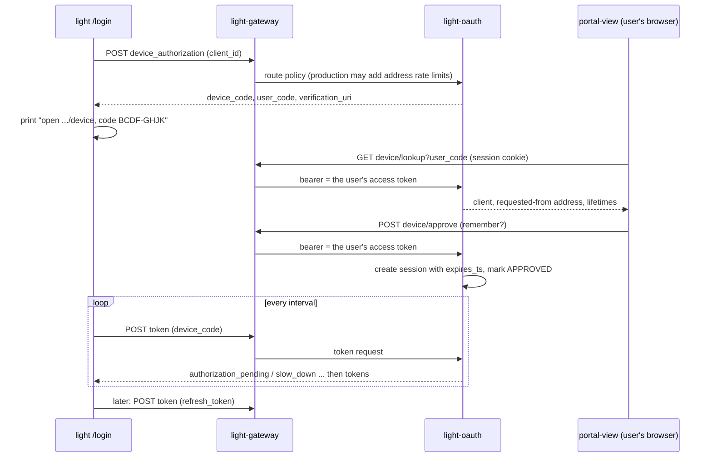

# CLI Device Authorization Grant

Status: implemented as of 2026-09-21 in `light-oauth`, the Light CLI, `portal-view`,
`portal-db`, and the local deployment repository. This design document is pending commit.
Revised the same day: the first design tied a login to the CLI's client certificate on a separate
mutual-TLS listener. That cannot work when `light-oauth` is reached only through `light-gateway`,
which ends TLS, so it was replaced by the standard grant described here.

## Problem

The Light CLI calls `light-gateway` with the signed-in user's access token. It does not present an
application secret or certificate: an open-source downloadable client cannot keep either one. The
user token lives about ten minutes. Portal's
browser login keeps it fresh with cookies and a refresh token, which a command-line program
cannot use, and the CLI may run on a VM with no browser. Pasting a token every ten minutes is not
workable.

## Decision

Use the **OAuth 2.0 Device Authorization Grant (RFC 8628)** in `light-oauth`, with a client that needs no secret,
on the one port `light-oauth` already serves, behind the Gateway. It is ordinary OAuth: nothing
in it depends on how the request reached `light-oauth`.

- `/login` in the CLI asks for a code and prints it. The user opens `portal-view`'s `/device`
  page on any device, signs in to Portal as usual (password, social, or Entra SSO with whatever
  MFA it enforces), checks what is being approved and approves it.
- The CLI receives an access token and a refresh token, and refreshes on use.
- A login lasts one day, or 90 days if the user ticks "remember me". **Both lengths are
  `light-oauth` server settings**; the server enforces them, and refreshing does not extend them.

## The standard parts

| Step | Endpoint | Standard |
| --- | --- | --- |
| Ask for a code | `POST /oauth2/{providerId}/device_authorization` (`client_id`, optional `scope`) | RFC 8628 §3.1 |
| Wait for approval | `POST /oauth2/{providerId}/token`, `grant_type=urn:ietf:params:oauth:grant-type:device_code` | RFC 8628 §3.4 |
| Keep the login alive | the same token endpoint, `grant_type=refresh_token`: the existing handler | RFC 6749 §6 |
| Sign out | `POST /oauth2/{providerId}/revoke` (`token`, `client_id`) | RFC 7009 |

Two endpoints exist only for the approval page, which is `portal-view`'s and not `light-oauth`'s,
and both take the signed-in user's access token as a bearer:

| Purpose | Endpoint |
| --- | --- |
| Show what a code is asking for | `GET /oauth2/{providerId}/device/lookup?user_code=` |
| Approve or deny | `POST /oauth2/{providerId}/device/approve` (`user_code`, `action=approve\|deny`, `remember`) |

**The client uses no secret.** A device client is an ordinary Portal client with `client_profile = cli`
and a `client_type` of `public` or `trusted` (`confidential` and `external` are refused), set on
Portal's client page (the profile dropdown has a `cli` entry). The Light CLI's own client, the one its
application token was issued from, is `trusted`: making it a device client only needs its profile set
to `cli`, and it keeps its secret and every grant that needs it. Without a secret, a device client may
use only the `device_code` and `refresh_token` grants; every other grant, and any request that
carries a secret, takes the ordinary path, which requires and checks one, so a wrong secret is refused
rather than ignored. Only users of the client's own host may inspect, approve, or deny a sign-in for it. When a client
is refused, the response is a plain `invalid_client`, and the log says whether it does not exist for
this provider or has the wrong type or profile.

## Codes

- The **device code** is 256 random bits, given only to the CLI and stored only as its SHA-256.
- The **user code** is eight letters from `BCDFGHJKLMNPQRSTVWXZ` (no vowels, so it cannot spell a
  word, and no look-alikes), shown as `XXXX-XXXX` and matched case-insensitively with the hyphen
  ignored: about 34 bits. It is single-use and lives 15 minutes by default.
- Polling faster than the interval gets `slow_down` and lengthens the interval by five seconds.
- A code is redeemed exactly once: the redeeming `UPDATE` matches only an `APPROVED` row, so of
  several racing polls one wins.

## Lifetime

`light-oauth`'s `values.yml` (`device_verification_uri` is required; the other keys are optional):

| Key | Default | Meaning |
| --- | --- | --- |
| `device_session_seconds` | 86400 | login length |
| `device_remember_seconds` | 7776000 | login length with "remember me" |
| `device_code_seconds` | 900 | how long an unapproved code lives |
| `device_interval_seconds` | 5 | minimum polling interval |
| `device_max_pending` | 10000 | cap on unapproved codes |
| `device_verification_uri` | required | the absolute URL of `portal-view`'s `/device` page |

A missing or bad value stops startup rather than returning an OAuth-server URL that does not host
the approval page. The session is created at approval with
`expires_ts = now + lifetime`; the refresh authority already refuses a refresh once `expires_ts`
has passed, so the login ends then with `invalid_grant` and the CLI tells the user to sign in
again. The access token stays at 600 seconds. Every role the user has goes into the tokens: there
is no per-role limit.

Note the existing gap this avoids: browser sessions have no server-side expiry (`expires_ts` is
never set by the authorization-code path).

## Security

The Gateway does the abuse control, which is the reason `light-oauth` sits behind it.

| Threat | Control |
| --- | --- |
| Guessing a user code | 34 bits, 15 minutes, single use; the lookup and decision calls need a signed-in user; production may add Gateway rate limits by address when exposure requires them |
| Stealing a device code | 256 bits, hashed at rest, single use, 15 minutes |
| A stolen refresh token | Rotation with a short duplicate-retry grace; **replaying an old token revokes the whole login** (`REFRESH_TOKEN_REPLAY`); the login ends on schedule; `light auth logout` revokes it; locking the user cuts it off at the next refresh; the access token lives 10 minutes. It is not sender-constrained: a stolen `~/.light/<env>/user-session.json` works until then, as with `gh` or `az`. DPoP (RFC 9449) is the proxy-friendly way to bind it if that is ever wanted |
| Approving as someone else, or on a stale token | The bearer is verified against the provider's keys, issuer and audience, must be a **user** token (an app token is refused), and the user's *current* authority is reloaded, so a locked user cannot approve |
| A token for one client used for another | The refresh handler checks client, provider and host on every refresh; revoke checks the client too |
| Table growth from an unauthenticated endpoint | `device_max_pending` and a purge of rows expired for a day (every 15 minutes); production may additionally enable Gateway rate limits |
| Remote phishing (RFC 8628 §5.4): an attacker starts a sign-in and talks a victim into approving it | The page shows the application, the requesting address and time, the scope and what "remember me" means; it warns; and Approve stays disabled until the person confirms they started this and the code matches. This is the residual risk of the standard flow, accepted: see the decision above. |

Where the request address comes from: `X-Forwarded-For`, first valid entry, as the rest of
`light-oauth` does. That is only trustworthy if the Gateway **overwrites** it and `light-oauth`
is not reachable except through the Gateway. The local base stack no longer publishes port 6881;
the optional workflow-broker development profile exposes it on loopback only. The address shown on
the approval page still depends on the Gateway replacing the forwarded header.

## What the Gateway must do

`light-oauth` needs nothing special. The `all-in-lt` resolved `handler.yml` already publishes the
five routes below. Other environments need the equivalent Gateway configuration:

1. **Routes** to `light-oauth`, under the prefix the Gateway already uses for it,
   `/oauth2/{hostId}/...` (the segment is passed through unchanged; `light-oauth` reads it as the
   provider id, as it does for `code`, `keys` and `token`). `token` already exists. Add
   `POST /oauth2/{hostId}/device_authorization` and `POST /oauth2/{hostId}/revoke` (from the CLI, no
   user token, like `token`), and `GET /oauth2/{hostId}/device/lookup` and
   `POST /oauth2/{hostId}/device/approve` (from `portal-view`, with the session turned into a
   bearer by the stateless handler and its CSRF check).
2. The CLI routes must **not** demand a user token or a CSRF cookie; the two approval routes must.
3. The Gateway must overwrite `X-Forwarded-For`. Address rate limits are a production deployment
   control to enable when the environment's exposure requires them; they are not configured locally.
4. `light-oauth` must not be published on the host in a real deployment.

The Gateway's `interactiveUserOnly` workflow-action policy is separate. It applies to `/mcp` and
allows an interactive caller that has a user token but no `x-scope-token`; it does not authenticate
or authorize these OAuth endpoints and must not be added to their route definitions.

## Decision: no enrolled-install gate, a warning instead

Without a gate, anyone who can reach the Gateway can request a code for the well-known public
client and try to phish a user with it (RFC 8628 §5.4; device-code phishing is widely abused).
An earlier version of this document proposed limiting `device_authorization` to CLIs holding a
certificate from `light-identity-issuer`. That was rejected on 2026-09-21: the Light CLI is open
source and downloadable anywhere, and the credential that enrols an install (the app token in the
download) is as public as the client. A certificate is only as strong as the way it was obtained,
so it would prove that *some* program enrolled, not that it is the real CLI. It is friction, not a
defence, and it costs a certificate authority, a bootstrap secret and Gateway trust configuration.

The control is therefore the approval page: it says plainly that the user should approve only if
they are connecting from the Light CLI right now, shows the requesting address and time, the
application, the scope and what "remember me" means, and keeps Approve disabled until the person
confirms. `device_max_pending` always bounds the endpoint; production can add Gateway rate limits. If a
real gate is ever wanted it needs an attestation that an open client cannot forge (for example a
platform-signed build), not a certificate.

## Data model

`portal-db` `patch_20260921_device_authorization.sql` (one patch, safe to apply again) creates one
table. It also upgrades a database that has the earlier, certificate-bound draft of this feature,
which is retired in place. `ddl.sql` includes the table for fresh installs.

`auth_device_authorization_t`: `device_code_sha256` (primary key), `user_code` (unique among
`PENDING`), `auth_host_id`, `provider_id`, `client_id` (foreign key to `auth_client_t`, cascade
policy `HARD_DELETE`), `requested_ip`, `scope`, `status` (`PENDING`, `APPROVED`, `DENIED`,
`REDEEMED`), `user_id`, `host_id`, `remember`, `session_id`, `created_at`, `expires_at`,
`approved_at`, `last_polled_at`, `poll_interval_seconds`.

At startup, `light-oauth` checks that both `auth_device_authorization_t` and
`auth_workflow_broker_t` exist. They support separate features. The workflow-broker table is needed
because the same issuer also implements workflow-bound OAuth grants for unattended workflow
continuation, and the normal authorization-code path queries it to determine whether a client is a
broker. The device grant does not use the workflow broker. Both migrations are Portal-owned, so the
issuer validates them and fails before becoming healthy rather than creating tables itself.

The retired draft had `auth_device_client_t` (registration is now the Portal client record),
`auth_device_session_t` (the install binding) and certificate columns on this table; the patch
removes them.

The device client is created and updated through Portal's client UI and event flow, then linked to
the provider. It is deliberately not inserted as bootstrap SQL. The `cli` profile option is part of
the Portal client form; there is no separate device-client registration table or seed.

## Light CLI

`/login`, `/whoami` and `/logout` inside the persistent `light` session, and refresh on use for every Gateway call. See
`light-fabric/docs/src/design/light-cli.md`. The CLI is configured with `cli.oauthUri` (the
Gateway, `https://localhost` locally), `cli.oauthProviderId` and `cli.oauthClientId`.

## portal-view

`/device` (redirects to `/app/device`, keeping the code) in `src/pages/oauth/DeviceApproval.tsx`.
It needs no configuration of its own. Which provider the request is for comes from the link the CLI
printed: `light-oauth` adds `?provider=` (the provider it served the request under) to
`verification_uri` and `verification_uri_complete`, so a CLI downloaded from another instance, which
names that instance's provider in its own settings, reaches the right one. The page accepts only a
plain identifier there, since it becomes a path segment of the API call. A page opened without the
link asks the person to open it. If nobody is signed in it offers to sign in and remembers the
request (code and provider) for 15 minutes, since sign-in returns to the dashboard.

## Alternatives considered

| Alternative | Why not |
| --- | --- |
| Paste a cookie or token | Ten minutes of life; unusable in a VM |
| A separate mutual-TLS listener tying a login to the install certificate (the first design) | The Gateway ends TLS, so `light-oauth` never sees the certificate. Making the Gateway forward a verified identity to a pinned listener is possible but breaks the platform's rule that forwarded certificate headers are never trusted, adds a second port, and buys only refresh-token binding, which rotation with replay detection already approximates |
| A password page on `light-oauth` | A second place to type a password, with no SSO or MFA, and a password oracle for anyone who can mint codes |
| Loopback redirect | Needs a browser on the CLI's machine |
| Sliding sessions | Deferred; a fixed end is simpler and was asked for |

## Implementation status

Built and tested (`portal-service/apps/light-oauth/src/device.rs`, its `tests.rs`; the CLI's
`auth.rs`, `oauth.rs`, `session.rs`; `portal-view`'s `DeviceApproval`):

- `cargo test -p light-oauth` passes 33 tests; 25 database-backed qualification tests remain
  ignored in the ordinary run. Database qualification uses `oauth_a1_qualification` with
  `-- --include-ignored --test-threads=1`.
- The security checks were mutation-tested: each of the public-client rules, the grant
  restriction, the secret rule, the host check, the expiry checks, the redeeming `UPDATE`'s
  guard, the pending cap, the purge age, the lifetime and remember-me settings, the token-use
  check, the bearer requirement on lookup, the recorded address and each route was broken in
  turn and a test failed. One overlap remains by design: `revoke` checks the token's client both
  in code and in its `UPDATE`.
- Holding a transaction connection while asking the pool for another can stall under load; redemption
  and approval were changed to avoid it and a test runs six sign-ins on a pool of three.

The local Gateway routes are configured. Address rate limits remain a production deployment
decision. Approval and denial both require an explicit action and a user from the client's host;
both outcomes are audited.
