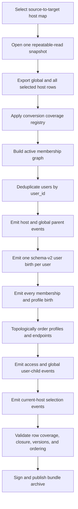
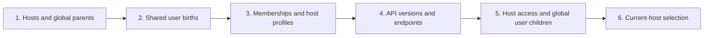

# Composable Multi-Host Snapshot Export And Bootstrap

## Status

Accepted design. Phases 0 through 4 are implemented in the working
repositories. The Phase 4 release cut-over requires signed v2 archives and
trusted public-key publication; final release qualification still requires a
production-schema two-host empty-database restore and a baseline-plus-delta
composition exercise.

This design extends
[Fast Snapshot-Derived Database Bootstrap](./database-recreation-event-bootstrap.md).
That design defines how one generated `events.json` is imported efficiently;
this design defines which user, membership, profile, and access events may be
generated when the source environment contains more than one host.

## Decision Summary

1. Treat `user_t` identity as environment-wide and emit at most one user birth
   event for each `user_id` in a complete environment bundle.
2. Treat employee/customer profile as authoritative per active membership. A
   host switch changes session selection only and never moves profile rows.
3. Treat `user_host_t.current` as session-selection state, not ownership or
   membership. `active = TRUE` determines whether a membership exists.
4. Generate a complete multi-host restore from one coordinated snapshot over
   an explicit set of hosts. Do not concatenate independently converted
   self-contained host exports.
5. Introduce explicit bundle modes: `environment`, `host-delta`, and
   `standalone-host`. Only the first two are composable under their declared
   dependency contracts.
6. Keep `UserCreatedEvent` and add schema v2 for shared identity only. Emit one
   `UserHostCreatedEvent` stream birth for every active membership, including
   the membership associated with any compatibility user birth.
7. Export host-scoped access rows only when their user is either provided by
   the same bundle or declared as a required identity dependency.
8. Fail export before publication when the selected rows are not
   referentially closed. Never publish an incomplete `UserCreatedEvent` or an
   access event whose user cannot exist at its import point.
9. Preserve current-host selection only after all included memberships exist.
   A `UserHostSwitchedEvent` follows the version-one
   `UserHostCreatedEvent` in the same `userId|hostId` stream.
10. Repair `switchUserHost` and `deleteUserHost` before coordinated export:
    switching must require active memberships and must not move profiles;
    deletion must clear `current` and deactivate all host access children.
11. Classify every exportable table in one conversion-coverage registry as
    standalone-event, folded-into-parent, or intentionally excluded. Any
    exported row with no declared conversion disposition blocks publication.
12. Keep existing single-host release behavior available during migration, but
    mark a self-contained `standalone-host` bundle as non-composable and
    normalize exactly one membership as current.

## Problem

The current snapshot exporter selects active users through active
`user_host_t` membership for one source host. It intentionally includes an
active membership even when `current = FALSE`. This is correct for a user who
belongs to several hosts and merely selects a different host for the current
session.

The current converter then folds `user_host_t`, `employee_t`, and `customer_t`
data into `UserCreatedEvent`. Those child tables do not produce standalone
events. Each conversion run also creates a new event UUID and starts aggregate
version allocation at one for every aggregate subject.

These rules make independently converted host snapshots non-composable. Given
one user who belongs to Host A and Host B:

- the Host A conversion emits `UserCreatedEvent(subject = userId, version = 1)`;
- the Host B conversion emits another
  `UserCreatedEvent(subject = userId, version = 1)`;
- the event IDs differ, so event-ID idempotency cannot identify them as the
  same event;
- canonical event storage rejects the duplicate `(aggregate_id,
  aggregate_version)` pair; and
- later host-scoped access events may fail or leave an incomplete membership
  projection, depending on transaction and DLQ boundaries.

Host switching exposes a second inconsistency. The current switch projection:

- changes every currently selected membership to `current = FALSE`;
- sets the selected membership to `current = TRUE`; and
- moves the user's `employee_t` or `customer_t` row to the selected host.

It does not deactivate the old membership or the old host's access grants. A
later Host A snapshot can therefore select the active user and Host A roles
while failing to find the employee/customer data required by the generated
`UserCreatedEvent`.

The switch SQL also lacks active-membership predicates. It can select an
inactive target membership, and its profile updates have no source-host
predicate: every employee/customer row for the user is moved. This both
destroys valid per-membership state and can collide with an existing target
profile primary key.

Deletion has the complementary defect. `UserHostDeletedEvent` currently
soft-deletes only `user_host_t`; it neither clears `current` nor deactivates the
host's user access children. The source projection can therefore retain an
inactive current membership and active grants that no longer have an active
membership parent.

The observed failure is not an isolated bad-row case. It is evidence that a
host-filtered projection snapshot does not yet define a closed, composable
user-identity boundary.

## Goals

- Recreate a selected multi-host environment without duplicate user births.
- Preserve every included active membership and its host-scoped access state.
- Support a user who switches the currently selected host without treating the
  old membership as deleted.
- Support an explicit leave or transfer workflow that deactivates old-host
  membership and access state.
- Make bundle dependencies and composition rules machine-verifiable.
- Reject malformed export candidates before they reach release storage or a
  destination event store.
- Preserve canonical aggregate-version and event-ID invariants.
- Give `portal-config-loc`, development, installation, backup, and tenant
  migration workflows one documented contract.
- Provide an incremental migration path from the existing
  `UserCreatedEvent` projection behavior.

## Non-Goals

- Reconstruct original business history from projection snapshots.
- Make two legacy self-contained host exports composable by ignoring duplicate
  event-store errors.
- Use `current = FALSE` as a synonym for inactive membership.
- Repair a published baseline by editing canonical event-store or DLQ payloads.
- Preserve access assignments for a host that is intentionally outside a
  standalone export when the required identity cannot be represented safely.
- Define cross-environment user-ID or email conflict resolution for tenant
  migration. That remains a separate mapping and approval concern.

## Terminology

| Term | Meaning |
| --- | --- |
| Environment-wide identity | One `user_t` row identified by `user_id`, shared by all memberships in one Portal environment. |
| Membership | One active or inactive `(host_id, user_id)` relationship in `user_host_t`. |
| Current host | The active membership selected for the user's current session. It is not an ownership marker. |
| Host profile | Host-scoped employee or customer identity data owned by one active membership. |
| Access child | A host-scoped role, group, attribute, position, permission, column-filter, or row-filter assignment that references a user. |
| Global user child | A user-owned row without `host_id`, such as `user_crypto_wallet_t`. |
| Soft-linked user child | A row carrying `user_id` without an enforced FK, such as `agent_memory_bank_t`; it still requires an explicit conversion dependency. |
| Included host set | The complete set of source hosts selected for one coordinated environment export. |
| Provided identity | A user birth emitted by the current bundle. |
| Required identity | A user that must already exist before a host-delta bundle is imported. |
| Referential closure | Every emitted child has its required parent in the bundle or in an explicit prerequisite manifest. |
| Authority host | The host stamped into the CloudEvent `host` extension for authorization and append routing when the aggregate itself is environment-wide. It is not aggregate ownership. |
| Conversion coverage registry | The authoritative disposition and dependency declaration for every exportable table. |

## Current Implementation Findings

### User identity and membership have different scopes

`user_t` is keyed by `user_id` and has no `host_id`. `user_host_t` is keyed by
`(host_id, user_id)`. The projection already allows a `UserCreatedEvent` to
find an existing shared user and ensure another host membership, but the event
stream remains one user aggregate keyed by `user_id`.

Consequently, projection-level upsert behavior cannot make two version-one
user birth events valid. Event append correctness is decided before or
independently of projection idempotency.

### Host-scoped user export includes non-current membership

The specialized `user_t` exporter selects an active user when an active
membership exists for the selected host. It does not require
`user_host_t.current = TRUE`. The specialized `user_host_t` exporter likewise
includes active current and non-current memberships.

This is the correct base rule for multi-host membership. Excluding every
non-current membership would silently remove valid users and access grants
from all hosts other than the currently selected one.

### Access children are selected independently

`role_user_t`, `group_user_t`, `attribute_user_t`, `user_position_t`,
`user_permission_t`, `user_col_filter_t`, and `user_row_filter_t` use generic
host-and-active selection rather than one authoritative membership closure.
The permission and filter rows also depend on `(host_id, endpoint_id)`, so they
must follow their API endpoint parents as well as user identity and membership.

This permits an access child to be exported even when its user birth is absent
or malformed. The database foreign key is a last line of defense, not an
export-selection policy.

FK discovery is insufficient on its own. `agent_memory_bank_t` carries
`user_id`, but its user FK was intentionally removed as part of operational
constraint decoupling. The conversion registry must retain this semantic
dependency even when database metadata cannot discover it.

### Membership and profile rows are folded into user birth

`user_host_t`, `employee_t`, and `customer_t` are conversion-skip tables.
Their selected values are merged into `UserCreatedEvent`. This makes a
single-host bootstrap convenient, but it prevents two host conversions from
being composed without repeating the shared user birth.

`user_crypto_wallet_t` exposes a separate coverage failure. It is exported for
users selected through host membership and is also listed as a conversion-skip
table, but it is not folded into `UserCreatedEvent` and no standalone event is
emitted. A successful conversion therefore loses wallet rows silently. The
coverage registry and row-accounting gate in this design make that state a
publication failure until a portable wallet event or explicit parent fold is
implemented.

### Membership projection implementation status

The Phase 2 `createUserHost` schema-v2 path honors the event payload's
`current` value and updates older active memberships monotonically. The legacy
schema-v1 path retains destination-derived current selection for compatibility.

The Phase 0.5 implementation establishes employee/customer profiles as
authoritative per active membership. `switchUserHost` validates an active
target, changes only membership current flags, and never moves profile rows.
`deleteUserHost` clears current state and deactivates host-local access rows
only when the membership delete advances its aggregate version. Controlled
repair events backfill already-drifted per-membership profiles at sequential
user aggregate versions.

### One-host remapping cannot represent an environment bundle

The current converter blindly replaces one `sourceHostId` string with one
`targetHostId` throughout row values and stamps that one target host into every
CloudEvent `host` extension. An N-host bundle requires typed N-way mapping and
per-event envelope-host derivation. Arbitrary string values must not be
rewritten merely because they equal a source host UUID.

The existing single-host snapshot method does use one repeatable-read
connection across all tables in that call. The new requirement is stronger:
all selected hosts must be read by one coordinated call and one repeatable-read
transaction, not by invoking the existing method independently for each host.

### Separate conversion runs allocate conflicting streams

Snapshot conversion allocates versions in an in-memory map scoped to one
conversion call. It generates a random event UUID for each output event. Two
independent snapshots containing the same user therefore produce distinct
events with the same `subject = userId` and `aggregateversion = 1`.

The converter also intentionally allocates versions greater than one when
several CreatedEvents share a subject. Validation must require that the first
event for each subject is version one and that the subject's versions are
contiguous; it must not require every CreatedEvent to have version one.

## Authority And State Rules

The design adopts the following authoritative meanings.

| State | Authority | Export rule |
| --- | --- | --- |
| Shared user identity | `user_t` | Emit once per complete environment bundle. |
| Host membership | `user_host_t.active` | Include when active and its host is selected. |
| Current selection | `user_host_t.current` | Restore after memberships; never use as the membership filter. |
| Employee/customer profile | `employee_t` / `customer_t` | One profile per applicable active membership; require complete identity fields and preserve its host. |
| Roles, groups, attributes, and positions | Their host-scoped active rows | Include only when the corresponding membership and user dependency are satisfied. |
| User permissions and filters | Their host-scoped active rows | Include only after user, membership, API version, and endpoint dependencies are satisfied. |
| Crypto wallets | `user_crypto_wallet_t` | Environment-wide user child; emit through an explicit portable event/fold contract exactly once per user. |
| Soft-linked user data | Explicit registry declaration | Do not rely on FK discovery; enforce the declared identity and host dependencies. |
| User leaves a host | Explicit membership deactivation event | Exclude inactive membership and its inactive access children. |
| User switches session host | Explicit switch event | Preserve memberships and per-membership profiles; change only current selection. |

Switching and leaving are different domain operations. If a product workflow
intends a full transfer, it must emit the events that deactivate old-host
membership and access. Snapshot export must not infer a leave from
`current = FALSE`.

A transfer uses this event sequence:

1. `UserHostCreatedEvent(newHost)` creates the new active membership/profile.
2. `UserHostSwitchedEvent(newHost)` selects it as current.
3. `UserHostDeletedEvent(oldHost)` clears and deactivates the old membership
   and its access children.

`UserHostDeletedEvent` remains the correct command. Its projection must be
extended rather than replaced with a database trigger, so replay reproduces
the same cascade.

## Bundle Modes

### Environment bundle

An `environment` bundle is the canonical artifact for rebuilding a new
environment containing one or more selected hosts.

The exporter receives the complete included host set and reads all relevant
tables in one repeatable-read transaction. It computes the union of users and
deduplicates global identities before conversion.

Properties:

- self-contained for the declared included host set;
- identity-closed: once a user is selected, every active membership and the
  current membership for that user is inside the set;
- exactly one user birth per included user;
- all active included memberships represented;
- all included access children referentially closed;
- safe for empty-database bootstrap;
- not assembled by concatenating host files.

An exact environment bundle may contain one host only when that host is also
identity-closed for its selected users. Otherwise the operator must include the
dependent hosts or choose the explicitly transformative `standalone-host`
mode. The release command has no exclude flag.

Lossy exclusion is available only through a separate operator-only
`extract-tenant` workflow. It requires an identified approver and records every
excluded identity and dependent-row count in its signed manifest. Separating
the command surface prevents a release pipeline from accidentally enabling a
lossy flag.

### Host-delta bundle

A `host-delta` bundle adds or updates one host in an environment whose shared
identity baseline already exists.

Properties:

- does not emit a second birth for a provided destination identity;
- emits host membership/profile and access events;
- declares required user identities and the baseline identity-set digest;
- is rejected before append if any required identity is absent or mismatched;
- is imported only after its required environment baseline.

A host delta is not a standalone installation artifact.

### Standalone-host bundle

A `standalone-host` bundle recreates one host without assuming a prior identity
baseline. It may synthesize user births for users selected into that host.

Properties:

- self-contained for its declared transformation policy;
- normalizes exactly one included active membership per user to
  `current = TRUE` when the source current host is outside the package;
- records `currentHostNormalized` and `normalizedCurrentHostId` in the
  manifest rather than depending on import order;
- must declare `composable: false`;
- must not later be concatenated with another standalone-host bundle;
- remains a transitional compatibility mode, not the target multi-host
  backup format.

## Recommended Environment Export Flow



The whole artifact is assembled before publication. Per-host intermediate
partitions may be used internally for memory or parallel query efficiency, but
the final identity allocation and event ordering operate over their union. All
database reads for the selected host set occur on the same repeatable-read
connection and transaction.

## Event Model

### Target contract

The clean target model separates four facts:

1. the shared user identity exists;
2. the user belongs to a host;
3. the user has a host-specific employee/customer profile when required; and
4. the user currently selected one of the active memberships.

The target event family should support:

| Event | Aggregate identity | Projection responsibility |
| --- | --- | --- |
| `UserCreatedEvent` schema v2 | `userId` | Insert shared `user_t` only; payload excludes `hostId`, `current`, `entityId`, `managerId`, and `referralId`. |
| `UserHostCreatedEvent` schema v2 | `userId|hostId` | Insert/reactivate `user_host_t` and carry the host-profile fields required for that membership. |
| Portable global user-child event/fold | Declared by conversion registry | Recreate wallets and any other environment-wide user children exactly once. |
| Host access CreatedEvents | Existing host-scoped compound IDs | Insert access rows after identity, membership, and endpoint dependencies. |
| `UserHostSwitchedEvent` | `userId|hostId` | Append after that membership's CreatedEvent and set current selection only. |
| `UserHostDeletedEvent` | `userId|hostId` | Clear current, deactivate membership, and deactivate every host access child in the projection transaction. |

`UserCreatedEvent` remains the user aggregate birth type. Schema v2 is selected
through the existing `(event type, eventschema)` policy registry and avoids a
new aggregate dispatch path. Its CloudEvent `host` extension is the bundle's
declared authority host for authorization and append routing; that extension
does not make the identity host-owned.

`UserHostCreatedEvent` schema v2 should contain enough profile data to
reconstruct its host relationship without another user birth:

```json
{
  "hostId": "host-id",
  "userId": "user-id",
  "current": false,
  "userType": "E",
  "entityId": "employee-id",
  "managerId": null,
  "aggregateVersion": 0,
  "newAggregateVersion": 1
}
```

For a customer membership, `entityId` and optional `referralId` carry the
customer profile. A function user has no employee/customer profile.

Employee/customer profile is per active membership. The schema already models
this with host-scoped profile keys and a composite profile-to-membership FK.
The schema-v2 projector creates or restores the profile for that exact
`(hostId, userId)` and never relocates another host's profile.

The projector must also stop deriving `current` from import order. Schema v2
must either honor the explicit payload value or insert memberships non-current
and rely on the final switch event. An already-active membership with an older
aggregate version must update monotonically; an equal/newer version remains an
idempotent no-op. The current `active = FALSE`-only conflict predicate is not
the schema-v2 contract.

### Compatibility contract

The first implementation may retain the existing `UserCreatedEvent` behavior:

- choose one included membership as the identity placement host;
- emit exactly one `UserCreatedEvent` for the user with complete profile data;
- emit a version-one `UserHostCreatedEvent` for every included membership,
  including the placement membership, so every `UserHost` stream has a birth;
- emit current-host selection last.

The placement choice is a conversion mechanism, not user ownership. Prefer the
included host containing the current employee/customer projection; otherwise
prefer the current active membership. Ambiguous or missing placement must fail
export rather than depend on map or query order.

During compatibility, `UserCreatedEvent` and the placement
`UserHostCreatedEvent` may both touch the same membership projection. The
membership projection must handle that exact replay case idempotently, while
the canonical `UserHost` event stream still begins with its CreatedEvent. Once
schema-v2 `UserCreatedEvent` is deployed, it stops creating membership/profile
rows and the compatibility placement requirement disappears.

### Envelope host and N-way remapping

Every bundle carries an explicit source-to-target host map. Conversion derives
the CloudEvent `host` extension per event:

- a host-owned aggregate uses that row's mapped target host;
- a `UserHost` or host-access event uses its membership's mapped target host;
- an environment-wide user identity or global user child uses the declared
  target authority host; and
- a genuinely global non-user aggregate uses its existing platform authority
  rule.

Remapping is schema-aware. It rewrites declared host fields and host components
of compound aggregate IDs through the N-way map; it does not perform blind
string replacement across arbitrary row values.

Snapshot bootstrap currently appends each generated event as a singleton
logical transaction, so the append validator's single-host/single-user rule is
satisfied per event. Any future multi-event logical transaction must partition
members by the same `(ce_host, ce_user)` pair rather than mixing host authority
inside one append transaction.

## Example: User Switched Between Two Hosts

Assume Steve has:

- an active non-current membership and roles in `dev.lightapi.net`;
- an active current membership and roles in `dev.networknt.com`; and
- an employee profile for each active membership after the projection repair.

### Complete two-host environment bundle

The coordinated bundle emits:

```text
HostCreatedEvent(dev.lightapi.net)
HostCreatedEvent(dev.networknt.com)
UserCreatedEvent schema v2(Steve)                            exactly once
UserHostCreatedEvent schema v2(Steve, dev.lightapi.net)      stream v1
UserHostCreatedEvent schema v2(Steve, dev.networknt.com)     stream v1
RoleUserCreatedEvent(Steve, dev.lightapi.net, ...)
RoleUserCreatedEvent(Steve, dev.networknt.com, ...)
UserHostSwitchedEvent(Steve, dev.networknt.com)              same stream v2
```

The exact host creation ordering depends on existing global/host bootstrap
contracts, but both host parents must exist before dependent membership rows.

### Primary-only environment bundle

After Phase 0.5, Steve still belongs to `dev.lightapi.net` because that
membership is active and has its own profile. A coordinated environment export
cannot claim to be complete for Steve while excluding his current
`dev.networknt.com` membership; it must include that host or fail closure.

An intentional isolated-host transformation uses `standalone-host` instead. It
includes Steve's shared birth, old-host membership/profile, and old-host access
children, then explicitly normalizes `dev.lightapi.net` as current and records
that transformation in the manifest. If Steve should not appear at all, the
source must contain an explicit old-host `UserHostDeletedEvent` cascade, or an
operator-approved `extract-tenant` workflow must omit Steve and every dependent
row together.

### Secondary host delta

If Steve already exists in the destination identity baseline, a
`dev.networknt.com` host delta emits the membership/profile and access events,
not another `UserCreatedEvent`. Its manifest requires Steve's `user_id` and the
expected identity digest.

## Bundle Manifest

Version-two output is a distinct bundle archive, not a bare event array. The
archive contains `bundle-manifest.json`, `events.json`, the applicable identity
sidecars, and a detached manifest signature. The importer accepts it only
through a manifest-aware `--bundle` path. The legacy bare-array path remains
available only for explicitly legacy standalone imports and cannot claim
composability.

This packaging makes the manifest enforceable: a legacy tool cannot be given a
v2 bundle archive and silently ignore its mode or dependencies. After the
Phase 4 cut-over, release/bootstrap commands reject bare arrays.

```json
{
  "formatVersion": 2,
  "bundleId": "uuid-v7",
  "mode": "environment",
  "composable": true,
  "primaryHostId": "host-a",
  "authorityHostId": "target-host-a",
  "hostMap": {
    "source-host-a": "target-host-a",
    "source-host-b": "target-host-b"
  },
  "sourceSnapshotTs": "2026-08-31T18:00:00Z",
  "providedIdentityCount": 120,
  "requiredIdentityCount": 0,
  "providedIdentityFile": "provided-identities.json",
  "providedIdentityDigest": "sha256:...",
  "requiredIdentityFile": null,
  "requiredIdentityFileSha256": null,
  "eventCount": 18000,
  "eventsSha256": "sha256:...",
  "contentMembers": [
    {
      "file": "events.json",
      "byteLength": 1234567,
      "sha256": "sha256:..."
    },
    {
      "file": "provided-identities.json",
      "byteLength": 4567,
      "sha256": "sha256:..."
    }
  ],
  "closurePolicy": "FAIL",
  "excludedIdentityCount": 0,
  "excludedAccessChildCount": 0,
  "currentHostNormalized": false,
  "normalizedCurrentHostId": null,
  "signature": {
    "algorithm": "Ed25519",
    "keyId": "portal-release-2026-01",
    "file": "bundle-manifest.sig"
  }
}
```

Identity inventories contain user IDs only, not emails or mutable profile
fields. The canonical digest preimage is a UTF-8 JSON array of lowercase
canonical UUID strings, deduplicated and lexicographically sorted, serialized
without insignificant whitespace, followed by one LF byte. SHA-256 is computed
over those exact bytes.

`provided-identities.json` carries the canonical provided-ID array. For
`host-delta`, `required-identities.json` carries the canonical required-ID
array. The manifest carries each applicable filename, SHA-256, and count, plus
the required baseline bundle/digest for a delta. The destination preflight
verifies IDs and compatible user type separately; a legitimate email change
does not alter the identity digest.

The detached signature covers canonical manifest bytes. The manifest's
`contentMembers` list in turn covers every content-member filename, byte
length, and SHA-256, including `events.json` and identity sidecars. It does not
list `bundle-manifest.sig`, because hashing a signature inside the bytes being
signed would be circular; the signature file is validated directly against
the canonical manifest and declared key. Release and tenant-extraction bundles
must be signed; local developer bundles may use an explicitly configured
unsigned development policy and cannot be promoted.

`sourceSnapshotTs` is captured after the coordinated repeatable-read
transaction begins and identifies that one database snapshot. All global and
N-host table reads use the same connection and transaction. It must never be
constructed from timestamps returned by several independent host exports.

The importer must reject:

- a host delta whose required baseline or identity digest does not match;
- a non-composable bundle requested as part of a composition;
- overlapping provided user identities across composed bundles;
- a composable archive with a missing/invalid manifest or signature;
- an event file whose checksum or count differs from the manifest; and
- a destination that is nonempty when an environment bootstrap requires an
  empty canonical store.

## Ordering And Import Phases

The generated event order must satisfy these phases:



Topological table sorting remains useful inside each phase, but database
foreign keys alone do not define all event-stream dependencies. The converter
must add explicit application dependencies for user birth, membership,
profile, access, and switch events.

Membership/profile ordering is itself topological. Within each host, an
employee manager profile precedes every report referencing that
`manager_id`, and a customer referral profile precedes every customer
referencing that `referral_id`. A cycle or missing parent fails conversion and
reports the involved host/profile keys; row order must never resolve it
implicitly.

`user_permission_t`, `user_col_filter_t`, and `user_row_filter_t` follow their
API endpoint event as well as the user membership. Global user children follow
the shared user birth. Explicit conversion-registry dependencies supplement
database FK metadata for soft-linked tables.

Every generated aggregate stream must remain monotonic. Across the final
assembled artifact:

- event IDs are unique;
- `(subject, aggregateversion)` is unique;
- the first emitted event for each subject is version one;
- versions for each subject are contiguous and ordered, including intentional
  version-two-or-later CreatedEvents that share a subject; and
- composition never renumbers events already published in another bundle.

## Conversion Coverage Registry

One registry is authoritative for export-to-event disposition. Each discovered
table declares:

```text
tableName
scopeResolver                 global, host, parent-derived, or operational
disposition                   STANDALONE_EVENT, FOLD_INTO_PARENT, or EXCLUDE
eventType / parentEventType   when applicable
identityDependencies          enforced and soft-linked
hostDependencies
orderingDependencies
rowAccountingRule
exclusionReason               required for EXCLUDE
```

`CONVERSION_SKIP_TABLES` must be generated from or validated against this
registry. A hand-maintained skip entry without a fold/exclusion declaration is
invalid.

For every exported non-excluded table, conversion reconciles row counts:

```text
exported rows = standalone-event consumed rows + parent-fold consumed rows
```

A one-to-many fold records the exact consumed child keys. Missing, duplicate,
or unconsumed rows fail publication. This gate detects the present
`user_crypto_wallet_t` loss and protects soft-linked tables such as
`agent_memory_bank_t`, regardless of FK metadata.

Operational/runtime rows remain excluded only through a named registry entry
with rationale and an owner. Adding a newly discovered table defaults to
publication failure until its disposition is reviewed.

Bundle mode also makes every selected-table query failure fatal. The current
best-effort behavior that logs one table's SQL exception and continues is not
allowed for a release, environment, host-delta, or extraction artifact because
it defeats row coverage before conversion begins.

## Referential Closure Algorithm

For an environment bundle:

1. Read active memberships for every included host.
2. Build `includedMemberships[(hostId, userId)]`.
3. Read active users for the distinct membership user IDs.
4. Resolve one required host profile for each applicable active membership and
   reject missing, duplicate, or ambiguous state.
5. Build `providedUsers[userId]` exactly once.
6. Apply the conversion coverage registry to every exported table and row.
7. Select host access children by joining to `includedMemberships`,
   `providedUsers`, and any endpoint parents.
8. Select global and soft-linked user children through explicit registry
   dependencies.
9. Validate that every selected child has its provided/required identity and
   all other declared parents.
10. Topologically order self-referencing profiles and cross-family children.
11. Allocate event streams and ordering over the complete union.

For a host delta, step 5 partitions user IDs into `providedUsers` and
`requiredUsers` according to the package contract. Steps 6 and 7 accept either
a provided user or a verified required user.

The exporter should specialize queries for all user-dependent tables rather
than relying on the generic `active` plus `host_id` filter.

## Validation Gates

Publication must fail unless all applicable gates pass.

### Structural gates

- Exactly one user birth exists for each provided `user_id`.
- No two output events share `(subject, aggregateversion)`.
- No two output events share an event ID.
- Every event has a derivable aggregate type and aggregate ID.
- The first emitted event for every subject is version one and all later
  versions for that subject are contiguous.
- Every exported non-excluded row is consumed exactly once by a standalone
  event or declared parent fold.
- Every conversion-skip table has an explicit folded or excluded registry
  disposition.
- Manifest event count and SHA-256 match the artifact.
- Manifest signature and every member checksum verify.

### User-closure gates

- Every active exported membership references a provided or required user.
- Every access child references an included membership and a provided or
  required user.
- Every permission/filter child also references an included endpoint parent.
- Every global or soft-linked user child references a provided or required
  user through the conversion registry.
- No access child is emitted for an excluded user.
- Every applicable active membership has exactly one employee/customer profile
  with a nonblank entity ID.
- Employee manager and customer referral graphs are acyclic and complete
  within each host.
- When schema-v1 compatibility is enabled, the selected birth placement has
  all legacy `UserCreatedEvent` fields required by its projector.
- A complete environment bundle preserves at most one current membership per
  user and reports users with none.
- A standalone bundle declares and produces exactly one normalized current
  membership per included user.

### Import qualification gates

- Import the environment bundle into an empty database.
- Wait for every relevant consumer cursor to converge.
- Require zero DLQ rows attributable to the bundle.
- Compare normalized source and destination projections for users,
  memberships, profiles, access children, global user children, and
  soft-linked declared children.
- For every current employee/customer membership, verify the effective JWT
  `uid` derivation resolves to the restored host-profile entity ID.
- Export the recreated environment again and compare normalized semantic
  inventories, ignoring generated event UUIDs and timestamps.
- Test one user active in two hosts, current in the secondary host, with roles
  in both.
- Test a complete transfer where old membership and roles are inactive.
- Test switch rejection for an inactive target membership and prove profile
  rows never move.
- Test `UserHostDeletedEvent` clearing `current` and deactivating every declared
  host access child.
- Test wallet row round-trip and failure on an intentionally unclassified
  conversion-skip table.
- Test manager/referral ordering, missing parents, and cycles.
- Test primary plus secondary composition and prove that the user birth appears
  once.
- Test rejection of two legacy standalone bundles containing the same user.

## API And CLI Direction

The snapshot exporter should accept an explicit bundle request rather than
only one source host:

```text
--bundle-mode environment
--host-map source-host-a=target-host-a
--host-map source-host-b=target-host-b
--primary-host-id target-host-a
--authority-host-id target-host-a
--bundle-output portal-events-v2.zip
```

Repeated `--host-map` values form one coordinated host set and define every
source-to-target mapping. A future API may accept the equivalent JSON request.
`--sourceHostId` and `--targetHostId` remain a one-pair compatibility alias
during migration. The release verb has an unconditional `FAIL` closure policy.

For host delta generation:

```text
--bundle-mode host-delta
--host-map source-host-b=target-host-b
--authority-host-id target-host-a
--requires-identity-manifest base-identities.json
--bundle-output host-b-v2.zip
```

Lossy extraction is a separate command and authorization boundary:

```text
extract-tenant \
  --host-map source-host-a=target-host-a \
  --approved-by operator-id \
  --bundle-output host-a-extraction-v2.zip
```

The release workflow must sign and publish the complete archive atomically.
The importer uses `--bundle portal-events-v2.zip`; it never discovers a
sidecar opportunistically beside a bare `events.json`.

## Migration Plan

### Phase 0: Stop malformed publication

- Add pre-publication checks for blank employee/customer entity IDs.
- Validate that every user-dependent child references an exported user.
- Detect duplicate user births and aggregate-version pairs when artifacts are
  assembled or appended.
- Introduce the conversion coverage registry and validate every
  `CONVERSION_SKIP_TABLES` entry against it.
- Reconcile every exported non-excluded row to one emitted event or declared
  parent fold; treat current wallet rows as a blocking uncovered family until
  their conversion contract is implemented.
- Add the switched-user regression fixture.
- Keep current production output unchanged when all checks pass.

Exit gate: the currently observed switched-user snapshot fails during export,
not later in the development DLQ, and no exported row can disappear silently
during conversion.

### Phase 0.5: Repair membership projections and existing drift

- Rewrite `switchUserHost` to deactivate only active current memberships,
  require the target membership to be active, and update only current flags.
- Remove all employee/customer host-move SQL from the switch projection.
- Enforce or validate at most one active current membership per user.
- Extend `deleteUserHost` to set `current = FALSE` and soft-deactivate active
  `role_user_t`, `group_user_t`, `attribute_user_t`, `user_position_t`,
  `user_permission_t`, `user_col_filter_t`, and `user_row_filter_t` rows for the
  same `(host_id, user_id)` in the projection transaction.
- Define transfer as create-new, switch-new, delete-old.
- Inventory active memberships missing their per-membership employee/customer
  profile. Generate controlled repair events at the next valid aggregate
  version; do not make an unrecorded direct-SQL correction the canonical fix.
- Dry-run profile ID, manager, referral, and target-primary-key conflicts.
  Quarantine ambiguous rows for operator resolution instead of inventing data.
- Replay the repaired event history into an empty projection and compare it to
  the repaired source state.

Exit gate: switch, delete, repair, and replay tests prove that active
memberships retain host-local profiles, inactive memberships are never
current, and no active access child survives membership deletion.

### Phase 1: Coordinated environment assembly

- Add an N-way host-map request and read all selected hosts through one
  repeatable-read connection and transaction.
- Replace blind string substitution with schema-aware host remapping and
  per-event CloudEvent authority-host derivation.
- Deduplicate `user_t` rows across the selected host union.
- Introduce the signed v2 bundle archive, manifest, and environment mode.
- Select all access, global-user, and soft-linked children through the complete
  conversion registry and dependency closure.
- Keep one compatibility `UserCreatedEvent` per user and emit a version-one
  `UserHostCreatedEvent` for every included membership, including placement.
- Topologically order manager/referral profiles and endpoint-dependent access
  rows; fail on cycles or missing parents.

Exit gate: a two-host empty-database restore produces one user birth and exact
normalized projections for both hosts, every `UserHost` stream has a
version-one birth, and all bundle row counts reconcile.

### Phase 2: Membership/profile event separation

- Register `UserCreatedEvent` schema v2 for shared `user_t` identity only; drop
  host, current, entity, manager, and referral fields from its payload.
- Add `UserHostCreatedEvent` schema v2 with per-membership profile data.
- Stop treating every selected `user_host_t` row as hidden data merged only
  into user birth.
- Emit all memberships independently after the one user birth.
- Rewrite `createUserHost` schema-v2 projection to honor explicit current state
  or deterministic final-switch semantics and to apply monotonic updates to
  active rows; do not call `determineCurrentFlag` for v2.
- Implement a portable wallet contract and any other uncovered registry
  families before removing their publication blockers.
- Update Java projection, replay, importer validation, policy registry, event
  schemas, and tests for the schema-versioned contracts.

Exit gate: adding a secondary host never emits another user birth for an
existing user, and schema-v2 replay reconstructs every membership/profile
without compatibility folding.

### Phase 3: Host delta composition

- Add canonical checksummed provided/required user-ID sidecars and digest
  verification.
- Add destination preflight for host-delta imports.
- Reject missing identity dependencies before canonical append.
- Sign manifests and verify every archive member before reading events.
- Add composition qualification covering several host import orders permitted
  by the manifest dependency graph.

Exit gate: a published environment baseline plus a compatible host delta
recreates the same normalized state as one coordinated environment bundle.

### Phase 4: Retire ambiguous standalone composition

- Mark legacy standalone exports as `composable: false`.
- Reject attempts to concatenate or compose them.
- Require the v2 archive/manifest import path for release and host-delta
  bundles; reject bare arrays on those paths after the published cut-over.
- Remove documentation and scripts that imply arbitrary host exports can be
  combined safely.
- Retain standalone mode only for an intentional isolated-host transformation
  with exactly one declared normalized current membership per user.

Exit gate: every supported restore path has an explicit bundle mode,
dependency contract, and conformance test.

## Operational Handling

For an explicitly invoked historical recovery tool outside the release and
bootstrap wrappers:

- treat one legacy `events.json` as one non-composable standalone target only;
- do not concatenate independently converted host snapshots;
- do not replay a malformed DLQ event unchanged;
- do not use host switching as a temporary way to make a release exportable;
  deploy the Phase 0.5 projection repair and repair source drift through
  replayable events before regenerating the canonical baseline;
- use a coordinated original-history export only when the complete selected
  history and its dependencies can be preserved and deduplicated by original
  event ID; and
- never use it for secondary-host restore into an existing environment. Use a
  signed `host-delta` archive whose baseline and identity dependencies pass
  destination preflight.

## Risks And Mitigations

| Risk | Mitigation |
| --- | --- |
| Current-host state is mistaken for membership ownership | Make `active` the membership rule and restore `current` in the last phase. |
| Switch or delete creates unexportable source state | Repair both projections in Phase 0.5 and qualify event-backed drift repair through replay. |
| A single-host export silently loses active cross-host access | Release always fails closure; lossy extraction is a separate approved command with signed counts. |
| Two bundles create the same user | One coordinated identity allocation; manifest-provided and required identity sets; importer preflight. |
| A required user ID resolves to an incompatible user | Digest stable user IDs only; validate user type separately and require operator resolution without treating email changes as identity changes. |
| A converted table is silently dropped | Require registry disposition and exact row accounting for every exported non-excluded table. |
| Random synthetic IDs prevent deduplication | Deduplicate before event generation and checksum the final assembled artifact. |
| Access events arrive before identity, membership, profile, or endpoint | Enforce explicit phases, registry dependencies, and topological ordering. |
| Legacy tools ignore the manifest | Package v2 as a distinct signed archive accepted only by the manifest-aware bundle path; hard-reject bare arrays after cut-over. |
| A partial batch leaves confusing DLQs | Validate the complete bundle before append and retain singleton logical transaction/DLQ isolation. |
| Multi-host export leaks tenant data | Require explicit host mappings, authorization for every source host, signed scope, and an auditable approver for extraction. |

## Settled Decisions

1. Employee/customer profile is per active membership. Switching current host
   never moves a profile row.
2. Shared identity continues to use `UserCreatedEvent`; schema v2 makes the
   payload host-independent and projects only `user_t`.
3. Host deltas use a separate checksummed required-user-ID sidecar referenced
   and signed through the bundle manifest. The digest contains sorted canonical
   UUIDs only.
4. Standalone export normalizes exactly one membership to current and records
   the transformation in the manifest.
5. Release closure always fails. Lossy exclusion exists only in a separate
   operator-approved `extract-tenant` workflow.
6. `UserHostDeletedEvent` is extended to clear current state and cascade soft
   deactivation through host access projections. Transfer is create-new,
   switch-new, then delete-old.

These decisions retain the immediate safety rule: one environment restore
cannot contain two user births for the same `user_id`, every active membership
has a version-one `UserHost` stream birth, and no child row may be published
without a satisfiable declared dependency and conversion disposition.
