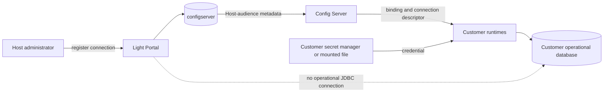
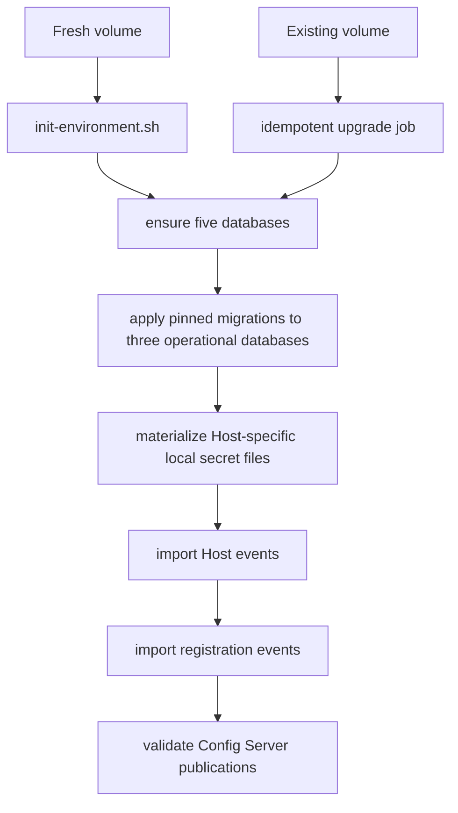

# Operational Storage Registration And Development PostgreSQL Topology

## Status

Accepted and implemented target architecture. Phases P0 through P7 are
complete, including runtime cutover and compatibility closure.

This document defines the operational-storage boundary for Light Portal and the
default PostgreSQL topology for:

- `portal-config-loc/all-in-lt`;
- `portal-config-dev`;
- `portal-config-bootstrap`; and
- `light-portal-install`.

The detailed delivery sequence is in
[Operational Storage Registration Implementation Plan](operational-storage-registration-plan.md).

## Decision Summary

The **Operational Storage** page is a registration page. It does not provision,
create, migrate, rotate, stop, or delete a customer's database.

An administrator opens the page from a selected Host and registers the database
that the Host's runtime services will use. Portal stores the binding in the
`configserver` control-plane database and publishes the connection contract
through Config Server. Customer runtimes such as Light Gateway, Light Workflow,
Light Deployer, Light Agent, and Light A2A load their Host-specific configuration
and connect directly to the registered database.



Database creation and schema migration belong to the customer's deployment
process. The four development/install repositories create their demo databases
locally because they own their PostgreSQL container, not because Portal is a
database provisioner.

## Portal And Customer Responsibilities

### Light Portal

Light Portal owns:

- the association between a selected Host and an operational database;
- non-secret connection metadata and the mounted credential-file contract;
- activation, update, publication, and unregistration of the binding;
- immutable Config Server audience projections; and
- audit history for registration changes.

Light Portal does not:

- connect to the operational database;
- test the supplied credential from the Portal process;
- create PostgreSQL servers, containers, databases, schemas, or roles;
- rotate a customer-owned database password;
- drop or decommission customer data; or
- run a continuously polling provisioning worker.

### Customer Or Deployment Owner

The customer or deployment owner:

- creates and operates the database;
- installs the versioned operational schemas and migrations;
- creates least-privilege runtime roles;
- manages network reachability, TLS, backup, restore, and retention;
- stores and rotates credentials; and
- mounts or otherwise resolves the credential for its runtime services.

For production, the operational database can be on a customer-managed
PostgreSQL server or managed database service inside the customer's organization.
Only the customer runtime network requires access to it. The cloud-hosted Portal
control plane does not require database network access.

## Registration Scope

The selected Host is the registration scope. The page must not ask the user to
enter a second Environment value that can contradict that Host.

For example, opening Operational Storage from `dev.networknt.com` registers the
store for `dev.networknt.com`; it cannot register storage for
`test.networknt.com`. To register the latter, the administrator opens the page
from that Host's row in Host Admin.

Runtime configuration still contains its instance `environment` or `envTag`
where required by the wider Config Server contract. That runtime lane is not a
second user-selected storage owner. The operational-store registration is keyed
by `hostId`, with at most one active registration per Host.

## Registration Contract

The registration form needs enough information to identify and connect to an
existing database without granting Portal database-administration authority:

| Field | Purpose |
| --- | --- |
| Engine | Initially `POSTGRESQL` |
| Server host | Customer-visible database DNS name or local Compose service name |
| Port | PostgreSQL port, normally `5432` |
| Database name | Exact database identity, for example `operations_networknt` |
| TLS mode | Required connection security policy |
| Credential source | Secret reference or mounted URL/credential file contract |
| Minimum schema generation | Runtime compatibility and readiness requirement |

Passwords and URLs containing passwords must not be written to Portal events,
ordinary Config Server properties, logs, browser history, or exports. Config
Server publishes the shared endpoint descriptor and credential-source contract.
Each runtime obtains its own service-specific least-privilege role and credential
from its deployment-owned secret mechanism; one Host-level username would
incorrectly collapse the Agent, Workflow, Gateway, A2A, Execution, and Deployer
roles.

Development profiles may materialize local secret files automatically. Each
runtime sees its Host-specific file at the stable path
`/run/secrets/operational-database-url`, while the file content selects the
correct database.

## Registration Lifecycle

Registration is synchronous control-plane work:

1. Host Admin opens Operational Storage for one Host.
2. The administrator enters the existing database connection contract.
3. `registerOperationalStoreBinding` validates syntax, Host ownership,
   uniqueness, and allowed credential-source fields.
4. Portal appends the registration event and updates the binding projection in
   one transaction.
5. Portal publishes the active Host-audience projection to Config Server.
6. Runtimes load the projection, resolve the credential locally, and perform
   database identity/schema checks during their own readiness sequence.

There is no `PENDING` provisioning job and no attempt counter. A registration
can be `REGISTERED`, `DEACTIVATED`, or `UNREGISTERED`. Optional runtime health or
last-validation evidence is observational and must not turn Portal into a
database provisioner.

Updating a registration creates a new aggregate version and publication digest.
Deactivation or unregistration revokes future publication but never deletes the
customer database. Historical provisioning events remain replayable during the
migration but cannot schedule infrastructure work.

## Config Server Runtime Binding

An illustrative non-secret projection is:

```yaml
operationalStore:
  contractVersion: 2
  bindingId: ${operationalStore.bindingId:}
  bindingDigest: ${operationalStore.bindingDigest:}
  scopeKind: HOST
  hostId: ${operationalStore.hostId:}
  engine: POSTGRESQL
  serverHost: ${operationalStore.serverHost:}
  port: ${operationalStore.port:5432}
  expectedDatabase: ${operationalStore.expectedDatabase:}
  tlsMode: ${operationalStore.tlsMode:REQUIRE}
  minimumSchemaGeneration: ${operationalStore.minimumSchemaGeneration:1}
  databaseUrlFile: ${operationalStore.databaseUrlFile:/run/secrets/operational-database-url}
  credentialGeneration: ${operationalStore.credentialGeneration:1}
```

The same semantic contract is compiled for the exact Host/service/instance
audience. A service receives only the schemas and privileges it owns. The
registered `credentialReference` is an absolute deployment-mounted path and is
published unchanged as `databaseUrlFile`, even when Config Server supplies all
non-secret fields.

## Development And Installer Topology

All four repositories use one PostgreSQL container with five databases:

```text
PostgreSQL server/container
|
+-- configserver               # Light Portal control plane
+-- knowledge                  # Light Knowledge
+-- operations                 # Host dev.lightapi.net
+-- operations_networknt       # Host dev.networknt.com
`-- operations_taiji           # Host dev.taiji.io
```

The three operational databases receive the same pinned operational migration
bundle but have separate database identities, canonical Host scope roots, and
runtime credentials. They do not require separate PostgreSQL containers.

The default registrations are:

| Host | Database | Compose server | Port |
| --- | --- | --- | --- |
| `dev.lightapi.net` | `operations` | `postgres` | `5432` |
| `dev.networknt.com` | `operations_networknt` | `postgres` | `5432` |
| `dev.taiji.io` | `operations_taiji` | `postgres` | `5432` |

The canonical Host UUID comes from the reviewed local Portal export; a
deployment must not derive or invent it from the database name. The shared P4
delta orders the three Org events, the three Host events, and then the three
registration events so the same identifiers are used across all four
repositories.

## Fresh And Existing Volumes

Fresh PostgreSQL entrypoint scripts run only once. The implementation therefore
needs both paths:



Database initialization and migration may use a PostgreSQL administrator because
they are deployment operations. Runtime services use least-privilege roles and
must not create databases or schemas during startup.

## Data Authority

### `configserver`

`configserver` contains Portal events, CQRS projections, Host records,
registration metadata, publication records, and Config Server snapshots. It
contains no operational runtime rows and no plaintext database password.

### `knowledge`

`knowledge` contains Light Knowledge documents, chunks, embeddings, indexing
jobs, and derived retrieval state. Its sharing and residency rules are separate
from ordinary Host operational storage.

### Host operational databases

Each Host operational database contains the service-owned schemas required by
the pinned bundle, including `operational_meta`, `agent_ops`, `a2a_ops`,
`workflow_ops`, `execution_ops`, `gateway_ops`, `audit_ops`, and `artifact_ops`.
Colocation in one database does not grant cross-schema write authority.

## Service Connection Matrix

| Service | Database access |
| --- | --- |
| Portal commands, queries, and Config Server | `configserver` only |
| Light Knowledge | `knowledge` |
| Light Gateway | Registered Host database; bounded Gateway/audit schemas only |
| Light Workflow | Registered Host database; Workflow/execution schemas only |
| Light Deployer | Registered Host database only when its runtime contract requires operational state |
| Light Agent and Light A2A | Registered Host database; owned schemas only |
| Browser Portal View | APIs only; never PostgreSQL |

## Failure Semantics

| Failure | Required behavior |
| --- | --- |
| Invalid registration syntax | Reject before appending an event |
| Duplicate active Host registration | Reject or require an explicit update command |
| Database unreachable | Customer runtime fails readiness; Portal remains available |
| Wrong database identity or schema generation | Runtime fails closed with a bounded diagnostic |
| Config Server unavailable | A running service follows its last-known-good snapshot policy |
| Portal unavailable | Existing runtime database connections continue |
| Registration deactivated | Config Server revokes the active publication; customer data is retained |
| Existing local volume lacks a new database | Idempotent deployment upgrade creates and migrates it |

## Verification Gates

### Control plane

- the registration command does not enqueue a provisioning job;
- registration publication is atomic with its control-plane projection;
- replay never performs database or container operations;
- Config Server contains no plaintext database password; and
- deactivate/unregister revokes publication without deleting data.

### Development topology

- each repository exposes exactly one PostgreSQL container by default;
- all five expected databases exist on fresh and existing volumes;
- each Host registration points to its exact database name;
- all three operational databases have the same migration checksum generation;
- no operational service schema exists in `configserver`; and
- Compose configuration and offline bundle checksum gates pass.

### Runtime

- each service loads the correct Host-audience binding from Config Server;
- `dev.networknt.com` cannot connect accidentally to `operations` or
  `operations_taiji`;
- database identity, binding digest, and schema generation are checked before
  readiness;
- runtime roles cannot create databases, roles, or schemas; and
- restarting Portal or Config Server does not interrupt established operational
  writes.

## Resolved Decisions

1. Operational Storage is registration, not provisioning.
2. The selected Host is the storage scope; there is no user-entered Environment
   field on the page.
3. Portal stores and publishes the binding but never connects to the operational
   database.
4. Customers own production database creation, migration, credentials, backup,
   and deletion.
5. Local/bootstrap/dev/install deployments create demo databases because the
   deployment owns their one PostgreSQL container.
6. The four repositories use the same five database names and the same three
   default Host-to-database mappings.
7. Config Server publishes Host-specific connection metadata; credentials remain
   deployment-owned secrets.
8. Deactivation or unregistration never drops a database.
9. Historical provisioning events remain replay-compatible during migration but
   cannot launch infrastructure work.
10. One versioned migration bundle and checksum authority is staged consistently
    across all four deployment repositories.
