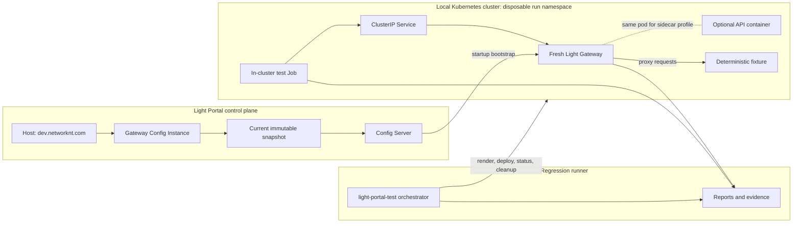
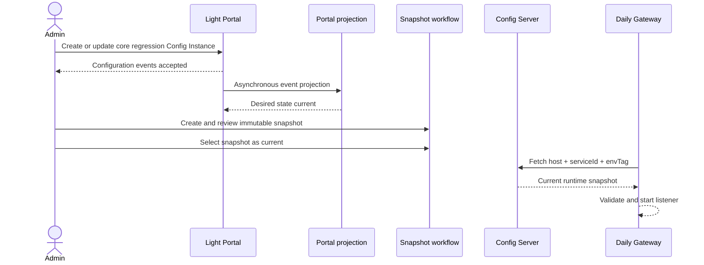
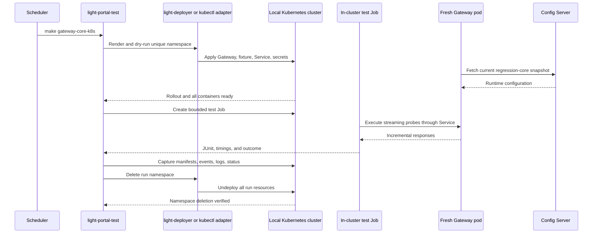

# Portal-Managed Light Gateway Regression

## Status

Proposed design. The generic SSE passthrough implementation and its repository-
local qualification gate are complete in `light-fabric`. The Portal-managed
daily regression harness described here is not yet implemented.

## Purpose

Light Gateway supports behavior that depends on both the released runtime and
configuration published by Light Portal. Repository-local unit and integration
tests can qualify the implementation, but they do not prove that a released
Gateway can:

- authenticate to Config Server;
- resolve the intended configuration identity;
- download and apply the current immutable snapshot;
- start from that configuration; and
- provide the expected behavior through its real network listener.

This design introduces a reusable regression harness in `light-portal-test`.
For each scheduled run, the harness starts deterministic test workloads and a
fresh Light Gateway runtime. The Gateway retrieves its configuration from a
Portal-managed Config Instance and the test client probes the resulting
black-box behavior. The same assertions can run against a standalone container,
a Docker Compose topology, or a disposable deployment in a local Kubernetes
cluster. Kubernetes is the authoritative target-platform lane.

The first runtime profile is `regression-core`. It uses multiple reserved path
prefixes so one Gateway instance and snapshot can exercise several compatible
features. Generic Server-Sent Events (SSE) passthrough is the first feature in
that profile. Once the harness is qualified, other Gateway features can reuse
the same runtime, lifecycle, and evidence model. Additional runtime profiles
are created only when two tests require incompatible handler chains, global
settings, startup outcomes, or dependencies.

## Decision Summary

1. Light Portal owns the mutable desired configuration, immutable snapshots,
   current-snapshot selection, and operator audit trail.
2. `light-fabric` retains exhaustive implementation qualification, including
   protocol matrices, concurrency, retry boundaries, soak, resource, and
   shutdown tests.
3. `light-portal-test` owns the scheduled black-box harness, deterministic
   upstream fixtures, runtime lifecycle, behavioral assertions, reports, and
   cleanup.
4. Each daily run starts a fresh released Light Gateway image. It does not
   reuse a long-running regression Gateway.
5. The Gateway loads configuration through the normal Config Server bootstrap
   tuple `(host, serviceId, envTag)`. Tests do not copy a complete runtime
   configuration into the test repository.
6. The shared development control plane uses the `dev.networknt.com` Host and
   a primary `regression-core` Env Tag. The Host is a configuration and
   ownership namespace; it does not require the temporary Gateway listener to
   be public.
7. The core profile selects feature-specific behavior with reserved request
   path prefixes. SSE is the first feature and uses a deterministic
   direct-proxy upstream. Router, rewrite, header, limit, and security tests
   should join the core profile when their effective configurations can safely
   coexist.
8. Timing-sensitive SSE assertions use a streaming client rather than treating
   an eventual HTTP 200 response as proof of incremental delivery.
9. The daily suite records enough runtime, image, snapshot, configuration, and
   request evidence to distinguish product regressions from configuration,
   credential, fixture, or infrastructure failures.
10. A separate regression profile and Config Instance are introduced only
    when the required configuration cannot safely coexist with the core
    profile or the test intentionally expects a different startup lifecycle.
11. Config Instances are created and updated through Portal commands or UI
    workflows. Regression setup must not seed Portal projection tables
    directly.
12. A standalone container remains a fast diagnostic option. Docker Compose is
    the fast multi-container integration lane, and a local Kubernetes cluster is
    the authoritative deployment and sidecar qualification lane.
13. Kubernetes runs use a unique namespace per run. The harness deploys, tests,
    captures evidence, deletes the namespace, and verifies its deletion before
    reporting success.
14. The local cluster is long-lived; application workloads are disposable. A
    complete cluster reset is reserved for tests that change cluster-scoped
    resources or leave the cluster unhealthy.

## Relationship To Existing Qualification

The SSE passthrough implementation already has a repeatable Phase 3 gate in
`light-fabric`:

```bash
./scripts/run-sse-passthrough-phase3-gates.sh
```

That gate is the authoritative implementation-level qualification for:

- downstream and upstream HTTP/1.1 and HTTP/2 combinations;
- direct proxy and service-router selection;
- timeout isolation;
- fail-closed response-handler conflicts;
- post-commit retry prevention;
- bounded file-descriptor and memory growth; and
- graceful and forced shutdown behavior.

The Portal-managed suite does not reproduce this full matrix every day. Its
purpose is to prove the released artifact and the real control-plane delivery
path together. A daily success therefore means more than a unit-test success,
but less than complete protocol requalification.

## Architecture



The Gateway does not require a public listener. Standalone runs bind to
loopback, Compose runs publish only the ports required by the test client, and
Kubernetes runs use a ClusterIP Service with an in-cluster test Job. The Portal
Host value is used for configuration lookup and ownership; it is not the
listener's DNS name.

## Component Responsibilities

| Component | Responsibility |
| --- | --- |
| Light Portal | Author Config Instance properties, preserve event history, create immutable snapshots, select the current snapshot, and provide operator visibility. |
| Config Server | Authenticate the Gateway and return only the current runtime configuration for its bootstrap identity. |
| Light Gateway image | Load the snapshot and provide the released proxy behavior under test. |
| Regression fixture | Emit deterministic responses for SSE and other compatible core features, including headers, events, delays, heartbeats, silence, and upstream failures. |
| `light-portal-test` | Select an execution topology, start or deploy dependencies, wait for readiness, execute probes, classify failures, publish reports, and clean up. |
| Docker Compose | Provide a fast, repeatable multi-container topology for local and pre-merge integration. |
| Local Kubernetes cluster | Qualify pod composition, Services, mounted configuration and secrets, probes, rollout, resource constraints, and namespace cleanup on the target platform. |
| `light-deployer` | Render, dry-run, apply, report status, and undeploy Kubernetes resources when the deployment-control path is in scope. |
| `light-fabric` gates | Qualify implementation details and the larger protocol/resource matrix before release. |

## Portal Configuration Model

### Config Instance identity

The first shared-development Config Instance is the core regression runtime:

| Field | Value |
| --- | --- |
| Host | `dev.networknt.com` |
| Product | Light Gateway (`gtw`) |
| Service ID | `com.networknt.light-gateway-1.0.0` |
| Environment | `dev` |
| Env Tag | `regression-core` |
| Suggested instance name | `Light Gateway Core Regression` |

The authoritative runtime lookup identity is:

```text
(dev.networknt.com, com.networknt.light-gateway-1.0.0, regression-core)
```

The internal `instanceId` remains useful for Portal relationships, snapshot
ownership, and audit. It is not added to the runtime lookup contract.

If `regression-core` is not already an allowed Env Tag, a Host-specific
`environment` reference-table value should be created for
`dev.networknt.com`.

### Instance strategy

Use one core Config Instance for all compatible Gateway feature tests. The
instance owns one current snapshot containing multiple path-scoped handler and
feature configurations. Adding a feature normally means adding another
reserved path prefix and test case, not another Portal instance.

The core path namespace is:

```text
/__regression/<feature>/<case>
```

Initial and candidate allocations are:

| Prefix | Intended behavior |
| --- | --- |
| `/__regression/sse/declared/` | Path-declared SSE classification and streaming. |
| `/__regression/sse/accept/` | Request `Accept` classification. |
| `/__regression/sse/promoted/` | Response `Content-Type` promotion. |
| `/__regression/sse/idle/` | Heartbeat and idle-timeout cases. |
| `/__regression/ordinary/` | Non-streaming timeout controls. |
| `/__regression/headers/` | Request and response header behavior. |
| `/__regression/rewrite/` | Path, method, and query rewrite behavior. |
| `/__regression/limits/` | Rate, concurrency, and bounded-size behavior. |
| `/__regression/security/` | Authentication and authorization behavior compatible with the core startup contract. |
| `/__regression/router/` | Service-router behavior once its fixture registration is part of the core lifecycle. |

The prefix is the stable test contract. Individual cases may be added below a
prefix without changing the instance identity. Paths must remain synthetic and
must not overlap real Portal, MCP, LLM, A2A, or application routes.

`handler.paths` uses trailing-wildcard templates such as
`/__regression/sse/declared/*` to select a chain for a feature family. The
Gateway resolves the first matching path entry, so specific templates must be
ordered before broader entries such as `/__regression/sse/*` or
`/__regression/*`. The SSE `streamPathPrefixes` property uses the corresponding
literal prefix without `*` because its matching contract is `startsWith`.

An additional regression runtime profile is justified only when the feature:

- requires a mutually exclusive default or complete handler chain;
- changes a global module setting in a way that invalidates another core case;
- intentionally exercises invalid configuration or startup rejection;
- requires a different listener or transport security posture; or
- needs an isolated external dependency whose lifecycle would make the core
  lane unreliable.

Because Config Server selects one current snapshot for a runtime bootstrap
tuple, an incompatible runtime profile normally receives another Env Tag and
Config Instance. It is still a profile-level separation, not a feature-level
instance policy. Candidate alternate identities should be named for the
incompatibility, such as `regression-invalid-config` or
`regression-strict-security`, rather than for every individual feature.

This document uses **runtime profile** for those test/runtime variants. Portal
**Config Profiles** are reusable product configuration-contract mappings; they
do not select among several current snapshots for one running instance and
must not be confused with regression runtime profiles.

### Snapshot lifecycle

Portal desired-state updates and runtime activation remain separate:



A daily test run is read-only with respect to Portal configuration. It must not
create a new snapshot, move the current pointer, or repair the instance. An
unexpected current snapshot is reported as configuration evidence instead of
being silently overwritten by the test.

For local authoring, changes are validated in `portal-config-loc/all-in-lt`.
Shared development receives the canonical events or supported promotion
artifact. Local and shared-development databases must not become independent
sources of truth for the same core regression profile.

## Gateway Bootstrap

The committed test asset is a minimal `startup.yml` template. It identifies the
runtime and Config Server, but it does not contain the complete Gateway
configuration:

```yaml
host: ${LIGHT_GATEWAY_STARTUP_HOST:dev.networknt.com}
serviceId: ${LIGHT_GATEWAY_SERVICE_ID:com.networknt.light-gateway-1.0.0}
envTag: ${LIGHT_GATEWAY_ENVIRONMENT:regression-core}
acceptHeader: application/yaml
timeout: ${LIGHT_GATEWAY_STARTUP_TIMEOUT:5000}
connectTimeout: ${LIGHT_GATEWAY_STARTUP_CONNECT_TIMEOUT:5000}
configServerUri: ${LIGHT_CONFIG_SERVER_URI}
authorization: ${LIGHT_PORTAL_AUTHORIZATION}
bootstrapCaCertPath: ${LIGHT_GATEWAY_BOOTSTRAP_CA_CERT_PATH:/config/ca.pem}
externalConfigDir: ${LIGHT_GATEWAY_EXTERNAL_CONFIG_DIR:/app/config-cache}
```

The harness supplies the Config Server URI, service authorization, and CA at
runtime. Tokens, private keys, and private CA material are never committed to
`light-portal-test` or stored in Portal as ordinary configuration properties.

The bootstrap contract is independent of the execution topology. Each topology
mounts the same minimal `startup.yml`, injects secrets through its native secret
mechanism, and gives the downloaded configuration a writable ephemeral cache.

## Execution Topologies

### Standalone container

The standalone mode starts one Gateway container and a fixture on the Linux
regression host. It is retained for fast diagnosis and initial harness
development. Host networking may provide stable loopback ports, but success in
this mode is not target-platform qualification.

### Docker Compose

Docker Compose is the default fast multi-container lane. A Compose project owns
the Gateway, fixture, optional API, test client, networks, volumes, and health
checks needed by one runtime profile. The project name includes the run ID so
resources from two runs cannot collide. The harness always executes `docker
compose down --volumes --remove-orphans` through its cleanup trap and verifies
that no project containers remain.

Ordinary Gateway-to-upstream profiles use a stable network alias such as
`regression-fixture`. The Kubernetes lane exposes the same logical name through
a Service when this allows both topologies to consume one Portal snapshot.

A sidecar profile has a stronger requirement: Light Gateway and the backend API
must share a network namespace when the configured upstream is
`127.0.0.1`. Compose may model that explicitly with a shared service network
namespace where the selected engine supports and qualifies it. A Compose setup
that merely connects two containers to the same bridge network is useful
integration coverage, but it is not evidence of Kubernetes sidecar semantics.

### Local Kubernetes cluster

The Kubernetes lane is the authoritative end-to-end lane because Kubernetes is
the target runtime. The cluster remains available across runs, while every test
deployment uses a unique namespace such as
`gateway-regression-<run-id>`. Namespaces and names must be DNS-safe and bounded
to Kubernetes length limits.

For a standalone Gateway profile, the namespace contains the Gateway, fixture,
ClusterIP Services, configuration, secrets, and an in-cluster test Job. For a
sidecar profile, the Gateway and API are containers in the same pod, the API
listens only on a pod-local port, and the Service selects only Gateway ingress
ports. The test Job calls the Service from inside the cluster; port forwarding
is optional diagnostic access and is not the authoritative probe path.

The Kubernetes lifecycle is:

1. preflight cluster connectivity, capacity, namespace uniqueness, image
   availability, required secrets, and Portal snapshot identity;
2. render manifests and perform client-side and server-side dry-run validation;
3. create the run namespace and apply resources, preferably through
   `light-deployer` when the deployment-control path is under test;
4. wait for Deployment rollout, every container's readiness, and fixture
   readiness within bounded deadlines;
5. run the in-cluster test Job and collect its JUnit and timing output;
6. capture manifests, image digests, pod descriptions, events, logs, restart
   counts, and termination states; and
7. delete the namespace in an unconditional cleanup path, wait for namespace
   termination, and verify that labeled run resources no longer exist.

A cleanup failure is classified as `CLEANUP`; the namespace is quarantined for
operator diagnosis and must not be reused by the next application. The harness
does not delete and recreate the entire cluster between ordinary application
runs. Cluster reset is justified only for cluster-scoped fixtures such as CRDs,
webhooks, or ClusterRoles, or when a health check proves that namespace cleanup
did not restore a usable baseline.

### Topology-specific configuration

Behavioral assertions should remain identical across topologies. Addresses and
deployment details should not leak into the feature contract. Prefer a stable
logical upstream name that can be implemented as a Compose network alias and a
Kubernetes Service. Profiles that require pod-local `127.0.0.1`, a different
listener, or another incompatible topology property receive a dedicated
runtime profile, Env Tag, and Config Instance under the existing incompatibility
rule. The harness must never rewrite a current Portal snapshot just to switch
execution topology.

## Core Profile Configuration Contract

The core snapshot defines the common server, handler, proxy, routing, and
observability baseline once. Feature-specific rules are scoped to the reserved
path prefixes wherever the Gateway configuration model supports path-level
selection. A new core feature must demonstrate that it does not alter the
expected behavior of existing prefixes before its properties are added to the
current snapshot.

### Initial SSE properties

The Portal snapshot should establish the following behavior without using
aggressive test timings:

| Property | Initial intent |
| --- | --- |
| `proxy.hosts` | Stable loopback address of the deterministic fixture. |
| `proxy.streamResponseContentTypes` | Include `text/event-stream`. |
| `proxy.streamRequestAcceptTypes` | Include `text/event-stream`. |
| `proxy.streamPathPrefixes` | Include `/__regression/sse/declared/`. |
| `proxy.streamMaxRequestTime` | Allow the bounded fixture stream to complete. |
| `proxy.streamIdleTimeout` | Approximately two seconds. |
| `proxy.streamResponseHeaderOverwrite` | Retain the documented standard streaming headers. |
| `proxy.maxRequestTime` | Nonzero and shorter than the streaming maximum so ordinary behavior can be distinguished. |

The effective handler configuration for the initial SSE prefixes ends in the
ordinary proxy handler and does not enable a complete-body response
transformation. A fail-closed filter case may join the core instance only when
its path-specific handler chain does not make the core snapshot invalid at
startup. Otherwise it belongs in an alternate runtime profile dedicated to
that incompatibility.

The exact port numbers and timeout values are implementation settings, but
they must be stable for a given published snapshot and documented in the
core profile's operational metadata. Daily timeout values should be measured in
seconds and have generous margins. Tight 75 or 100 millisecond deadlines
belong in deterministic repository-local gates, not on a potentially loaded
scheduled runner.

## Deterministic Fixture Contract

The fixture is a small test-owned server with no dependency on a third-party
API. It exposes bounded endpoints such as:

| Endpoint | Behavior |
| --- | --- |
| `/__regression/sse/declared/two-events` | Sends event 1 immediately, waits, sends event 2, and closes. |
| `/__regression/sse/accept/two-events` | Returns SSE for a request classified initially through `Accept`. |
| `/__regression/sse/promoted/two-events` | Returns SSE when neither request path nor `Accept` predicts a stream. |
| `/__regression/sse/idle/heartbeat` | Sends heartbeats more frequently than the idle deadline and then closes normally. |
| `/__regression/sse/idle/silence` | Sends one event and then remains silent beyond the idle deadline. |
| `/__regression/ordinary/slow` | Delays an ordinary response beyond `maxRequestTime`. |
| `/__regression/headers/stream` | Returns parameterized content type, cache policy, and deliberately interesting framing headers. |

Every endpoint has a fixed maximum lifetime. The fixture records request
counts and timestamps so tests can prove whether a post-commit request was
retried without retaining event payloads indefinitely.

## Initial Daily Test Cases

### Bootstrap and readiness

Before feature probes, the harness verifies:

- the Gateway process is running from the requested image digest;
- Config Server bootstrap succeeded for the expected identity;
- runtime configuration validation completed;
- the expected listener became ready within a bounded interval; and
- the fixture is independently healthy.

A startup failure is reported separately from an SSE behavior failure.

### Incremental passthrough

The client records the arrival time of each response chunk. It must receive
event 1 while the upstream request remains open and before the fixture emits
event 2. Receiving both events only after upstream completion fails the test,
even if the final status is HTTP 200 and the response body is otherwise
correct.

This assertion requires a streaming-capable client. Hurl may validate status,
headers, and complete bounded responses, but it must not be the only evidence
for incremental delivery. A small Node client using the streaming HTTP APIs is
the preferred first implementation.

### Request-path classification

The client calls `/__regression/sse/declared/two-events` without an SSE
`Accept` header. The configured path prefix must select the stream policy
before upstream headers arrive.

### Accept classification

The client exercises case-insensitive, parameterized, and comma-separated SSE
media types. The upstream then confirms `text/event-stream`. The daily lane may
rotate representative forms while the exhaustive normalization combinations
remain in `light-fabric` unit tests.

### Response-side promotion

The client calls a path outside `streamPathPrefixes` without an SSE `Accept`
header. When the upstream returns `Content-Type: text/event-stream`, the stream
must continue beyond the shorter ordinary request deadline and complete within
the stream deadline.

### Stream idle timeout

One endpoint sends heartbeats below the idle threshold and completes normally.
Another sends an initial event and then becomes silent. The latter must close
after the idle interval. Because response headers and data are already
committed, the test expects stream termination rather than a replacement 504
document.

### Ordinary timeout

A non-SSE upstream response that exceeds `maxRequestTime` must return HTTP 504
before response commitment. This guards against accidentally applying the
stream exemption to ordinary traffic.

### Header and framing behavior

The suite confirms that:

- the upstream parameterized `Content-Type` remains authoritative;
- configured upstream `Cache-Control` survives normal header mutation;
- an unknown-length stream does not expose a contradictory `Content-Length`;
  and
- downstream framing is valid for the tested protocol.

The complete HTTP/1.0, HTTP/1.1, and HTTP/2 framing matrix remains in the
`light-fabric` gate.

## `light-portal-test` Layout

The first implementation should use a core-profile entry point with
feature-specific suites:

```text
light-portal-test/
  config/gateway-core/
    startup.yml
  deploy/gateway-core/
    compose.yaml
    k8s/
  tests/gateway-core/
    fixture-server.mjs
    sse-passthrough.test.mjs
  scripts/
    run-gateway-managed.sh
    run-gateway-core.sh
    run-gateway-sse.sh
    runtime-container.sh
    runtime-compose.sh
    runtime-kubernetes.sh
```

The Makefile initially adds:

```text
make gateway-core
make gateway-sse
make gateway-core-compose
make gateway-core-k8s
```

`make gateway-core` starts the core runtime once and executes every core feature
suite. `make gateway-sse` uses the same core Config Instance but selects only
the SSE fixture cases for focused diagnosis. The normal daily batch invokes
the Kubernetes core target and places its artifacts under the existing
timestamped `reports/runs/<run-id>/` hierarchy. `gateway-core-compose` is the
fast multi-container target; `gateway-core-k8s` is the authoritative
target-platform target. The base targets may accept a `GATEWAY_RUNTIME` selector
as long as reports record the selected topology unambiguously.

`run-gateway-managed.sh` owns reusable mechanics:

- validating required tools and secret inputs;
- allocating the report directory;
- starting the fixture;
- starting the selected Gateway image;
- waiting for bounded readiness;
- invoking the selected feature test;
- capturing evidence; and
- terminating child processes, Compose projects, or Kubernetes namespaces
  through an exit trap.

The three `runtime-*.sh` adapters implement the topology-specific deploy,
readiness, endpoint discovery, evidence, and cleanup operations behind this
shared lifecycle. Feature suites must not embed `docker`, `docker compose`, or
`kubectl` commands.

`run-gateway-core.sh` supplies the core runtime profile, fixture command,
expected bootstrap identity, listener address, and ordered feature suite.
`run-gateway-sse.sh` is a narrow selector over that same core lifecycle; it
does not load a different Portal snapshot.

## Kubernetes Daily Execution Lifecycle



The harness must enforce one overall deadline plus bounded rollout, Job, and
cleanup deadlines. It must not leave a Gateway, API, fixture, test Job,
temporary config cache, Compose project, listener, or reusable Kubernetes
namespace behind after success, failure, or interruption.

## Inputs And Secrets

The scheduled environment supplies at least:

| Input | Purpose |
| --- | --- |
| `LIGHT_GATEWAY_IMAGE` | Exact release or daily image under test. |
| `LIGHT_CONFIG_SERVER_URI` | Config Server bootstrap endpoint. |
| `LIGHT_PORTAL_AUTHORIZATION` | Service credential used for authenticated bootstrap and any configured registration. |
| `LIGHT_GATEWAY_BOOTSTRAP_CA_CERT_PATH` | Trust root for Config Server. |
| `LIGHT_GATEWAY_STARTUP_HOST` | Defaults to `dev.networknt.com`. |
| `LIGHT_GATEWAY_SERVICE_ID` | Defaults to the Light Gateway service ID. |
| `LIGHT_GATEWAY_ENVIRONMENT` | Defaults to `regression-core`. |
| `GATEWAY_RUNTIME` | Selects `container`, `compose`, or `kubernetes`; scheduled target-platform runs use `kubernetes`. |
| `KUBECONFIG` and cluster context | Select the approved local regression cluster without granting broader cluster access than required. |
| `GATEWAY_RUN_NAMESPACE` | Optional generated namespace override; it must remain unique and carry the run ID. |

Credentials are supplied through the regression host's managed secret
facility. The harness must not print the authorization value, include it in a
command-line argument visible to other processes, persist it in reports, or
copy it into the downloaded-config evidence.

## Evidence And Reporting

Each run records:

- UTC run identifier and test revision;
- requested image reference and resolved image digest;
- bootstrap Host, Service ID, and Env Tag;
- current snapshot identifier or version when the runtime exposes it safely;
- SHA-256 hashes of relevant downloaded configuration files;
- Gateway startup and terminal logs with secrets redacted;
- fixture request counts and bounded timing records;
- per-test event-arrival timings and outcomes;
- selected execution topology and, for Compose, the rendered model and project
  resource inventory;
- for Kubernetes, the rendered and applied manifest hashes, namespace, node,
  pod and container image IDs, rollout state, restart counts, Events,
  descriptions, test Job result, and namespace-deletion result;
- JUnit output for scheduled-test integration; and
- cleanup outcome.

Downloaded configuration may contain sensitive values. The default evidence is
file name, size, and digest, not raw file content. A deliberately sanitized
allowlist may expose selected non-secret effective properties when it improves
diagnosis.

The report should classify the first failing boundary:

| Classification | Example |
| --- | --- |
| `HARNESS` | Container engine or required test tool unavailable. |
| `FIXTURE` | Fixture fails its independent health check. |
| `DEPLOYMENT_RENDER` | Compose or Kubernetes resources fail rendering, policy, or dry-run validation. |
| `DEPLOYMENT_APPLY` | Resources cannot be created or the rollout does not complete. |
| `BOOTSTRAP_AUTH` | Config Server rejects the service credential. |
| `CONFIG_LOOKUP` | No current snapshot exists for the bootstrap tuple. |
| `CONFIG_VALIDATION` | Downloaded Gateway configuration is invalid. |
| `GATEWAY_STARTUP` | Gateway exits or never opens its listener. |
| `FEATURE_ASSERTION` | Gateway starts but violates an SSE assertion. |
| `CLEANUP` | Runtime, Compose project, or Kubernetes namespace cannot be removed and verified cleanly. |

This prevents a missing snapshot from being reported as an SSE transport
regression.

## Security And Isolation

- Bind the fixture and Gateway listener to loopback unless a later test
  explicitly requires remote reachability. In Kubernetes, prefer ClusterIP
  Services and an in-cluster test Job over externally published ports.
- Give the runner namespace-scoped least-privilege RBAC. Cluster-scoped
  resources require a separately reviewed profile and cleanup policy.
- Generate a unique namespace and resource labels for every Kubernetes run;
  never deploy regression workloads into an application or control-plane
  namespace.
- Use a dedicated least-privilege Gateway service principal for regression.
- Permit that principal to retrieve only its intended configuration audience
  and perform only the controller operations required by the core or selected
  alternate profile.
- Do not place provider credentials, user tokens, or production endpoint
  secrets in the regression snapshot.
- Keep the fixture deterministic and synthetic. It must not proxy into a
  customer or production system.
- Preserve normal Gateway authentication and authorization on core or alternate
  paths that claim to test those handlers. Streaming classification must never
  be treated as an authorization bypass.
- Bound every fixture response, client request, readiness wait, and overall
  harness run.
- Redact authorization headers, cookies, token material, and raw downloaded
  secrets from reports.

## Configuration Change And Rollback

Snapshots are immutable. To change the core regression profile:

1. update desired configuration through Portal;
2. wait for the event projection to catch up;
3. create and review a new snapshot;
4. run the affected feature suites manually during a controlled candidate
   activation window, then restore the prior current pointer if validation
   fails;
5. select the verified snapshot as current; and
6. let the next fresh Gateway run consume it normally.

Rollback moves the current pointer to a previously verified immutable snapshot
and reruns the suite. The test harness never edits a snapshot in place.

## Extension To Other Gateway Features

After the SSE feature is stable, add compatible features to the core profile by
allocating new path prefixes and extending the shared fixture. Each addition
must define:

- its reserved path prefix and core handler-chain selection;
- required fixture behavior or external dependency;
- required handler chain and configuration ownership;
- startup and readiness contract;
- feature assertions;
- safe timeout and retry bounds;
- secrets and authorization scope;
- expected observability evidence; and
- cleanup behavior.

The addition must also prove that its configuration remains compatible with
all existing core paths. Only when that check fails for a legitimate product
reason should the feature propose an alternate runtime profile, Env Tag, and
Config Instance.

Good early core candidates include ordinary proxy deadlines, request and
response header rewrite, URL rewrite, rate limiting, access-control denial,
and controller-backed router selection. Specialized LLM, MCP, A2A, and
WebSocket protocol suites remain separate feature lanes, but they may use the
same core Gateway instance when their global runtime requirements remain
compatible.

API sidecar suites are topology-specific feature lanes. Their authoritative
Kubernetes manifest places Light Gateway and the API in one pod, exposes only
Gateway ingress through the Service, verifies the API is reachable over the
configured pod-local address, and proves that the backend is not independently
published. Compose may provide a fast equivalent only when its network
namespace behavior has been qualified for the selected container engine.

## Delivery Plan

### Phase 0: Core Portal profile

- Create the `regression-core` Config Instance under `dev.networknt.com`.
- Add the minimal proxy, server, and handler properties through supported
  Portal commands or UI.
- Reserve the `/__regression/` namespace and add the initial SSE and ordinary
  control path prefixes.
- Create, inspect, and activate an immutable snapshot.
- Verify a manually started Gateway downloads the intended snapshot.

Exit gate: a fresh Gateway starts using only the bootstrap file and runtime
secrets, and its effective configuration hashes match the reviewed snapshot.

### Phase 1: Shared assertions and Compose harness

- Add the deterministic fixture and streaming Node assertions to
  `light-portal-test`.
- Add bounded startup, readiness, evidence, and cleanup handling behind the
  shared runtime-adapter contract.
- Add the Compose topology and independent `make gateway-core-compose` and
  focused `make gateway-sse` targets.
- Qualify success and intentionally injected bootstrap, fixture, timeout, and
  cleanup failures.

Exit gate: repeated Compose runs distinguish incremental delivery, promotion,
idle termination, and ordinary timeout without leaked processes, containers,
volumes, networks, or ports.

### Phase 2: Local Kubernetes lifecycle

- Add the namespace-scoped Kubernetes manifests and `runtime-kubernetes.sh`
  adapter.
- Render and dry-run before applying through `light-deployer` when its
  deployment path is in scope.
- Run the assertions through an in-cluster Job and capture workload, rollout,
  image, Event, log, and Job evidence.
- Qualify success plus intentionally injected render, apply, rollout, Job, and
  namespace-cleanup failures.

Exit gate: repeated `make gateway-core-k8s` runs create unique namespaces,
prove the same core behavior, delete their namespaces, verify deletion, and
leave the long-lived local cluster ready for another application.

### Phase 3: Daily Kubernetes integration

- Invoke `make gateway-core-k8s` from the daily batch.
- Publish JUnit and diagnostic artifacts with the other timestamped reports.
- Pin or explicitly select the daily image policy and record its resolved
  digest.
- Add notification using the existing daily regression failure channel.

Exit gate: the scheduled job runs unattended, retains actionable evidence, and
does not mutate Portal configuration or retain a reusable application
namespace.

### Phase 4: Additional core features and sidecar profiles

- Add header, rewrite, limit, security, and router paths to the core profile
  when their configurations coexist safely.
- Reuse the core instance and lifecycle for every compatible feature.
- Create an alternate runtime profile only when a documented incompatibility
  prevents a feature from joining the core snapshot.
- Add an API sidecar profile whose Kubernetes Deployment places Light Gateway
  and the backend in one pod, routes to the backend over `127.0.0.1`, and
  exposes only Gateway ports through its Service.
- Add a Compose sidecar lane only if the chosen Docker or Podman Compose runtime
  provides qualified shared-network-namespace behavior.

Exit gate: at least one additional feature runs through a new core path without
copying instance, secret handling, readiness, evidence, or cleanup logic; any
alternate profile has a documented incompatibility; and the sidecar lane proves
pod-local routing and the absence of a directly published backend endpoint.

## Acceptance Criteria

The first Portal-managed SSE regression is complete when:

- a dedicated active Config Instance exists under `dev.networknt.com` with Env
  Tag `regression-core`;
- the intended immutable snapshot is current and retrievable only through the
  normal authenticated bootstrap path;
- a fresh released Gateway image starts from the minimal `startup.yml`;
- the deterministic fixture requires no external or billable provider;
- the client proves event 1 arrives before upstream completion;
- path, Accept, and response-content-type classification are exercised;
- heartbeat progress and idle silence produce different outcomes;
- ordinary requests remain subject to the ordinary timeout;
- selected upstream streaming headers and valid framing are observed;
- image, bootstrap, snapshot/configuration, request timing, logs, and JUnit
  evidence are retained without secrets;
- the Compose lane removes its processes, containers, volumes, networks,
  ports, and temporary caches;
- the Kubernetes lane uses a unique namespace, exercises the Gateway through
  an in-cluster Job and ClusterIP Service, and verifies namespace deletion;
- the focused SSE, Compose core, and Kubernetes core targets are independently
  runnable;
- `gateway-core-k8s` is included in the daily batch as the authoritative
  target-platform lane;
- a successful run leaves the long-lived local cluster ready to deploy another
  application; and
- the core path-prefix model is ready to accept additional compatible Gateway
  features without creating another Config Instance.

## Related Documentation

- [Control-Plane Policy Publication Through Config Server](control-plane-policy-config-server.md)
- [API Version Publication To Gateway](api-version-gateway-publication.md)
- [Create Instance](../../help/portal-view/forms/create-instance.md)
- [Instance Admin](../../help/portal-view/pages/instance-admin.md)
- [SSE Passthrough Parity](https://github.com/networknt/light-fabric/blob/master/docs/src/product/light-gateway/sse-passthrough-parity.md)
