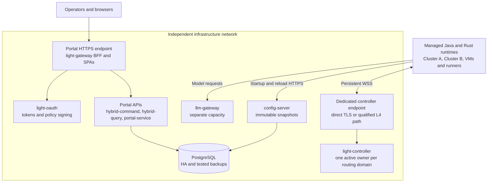
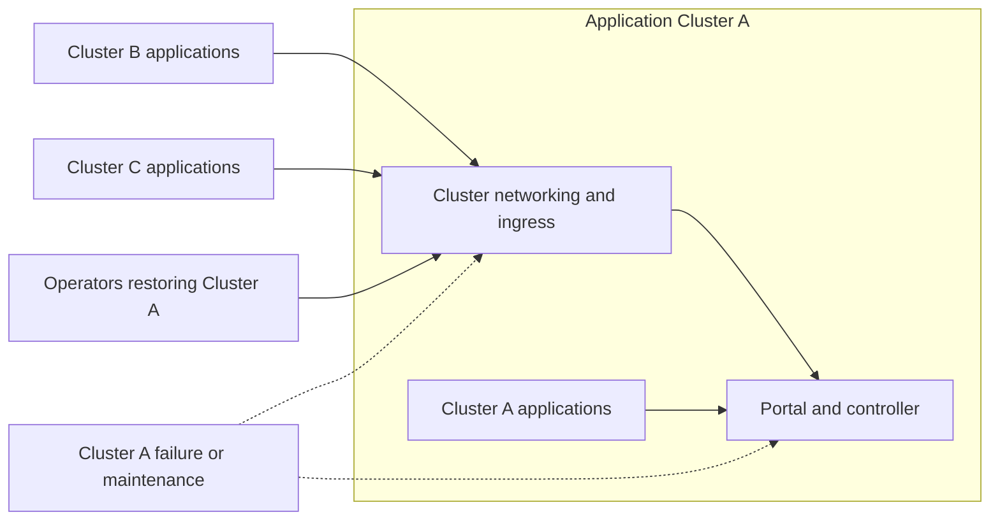
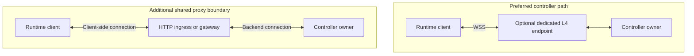
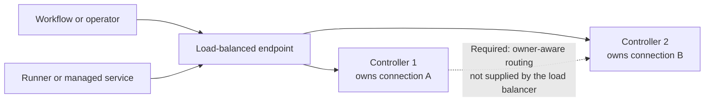

# Production Deployment: An Independent Light Portal Control Plane

## Decision and scope

**Deploy the enterprise Light Portal control plane on dedicated infrastructure VMs by default, outside the application Kubernetes clusters it manages.** Run its services as supervised containers or native processes, use stable private endpoints, and operate its database, signing keys, backups, and recovery procedures as infrastructure.

Light Portal is the control plane for the Rust light-fabric AI and API ecosystem and the Java light-4j API ecosystem. Its placement should follow the availability and recovery requirements of the entire managed estate, rather than the deployment convention of one application team.

The normal exception is an organization with one Kubernetes cluster, where every controller-connected application is in that cluster and the organization explicitly accepts their shared failure and maintenance boundary. This exception still requires the networking, controller ownership, recovery, and qualification controls below.

A dedicated management cluster can also satisfy an enterprise infrastructure boundary if it is independently operated and recoverable. That is an architecture exception requiring evidence, not a reason to place Portal in an arbitrary shared application cluster. Multiple clusters do not make Kubernetes technically incapable of hosting Portal.

**Status:** proposed production deployment standard, dated September 11, 2026. This document defines a target topology and acceptance criteria; it does not certify automatic controller failover or a production HA package as implemented.

## Why this is infrastructure

Portal does more than serve an administrative UI. Connected services use the controller channel for registration, discovery updates, remote administration, and permitted communication. Controller-mediated workflow-to-runner and agent execution therefore introduces a runtime dependency as well as an operational dependency.

| Service | Responsibility | Deployment consequence |
| --- | --- | --- |
| light-gateway, Portal BFF | Serve SPAs and route browser API requests to Portal services | Stable browser origin, correct host/path handling, and independent operator access |
| light-oauth | Issue tokens and sign policies | Protect signing keys; preserve issuance and trust distribution during maintenance |
| light-controller | Maintain persistent service channels, discovery, administrative commands, and authorized relay/execution interactions | Treat live connections and their owning process as state |
| config-server | Provide immutable configuration snapshots at startup and explicit reload | Stable bootstrap endpoint; preserve snapshot integrity and audience isolation |
| llm-gateway | Separate light-gateway instance routing LLM traffic | Separate capacity and resource limits from controller and Portal BFF |
| PostgreSQL | Hold control-plane data and Portal knowledge | Database HA, durable backup, restore, and workload isolation are required |
| hybrid-command | Validate commands and append user events | Preserve authorization, event durability, and command idempotency |
| hybrid-query | Process events into projections and answer queries | Coordinate projection ownership/checkpoints and expose projection lag |
| portal-service | Supply reference APIs, including UI dropdown data | Internal API availability and consistent reference data |

These are logical services, not a requirement to place nine containers on one machine. Stateless HTTP services may scale independently after their session and consistency requirements are checked. Projection processing cannot be duplicated blindly. Knowledge ingestion and LLM traffic must not exhaust the CPU, memory, I/O, or database connections needed for control operations.

### What a controller outage actually affects

An interruption prevents operations over the disconnected channel until recovery: live administration, new discovery updates, and controller-mediated requests. An in-flight operation may time out or have an unknown outcome; automatically retrying a side effect can duplicate it.

It does **not** follow that every business API immediately stops. Applications may continue with already loaded configuration, locally validated tokens, and cached discovery endpoints. Their behavior depends on cache expiry, token/JWKS availability, discovery mode, and whether the business path actually relays through the controller. New starts and explicit reloads separately depend on config-server availability.

Specify these failure modes per workload. “The control plane is down” and “all data-plane requests are down” are different incidents.

## Recommended topology: dedicated VMs

Place Portal in a private infrastructure network reachable from every approved cluster, VM environment, and runner network. Use enterprise DNS and explicit routing/firewall rules, not cluster-local service names as the enterprise contract.

The diagram shows principal dependencies, not every authorized request. Controller arrows are bidirectional after the runtime initiates the outbound connection; exposing arbitrary inbound admin ports on every workload is unnecessary.

Recommended placement:

- Place Portal HTTP services across separate failure domains as their availability target requires. Containers on VMs remain containerized deployments; Kubernetes is not a prerequisite for image immutability.
- Give the controller dedicated resources and a separately controlled maintenance schedule. Its endpoint must remain reachable when an application cluster is unavailable.
- Isolate PostgreSQL from disposable application hosts. Use a managed database or an operated HA database deployment, with explicit RPO/RTO and tested point-in-time recovery.
- Reserve capacity for reconnection and bootstrap peaks, not just steady-state traffic. Separate llm-gateway and heavy knowledge workloads when they contend with control-plane services.
- Retain out-of-band access, infrastructure configuration, signing-key recovery material, and database backups outside the managed clusters.

An F5 virtual server can be part of this topology, but “F5” alone does not specify the connection behavior. Review its TCP, TLS, HTTP, idle-timeout, health-check, and draining configuration. Some F5 configurations also maintain separate client-side and server-side connections. A VM plus an unqualified proxy is not automatically safer.

## Multi-cluster placement and recovery independence

Putting Portal in application Cluster A makes operators in Clusters B and C depend on A's network, capacity, storage, ingress, upgrades, and recovery procedures. A namespace separates access and policy; it does not remove these infrastructure dependencies.

The concern is correlated failure: the management system needed during a cluster incident shares that cluster's outage. A Kubernetes API outage does not necessarily stop existing Pods, but it can prevent the rescheduling and configuration changes needed to recover them. Independent placement reduces that dependency; it does not eliminate failures in shared WAN, DNS, identity, cloud accounts, or physical sites.

Equitable access comes from routable endpoints, trust, authorization, and network policy. It is not physically impossible to expose an in-cluster controller to other clusters. The VM recommendation instead avoids making one application cluster the enterprise management dependency.

Avoid bootstrap cycles. A replacement control-plane host must be recoverable using protected bootstrap configuration and credentials without requiring its own unavailable controller, config-server, or UI. Document the dependency order: infrastructure networking and database recovery; trust and signing services; configuration and controller services according to their actual startup dependencies; Portal APIs/BFF; then managed workload reconnection.

## Persistent WebSockets and the network boundary

### Separate browser ingress from controller transport

The preferred controller path has no shared application HTTP ingress. Use a dedicated service endpoint, either directly or through a qualified transport-level load-balancing path. Keep browser BFF traffic on its own HTTPS endpoint.

A proxy opening a backend connection does not inherently break WebSockets or discovery. NGINX supports WebSocket tunneling, and Traefik supports WS/WSS. The added component must preserve the negotiated protocol and carry the bidirectional stream for its lifetime. Its timeouts, resource limits, reloads, restarts, and TLS trust boundary become part of the controller service contract. [NGINX WebSocket documentation](https://nginx.org/en/docs/http/websocket.html), [Traefik WebSocket documentation](https://doc.traefik.io/traefik/v3.4/user-guides/websocket/).

The transport contract must cover:

- TLS termination location, certificate rotation, runtime authentication, and any required client certificate identity;
- upgrade headers and subprotocol negotiation, binary frames, message sizes, and backpressure;
- the shortest idle timeout across all intermediaries, with heartbeat timing and failure detection below that timeout;
- connection admission, queue bounds, file descriptors, and behavior under slow readers;
- controlled draining, forced disconnect deadlines, and client reconnect behavior.

TLS passthrough preserves end-to-end TLS termination at the controller; it does not remove all intermediate TCP state or timeouts. For AWS NLB, a TCP listener is the documented way to forward encrypted traffic without terminating TLS at the load balancer. A TLS listener has a different termination contract. [AWS NLB listeners](https://docs.aws.amazon.com/elasticloadbalancing/latest/network/load-balancer-listeners.html).

### Do not base the recommendation on universal disconnect claims

NGINX configuration reloads normally start new workers and gracefully retire old workers. A reload is not proof that every active WebSocket is severed. Shutdown limits, ingress-controller implementation, Pod termination, and load-balancer timeouts can still end a stream and must be tested. Traefik or Envoy also cannot preserve a connection after its owning process or node disappears. [NGINX process control](https://nginx.org/en/docs/control.html).

Similarly, kube-proxy need not be a userspace proxy hop for each packet. Kubernetes routing can use kernel forwarding or other dataplanes, and some load balancers target Pods directly. Measure the deployed path; do not assume one fixed chain of proxy allocations.

There is no justified universal “10,000 connections is safe” cutoff or fixed 15–100 KB overhead per proxied connection. Connection memory, TLS state, buffers, message rate, queue growth, and reconnect authentication determine capacity.

## Controller replicas and high availability

### Current implementation evidence

In the inspected Rust controller revision, general runtime instances, service membership, discovery subscribers, and pending administrative commands are stored in process-local maps and channels. Command dispatch looks up the local runtime sender; discovery snapshots are built from that process's registered instances. These paths do not become cluster-wide simply because replicas share PostgreSQL.

Source anchors: [AppState and discovery snapshots](https://github.com/lightapi/controller-rs/blob/3ef48edee3edf47ea7ee42662f141c6d3fa3c542/src/state.rs), [CommandRouter](https://github.com/lightapi/controller-rs/blob/3ef48edee3edf47ea7ee42662f141c6d3fa3c542/src/command_router.rs). This finding concerns the general registry/administrative transport; database-backed execution state is a separate mechanism and does not prove transparent failover for every channel.

Two arbitrary active replicas can yield incomplete discovery or “not connected” command responses. Sticky sessions do not ensure that two different clients, or an operator and its target, reach the same owner. This is fragmented connection ownership; reserve “split brain” for cases involving conflicting authorities or unfenced writers.

The issue is the same on two VMs behind F5. Replicas, a shared database, and a StatefulSet do not constitute controller HA by themselves.

### Production HA choices

Until a release has demonstrated cross-replica routing, use one active controller owner per defined routing domain. A standby may reduce recovery time, but promotion must fence the previous owner and reconnect/re-register clients. Do not advertise seamless failover: live sockets and in-memory pending responses do not migrate.

An active/standby design needs an independently reliable lease or fencing mechanism, health-aware endpoint switching, prevention of two active owners during a partition, and a tested promotion runbook. This document recommends those requirements; it does not assert they already exist. Without them, describe the deployment honestly as a single active service with supervised restart and a measured recovery interval.

An active/active design must demonstrate ownership lookup, cross-owner command forwarding, complete and authorized discovery, subscription propagation, partition handling, and response correlation. A Redis/NATS backplane is one possible building block, not a complete solution. Deterministic partitioning is another option only when the routing domains and cross-domain behavior are explicit.

For workflow execution, preserve durable operation identity, deadlines, leases/fencing where applicable, and outcome reconciliation. A lost response is not evidence that the action did not occur.

## SPA serving and ingress complexity

The simplest browser contract is a dedicated hostname, for example `https://portal.example.com`, forwarded to the BFF with the host and path preserved. The gateway owns SPA assets, deep-link fallback, and API routing.

Kubernetes can use host-based ingress for this same contract; a static path prefix is not mandatory. Complexity grows when a shared ingress imposes an external prefix, rewrites it, and leaves the SPA, API callbacks, cookies, and gateway interpreting different paths. Kubernetes Ingress supports host/path routing, while implementation-specific rewrites require controller-specific configuration. [Kubernetes Ingress](https://kubernetes.io/docs/concepts/services-networking/ingress/).

| Contract | Dedicated hostname, unchanged path | Shared prefix with rewriting |
| --- | --- | --- |
| Browser assets and deep links | One application base | Browser base and gateway-received path may differ |
| BFF API routing | Stable API namespace | Must preserve namespace and prevent SPA fallback for API errors |
| OAuth redirects | One registered external origin/path | Redirect URI must match browser-visible prefix exactly |
| Cookies | Explicit domain/path for the dedicated origin | Scope to the correct external API path; avoid sibling application leakage |
| Release portability | Fewer environment-dependent paths | Requires a qualified build/runtime configuration contract |
| Troubleshooting | Gateway sees the user's path | Operator must reconstruct every rewrite boundary |

The Rust gateway already has virtual-host static serving and SPA fallback in [resource.rs](https://github.com/networknt/light-fabric/blob/17359e1c73273d65e9a27d6dc82f01583f29f3d6/frameworks/light-pingora/src/resource.rs). The [portable signed Portal View design](../portal-view/portable-signed-runtime-configuration.md) distinguishes `publicBasePath`, `apiBasePath`, and `gatewayBasePath`; it is a proposed contract, not blanket evidence that every release supports arbitrary ingress prefixes.

For either platform, qualify direct navigation to a deep link, asset fetches, login/logout callbacks, token exchange, cookie scope, and an API 404 that must remain JSON rather than becoming `index.html`.

## Detailed comparison

| Concern | Dedicated infrastructure VMs | Shared application Kubernetes cluster | Dedicated management Kubernetes cluster |
| --- | --- | --- | --- |
| Failure boundary | Independent of application cluster failures when networking/storage are also independent | Portal shares cluster infrastructure and recovery constraints | Can be independent of application clusters |
| Persistent channels | Operator controls process and host maintenance | Adds Pod, node, ingress and operator reconciliation lifecycles | Similar mechanisms, with dedicated ownership and capacity |
| Controller HA | Requires connection ownership and fenced failover | Same application requirements; replica count does not solve them | Same application requirements |
| Multi-cluster access | Stable enterprise endpoint and routing | Requires external reachability into the hosting cluster | Stable enterprise endpoint remains necessary |
| Bootstrap recovery | Can recover without an application Kubernetes API | Risk of circular dependency on the cluster being repaired | Needs its own independent bootstrap and recovery plan |
| SPA routing | Dedicated origin is straightforward | Straightforward with dedicated host; shared rewrites add work | Infrastructure team can reserve a dedicated host |
| PostgreSQL | Managed service or dedicated database VMs | Stateful storage/operator and cluster failure coupling if colocated | Managed database or separately qualified operator deployment |
| Signing material | Dedicated secret distribution/HSM integration | Secret access shares cluster administration boundary | Can have separate administrators and secret policies |
| Scheduling and replacement | Supervisor and VM automation must be operated | Strong built-in reconciliation and scheduling | Same Kubernetes benefits with a larger platform footprint |
| CI/CD and observability | Must integrate VM deployment and telemetry | Reuses established pipelines and collectors | Reuses tooling, but runs a separate platform |
| Resource efficiency | Reserved capacity may cost more at low utilization | Pooling can be efficient; contention needs control | Reserved infrastructure node capacity reduces pooling advantage |
| Maintenance ownership | Clear infrastructure change window | Coordination across application and platform teams | Clear infrastructure ownership if organizationally enforced |
| Portability | OCI images plus OS/network automation | Manifests still vary for EKS/OpenShift networking, storage and security | Similar platform-specific qualification |
| Operational cost | VM lifecycle, patching, backup and failover automation | Less separate tooling, more connection/cluster qualification | Often highest fixed complexity unless already operated |

VMs do not require a monitoring silo: use the same metrics, logs, tracing, alerting, image registry, and release pipeline. Conversely, an organization with a mature Kubernetes platform and little VM operating capability has a real reason to prefer Kubernetes. Compare total ownership cost and recovery competence, not just manifest count.

## Kubernetes exception requirements

The single-cluster exception is reasonable only if all managed applications share that cluster, independent management during its total outage is not required, and the customer accepts the combined outage boundary. If additional clusters or external runners are planned, revisit the decision before onboarding them.

A separately operated management cluster may qualify for a multi-cluster estate, but it must meet the same independence objectives as dedicated VMs. A dedicated namespace in an application cluster does not qualify.

For either Kubernetes exception:

1. Reserve infrastructure capacity with suitable node placement, resource requests/limits, topology separation, and a deliberate maintenance policy. Do not let automatic scaling reduce controller capacity without a connection-drain plan.
2. Provide a dedicated controller endpoint. Prefer the qualified direct/L4 transport path; a shared HTTP ingress is outside the default profile.
3. Choose Deployment versus StatefulSet from actual identity/storage requirements. StatefulSet provides stable identities and ordered lifecycle behavior, not socket persistence or immunity to replacement. [Kubernetes StatefulSets](https://kubernetes.io/docs/concepts/workloads/controllers/statefulset/).
4. Configure rollout limits, startup/readiness probes, termination grace periods, and application-level draining. A PodDisruptionBudget constrains covered voluntary evictions; it does not prevent involuntary failures or govern Deployment/StatefulSet rolling updates. Infinite-lived connections require a bounded disconnect/reconnect plan. [Kubernetes disruptions](https://kubernetes.io/docs/concepts/workloads/pods/disruptions/).
5. Use an approved application PriorityClass if needed. Do not assign `system-cluster-critical` to Portal as a purported zero-eviction switch; Kubernetes reserves system priority classes for critical system components, and priority is not an availability guarantee. [Pod priority and preemption](https://kubernetes.io/docs/concepts/scheduling-eviction/pod-priority-preemption/).
6. Keep database recovery, signing-key recovery, administrative access, and bootstrap artifacts available outside the cluster being recovered.
7. Prove the controller ownership model before enabling multiple active replicas. Affinity and readiness do not replace it.
8. Publish runbooks for node drain, ingress maintenance, certificate rotation, controller failure, storage failure, and cluster restoration.

For **EKS**, evaluate an NLB TCP listener and the selected target mode for the controller separately from the BFF HTTP ingress. Verify the actual TLS and draining behavior rather than assuming ALB, NLB, and ingress are interchangeable.

For **OpenShift**, qualify the router and Route termination mode, tunnel timeout, security constraints, and storage integration. Passthrough Routes preserve encrypted traffic to the backend but still introduce a router lifecycle and tunnel limits. They are a possible qualified alternative, not the same as removing ingress. [OpenShift 4.20 ingress and load balancing](https://docs.redhat.com/en/documentation/openshift_container_platform/4.20/html-single/ingress_and_load_balancing/index).

## Availability and capacity qualification

Define the targets before deciding the host count or declaring either topology production ready. Required inputs are peak connected runtimes, message rates and sizes, in-flight operations, maximum acceptable discovery staleness, reconnect recovery time, outage budget, database RPO/RTO, and deployment/maintenance frequency.

A useful estimate is `disconnected clients / reconnect spreading window`. For example, reconnecting 20,000 clients over 120 seconds averages about 167 attempts/second before retries. This is illustrative, not a capacity claim; synchronized retries, TLS handshakes, token verification, configuration reads, and registration processing can produce much larger peaks.

| Qualification exercise | Required evidence |
| --- | --- |
| Kill the active controller process | Bounded detection, jittered reconnect, re-registration, restored subscriptions, measured time to a usable channel |
| Upgrade the controller or drain its node/VM | No new admissions to the draining owner; bounded termination; reconciled in-flight outcomes |
| Put caller and target on different replicas | Correct discovery and command routing, or enforced single-owner placement |
| Partition active and standby | Fencing prevents conflicting active ownership; promotion follows the defined authority |
| Restart or reconfigure the actual load balancer/ingress | Observed connection loss and recovery within budget; no assumption of zero disconnects |
| Rotate certificates and signing keys | Existing/new session behavior and trust overlap work as designed |
| Saturate LLM/knowledge traffic | Control commands, discovery and snapshot reads retain their latency/resource budgets |
| Lose an application cluster | External Portal remains operable; unaffected clusters continue to use it |
| Lose PostgreSQL or OAuth | Documented degradation, recovery, token/cache behavior, and no unsafe side-effect replay |
| Restore from backup without Portal UI | Database, keys, snapshots and configuration restored to agreed RPO/RTO |
| Reconcile events and projections | Projection lag/checkpoints and publication readiness verified before resuming changes |
| Exercise SPA/auth routing | Deep links, assets, callbacks, cookies, and API errors meet the browser contract |

Measure connected sessions, connection churn, authentication failures, discovery staleness, command queue depth, timeout/unknown-outcome rates, snapshot-read errors, database saturation, and projection lag. Validate both Java and Rust clients: reconnect, discovery transport, authentication, and recovery capabilities can differ by release.

## Customer decision statement

Light Portal should normally run outside the application clusters because it manages those clusters' workloads and must remain available while they are being repaired or maintained. Dedicated VMs provide a clear infrastructure boundary and a smaller set of lifecycle dependencies for persistent controller connections.

Kubernetes is an acceptable exception when the entire managed estate intentionally shares one cluster's failure boundary, or when an independently governed management cluster demonstrates equivalent isolation and recovery. In either case, production acceptance depends on controller connection ownership, tested recovery, and the actual network path—not on choosing a StatefulSet or adding replicas.

Related designs: [LLM gateway topology](llm-gateway-topology.md), [policy publication through config-server](control-plane-policy-config-server.md), [database topology](development-database-topology.md), and [portable Portal View configuration](../portal-view/portable-signed-runtime-configuration.md).

