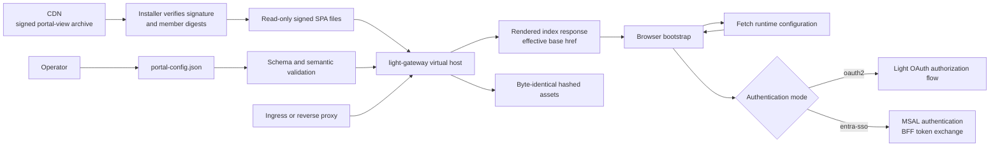
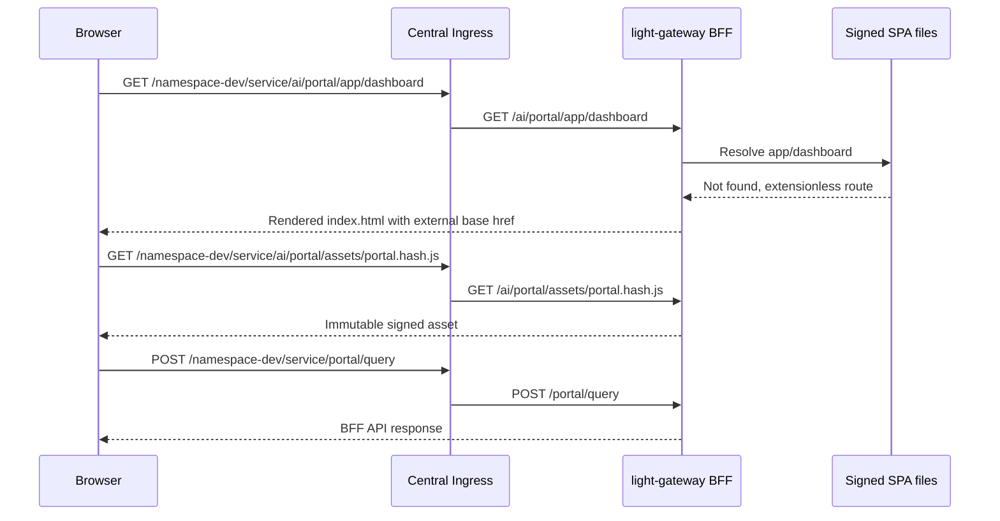

# Portable Signed Portal View Artifact and Runtime Configuration

## Status

Proposed design. The current `portal-view` build still compiles deployment
values from `VITE_*` variables, and the gateway does not yet render a runtime
base URL into the SPA entry page. The Rust `light-gateway` already supports
virtual-host static files and fallback to `index.html` for extensionless SPA
routes. The Java `VirtualHostHandler` serves static resources but does not yet
provide equivalent deep-route fallback.

This document defines the target contract. It does not claim that the runtime
configuration loader, gateway HTML rendering, release archive, or all
qualification gates have been implemented.

## Problem

`portal-view` is deployed in more than one network topology:

- directly on a host through Docker Compose or a native process;
- behind a conventional reverse proxy;
- behind a centralized Kubernetes Ingress that adds an environment and service
  prefix and removes part of that prefix before forwarding the request; and
- with either Light OAuth authorization-code login or enterprise Microsoft
  Entra ID authentication followed by backend-mediated token exchange.

Today, Vite embeds values such as the asset base, React Router base, API URL,
sign-in URL, tenant ID, client ID, and redirect URI into the generated
JavaScript. A path or identity-provider change therefore requires another
frontend build. That prevents one release artifact from being signed once,
published to the CDN, verified by every installer, and reused unchanged in all
environments.

A Kubernetes request also has two distinct path namespaces. For example:

```text
Browser-visible URL:
https://dev.ingress/namespace-dev/service/ai/portal/app/dashboard

Ingress removes:
/namespace-dev/service

Path received by light-gateway:
/ai/portal/app/dashboard
```

Using one `basePath` for both namespaces hides an important routing boundary.

## Decision Summary

1. Build and sign one immutable `portal-view` release archive.
2. Move deployment values from Vite build variables into a versioned runtime
   JSON document supplied by the installer or operator.
3. Keep build-tool and development-only options as Vite variables.
4. Model the browser-visible application base, browser-visible API base, and
   gateway-visible static mount as separate values.
5. Load and validate runtime configuration before importing the application or
   constructing either authentication client.
6. Build static asset references relative to a `<base>` element.
7. Let `light-gateway` render the effective `<base href>` into the SPA entry
   response without modifying the signed template on disk.
8. Select authentication through an explicit `oauth2` or `entra-sso` profile;
   never place a client secret in browser configuration.
9. Preserve known API routes ahead of the virtual-host fallback so a missing
   API never becomes an HTML response.
10. Verify the vendor archive before extraction and validate customer runtime
    configuration independently.

## Goals

- Publish one versioned and signed Portal View artifact to the CDN.
- Support Kubernetes path rewriting and standalone deployments with that same
  artifact.
- Support Light OAuth and enterprise Entra SSO with that same artifact.
- Allow an operator to install only a runtime JSON file and gateway
  configuration after verifying the release.
- Preserve direct links and browser refresh for React Router routes.
- Keep hashed assets immutable and efficiently cacheable.
- Fail closed on missing, malformed, or unsafe runtime configuration.
- Keep all credentials and token-exchange secrets out of browser-delivered
  files.
- Make the effective release version and configuration revision observable.

## Non-Goals

- The runtime JSON is not a secret store.
- The vendor signature does not certify customer-authored configuration.
- This design does not make Kubernetes Ingress and standalone routing
  identical; it gives both topologies one explicit contract.
- This design does not replace Entra application registration, Light OAuth
  client registration, BFF token exchange, session management, CSRF, CORS, or
  authorization policy.
- This design does not require the gateway to download artifacts from the CDN.
  An installer, image build, init container, or other approved release process
  may perform download and verification.
- This design does not put an environment name, namespace, hostname, or
  customer identity into the signed JavaScript bundle.

## Terminology and Path Contract

| Name | Owner | Meaning | Kubernetes example | Standalone example |
| --- | --- | --- | --- | --- |
| `publicBasePath` | Runtime JSON | Browser-visible root of the SPA | `/namespace-dev/service/ai/portal` | `/` |
| `apiBasePath` | Runtime JSON | Browser-visible prefix placed before BFF API endpoints | `/namespace-dev/service` | empty string |
| `gatewayBasePath` | Gateway virtual host | Post-proxy path at which static Portal files are mounted | `/ai/portal` | `/` |
| route path | React | Path below `publicBasePath` | `/app/dashboard` | `/app/dashboard` |
| API endpoint | Portal code | Stable BFF endpoint below `apiBasePath` | `/portal/query` | `/portal/query` |

`gatewayBasePath` must not be inferred from `publicBasePath`. An external proxy
can add, remove, or replace path segments. The operator configures the two sides
of that rewrite explicitly.

Paths use these canonical forms:

- `publicBasePath` starts with `/` and has no trailing slash, except `/`;
- `apiBasePath` is empty for an origin-root API or starts with `/` and has no
  trailing slash;
- `gatewayBasePath` starts with `/` and has no trailing slash, except `/`; and
- the HTML renderer produces exactly one trailing slash for `<base href>`.

## Architecture



The release and deployment trust boundaries are deliberately separate:

- the release publisher owns and signs application code, the index template,
  the runtime schema, and the release manifest;
- the operator owns routing, public identifiers, feature flags, and external
  URLs in `portal-config.json`; and
- the BFF owns secrets, session cookies, token exchange, authorization, and
  protected API routing.

## Release Artifact

A release archive should contain:

```text
portal-view-<version>.zip
├── index.html
├── assets/
│   ├── bootstrap.<hash>.js
│   ├── portal.<hash>.js
│   ├── oauth2.<hash>.js
│   ├── entra-sso.<hash>.js
│   └── portal.<hash>.css
├── portal-config.schema.json
├── release-manifest.json
└── VERSION
```

The detached signature is published beside the archive. The release manifest
records at least:

- artifact name and version;
- archive SHA-256;
- each member path and SHA-256;
- build commit;
- build timestamp;
- supported runtime configuration schema versions;
- signing algorithm and key ID; and
- minimum compatible gateway capability version.

Every release supports its current runtime configuration schema version `N`
and the immediately preceding version `N-1`. A release may add a new schema
version, but it must not tighten the meaning of an already published version.
Removing `N-1` support requires a later release after the normal customer
configuration migration window.

The public verification key must arrive through a trust channel independent of
the downloaded artifact, following the platform release-signing-key design.
Verification completes before extraction or replacement of the active Portal
files.

The verified SPA directory should be mounted read-only. Customer configuration
should be mounted separately, for example:

```text
/lightapi/dist/                 signed, read-only release files
/config/portal-config.json      customer-owned runtime configuration
```

The gateway reads the configuration from the second path. It does not require
the operator to modify the extracted release.

### Reserved runtime configuration endpoint

The gateway owns one reserved endpoint within each SPA mount:

```text
<gatewayBasePath>/portal-config.json
```

For example, the browser requests
`/namespace-dev/service/ai/portal/portal-config.json`, and Ingress forwards
`/ai/portal/portal-config.json`.

That exact gateway route does not resolve a file below `/lightapi/dist`. The
virtual-host SPA handler serves a canonical JSON representation from the
validated in-memory model loaded from `spa.runtimeConfig`, such as
`/config/portal-config.json`. This is an intentional exception to static-root
file resolution; it does not allow an arbitrary filesystem path in a request.

Only `GET` and `HEAD` are supported. The response uses
`Content-Type: application/json`, `X-Content-Type-Options: nosniff`, and
`Cache-Control: no-store`, and includes the validated configuration digest in
an `ETag` and `X-Portal-Config-Digest` response header. The reserved endpoint
is terminal: it is never eligible for static resolution or SPA fallback,
including when configuration loading has failed.

## Runtime Configuration Contract

The initial schema should use an explicit version and grouped fields:

```json
{
  "schemaVersion": 1,
  "routing": {
    "publicBasePath": "/namespace-dev/service/ai/portal",
    "apiBasePath": "/namespace-dev/service"
  },
  "authentication": {
    "mode": "entra-sso",
    "tenantId": "11111111-2222-3333-4444-555555555555",
    "clientId": "aaaaaaaa-bbbb-cccc-dddd-eeeeeeeeeeee",
    "redirectUri": ""
  },
  "features": {
    "preRegistrationEnabled": false,
    "preRegistrationUrl": "",
    "preRegistrationApiIdPath": "apiId",
    "preRegistrationServiceIdPath": "",
    "preRegistrationErrorPath": "",
    "preRegistrationPayloadMapping": {},
    "toolsSyncEnabled": false,
    "toolsSyncUrl": "",
    "toolsSyncErrorPath": "",
    "wizardRequiredApiFields": [
      "categoryIds",
      "apiDesc",
      "region",
      "businessGroup",
      "lob",
      "platform"
    ]
  },
  "externalLinks": {
    "portalDocumentation": "https://doc.lightapi.net",
    "apiOnboarding": "https://lightapi.net",
    "productReleases": "https://lightapi.net/releases"
  }
}
```

Prefer native JSON booleans, arrays, and objects instead of the string and
JSON-inside-string representations inherited from environment variables.

### Validation

The signed JSON Schema validates structure. Semantic validation additionally
enforces:

- a supported `schemaVersion`;
- normalized paths without `..`, backslashes, query strings, fragments,
  control characters, encoded separators, schemes, or authority components;
- HTTPS for absolute production URLs;
- required `tenantId` and `clientId` for `entra-sso`;
- required `signInUrl` for `oauth2`;
- an allowlisted authentication mode;
- allowed redirect origins and paths;
- bounded string, array, object, and document sizes;
- no unknown top-level or security-sensitive fields; and
- no field named or shaped like a client secret, private key, password, access
  token, refresh token, or bearer token.

Both the gateway and browser validate the document. Gateway validation protects
HTML generation and startup. Browser validation protects against a stale or
incorrectly served document and gives the operator a specific diagnostic.

## Portal Bootstrap

The application must not statically import modules that read configuration
before the runtime document has loaded. The signed bootstrap chunk performs:

```text
load portal-config.json relative to document.baseURI
  -> verify HTTP status and content type
  -> validate schema version and semantic constraints
  -> publish immutable window.__PORTAL_CONFIG__
  -> dynamically import the selected authentication adapter
  -> dynamically import the main Portal application
```

Conceptual bootstrap code:

```typescript
async function startPortal(): Promise<void> {
  const url = new URL("portal-config.json", document.baseURI);
  const signal = AbortSignal.timeout(10_000);
  const response = await fetch(url, {
    cache: "no-store",
    credentials: "same-origin",
    signal,
  });

  if (!response.ok) {
    throw new Error(`Portal configuration failed: HTTP ${response.status}`);
  }

  const candidate: unknown = await response.json();
  const runtimeConfig = validatePortalConfig(candidate);
  window.__PORTAL_CONFIG__ = deepFreeze(runtimeConfig);

  if (runtimeConfig.authentication.mode === "entra-sso") {
    await import("./auth/entra-sso");
  } else {
    await import("./auth/oauth2");
  }

  await import("./main");
}

void startPortal();
```

This ordering is required because the current MSAL configuration is constructed
during module initialization. The target implementation creates authentication
clients only after runtime configuration is available.

Runtime loading failure displays a small configuration-error page from the
signed bootstrap code. It must not start the Portal with partially populated
defaults. A timeout, abort, invalid content type, parse failure, validation
failure, and non-success HTTP status all take this path.

`deepFreeze` recursively freezes the validated object, including `routing`,
`authentication`, `features`, `externalLinks`, nested mappings, and arrays.
Application code consumes a deeply read-only type or selectors over that
object; no module receives a mutable configuration reference.

## Asset and HTML Base Handling

Production assets are built with a relative Vite base:

```javascript
export default defineConfig({
  base: "./",
});
```

Relative assets alone are insufficient for deep links. Given the browser URL
`/namespace-dev/service/ai/portal/app/dashboard`, `./assets/app.js` would
otherwise resolve below `/app/`. The entry page therefore contains a signed
placeholder before all relative resource references:

```html
<base href="__PORTAL_BASE_HREF__" />
```

When the gateway returns `index.html`, including for SPA fallback, it replaces
only that exact placeholder with the normalized, HTML-escaped runtime value:

```html
<base href="/namespace-dev/service/ai/portal/" />
```

The gateway renders the response in memory. It does not alter the verified
template or hashed files on disk. The renderer rejects a missing placeholder,
multiple placeholders, invalid configuration, and unsafe base values.

The `<base>` element changes resolution for every relative URL in the document,
not only Vite assets. Portal code must therefore construct React Router
locations, `history.pushState` and `history.replaceState` URLs, fragment links,
form actions, fetch URLs, WebSocket URLs, and EventSource URLs as absolute paths
or through the approved path-joining utilities. A relative `#fragment` is not
assumed to remain on the current route after `<base>` is introduced.

## Gateway Static and SPA Contract

The gateway has two independent inputs:

```yaml
virtual-host.hosts:
  - domain: dev.ingress
    path: /ai/portal
    base: /lightapi/dist
    transferMinSize: 10245760
    directoryListingEnabled: false
    spa:
      enabled: true
      index: index.html
      runtimeConfig: /config/portal-config.json
      basePlaceholder: __PORTAL_BASE_HREF__
```

- `path` is the gateway-visible static mount after proxy rewriting.
- `runtimeConfig.routing.publicBasePath` is the browser-visible mount.

The proposed `spa` object is additive. Existing static virtual hosts without it
retain their current behavior.

For a matching virtual host, the gateway:

1. serves the exact reserved runtime-configuration route from the validated
   in-memory model;
2. terminates any path below a registered API, OAuth, WebSocket, MCP, health,
   or management prefix in the corresponding handler chain, including an
   unknown path below that prefix;
3. serves an existing static file below the configured root;
4. serves the rendered directory index for the configured root;
5. serves the rendered SPA index for a missing extensionless browser route;
6. returns `404` for a missing asset-looking path; and
7. rejects traversal, dotfiles, and files outside the static root.

The Rust gateway already implements the underlying static resolution, including
SPA fallback. It needs the reserved configuration endpoint, prefix-terminal
routing, optional runtime-config load, validation, and index rendering. The
Java resource handler needs both explicit SPA fallback and index rendering if
the Java gateway remains a supported Portal BFF.

### Handler precedence

Known BFF namespaces must be selected by segment-aware prefix before the static
fallback. The registration is intentionally broader than the exact successful
routes so a misspelled or unavailable endpoint remains terminal. The exact list
is profile-owned, but commonly includes:

```text
/oauth2
/auth/ms
/logout
/portal
/r
/config-server
/services
/schedulers
/chat
/ctrl/mcp
/health
/adm
```

Returning `index.html` for a misspelled or unavailable API creates misleading
JSON parsing and authentication errors. API selection therefore cannot depend
only on whether the path contains a dot or exactly matches a valid endpoint.
For example, `/portal/quer` is below the registered `/portal` namespace and
must return the BFF's `404` or structured error; it never reaches virtual-host
static resolution. Prefix matching is segment-aware, so `/portalx` does not
match `/portal`.

## Kubernetes Deployment



Example runtime routing:

```json
{
  "routing": {
    "publicBasePath": "/namespace-dev/service/ai/portal",
    "apiBasePath": "/namespace-dev/service"
  }
}
```

Example gateway static mount:

```yaml
path: /ai/portal
base: /lightapi/dist
```

The Ingress must forward the original host expected by virtual-host matching,
or explicitly set the gateway host. It must route both the Portal static prefix
and browser-visible API prefix to the same BFF where that is the selected
topology.

The first release does not consume `X-Forwarded-Prefix`. Explicit runtime
configuration covers the required single-route Kubernetes and standalone
topologies without adding a forwarded-header trust or cache-poisoning surface.
A future multi-prefix requirement must define trusted proxies, edge header
sanitization, normalization, and cache variation before enabling that mode.

## Standalone and Docker Compose Deployment

The same archive uses root paths when the BFF is directly exposed:

```json
{
  "schemaVersion": 1,
  "routing": {
    "publicBasePath": "/",
    "apiBasePath": ""
  },
  "authentication": {
    "mode": "oauth2",
    "signInUrl": "https://signin.example.com?client_id=portal-client"
  }
}
```

```yaml
virtual-host.hosts:
  - domain: portal.example.com
    path: /
    base: /lightapi/dist
    spa:
      enabled: true
      index: index.html
      runtimeConfig: /config/portal-config.json
```

A standalone reverse proxy may still add a prefix. In that case it uses the
same explicit external/internal path contract as Kubernetes; no frontend build
changes.

## Authentication Profiles

Authentication is a discriminated runtime choice rather than a collection of
loosely related booleans.

### Light OAuth profile

```json
{
  "authentication": {
    "mode": "oauth2",
    "signInUrl": "/namespace-dev/service/signin?client_id=portal-client"
  }
}
```

The Portal sends the browser through the configured authorization flow. The BFF
and Light OAuth own authorization requests, callbacks, cookies, refresh, CSRF,
and logout. The client identifier is public; any confidential-client secret is
server-side only.

### Enterprise Entra SSO profile

```json
{
  "authentication": {
    "mode": "entra-sso",
    "tenantId": "11111111-2222-3333-4444-555555555555",
    "clientId": "aaaaaaaa-bbbb-cccc-dddd-eeeeeeeeeeee",
    "redirectUri": "https://dev.ingress/namespace-dev/service/ai/portal/redirect",
    "postLogoutRedirectUri": "https://dev.ingress/namespace-dev/service/ai/portal/redirect"
  }
}
```

When an explicit redirect is absent, Portal may derive it only as:

```text
new URL(joinBrowserPath(publicBasePath, "/redirect"), window.location.origin)
```

`joinBrowserPath` performs normalized segment joining instead of string
concatenation. It produces `/redirect` for a root `publicBasePath` and
`/namespace-dev/service/ai/portal/redirect` for the prefixed example; it never
produces `//redirect`. The same rule applies to the post-logout redirect. This
also repairs the current origin-root `postLogoutRedirectUri: "/redirect"`
behavior for every prefixed deployment.

The exact URI must be registered with Entra. The SPA authenticates with MSAL,
then the BFF validates the Microsoft token and performs the approved Light OAuth
token exchange. Tenant ID and SPA client ID are public. Exchange credentials,
internal tokens, and cookie-signing material never enter runtime JSON.

The universal release contains both authentication adapters. Dynamic imports
allow the browser to download only the selected adapter while keeping all
chunks inside the same signed archive.

### BFF profile remains deployment-specific

The universal frontend does not make backend authentication configuration
universal. The selected BFF instance must activate the matching handlers and
configuration:

| Concern | `oauth2` | `entra-sso` |
| --- | --- | --- |
| Browser identity provider | Light OAuth sign-in | Microsoft Entra ID |
| Frontend adapter | OAuth redirect/session | MSAL |
| BFF exchange handler | Not required for ordinary flow | Required |
| Microsoft token validation | Not applicable | Required in BFF and token exchange |
| Redirect registration | Light OAuth client | Entra application |
| Client secret in runtime JSON | Forbidden | Forbidden |
| Signed Portal artifact | Same artifact | Same artifact |

## API URL Construction

Application endpoints remain stable strings such as `/portal/query`. A single
URL utility joins them to `apiBasePath` by path segment rather than string
concatenation:

```text
joinApiPath("/namespace-dev/service", "/portal/query")
  -> /namespace-dev/service/portal/query

joinApiPath("", "/portal/query")
  -> /portal/query
```

Absolute endpoint overrides are permitted only for fields whose schema
explicitly allows them. They trigger the normal CORS and credential rules and
must not silently inherit cookies across origins.

HTTP, WebSocket, and EventSource URL builders must consume the same routing
authority. `/ctrl/mcp` and `/chat` cannot bypass `apiBasePath` merely because
they change scheme from HTTP to WebSocket.

## Cookies, Redirects, and Origin Policy

Ingress does not generally rewrite `Set-Cookie Path`. A cookie scoped to the
gateway-visible `/ai/portal` does not match the browser-visible
`/namespace-dev/service/ai/portal`.

In the centralized Kubernetes topology, the Ingress host is shared by multiple
namespaces and services. The default cookie path is therefore the
browser-visible `apiBasePath`, not `/`, `gatewayBasePath`, or
`publicBasePath`. For example:

```text
Path=/namespace-dev/service
Secure
HttpOnly for token-bearing cookies
SameSite=Lax or the explicitly qualified enterprise policy
```

This path covers `/namespace-dev/service/portal/query` as well as the Portal
application. Scoping it to the longer `publicBasePath` would prevent the browser
from sending the session cookie to BFF APIs. `Path=/` is permitted only when a
dedicated-host standalone deployment intentionally has no sibling applications
on that origin. Cookie domain, secure mode, same-site mode, callback URLs, CORS
origins, and WebSocket origin allowlists are server configuration and must align
with the public URL.

## Caching and Response Headers

| Resource | Cache policy | Notes |
| --- | --- | --- |
| Rendered `index.html` | `no-cache` | Revalidate configuration and release activation |
| Reserved `portal-config.json` response | `no-store` | Served from the validated gateway model, not the static root |
| Hashed JS, CSS, fonts, images | `public, max-age=31536000, immutable` | Byte-identical signed release members |
| Unhashed release metadata | `no-cache` | Used for diagnostics and compatibility checks |

The HTML renderer must apply a content security policy compatible with the
generated `<base>`, normally including `base-uri 'self'`.

## Failure Behavior and Observability

The system fails closed with an operator-readable page or startup error for:

- missing runtime configuration;
- unsupported schema version;
- unsafe path or redirect configuration;
- incompatible artifact and gateway capability versions;
- a missing or duplicate base placeholder;
- a requested authentication mode whose required fields are absent; or
- release verification failure before activation.

Do not fall back silently to localhost, `/`, a default tenant, or a default
authentication mode in production.

The gateway service-info/configuration surface should expose only safe metadata:

- Portal artifact version and digest;
- runtime schema version;
- runtime configuration digest, not the full document;
- configured internal mount;
- effective public and API paths;
- selected authentication mode;
- SPA fallback and index-rendering capability state; and
- last successful configuration load/reload time.

Logs must not print tokens, cookies, authorization headers, or the full runtime
document.

### Long-lived browser sessions

Runtime configuration is immutable for one page lifetime. A tab does not hot
apply a new routing or authentication profile because doing so could split one
session across incompatible authorities. The bootstrap retains the initial
configuration digest. On document visibility changes and at a bounded interval,
the Portal checks the reserved configuration endpoint and compares its digest.
The check uses `ETag` or `X-Portal-Config-Digest` and runs when a backgrounded
document becomes visible plus at a configurable interval no shorter than five
minutes. When the digest changes, the UI prompts the user to reload; it does
not mutate the active configuration in place. This makes revision drift
observable while keeping authentication and routing transitions explicit.

## Compatibility and Migration

### Phase 0: Contract and fixtures

- Add the versioned runtime JSON Schema.
- Add Kubernetes, root Compose, prefixed reverse-proxy, OAuth, and Entra
  fixtures.
- Define release manifest and minimum gateway capability fields.
- Treat the existing build-time deployment model as supported during migration.

### Phase 1: Portal bootstrap

- Add the runtime bootstrap entry and configuration validator.
- Refactor configuration consumers behind one deeply read-only object and
  selector/path-joining APIs.
- Replace the current module-level derived exports, including authentication
  flags, trimmed URLs, parsed pre-registration mappings, and wizard field
  arrays, with selectors evaluated from the loaded runtime object. Migrate all
  importing modules; this is the main body of Phase 1 rather than incidental
  cleanup.
- Ensure authentication modules initialize after bootstrap.
- Replace the hard-coded origin-root MSAL `postLogoutRedirectUri` with the
  normalized runtime redirect contract.
- Replace deployment `VITE_*` values with runtime fields.
- Keep `import.meta.env.DEV`, development TLS/port/proxy values, and explicit
  build qualification inputs as build-time controls.

### Phase 2: Portable assets and routing

- Build production assets with a relative Vite base.
- Add the single base placeholder before resource references.
- Route React with runtime `publicBasePath`.
- Route HTTP and WebSocket BFF calls with runtime `apiBasePath`.
- Remove implicit localhost production fallbacks.

### Phase 3: Rust gateway rendering

- Extend virtual-host configuration with the optional `spa` object.
- Validate runtime configuration at startup and reload.
- Serve the exact reserved `portal-config.json` route from the validated
  in-memory configuration with `no-store`.
- Render only the SPA index; serve hashed assets unchanged.
- Make registered API namespaces prefix-terminal before static resolution.
- Publish capability and safe configuration evidence.

### Phase 4: Java compatibility if retained

- Add explicit SPA fallback to the Java resource handler.
- Add the same index-template and validation contract.
- Run a shared fixture suite against Java and Rust implementations.

### Phase 5: Release and installers

- Produce deterministic archives and manifests.
- Sign the archive with the approved release key.
- Publish archive, detached signature, and release metadata to the CDN.
- Update each installer to verify before extraction.
- Before activation, validate the existing customer configuration against the
  incoming release's supported `N` and `N-1` schemas and semantic rules, and
  verify the incoming gateway capability requirement. An incompatible release
  is rejected while the current release remains ready.
- Activate the already-qualified release atomically.
- Mount the verified release read-only and customer configuration separately.

### Phase 6: Retire environment builds

- Qualify every supported topology and authentication profile.
- Remove environment-specific build scripts only after rollback evidence exists.
- Retain one release rollback and the previously valid customer configuration.

## Qualification Gates

### Portal unit and build gates

- Runtime configuration loads before `config.ts`, authentication, and React.
- Runtime configuration fetch timeout takes the deterministic error path.
- Missing or invalid configuration produces a deterministic error page.
- The entire runtime object graph is frozen and exposed through read-only
  types/selectors.
- Path joining covers root, prefixed, duplicate-slash, and rejected traversal
  cases.
- BrowserRouter uses `publicBasePath` while API and WebSocket clients use
  `apiBasePath`.
- Root and prefixed login/logout redirect construction produces exactly one
  path separator and the registered browser-visible URI.
- Fragment navigation and History API calls remain on the intended Portal
  route and never depend accidentally on `<base>` resolution.
- OAuth and Entra adapters are selected exclusively.
- Production output contains no deployment hostname, namespace, tenant, client
  ID, redirect URI, or localhost API fallback.
- Two builds from the same source inputs are byte-for-byte reproducible.

### Gateway gates

- Root and deep React routes return the rendered entry page.
- The reserved runtime-configuration endpoint is served from the external
  configured source, never the static root or SPA fallback.
- Existing and missing assets return the correct file or `404`.
- Any request below a registered API namespace, including an unknown endpoint,
  is terminal and never returns the SPA entry page.
- Traversal and dotfile requests are rejected.
- Base placeholder replacement is exact and injection-safe.
- Runtime configuration reload is atomic; a failed candidate retains the last
  valid configuration and reports failure.
- Index, runtime JSON, and hashed assets receive the specified cache headers.
- Runtime configuration digest changes are observable without mutating a
  running tab's configuration.

### Browser matrix

Run the same signed archive through:

| Topology | Authentication | Required result |
| --- | --- | --- |
| Docker Compose at `/` | Light OAuth | Login, API, refresh, logout, and deep-link refresh pass |
| Docker Compose behind a prefix | Light OAuth | Assets, API prefix, cookies, and redirects pass |
| Kubernetes rewritten prefix | Light OAuth | External/internal path separation passes |
| Kubernetes rewritten prefix | Entra SSO | MSAL redirect, exchange, session, logout, and refresh pass |
| Standalone at `/` | Entra SSO | Same artifact starts with only runtime/BFF config changes |

Each case verifies direct navigation to a route at least three levels deep,
page refresh, back/forward navigation, an absent asset, an absent API endpoint,
WebSocket connection, and logout redirect.

### Release and operational gates

- Invalid signature, unknown key, manifest mismatch, or member digest mismatch
  stops installation before extraction or activation.
- The installer validates existing customer configuration and gateway
  compatibility against the incoming release before activation.
- The gateway fails readiness when its active configuration is invalid, but an
  incompatible candidate release never replaces a ready active release.
- Releases accept schema versions `N` and `N-1` through the documented
  migration window.
- Activation is atomic and retains the previous verified release for rollback.
- Runtime evidence reports the expected artifact and configuration digests.
- No private key, OAuth secret, token, or cookie value appears in the archive,
  runtime JSON, logs, or service-info output.

## Alternatives Considered

### Continue per-environment builds

This preserves current behavior but prevents one signed artifact from being the
release authority. It also makes a path or public-client change look like an
application-code release.

### Use `HashRouter`

Hash routing keeps the server request at the SPA root and makes relative assets
simple, but changes every public Portal URL to `#/...`, affects redirect and
bookmark contracts, and abandons the existing BrowserRouter URL model. It is a
valid fallback for a static server that cannot render the index, not the target.

### Generate modified files in an init container

An init container can replace placeholders on disk without rebuilding. It is
operationally workable but changes a verified release member and complicates
evidence about what bytes are active. In-memory gateway rendering preserves the
signed source files and centralizes validation.

### Infer the public prefix from the request path

After Ingress rewriting, the gateway cannot reconstruct removed segments from
the request path. A forwarded prefix can supply them, but only within an
explicit trusted-proxy boundary. Guessing from route names or probing parent
directories is rejected.

`X-Forwarded-Prefix` support is deferred from the first release. It adds a
trusted-header and cache-variation surface without being required by the
explicit runtime configurations in the qualification matrix.

### Put runtime values in JavaScript

An operator-authored `config.js` is easy to include but is executable code. JSON
with strict schema validation gives a smaller trust surface and clearer error
handling.

## Open Questions

- Is Java `light-gateway` still a required Portal BFF target after the Rust
  rollout, or is Java support limited to migration?
- Which release-signing trust domain and key ID namespace owns Portal View
  archives?
- Should an operator optionally sign its runtime configuration with a local key
  for high-assurance installations?
- What is the minimum gateway capability/version handshake exposed to the
  installer and Portal bootstrap?
- Which exact BFF cookie paths are required by the centralized enterprise
  Ingress?

The existing `10245760` `transferMinSize` compatibility default may be a typo
for 10 MiB (`10485760`). Changing that framework default is a separate
compatibility decision and is not part of this Portal runtime-configuration
design.

## Acceptance Criteria

The design is complete when one archived and signed Portal View build is
qualified without modification in all required Kubernetes and standalone
topologies, and changing only validated runtime and BFF configuration can
switch between Light OAuth and enterprise Entra SSO. Direct React routes,
assets, APIs, WebSockets, redirects, cookies, refresh, logout, caching,
signature verification, atomic activation, and rollback must all pass with
recorded evidence.
