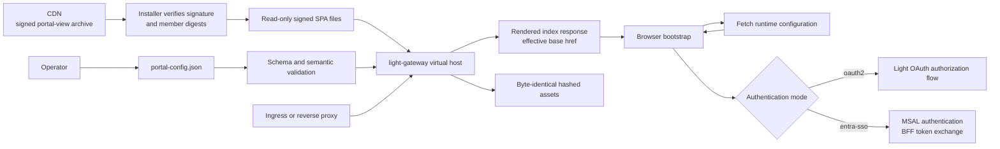
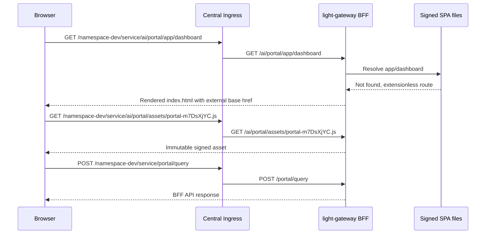

# Portable Signed Portal View Artifact and Runtime Configuration

## Status

Proposed design. The current `portal-view` build still compiles deployment
values from `VITE_*` variables, and the gateway does not yet render a runtime
base URL into the SPA entry page. The Rust `light-gateway` already supports
virtual-host static files and fallback to `index.html` for extensionless SPA
routes. This design targets only Rust `light-gateway`; Java gateway parity is
out of scope for the migration away from Java.

This document defines the target contract. It does not claim that the runtime
configuration loader, gateway HTML rendering, release archive, or all
qualification gates have been implemented. It supersedes the target architecture
in [Multiple Environment](multiple-environment.md); that build-time model remains
supported until the migration gates below pass.

## Problem

`portal-view` is deployed in more than one network topology:

- directly on a host through Docker Compose or a native process;
- behind a conventional reverse proxy;
- behind a centralized Kubernetes Ingress that adds an environment and service
  prefix and removes part of that prefix before forwarding the request; and
- with either Light OAuth authorization-code login or enterprise Microsoft
  Entra ID authentication followed by backend-mediated token exchange.

Today, Vite embeds values such as the asset base, React Router base, API URL,
sign-in URL, tenant ID, client ID, and redirect URI into the generated
JavaScript. A path or identity-provider change therefore requires another
frontend build. That prevents one release artifact from being signed once,
published to the CDN, verified by every installer, and reused unchanged in all
environments.

A Kubernetes request also has two distinct path namespaces. For example:

```text
Browser-visible URL:
https://dev.ingress/namespace-dev/service/ai/portal/app/dashboard

Ingress removes:
/namespace-dev/service

Path received by light-gateway:
/ai/portal/app/dashboard
```

Using one `basePath` for both namespaces hides an important routing boundary.

## Decision Summary

1. Build and sign one immutable `portal-view` release archive.
2. Move deployment values from Vite build variables into a versioned runtime
   JSON document supplied by the installer or operator.
3. Keep build-tool and development-only options as Vite variables.
4. Model the browser-visible application base, browser-visible API base, and
   gateway-visible static mount as separate values.
5. Load and validate runtime configuration before importing the application or
   constructing either authentication client.
6. Build static asset references relative to a `<base>` element.
7. Let `light-gateway` render the effective `<base href>` into the SPA entry
   response without modifying the signed template on disk.
8. Use OAuth 2.0 authorization-code grant flow (`oauth2`) for `portal-config-loc`,
   `portal-config-dev`, and `light-portal-install`. `portal-config-bootstrap` may
   select SSO; the defined SSO adapter is `entra-sso`. Never place a client
   secret in browser configuration.
9. Preserve known API routes ahead of the virtual-host fallback so a missing
   API never becomes an HTML response.
10. Verify the vendor archive before extraction and validate customer runtime
    configuration independently.

## Goals

- Publish one versioned and signed Portal View artifact to the CDN.
- Support Kubernetes path rewriting and standalone deployments with that same
  artifact.
- Support Light OAuth and enterprise Entra SSO with that same artifact.
- Allow an operator to install only a runtime JSON file and gateway
  configuration after verifying the release.
- Preserve direct links and browser refresh for React Router routes.
- Keep hashed assets immutable and efficiently cacheable.
- Fail closed on missing, malformed, or unsafe runtime configuration.
- Keep all credentials and token-exchange secrets out of browser-delivered
  files.
- Make the effective release version and configuration revision observable.

## Non-Goals

- The runtime JSON is not a secret store.
- The first release does not support cross-origin BFF sessions; deployments
  expose the BFF through the Portal origin. Cross-origin feature services retain
  their separately defined authentication contracts.
- The vendor signature does not certify customer-authored configuration.
- This design does not make Kubernetes Ingress and standalone routing
  identical; it gives both topologies one explicit contract.
- This design does not replace Entra application registration, Light OAuth
  client registration, BFF token exchange, session management, CSRF, CORS, or
  authorization policy.
- This design does not require the gateway to download artifacts from the CDN.
  An installer, image build, init container, or other approved release process
  may perform download and verification.
- This design does not put an environment name, namespace, hostname, or
  customer identity into the signed JavaScript bundle.

## Terminology and Path Contract

| Name | Owner | Meaning | Kubernetes example | Standalone example |
| --- | --- | --- | --- | --- |
| `publicBasePath` | Runtime JSON | Browser-visible root of the SPA | `/namespace-dev/service/ai/portal` | `/` |
| `apiBasePath` | Runtime JSON | Browser-visible prefix placed before BFF API endpoints | `/namespace-dev/service` | empty string |
| `gatewayBasePath` | Gateway virtual host | Post-proxy path at which static Portal files are mounted | `/ai/portal` | `/` |
| route path | React | Path below `publicBasePath` | `/app/dashboard` | `/app/dashboard` |
| API endpoint | Portal code | Stable BFF endpoint below `apiBasePath` | `/portal/query` | `/portal/query` |

`gatewayBasePath` must not be inferred from `publicBasePath`. An external proxy
can add, remove, or replace path segments. The operator configures the two sides
of that rewrite explicitly.

Paths use these canonical forms:

- `publicBasePath` starts with `/` and has no trailing slash, except `/`;
- `apiBasePath` is empty for an origin-root API or starts with `/` and has no
  trailing slash;
- `gatewayBasePath` starts with `/` and has no trailing slash, except `/`; and
- the HTML renderer produces exactly one trailing slash for `<base href>`.

## Architecture


```mermaid
flowchart LR
    CDN[CDN<br/>signed portal-view archive] --> VERIFY[Installer verifies signature<br/>and member digests]
    VERIFY --> CORE[Read-only signed SPA files]
    OP[Operator] --> CFG[portal-config.json]
    CFG --> VALIDATE[Schema and semantic validation]
    CORE --> GW[light-gateway virtual host]
    VALIDATE --> GW
    INGRESS[Ingress or reverse proxy] --> GW
    GW --> INDEX[Rendered index response<br/>effective base href]
    GW --> ASSET[Byte-identical hashed assets]
    INDEX --> BROWSER[Browser bootstrap]
    BROWSER --> CFGHTTP[Fetch runtime configuration]
    CFGHTTP --> BROWSER
    BROWSER --> AUTH{Authentication mode}
    AUTH -->|oauth2| OAUTH[Light OAuth authorization flow]
    AUTH -->|entra-sso| ENTRA[MSAL authentication<br/>BFF token exchange]
```

The release and deployment trust boundaries are deliberately separate:

- the release publisher owns and signs application code, the index template,
  the runtime schema, and the release manifest;
- the operator owns routing, public identifiers, feature flags, and external
  URLs in `portal-config.json`; and
- the BFF owns secrets, session cookies, token exchange, authorization, and
  protected API routing.

## Release Artifact

Publish these three sibling files under one immutable versioned release directory:

```text
portal-view-<version>.zip
release-manifest.json
release-manifest.sig
```

The archive contains:

```text
portal-view-<version>.zip
├── index.html
├── assets/
│   ├── bootstrap-<hash>.js
│   ├── portal-<hash>.js
│   ├── oauth2-<hash>.js
│   ├── entra-sso-<hash>.js
│   └── portal-<hash>.css
├── portal-config.schema.json
└── VERSION
```

Chunk names above are illustrative Vite `name-hash` names, not fixed entry names.
Production release builds disable source maps and exclude `.map` files and
source-map references from the public archive. The current `sourcemap: true`
build setting must change; development builds may retain maps.

`release-manifest.sig` is an Ed25519 signature over the exact published UTF-8
bytes of `release-manifest.json`. The manifest and signature are outside the
archive, so the archive digest has no self-reference. The manifest records:

- artifact name and version;
- archive SHA-256;
- every archive member path, SHA-256, and cache class (`immutable` or
  `revalidate`); only content-addressed assets use `immutable`;
- `spaRoutes`, mount-relative route reservations with explicit `exact` or
  `prefix` matching, generated and checked against the release router;
- build commit;
- build timestamp derived from the fixed `SOURCE_DATE_EPOCH`, never wall time;
- supported runtime configuration schema versions;
- `signature.algorithm` (`Ed25519`) and `signature.keyId`, included in the
  signed manifest even though the signature bytes are detached; and
- minimum compatible gateway capability version.

Every release supports its current runtime configuration schema version `N`
and the immediately preceding version `N-1`. A release may add a new schema
version, but it must not tighten the meaning of an already published version.
Removing `N-1` support requires a later release after the normal customer
configuration migration window.

The public verification key must arrive through a trust channel independent of
the downloaded artifact, following
[Release Signing Key Management and Rotation](../release-signing-key-management.md).
The dedicated trust domain is `portal-view-archive`, with keys such as
`portal-view-release-2026-01` in `portal-view-release-keys/<keyId>.pem`. An
untrusted manifest may select only an already enrolled key in this domain; it
cannot enroll keys or select an arbitrary algorithm or filesystem path.

Verify the manifest signature first, then the archive SHA-256 and exact member
set/digests by inspecting the archive before extraction. Reject duplicate or
unsafe paths, symlinks, unlisted members, and missing members. Extract into a
staging directory and verify the resulting files before atomic activation.
Keep the verified manifest and signature inside the same version directory as
the extracted SPA files. Activate that directory as one unit using the contract
below; never replace the static root and manifest independently.

Pin build tools, dependency inputs, member ordering, permissions, compression
settings, and archive timestamps. Identical inputs, including `SOURCE_DATE_EPOCH`,
must reproduce both archive bytes and manifest bytes; signature generation
follows that reproducible build.

### Atomic release activation and verification ownership

Stage each release in its own directory, then make it immutable. The gateway
sees the release tree read-only; the deployment process manages a single
`current` pointer on the same filesystem:

```text
/lightapi/releases/<version>/
├── dist/                       verified archive members
├── release-manifest.json       verified external manifest
└── release-manifest.sig        detached signature
/lightapi/current -> releases/<version>
/config/portal-config.json      separately mounted customer configuration
/config/portal-view-release-keys/  independently provisioned, read-only public keys
```

The installer verifies the signature, archive digest, and member digests before
extraction, then verifies the extracted exact file set and hashes. Once the
candidate and existing runtime configuration pass compatibility checks, it
atomically renames a prepared symlink over `current`. Never overwrite a version
directory or update two bind mounts separately. Mount the parent release tree
so the gateway can observe the pointer change. Docker Compose activation is an
explicit owner command: first validate the staged release and runtime configuration
offline with the target gateway image's `light-gateway validate-portal-release`,
then swap `current`, force-recreate the gateway service with
`docker compose up -d --no-deps --force-recreate`, and read back the expected
`X-Portal-Release-Digest`. Failed activation restores the previous release,
recreates it and verifies its digest; interrupted recovery retains its journal
until the complete prior state is restored. First pointer-only preparation changes
no serving process; first serving cutover and rollback require the separate
Portal UI configuration change, snapshot publication and explicit recreation.
Online activation uses the controller `reload_modules` tool with
`{"modules":["light-pingora/virtual-host"]}` after the validated pointer swap,
and reads back the digest; failure restores the pointer and reloads again.
There is no filesystem watcher; swapping `current` alone does not activate the
release in a running gateway.

Extend `load_static_resources` to resolve `current` **once** to a concrete
version directory and load its static sites, manifest/cache classes, route
reservations, rendered root index, and validated runtime configuration into one
candidate `StaticResourceSet`. Both `base` and `spa.releaseManifest` must resolve
under that same pinned directory; do not resolve `current` independently for
each file or on each request. The current `StaticResourceReloader` already builds
with `load_static_resources` and then publishes through one `ConfigManager.store`;
the new release data must join that snapshot rather than a separate reload.
This guarantees consistency within the static snapshot, not an atomic reload of
unrelated gateway modules.

At every startup and static-resource reload, the gateway verifies the manifest
signature with enrolled Portal View keys mounted read-only at
`/config/portal-view-release-keys/<keyId>.pem`, checks the exact extracted file set,
and re-hashes every signed file against the manifest. A filename-only check is
insufficient. Archive-byte verification belongs to the installer; the gateway
does not require the ZIP at runtime. Reject unsafe paths and symlinks inside
`dist`; the deployment-owned `current` pointer is resolved only at the release
boundary. These checks precede publication, not each HTTP request. Immutable
version directories must remain unmodified after verification. Provision the
gateway keys through the same independent trust channel and rotation/revocation
policy as the installer, outside the release directory; never enroll keys from
the downloaded archive or manifest.

The filesystem pointer swap selects the candidate; the single successful
snapshot publication is the serving activation point. Requests retain their
snapshot's concrete paths and cache metadata, so an in-flight old request cannot
read new files with old metadata. A failed reload retains the previous snapshot;
the deployment restores `current` to the previous directory and reports failure.
A cold-start verification failure fails readiness. Rollback swaps `current` back
and reloads the same way. Keep at least the active and previous version
directories. Prune older versions only after successful readback of the active
manifest digest and during maintenance with all gateway processes serving that
release tree drained and stopped. Digest readback alone does not prove that
older requests have finished, especially across rapid successive activations;
ordinary online activation performs no pruning. This rule requires no external
snapshot-reference inspection. The pointer and snapshot are two ordered steps,
not a claimed cross-process transaction.

The gateway reads customer configuration from `/config/portal-config.json`.
It does not require the operator to modify the extracted release.

### Reserved runtime configuration endpoint

Virtual hosts are keyed by domain and duplicate domains are rejected. This
contract supports one SPA mount per selected virtual host per gateway; multiple
SPA mounts on the same host are out of scope. The gateway owns one reserved
endpoint within that mount:

```text
<gatewayBasePath>/portal-config.json
```

For example, the browser requests
`/namespace-dev/service/ai/portal/portal-config.json`, and Ingress forwards
`/ai/portal/portal-config.json`.

That exact gateway route does not resolve a file below the pinned static root. The
virtual-host SPA handler serves a canonical JSON representation from the
validated in-memory model loaded from `spa.runtimeConfig`, such as
`/config/portal-config.json`. This is an intentional exception to static-root
file resolution; it does not allow an arbitrary filesystem path in a request.

Only `GET` and `HEAD` are supported. The response uses
`Content-Type: application/json`, `X-Content-Type-Options: nosniff`, and
`Cache-Control: no-store`, and includes the validated configuration digest in
an `ETag` and `X-Portal-Config-Digest` response header. Both this endpoint and
the rendered index include `X-Portal-Release-Digest`, the SHA-256 hex digest of
the exact verified `release-manifest.json` bytes, for release readback. The reserved endpoint
is terminal: it is never eligible for static resolution or SPA fallback,
including when configuration loading has failed.

## Runtime Configuration Contract

The initial schema should use an explicit version and grouped fields:

```json
{
  "schemaVersion": 1,
  "routing": {
    "publicBasePath": "/namespace-dev/service/ai/portal",
    "apiBasePath": "/namespace-dev/service"
  },
  "authentication": {
    "mode": "entra-sso",
    "tenantId": "11111111-2222-3333-4444-555555555555",
    "clientId": "aaaaaaaa-bbbb-cccc-dddd-eeeeeeeeeeee",
    "redirectUri": ""
  },
  "features": {
    "preRegistrationEnabled": false,
    "preRegistrationUrl": "",
    "preRegistrationApiIdPath": "apiId",
    "preRegistrationServiceIdPath": "",
    "preRegistrationErrorPath": "",
    "preRegistrationPayloadMapping": {},
    "toolsSyncEnabled": false,
    "toolsSyncUrl": "",
    "toolsSyncErrorPath": "",
    "wizardRequiredApiFields": [
      "categoryIds",
      "apiDesc",
      "region",
      "businessGroup",
      "lob",
      "platform"
    ]
  },
  "externalLinks": {
    "portalDocumentation": "https://doc.lightapi.net",
    "apiOnboarding": "https://lightapi.net",
    "productReleases": "https://lightapi.net/releases"
  }
}
```

Prefer native JSON booleans, arrays, and objects instead of the string and
JSON-inside-string representations inherited from environment variables.

### Validation

The signed JSON Schema validates structure. Semantic validation additionally
enforces:

- a supported `schemaVersion`;
- normalized paths without `..`, backslashes, query strings, fragments,
  control characters, encoded separators, schemes, or authority components;
- HTTPS for absolute production URLs;
- BFF routing is same-origin in the initial schema; `routing.apiOrigin` is
  not accepted, and BFF endpoint builders reject absolute origin overrides;
- required `tenantId` and `clientId` for `entra-sso`;
- required `signInUrl` for `oauth2`, validated as a URL using the contract below
  rather than as a query-free routing path;
- an allowlisted authentication mode;
- allowed redirect origins and paths;
- bounded string, array, object, and document sizes;
- no unknown top-level or security-sensitive fields; and
- no field named or shaped like a client secret, private key, password, access
  token, refresh token, or bearer token.

Both the gateway and browser validate the document. Gateway validation protects
HTML generation and startup. Browser validation protects against a stale or
incorrectly served document and gives the operator a specific diagnostic.

## Portal Bootstrap

The application must not statically import modules that read configuration
before the runtime document has loaded. The signed bootstrap chunk performs:

```text
load portal-config.json relative to document.baseURI
  -> verify HTTP status and content type
  -> validate schema version and semantic constraints
  -> publish immutable window.__PORTAL_CONFIG__
  -> dynamically import the selected authentication adapter
  -> dynamically import the main Portal application
```

Conceptual bootstrap code:

```typescript
async function startPortal(): Promise<void> {
  const url = new URL("portal-config.json", document.baseURI);
  const signal = AbortSignal.timeout(10_000);
  const response = await fetch(url, {
    cache: "no-store",
    credentials: "same-origin",
    signal,
  });

  if (!response.ok) {
    throw new Error(`Portal configuration failed: HTTP ${response.status}`);
  }

  const candidate: unknown = await response.json();
  const runtimeConfig = validatePortalConfig(candidate);
  window.__PORTAL_CONFIG__ = deepFreeze(runtimeConfig);

  if (runtimeConfig.authentication.mode === "entra-sso") {
    await import("./auth/entra-sso");
  } else {
    await import("./auth/oauth2");
  }

  await import("./main");
}

void startPortal();
```

This ordering is required because the current MSAL configuration is constructed
during module initialization. The target implementation creates authentication
clients only after runtime configuration is available.

Runtime loading failure displays a small configuration-error page from the
signed bootstrap code. It must not start the Portal with partially populated
defaults. A timeout, abort, invalid content type, parse failure, validation
failure, and non-success HTTP status all take this path.

`deepFreeze` recursively freezes the validated object, including `routing`,
`authentication`, `features`, `externalLinks`, nested mappings, and arrays.
Application code consumes a deeply read-only type or selectors over that
object; no module receives a mutable configuration reference.

## Asset and HTML Base Handling

Production assets are built with a relative Vite base:

```javascript
export default defineConfig({
  base: "./",
});
```

Relative assets alone are insufficient for deep links. Given the browser URL
`/namespace-dev/service/ai/portal/app/dashboard`, `./assets/app.js` would
otherwise resolve below `/app/`. The entry page therefore contains a signed
placeholder before all relative resource references:

```html
<base href="__PORTAL_BASE_HREF__" />
```

When the gateway returns `index.html`, including for SPA fallback, it replaces
only that exact placeholder with the normalized, HTML-escaped runtime value:

```html
<base href="/namespace-dev/service/ai/portal/" />
```

The gateway renders the response in memory. It does not alter the verified
template or hashed files on disk. The renderer rejects a missing placeholder,
multiple placeholders, invalid configuration, and unsafe base values.

The `<base>` element changes resolution for every relative URL in the document,
not only Vite assets. Portal code must therefore construct React Router
locations, `history.pushState` and `history.replaceState` URLs, fragment links,
form actions, fetch URLs, WebSocket URLs, and EventSource URLs as absolute paths
or through the approved path-joining utilities. A relative `#fragment` is not
assumed to remain on the current route after `<base>` is introduced.

## Gateway Static and SPA Contract

The gateway has two independent inputs:

```yaml
virtual-host.hosts:
  - domain: dev.ingress
    path: /ai/portal
    base: /lightapi/current/dist
    transferMinSize: 10245760
    directoryListingEnabled: false
    spa:
      enabled: true
      index: index.html
      runtimeConfig: /config/portal-config.json
      releaseManifest: /lightapi/current/release-manifest.json
      releaseKeyDir: /config/portal-view-release-keys
      basePlaceholder: __PORTAL_BASE_HREF__
```

- `path` is the gateway-visible static mount after proxy rewriting.
- `runtimeConfig.routing.publicBasePath` is the browser-visible mount.

The proposed `spa` object enables runtime validation, root-index rendering,
the reserved config endpoint, and manifest-based cache policy. It does not
introduce extensionless fallback: existing virtual hosts, including sign-in
hosts, already have it. Hosts without the block (or with `spa.enabled: false`)
retain their current unrendered fallback and legacy cache behavior.

`gatewayBasePath` names the virtual-host `path`, matched against the path received
from the proxy. `handler.basePath` is a separate handler-matching convenience:
today exact/wildcard handlers try the received path and then a segment-aware
base-stripped path. It does not define the browser prefix or the static mount.
The terminal namespace rules must use the same matching behavior as exact
handlers. Do not strip this prefix a second time from static resolution; test
non-root `handler.basePath` together with a rewritten Ingress mount.

For a matching SPA-enabled virtual host, the target request pipeline:

1. serves the exact reserved runtime-configuration route from the validated
   in-memory model;
2. terminates any path below a registered API, OAuth, WebSocket, MCP, health,
   or management prefix in the corresponding handler chain, including an
   unknown path below that prefix;
3. serves an existing static file below the configured root;
4. serves the rendered directory index for the configured root;
5. serves the rendered SPA index for a missing extensionless browser route;
6. returns `404` for a missing asset-looking path; and
7. rejects traversal, dotfiles, and files outside the static root.

Only the configured root `index.html` is rendered, including when selected by
SPA fallback. A real subdirectory takes precedence over fallback: its own
`index.html` is served unchanged, or it returns `404` if there is no index.
Consequently `/assets` must not be used as a React route. Missing paths whose
last segment contains a dot are treated as assets; React routes ending in a
version or hostname cannot rely on refresh fallback under this contract.

The Rust gateway needs the reserved configuration endpoint, terminal namespace
guards, optional runtime-config load, validation, root-index rendering, and
manifest cache classification. These are proposed capabilities, not current
behavior.

### Handler precedence

The existing `path_template_match` already supports segment-aware `/portal/*`
matching (including `/portal` itself), and `find_map` selects the first match.
Extend that machinery with explicit any-method matching and a generic terminal
404 handler; the existing `sidecar-deny` is sidecar-specific. Register exact
working routes first, then namespace guards, then static fallback. Preserve
explicit CORS/preflight handling before terminal guards. Wrong-method requests
such as `GET /portal/command` must terminate with an API error, never HTML.

Known BFF namespaces must be selected by segment-aware prefix before the static
fallback. The registration is intentionally broader than the exact successful
routes so a misspelled or unavailable endpoint remains terminal. The exact list
is profile-owned, but commonly includes:

```text
/oauth2
/auth/ms
/logout
/portal
/r
/config-server
/services
/schedulers
/chat
/ctrl/mcp
/mcp
/api
/authorization
/ws
/github
/google
/facebook
/health
/adm
```

Also retain exact handler-owned resources `/spec.yaml`, `/specui.html`, and
`/favicon.ico` before fallback; these are exact resources, not broad namespaces.
Inventory each deployment profile against `handler.yml` and frontend traffic.
Correct the development proxy `/schedules` spelling to server `/schedulers`
during migration rather than introducing a new server namespace. Reject a
configuration only when a guard intersects a declared SPA route reservation or
the exact reserved configuration endpoint, not merely because the guard is
beneath the static mount. A root mount must accept `/portal/*` and `/chat/*`.

The signed manifest declares these current mount-relative reservations:

```json
{
  "spaRoutes": [
    { "path": "/", "match": "exact" },
    { "path": "/app", "match": "prefix" },
    { "path": "/redirect", "match": "exact" },
    { "path": "/device", "match": "exact" }
  ]
}
```

`prefix` means the path itself and segment-bounded descendants; exact `/` does
not reserve every descendant. The router's catch-all error page is not a route
reservation. Expand reservations under `gatewayBasePath` and compare request
sets using the same received-path and `handler.basePath` alias rules as handler
selection. Reject either ancestor or descendant overlap with a prefix reservation,
or a guard that covers an exact reservation. Include the mount's slash/no-slash
root aliases and the exact `<gatewayBasePath>/portal-config.json` endpoint.
For example, root-mounted `/app/*`, `/redirect/*`, and `/*` guards conflict;
`/portal/*`, `/chat/*`, and `/application/*` do not. A prefixed mount compares
against its prefixed routes, not origin-root `/app`. Build gates must detect
router/manifest reservation drift.

Returning `index.html` for a misspelled or unavailable API creates misleading
JSON parsing and authentication errors. API selection therefore cannot depend
only on whether the path contains a dot or exactly matches a valid endpoint.
For example, `/portal/quer` is below the registered `/portal` namespace and
must return the BFF's `404` or structured error; it never reaches virtual-host
static resolution. Prefix matching is segment-aware, so `/portalx` does not
match `/portal`.

## Kubernetes Deployment


```mermaid
sequenceDiagram
    participant B as Browser
    participant I as Central Ingress
    participant G as light-gateway BFF
    participant F as Signed SPA files

    B->>I: GET /namespace-dev/service/ai/portal/app/dashboard
    I->>G: GET /ai/portal/app/dashboard
    G->>F: Resolve app/dashboard
    F-->>G: Not found, extensionless route
    G-->>B: Rendered index.html with external base href
    B->>I: GET /namespace-dev/service/ai/portal/assets/portal-m7DsXjYC.js
    I->>G: GET /ai/portal/assets/portal-m7DsXjYC.js
    G-->>B: Immutable signed asset
    B->>I: POST /namespace-dev/service/portal/query
    I->>G: POST /portal/query
    G-->>B: BFF API response
```

Example runtime routing:

```json
{
  "routing": {
    "publicBasePath": "/namespace-dev/service/ai/portal",
    "apiBasePath": "/namespace-dev/service"
  }
}
```

Example gateway static mount:

```yaml
path: /ai/portal
base: /lightapi/current/dist
```

The Ingress must forward the original host expected by virtual-host matching,
or explicitly set the gateway host. It must route both the Portal static prefix
and browser-visible API prefix to the same BFF where that is the selected
topology.

The first release does not consume `X-Forwarded-Prefix`. Explicit runtime
configuration covers the required single-route Kubernetes and standalone
topologies without adding a forwarded-header trust or cache-poisoning surface.
A future multi-prefix requirement must define trusted proxies, edge header
sanitization, normalization, and cache variation before enabling that mode.

## Standalone and Docker Compose Deployment

The same archive uses root paths when the BFF is directly exposed:

```json
{
  "schemaVersion": 1,
  "routing": {
    "publicBasePath": "/",
    "apiBasePath": ""
  },
  "authentication": {
    "mode": "oauth2",
    "signInUrl": "https://signin.example.com?client_id=portal-client"
  }
}
```

```yaml
virtual-host.hosts:
  - domain: portal.example.com
    path: /
    base: /lightapi/current/dist
    spa:
      enabled: true
      index: index.html
      runtimeConfig: /config/portal-config.json
      releaseManifest: /lightapi/current/release-manifest.json
      releaseKeyDir: /config/portal-view-release-keys
```

A standalone reverse proxy may still add a prefix. In that case it uses the
same explicit external/internal path contract as Kubernetes; no frontend build
changes.

## Authentication Profiles

Authentication is a discriminated runtime choice rather than a collection of
loosely related booleans. Deployment defaults are explicit:

| Deployment repository | Authentication contract |
| --- | --- |
| `portal-config-loc` | OAuth 2.0 authorization-code grant (`oauth2`) |
| `portal-config-dev` | OAuth 2.0 authorization-code grant (`oauth2`) |
| `light-portal-install` | OAuth 2.0 authorization-code grant (`oauth2`) |
| `portal-config-bootstrap` | Operator-selected; may use SSO (`entra-sso` when Entra is selected) |

Bootstrap SSO is a supported option, not a decision that every bootstrap
installation must use Entra. A different SSO provider needs its own contract.

### Light OAuth profile

```json
{
  "authentication": {
    "mode": "oauth2",
    "signInUrl": "/namespace-dev/service/signin?client_id=portal-client"
  }
}
```

The Portal sends the browser through the configured OAuth 2.0 authorization-code
grant flow. `signInUrl` is either a browser-origin absolute path beginning with
one `/`, or an absolute HTTPS URL. Queries are allowed, including the public
`client_id`; fragments, userinfo, protocol-relative URLs, control characters,
and unsafe path encodings are rejected. Resolve against `window.location.origin`,
not the document base. The current Light sign-in contract requires one nonempty
`client_id`. Use `URL.searchParams.set` for `user_type=E` and the per-login
`state`, preserving other validated query fields without string concatenation.
Those two generated fields must not be configured. The hard-coded
`https://signin.localhost?...` fallback in `src/utils/signIn.ts` is removed.

The BFF and Light OAuth own authorization requests, callbacks, cookies, refresh, CSRF,
and logout. The client identifier is public; any confidential-client secret is
server-side only.

### Enterprise Entra SSO profile

```json
{
  "authentication": {
    "mode": "entra-sso",
    "tenantId": "11111111-2222-3333-4444-555555555555",
    "clientId": "aaaaaaaa-bbbb-cccc-dddd-eeeeeeeeeeee",
    "redirectUri": "https://dev.ingress/namespace-dev/service/ai/portal/redirect",
    "postLogoutRedirectUri": "https://dev.ingress/namespace-dev/service/ai/portal/redirect"
  }
}
```

When an explicit redirect is absent, Portal may derive it only as:

```text
new URL(joinBrowserPath(publicBasePath, "/redirect"), window.location.origin)
```

`joinBrowserPath` performs normalized segment joining instead of string
concatenation. It produces `/redirect` for a root `publicBasePath` and
`/namespace-dev/service/ai/portal/redirect` for the prefixed example; it never
produces `//redirect`. The same rule applies to the post-logout redirect. This
consolidates the already base-aware hand-rolled derivations in `signIn.ts` and
`UserContext.tsx`, and fixes the origin-root default in `authConfig.js`, through
`joinBrowserPath`. It does not imply that existing explicit login/logout calls
always lose the prefix.

The exact URI must be registered with Entra. The SPA authenticates with MSAL,
then the BFF validates the Microsoft token and performs the approved Light OAuth
token exchange. Tenant ID and SPA client ID are public. Exchange credentials,
internal tokens, and cookie-signing material never enter runtime JSON.

The universal release contains both authentication adapters. Dynamic imports
allow the browser to download only the selected adapter while keeping all
chunks inside the same signed archive.

### BFF profile remains deployment-specific

The universal frontend does not make backend authentication configuration
universal. The selected BFF instance must activate the matching handlers and
configuration:

| Concern | `oauth2` | `entra-sso` |
| --- | --- | --- |
| Browser identity provider | Light OAuth sign-in | Microsoft Entra ID |
| Frontend adapter | OAuth redirect/session | MSAL |
| BFF exchange handler | Not required for ordinary flow | Required |
| Microsoft token validation | Not applicable | Required in BFF and token exchange |
| Redirect registration | Light OAuth client | Entra application |
| Client secret in runtime JSON | Forbidden | Forbidden |
| Signed Portal artifact | Same artifact | Same artifact |

## API URL Construction

Application endpoints remain stable strings such as `/portal/query`. A single
URL utility joins them to `apiBasePath` by path segment rather than string
concatenation:

```text
joinApiPath("/namespace-dev/service", "/portal/query")
  -> /namespace-dev/service/portal/query

joinApiPath("", "/portal/query")
  -> /portal/query
```

The current `apiBaseUrl` accepts a full origin (including the development
`https://dev.lightapi.net` configuration), but that does not establish working
cross-origin cookie authentication. The first runtime schema supports only a
same-origin BFF: resolve API paths against `window.location.origin` and convert
`https` to `wss` for WebSockets. It does not expose `routing.apiOrigin`. Existing
cross-origin deployments must provide a same-origin reverse-proxy or development
proxy route before migration; they cannot silently copy an absolute API URL into
`apiBasePath`. Cross-origin BFF support is deferred to a future schema and an
explicit CSRF/identity delivery design.

`features.preRegistrationUrl` and `features.toolsSyncUrl` explicitly permit
absolute HTTPS service URLs or root-absolute endpoint paths. Endpoint paths
use the API builder; absolute service URLs retain their configured authority.
Do not blindly rewrite the two raw wizard fetches as BFF calls. Validate
external destinations and their token audience/credential policy separately;
BFF cookies and identity tokens must not be forwarded to arbitrary origins.
These external feature service contracts do not enable cross-origin BFF sessions.

HTTP, WebSocket, and EventSource URL builders must consume the same routing
authority. `/ctrl/mcp` and `/chat` cannot bypass `apiBasePath` merely because
they change scheme from HTTP to WebSocket.

## Cookies, Redirects, and Origin Policy

The current Portal depends on page-readable cookies: `fetchClient.ts` reads
`csrf` for `X-CSRF-TOKEN`; `chatAuthentication.ts` reads `userId`, `host`, and
`csrf` for renewal and identity checks; `Chat.tsx` reads `csrf` for its WebSocket
subprotocol. Cookie Domain and Path must make those non-HttpOnly cookies visible
at the Portal page as well as usable by the same-origin BFF. Token-bearing
cookies remain HttpOnly. Cookie-path validation must prove that the configured
API cookie path covers the Portal page and the BFF endpoints; unrelated public
and API paths cannot satisfy that rule without an explicitly qualified scope.

A different API host's host-only cookies are invisible to the Portal page.
SameSite=Lax also excludes cross-site fetch/WebSocket sessions, and third-party
cookie blocking cannot be solved by CORS or `credentials: include`. Sharing a
parent-domain cookie between same-site subdomains could address visibility, but
broadens cookie authority and still requires path, credential, CSRF, and identity
qualification. This design does not enable that policy implicitly. A future
cross-origin design must specify secure token/identity delivery and browser
cookie constraints before adding a supported topology or required gate.

Ingress does not generally rewrite `Set-Cookie Path`. A cookie scoped to the
gateway-visible `/ai/portal` does not match the browser-visible
`/namespace-dev/service/ai/portal`.

In the centralized Kubernetes topology, the Ingress host is shared by multiple
namespaces and services. The default cookie path is therefore the
browser-visible `apiBasePath`, not `/`, `gatewayBasePath`, or
`publicBasePath`. For example:

```text
Path=/namespace-dev/service
Secure
HttpOnly for token-bearing cookies
SameSite=Lax or the explicitly qualified enterprise policy
```

This path covers `/namespace-dev/service/portal/query` as well as the Portal
application. Scoping it to the longer `publicBasePath` would prevent the browser
from sending the session cookie to BFF APIs. `Path=/` is permitted only when a
dedicated-host standalone deployment intentionally has no sibling applications
on that origin. Cookie domain, secure mode, same-site mode, callback URLs, CORS
origins, and WebSocket origin allowlists are server configuration and must align
with the public URL.

## Caching and Response Headers

| Resource | Cache policy | Notes |
| --- | --- | --- |
| Rendered `index.html` | `no-cache` | Revalidate configuration and release activation |
| Reserved `portal-config.json` response | `no-store` | Served from the validated gateway model, not the static root |
| Manifest-classified immutable JS, CSS, fonts, images | `public, max-age=31536000, immutable` | Verified content-addressed release members |
| Unhashed release metadata | `no-cache` | Used for diagnostics and compatibility checks |

Rendered index and runtime-configuration responses carry
`X-Portal-Release-Digest: <sha256 hex of release-manifest.json bytes>` so an
owner can verify the release served after activation or restoration.

For SPA-enabled hosts, derive immutable membership from the verified manifest
loaded through `spa.releaseManifest`, not from a filename heuristic. The current
`is_hashed_asset` recognizes eight or more hex characters, which misses Vite
base64url hashes such as `app-m7DsXjYC.js`. A signed member digest alone does not
make a stable URL immutable: root HTML, schema, and `VERSION` use `revalidate`.
Reject release/manifest mismatch at activation; an absent or invalid manifest
cannot enable immutable caching.

The HTML renderer must apply a content security policy compatible with the
generated `<base>`, normally including `base-uri 'self'`.

## Failure Behavior and Observability

The system fails closed with an operator-readable page or startup error for:

- missing runtime configuration;
- unsupported schema version;
- unsafe path or redirect configuration;
- incompatible artifact and gateway capability versions;
- a missing or duplicate base placeholder;
- a requested authentication mode whose required fields are absent; or
- release verification failure before activation.

Do not fall back silently to localhost, `/`, a default tenant, or a default
authentication mode in production.

The gateway service-info/configuration surface should expose only safe metadata:

- Portal artifact version and digest;
- runtime schema version;
- runtime configuration digest, not the full document;
- configured internal mount;
- effective public and API paths;
- selected authentication mode;
- SPA fallback and index-rendering capability state; and
- last successful configuration load/reload time.

Logs must not print tokens, cookies, authorization headers, or the full runtime
document.

### Long-lived browser sessions

Runtime configuration is immutable for one page lifetime. A tab does not hot
apply a new routing or authentication profile because doing so could split one
session across incompatible authorities. The bootstrap retains the initial
configuration digest. On document visibility changes and at a bounded interval,
the Portal checks the reserved configuration endpoint and compares its digest.
The check uses `ETag` or `X-Portal-Config-Digest` and runs when a backgrounded
document becomes visible plus at a configurable interval no shorter than five
minutes. When the digest changes, the UI prompts the user to reload; it does
not mutate the active configuration in place. This makes revision drift
observable while keeping authentication and routing transitions explicit.

## Compatibility and Migration

During migration, default `vite build` remains legacy-compatible with an embedded
`portal-config.json` and concrete `<base href>`; only `vite build --mode release`
output is signed by the release tooling, alongside retained legacy `lightapi.zip`
and environment build scripts until their separately qualified Phase 6 retirement.

### Phase 0: Contract and fixtures

- Add the versioned runtime JSON Schema.
- Add Kubernetes, root Compose, prefixed reverse-proxy, OAuth, and Entra
  fixtures.
- Define release manifest and minimum gateway capability fields.
- Treat the existing build-time deployment model as supported during migration.

### Phase 1: Portal bootstrap

- Add the runtime bootstrap entry and configuration validator.
- Refactor configuration consumers behind one deeply read-only object and
  selector/path-joining APIs.
- Replace the current module-level derived exports, including authentication
  flags, trimmed URLs, parsed pre-registration mappings, and wizard field
  arrays, with selectors evaluated from the loaded runtime object. Migrate all
  importing modules; this is the main body of Phase 1 rather than incidental
  cleanup.
- Audit `fetchClient.ts`, `ControllerContext.tsx`, `pages/genai/Chat.tsx`,
  `pages/genai/chatAuthentication.ts`, and both raw fetch calls in
  `wizards/mcp/hooks/useMcpWizardHandlers.ts`; distinguish BFF endpoints from
  intentionally external feature service URLs.
- Ensure authentication modules initialize after bootstrap.
- Replace the hard-coded origin-root MSAL `postLogoutRedirectUri` with the
  normalized runtime redirect contract.
- Replace deployment `VITE_*` values with runtime fields.
- Keep `import.meta.env.DEV`, development TLS/port/proxy values, and explicit
  build qualification inputs as build-time controls.

### Phase 2: Portable assets and routing

- Build production assets with a relative Vite base and source maps disabled.
- Replace the root-absolute `/vite.svg` favicon with a signed relative asset.
- Add the single base placeholder before resource references.
- Route React with runtime `publicBasePath`.
- Route HTTP, EventSource, and WebSocket BFF calls through same-origin
  `apiBasePath`, including raw `/chat` and `/portal/query` calls identified
  in Phase 1. Preserve explicit external feature service URLs.
- Correct the Vite proxy `/schedules` entry to `/schedulers`.
- Use `URL.searchParams` in sign-in and remove both API and sign-in localhost
  production fallbacks.

### Phase 3: Rust gateway rendering

- Extend virtual-host configuration with the optional `spa` object.
- Validate runtime configuration at startup and reload.
- Mount independently enrolled Portal View public keys read-only at
  `/config/portal-view-release-keys/` for startup and reload verification.
- Serve the exact reserved `portal-config.json` route from the validated
  in-memory configuration with `no-store`.
- Render only the SPA index; serve hashed assets unchanged.
- Extend existing `/*` matching with any-method guards and a generic terminal
  404; order exact routes before guards and guards before static resolution.
- Verify `handler.basePath` matching and guard/reserved-route collision checks
  against signed `spaRoutes`, including valid root mounts.
- Extend `load_static_resources` with pinned version paths, manifest signature
  verification, full member hashing, route reservations, and runtime/index data
  in one `ConfigManager` snapshot; retain the old snapshot on reload failure.
- Derive immutable asset membership from manifest cache classes, including
  Vite base64url-hashed names.
- Publish capability and safe configuration evidence.

### Phase 4: Deployment authentication profiles

- Configure `oauth2` authorization-code flow in `portal-config-loc`,
  `portal-config-dev`, and `light-portal-install`.
- Supply an optional Entra SSO fixture for `portal-config-bootstrap`; record
  the actual operator-selected profile and matching BFF configuration.
- Qualify both adapters on Rust `light-gateway`. Java parity is not a gate.

### Phase 5: Release and installers

- Produce deterministic archives and manifests.
- Sign the external manifest with the approved Portal View archive key.
- Publish the versioned archive, `release-manifest.json`, and
  `release-manifest.sig` together under the versioned CDN directory.
- Update each installer to verify signature, archive, and members before
  extraction, and retain the verified manifest for gateway startup.
- Replace `light-portal-install` downloading `lightapi.zip` into
  `light-gateway-rust/lightapi` with the versioned archive flow. Define the
  extraction layout explicitly: the archive root is the SPA root, so activate
  it under `releases/<version>/dist`, without an extra nested `dist/`. Keep
  the manifest and signature in that same version directory.
- Remove `normalize_portal_assets` and its invocation. Its current rewriting
  of `user_type=C` to `user_type=E` in JS/HTML is forbidden for signed members;
  the OAuth adapter owns `user_type=E` before signing. Do not patch old bundles
  to simulate a new release.
- Before activation, validate the existing customer configuration against the
  incoming release's supported `N` and `N-1` schemas and semantic rules, and
  verify the incoming gateway capability requirement. An incompatible release
  is rejected while the current release remains ready.
- Activate through the single `current` pointer, invoke the `virtual-host`
  reload for verified snapshot publication, and confirm the active digest.
  On failure, restore the pointer and invoke the reload again as described above.
- Mount the verified release read-only and customer configuration separately.

### Phase 6: Retire environment builds

- Qualify every supported topology and authentication profile.
- Remove environment-specific build scripts only after rollback evidence exists.
- Retain one release rollback and the previously valid customer configuration.

## Qualification Gates

### Portal unit and build gates

- Runtime configuration loads before `config.ts`, authentication, and React.
- Runtime configuration fetch timeout takes the deterministic error path.
- Missing or invalid configuration produces a deterministic error page.
- The entire runtime object graph is frozen and exposed through read-only
  types/selectors.
- Path joining covers root, prefixed, duplicate-slash, and rejected traversal
  cases.
- BrowserRouter uses `publicBasePath` while API and WebSocket clients use
  `apiBasePath`.
- Root and prefixed login/logout redirect construction produces exactly one
  path separator and the registered browser-visible URI.
- Fragment navigation and History API calls remain on the intended Portal
  route and never depend accidentally on `<base>` resolution.
- OAuth and Entra adapters are selected exclusively.
- Production output contains no deployment hostname, namespace, tenant, client
  ID, redirect URI, or localhost API fallback.
- Two builds with the same pinned inputs and `SOURCE_DATE_EPOCH` produce
  byte-identical archives and external manifests.
- No source maps or source-map references are shipped in the public release.
- Sign-in query handling preserves `client_id` and produces one generated
  `user_type` and `state`, with no localhost fallback.

### Gateway gates

- Root and deep React routes return the rendered entry page.
- The reserved runtime-configuration endpoint is served from the external
  configured source, never the static root or SPA fallback.
- Existing and missing assets return the correct file or `404`.
- Any request below a registered API namespace, including an unknown endpoint,
  is terminal and never returns the SPA entry page.
- Wrong-method requests and namespace roots are terminal; `/portalx` is not
  captured by `/portal/*`. Exact working routes and CORS preflight still work.
- Non-root `handler.basePath`, static mount, and Ingress rewriting compose
  without double stripping. Root-mounted `/portal/*` and `/chat/*` guards pass;
  guards covering signed route reservations or runtime configuration fail.
- Manifest `spaRoutes` matches the release router, with `/` exact rather than
  a prefix, including equivalent checks on prefixed mounts.
- Hosts without `spa` retain unrendered fallback. Real subdirectories and
  final-segment dots obey the documented resolution constraints.
- Traversal and dotfile requests are rejected.
- Base placeholder replacement is exact and injection-safe.
- Runtime configuration reload is atomic; a failed candidate retains the last
  valid configuration and reports failure.
- Index, runtime JSON, and manifest-classified assets receive the specified
  cache headers, including non-hex Vite hashes and stable-name metadata.
- Runtime configuration digest changes are observable without mutating a
  running tab's configuration.

### Browser matrix

Run the same signed archive through:

| Topology | Authentication | Required result |
| --- | --- | --- |
| Docker Compose at `/` | Light OAuth | Login, API, refresh, logout, and deep-link refresh pass |
| Docker Compose behind a prefix | Light OAuth | Assets, API prefix, cookies, and redirects pass |
| Kubernetes rewritten prefix | Light OAuth | External/internal path separation passes |
| Kubernetes rewritten prefix | Entra SSO | MSAL redirect, exchange, session, logout, and refresh pass |
| Standalone at `/` | Entra SSO | Same artifact starts with only runtime/BFF config changes |

Each case verifies direct navigation to a route at least three levels deep,
page refresh, back/forward navigation, an absent asset, an absent API endpoint,
WebSocket connection, and logout redirect. Each same-origin case also proves
page visibility of `csrf`, `userId`, and `host`, HTTP CSRF header delivery, and
WebSocket CSRF subprotocol delivery. Separate API origins are deferred and are
not part of this release's required matrix.

### Release and operational gates

- Invalid signature, unknown key, manifest mismatch, or member digest mismatch
  stops installation before extraction or activation.
- The installer validates existing customer configuration and gateway
  compatibility against the incoming release before activation.
- The gateway fails readiness when its active configuration is invalid, but an
  incompatible candidate release never replaces a ready active release.
- Releases accept schema versions `N` and `N-1` through the documented
  migration window.
- Pointer swap and snapshot publication retain the previous verified release
  for rollback. Concurrent requests across activation use consistent files,
  manifest cache classes, rendered index, and runtime configuration per snapshot.
- Startup/reload rejects changed file bytes even when filenames still match,
  as well as missing, extra, or unsafe members and invalid manifest signatures.
- A pointer change during loading cannot mix version directories. Failed reload
  keeps the prior active digest; restoring the pointer and rollback are tested.
- Runtime evidence reports the expected artifact and configuration digests.
- No private key, OAuth secret, token, or cookie value appears in the archive,
  runtime JSON, logs, or service-info output.

## Alternatives Considered

### Continue per-environment builds

This preserves current behavior but prevents one signed artifact from being the
release authority. It also makes a path or public-client change look like an
application-code release.

### Use `HashRouter`

Hash routing keeps the server request at the SPA root and makes relative assets
simple, but changes every public Portal URL to `#/...`, affects redirect and
bookmark contracts, and abandons the existing BrowserRouter URL model. It is a
valid fallback for a static server that cannot render the index, not the target.

### Generate modified files in an init container

An init container can replace placeholders on disk without rebuilding. It is
operationally workable but changes a verified release member and complicates
evidence about what bytes are active. In-memory gateway rendering preserves the
signed source files and centralizes validation.

### Infer the public prefix from the request path

After Ingress rewriting, the gateway cannot reconstruct removed segments from
the request path. A forwarded prefix can supply them, but only within an
explicit trusted-proxy boundary. Guessing from route names or probing parent
directories is rejected.

`X-Forwarded-Prefix` support is deferred from the first release. It adds a
trusted-header and cache-variation surface without being required by the
explicit runtime configurations in the qualification matrix.

### Put runtime values in JavaScript

An operator-authored `config.js` is easy to include but is executable code. JSON
with strict schema validation gives a smaller trust surface and clearer error
handling.

## Open Questions

- Should an operator optionally sign its runtime configuration with a local key
  for high-assurance installations?
- What is the minimum gateway capability/version handshake exposed to the
  installer and Portal bootstrap?
- Which exact BFF cookie paths are required by the centralized enterprise
  Ingress?

The existing `10245760` `transferMinSize` compatibility default may be a typo
for 10 MiB (`10485760`). Changing that framework default is a separate
compatibility decision and is not part of this Portal runtime-configuration
design.

## Acceptance Criteria

The design is complete when one archived and signed Portal View build is
qualified without modification in all required Kubernetes and standalone
topologies, and changing only validated runtime and BFF configuration can
switch between Light OAuth and enterprise Entra SSO. Direct React routes,
assets, APIs, WebSockets, redirects, cookies, refresh, logout, caching,
signature verification, atomic activation, and rollback must all pass with
recorded evidence.
