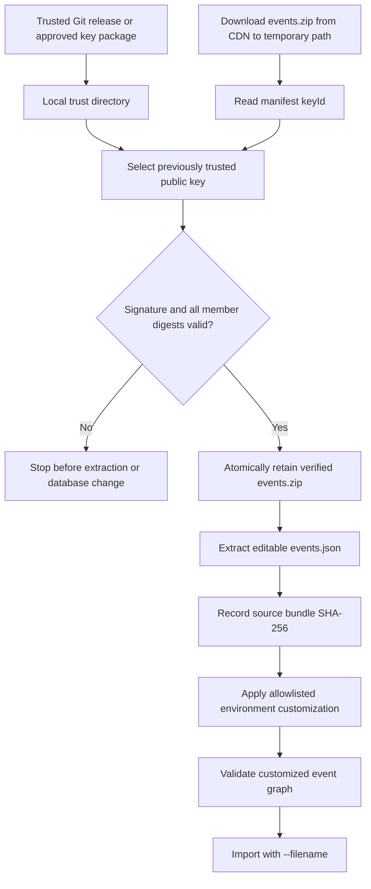
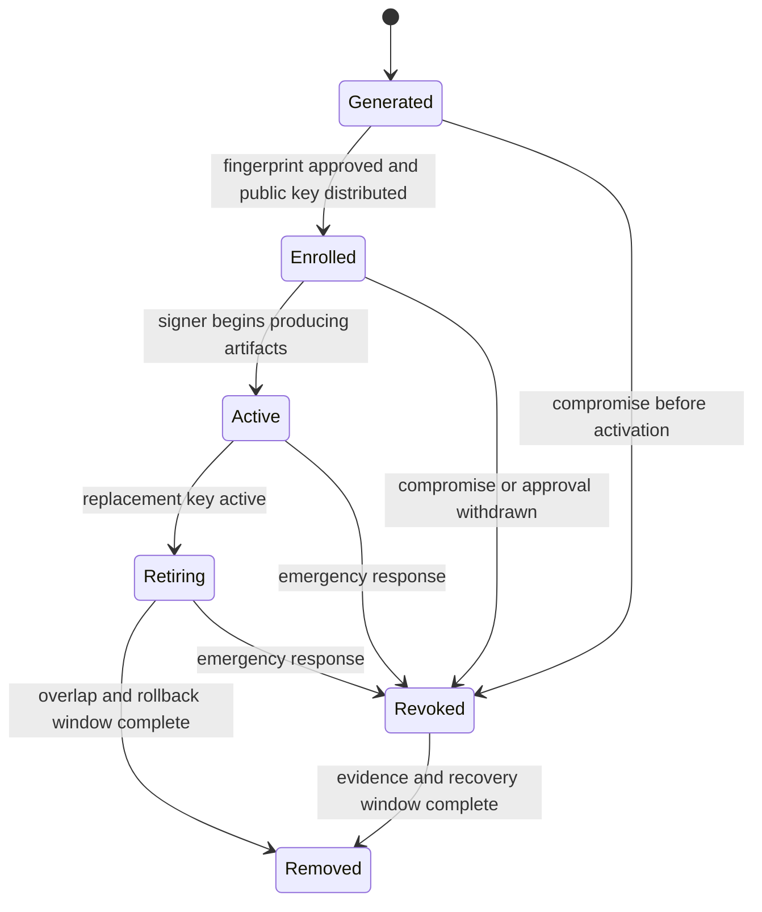

# Release Signing Key Management and Rotation

## Status

Normative design. Implementation is partial.

`portal-config-dev` currently verifies the signed environment bundle before
extracting its editable `events.json`. The other deployment repositories do
not yet implement every requirement in this document. The implementation
status table identifies those gaps explicitly.

This design consolidates the release-key rules previously embedded in
[Enterprise AI-Assisted Bootstrap and EKS Deployment](enterprise-ai-assisted-bootstrap-eks.md)
and the bundle signature contract in
[Composable Multi-Host Snapshot Export and Bootstrap](light-portal/composable-multi-host-snapshot-export.md).

## Problem

Light Portal release artifacts are consumed through several paths:

- `portal-config-loc` recreates disposable development databases;
- `portal-config-dev` prepares and imports the development baseline;
- `portal-config-bootstrap` installs a customer bootstrap environment; and
- `light-portal-install` provides a low-friction local evaluation stack.

Those consumers must agree on which release keys they trust, how a key arrives,
when a new key becomes active, how long the old key remains valid, and what to
do if a key is compromised. A public key copied ad hoc after an installation
failure is operationally fragile. Downloading the key beside the artifact it
verifies also fails to establish an independent root of trust.

The platform additionally has more than one signed-artifact domain. The
Ed25519 key used for `events.zip` is not automatically the same identity as the
key used for the optional PostgreSQL bootstrap archive manifest. Treating
unrelated keys as one unnamed "release key" makes rotation and revocation
ambiguous.

## Goals

- Establish explicit signing-key trust domains and ownership.
- Deliver public trust anchors independently of the artifacts they verify.
- Keep all private signing keys confined to approved release infrastructure.
- Make normal rotation non-disruptive through an intentional overlap period.
- Support emergency revocation without silently trusting a replacement key.
- Give every consumer the same fail-closed verification contract.
- Preserve an auditable release and key-rotation history.
- Keep local installation simple: public keys are configuration, not secrets.

## Non-Goals

- This design does not make an edited environment-specific `events.json`
  immutable or signed. The downloaded global bundle is verified before
  extraction; approved customization is recorded separately.
- This design does not define OAuth token-signing, TLS certificate, customer
  SSO, provider API-key, or workload-identity rotation.
- This design does not place release private keys in Portal, Config Server,
  Compose, a source repository, a container image, or a public object store.
- This design does not treat HTTPS from the CDN as artifact authenticity.
- This design does not require public keys to be stored in a secrets manager.

## Trust Domains

Each signed-artifact family has its own key namespace and lifecycle.

| Trust domain | Artifact | Current algorithm | Public-key location | Private-key owner |
|---|---|---|---|---|
| Environment event bundle | `events.zip` and `bundle-manifest.sig` | Ed25519 | `release-keys/<keyId>.pem` | Daily-release signing runner |
| Database bootstrap archive | Release `manifest.json`, `manifest.sig`, and `portal-bootstrap.dump` | Algorithm declared by the bootstrap release contract | `bootstrap/release-public.pem` or a future key-ID directory | Bootstrap-archive release runner |
| Future top-level release manifest | CDN archive digests and OCI image digests | To be selected by the release-manifest design | Dedicated release-manifest trust directory | Release orchestration service |

Keys from different trust domains must not be reused merely for convenience.
If a deliberate migration uses one cryptographic key in two domains, both
registries and release records must still name the domains independently so a
later revocation can be scoped correctly.

## Security Invariants

1. A private signing key exists only in approved release infrastructure.
2. A public trust anchor arrives through Git, an approved package, internal
   PKI, or another authenticated channel independent of the artifact download.
3. A consumer never automatically trusts a key fetched from the same CDN path
   as the artifact being verified.
4. The manifest `signature.keyId` selects an already trusted key. It never
   enrolls a new key.
5. Unknown, malformed, expired, or revoked key IDs fail closed.
6. Signature and member-digest verification completes before extraction,
   database deletion, database replacement, or import.
7. Key IDs are immutable and never reused for different public-key bytes.
8. Multiple public keys may be trusted during a bounded rotation overlap.
9. Removing an old key is a separate, later release from activating its
   replacement.
10. Environment customization occurs only after the immutable source bundle is
    verified. The customized JSON is imported with `--filename`, without an
    import-time signing requirement.

## Key Naming and Fingerprints

Environment-bundle key IDs must satisfy the importer's safe filename contract
and should encode purpose and activation period, for example:

```text
portal-release-2026-01
portal-release-2027-01
```

The trusted PEM path is:

```text
release-keys/<keyId>.pem
```

The authoritative fingerprint is SHA-256 over the DER-encoded SubjectPublicKeyInfo:

```bash
openssl pkey -pubin -in "release-keys/$key_id.pem" -outform DER | sha256sum
```

A key ID, fingerprint, algorithm, trust domain, activation release, retirement
release, and revocation status form one key record. A public key file without
that release record is not sufficient evidence of an approved rotation.

## Public-Key Delivery

For the public and developer distributions, the Git repository is the primary
trust-anchor delivery channel. The key is small, public, reviewable, and
available before the installer downloads `events.zip` from R2.

| Consumer | Required delivery | Runtime behavior |
|---|---|---|
| `portal-config-loc` | Commit approved event-bundle public keys under `release-keys/`. Permit `EVENT_BUNDLE_KEY_DIR` for controlled overrides. | Verify the signed bundle before bootstrap import. A missing key stops the import. |
| `portal-config-dev` | Commit approved keys for reproducibility. The authenticated SSH deploy path may stage the same key, but it must compare with the pinned fingerprint and fail on mismatch instead of silently replacing trust. | Verify and extract before customization. Record the source-bundle digest. |
| `portal-config-bootstrap` | Commit approved keys under `release-keys/` or provision them through the customer's approved configuration channel. | Verify the downloaded bundle before extraction or any destructive database action. |
| `light-portal-install` | Ship approved keys in the GitHub repository/archive used by the installer. | Verify `events.zip` before extracting the fallback `events.json`. Keep the database-bootstrap trust key separate. |

The CDN may publish public keys and fingerprints for inspection and disaster
recovery, but the normal runtime must not enroll those copies automatically.

## Verification and Customization Flow



The release signature authenticates the immutable bundle at the download
boundary. It does not claim that later environment-specific edits were signed
by the release service. Installation evidence must therefore record both the
verified source-bundle digest and the final customized JSON digest.

## Key Lifecycle



- **Generated**: The private key is created in approved release infrastructure;
  the public key and fingerprint are derived.
- **Enrolled**: Consumers trust the public key, but release artifacts are not
  yet signed with it.
- **Active**: The release signer uses the key ID for new artifacts.
- **Retiring**: A replacement key is active, while the old key remains trusted
  for rollback and previously published artifacts.
- **Revoked**: Consumers reject the key even if its PEM is still retained for
  audit evidence.
- **Removed**: Runtime distributions no longer include the key. Historical
  records retain its ID, fingerprint, and lifecycle dates.

## Normal Rotation Procedure

### 1. Generate and record

Generate the new private key on the approved release runner or HSM-backed
service. Derive its public key and SPKI fingerprint. Create a rotation record
containing:

- trust domain;
- old and new key IDs;
- old and new fingerprints;
- algorithm;
- approving change or release record;
- enrollment release;
- activation release;
- minimum overlap period;
- planned retirement and removal releases; and
- rollback owner.

### 2. Enroll before activation

Add the new public key alongside the old key in every consumer. CI must prove
that all required repositories contain identical bytes for the new key ID and
that no private key was committed. Release and deploy those consumers before
the signer changes.

### 3. Activate

Configure the release runner to sign new artifacts with the new key ID. Publish
one qualification bundle, verify it through every supported consumer, and
retain the immediately preceding old-key bundle for rollback.

### 4. Observe overlap

During overlap, consumers accept both key IDs. New releases use only the new
key. Monitor signature failures, unknown-key failures, stale installers, and
unexpected use of the old key.

### 5. Retire and remove

Mark the old key retiring after the rollback window. Remove it only after all
supported artifacts signed by it have expired or been withdrawn and all
supported consumers include the new key. Removal requires its own reviewed
change; it must not occur in the activation commit.

## Emergency Revocation

If a private key may be compromised:

1. Stop signing and publishing in the affected trust domain.
2. Record the last known-good artifact and the suspected exposure window.
3. Mark the key revoked in the release record and consumer trust metadata.
4. Distribute the replacement public key through the original independent
   enrollment channel. Do not authorize it solely with the compromised key.
5. Release consumer updates that reject the compromised key.
6. Re-sign and republish affected artifacts with new bundle IDs and immutable
   release identifiers.
7. Invalidate CDN caches or aliases that could continue serving compromised
   artifacts.
8. Re-qualify every clean-install and database-recreation path.
9. Preserve the revoked public key and incident evidence outside the active
   trust set for forensic use.

Availability does not override revocation. A consumer with only a revoked key
must stop with an actionable error instead of accepting an unsigned artifact
or downloading a replacement trust anchor from the artifact CDN.

## Rollback

During normal overlap, rollback means selecting the last qualified artifact
signed by either still-trusted key. It does not mean changing a manifest's
`keyId`, replacing the signature file, or re-enrolling an old removed key
without review.

If the new signer fails but is not compromised, the release owner may
temporarily resume signing with the retiring key during the documented overlap.
That action must be recorded. After the old key is removed or revoked, using it
again requires a new enrollment decision and is not an ordinary rollback.

## Release-Runner Key Custody

- Store private keys outside source trees and build artifacts.
- Grant signing access only to the bounded signing step, not the general build
  workspace.
- Prevent private-key bytes from appearing in logs, command traces, CI caches,
  container layers, or generated bundles.
- Back up private keys only through the approved encrypted recovery mechanism.
- Record who or what invoked each signing operation, the key ID, artifact
  digest, bundle ID, release ID, and timestamp.
- Require explicit approval for activation, rotation, revocation, recovery, or
  export of a private key.
- Derive public keys on the release runner and compare their fingerprints to
  the enrolled records before publication.

## Repository Responsibilities and Current Gaps

| Repository | Target responsibility | Current status |
|---|---|---|
| `event-importer` | Enforce signature, algorithm, key-ID filename safety, manifest canonicalization, and member digests. | Signed v2 bundle verification is implemented. Lifecycle metadata such as expiry and revocation is not yet a shared machine-readable contract. |
| `devops` | Protect private keys, derive public keys, sign artifacts, write release evidence, and prevent activation before consumer enrollment. | Environment-bundle signing and public-key derivation are implemented. Cross-repository enrollment and rotation gates are incomplete. |
| `portal-config-loc` | Ship the pinned public key and verify a clean-install bundle before removing preserved volumes. | Verification exists, but the repository does not currently track the release key and full deployment can remove volumes before bundle verification runs. |
| `portal-config-dev` | Verify before extraction, preserve the immutable bundle, and bind editable JSON to its source digest. | Implemented. The deploy path copies the key over SSH but does not enforce equality with a repository-pinned fingerprint. |
| `portal-config-bootstrap` | Verify before extraction and before database backup/replacement. | Not implemented; the current recreate path downloads and extracts directly. |
| `light-portal-install` | Verify the event bundle before fallback extraction/import and independently verify the optional database-bootstrap manifest. | Database-bootstrap signature support exists but its default public key is not shipped. Event-bundle fallback verification is not implemented. |
| `light-portal-doc` | Publish the trust, rotation, revocation, and operational evidence contract. | This document establishes the platform-wide contract. |

## Machine-Readable Trust Metadata

The current event importer discovers trusted keys from PEM filenames. A later
implementation phase should add a reviewed trust registry without changing the
manifest's `keyId` selection rule. A representative record is:

```json
{
  "schemaVersion": 1,
  "trustDomain": "environment-event-bundle",
  "keys": [
    {
      "keyId": "portal-release-2026-01",
      "algorithm": "Ed25519",
      "spkiSha256": "sha256:<hex>",
      "state": "ACTIVE",
      "enrollmentRelease": "<release-id>",
      "activationRelease": "<release-id>",
      "retirementRelease": null,
      "revocationTs": null
    }
  ]
}
```

Until the importer enforces this metadata directly, repository review and
release automation must enforce lifecycle state. A PEM file must never silently
override an explicit revocation record.

## Qualification Gates

Every key-management change must pass:

1. **Key material checks**: Every PEM parses as a public key; no private-key
   markers or private-key files are present.
2. **Fingerprint consistency**: The same key ID has identical SPKI bytes and
   fingerprint in every required consumer.
3. **Known-good verification**: Each consumer accepts a qualification bundle
   signed by every active key.
4. **Negative verification**: Each consumer rejects a tampered manifest,
   tampered member, missing key, unknown key ID, wrong algorithm, and invalid
   signature.
5. **Rotation overlap**: Both old and new keys verify their own bundles during
   the overlap; new releases name only the new key.
6. **Revocation**: A revoked key is rejected even if its PEM remains available
   for evidence.
7. **Ordering**: Verification failure occurs before extraction, customization,
   volume deletion, database replacement, or import.
8. **Clean-install coverage**: `portal-config-loc`,
   `portal-config-bootstrap`, and `light-portal-install` recreate an empty
   database from the qualified release. `portal-config-dev` prepares and
   recreates its baseline through the managed deploy path.
9. **Rollback coverage**: The last old-key artifact remains usable only during
   the documented overlap and is rejected after revocation or removal.

## Implementation Sequence

1. Commit the current event-bundle public key to the consumer repositories and
   add fingerprint-consistency tests.
2. Move `portal-config-loc` clean-deployment verification ahead of Compose
   `down -v`, so a missing key or invalid bundle preserves the existing
   database.
3. Port `portal-config-dev`'s verify-before-extract behavior to
   `portal-config-bootstrap`.
4. Make `light-portal-install` verify `events.zip` before fallback extraction
   and ship the independently approved database-bootstrap public key when that
   archive feature is enabled.
5. Change the dev deploy path from unconditional key replacement to pinned-key
   comparison and explicit enrollment.
6. Add machine-readable lifecycle metadata and importer enforcement for
   expired and revoked keys.
7. Add release-workflow gates that prevent signer activation until every
   supported consumer has enrolled the new public key.
8. Bind CDN archive checksums and OCI image digests through the future signed
   top-level release manifest.

## Operational Evidence

Retain the following for every activation, rotation, retirement, or revocation:

- trust domain and key ID;
- SPKI fingerprint and algorithm;
- approving change record;
- affected repository commits and released versions;
- signer activation configuration change;
- qualification bundle ID and digest;
- verification results for every consumer;
- overlap start and end;
- retirement, revocation, and removal timestamps;
- rollback decision and outcome, if used; and
- incident reference for emergency revocation.

This evidence contains no private-key material.
