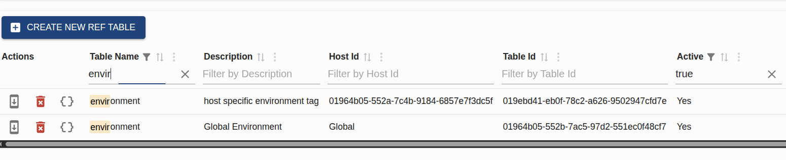

# Reference Table Admin

The Reference Table Admin page allows you to create and manage reference-data tables for your portal view. 

## Global vs. Host-Specific Tables

Reference tables can be defined at two levels:

1. **Global Reference Tables**: These are built-in or system-wide tables that have no specific `hostId` assigned (the Host ID column will display as "Global"). They provide a baseline set of reference data accessible to all hosts.
2. **Host-Specific Reference Tables**: These are tables created by and assigned to a specific host (displaying the host's ID in the Host ID column). They contain reference data that is isolated and only accessible to that particular host.

> [!TIP]
> **Expanding Global Tables:** You can define a host-specific reference table using the **exact same table name** as an existing global reference table. By doing this, you can expand or override the global reference table entries with your own host-specific values, tailoring the reference data to your host's needs without affecting other hosts.

## Usage in `Forms.json`

The primary consumer of reference tables in `portal-view` is the React Schema Form component, which dynamically renders dropdowns, radios, and multi-select fields based on `Forms.json`. 

In `portal-view/src/data/Forms.json`, fields that require dynamic reference data specify a URL pointing to the backend API.

Example of a standard dropdown:
```json
{
  "key": "user_type",
  "type": "select",
  "titleMap": {
    "url": "/r/data?name=user_type"
  }
}
```

Example of a cascading (dependent) dropdown using the `host` context and a parent field value:
```json
{
  "key": "province",
  "type": "select",
  "titleMap": {
    "url": "/r/data?name=province&host={0}&rela=country-province&from={1}"
  }
}
```

## The `/r/data` API

The `/r/data` endpoint is exposed by the `portal-service` (specifically in `apps/portal-service`) to serve reference data securely and efficiently to the frontend.

It accepts several important query parameters to shape the response:

- **`name`**: The `tableName` of the reference table you want to fetch (e.g., `country`, `user_type`).
- **`host`**: The `hostId` of the current user's workspace. Passing this parameter ensures that any host-specific reference values (overrides/expansions) are merged seamlessly with the global values.
- **`rela`**: The ID of a relationship mapping (Reference Relation). This is used for dependent datasets (e.g., `country-province`).
- **`from`**: The actual selected value of the parent field in the relationship (e.g., if `country` was set to `US`, `from=US` would fetch only provinces belonging to the US).

The `portal-service` securely resolves these requests, fetches the necessary values from the underlying `ref-query` service, evaluates relationships, and returns a key-value map compatible with `react-schema-form`'s `titleMap` or `dynaselect`.

## Example: Global vs. Host-Specific Expansion (`createInstance` form)

A perfect example of how global and host-specific tables interact is found in the **Create Instance** form, specifically between the `environment` and `envTag` fields.

### 1. The Global Field (`environment`)
The `environment` field is designed to ONLY show the standard global environments. It does not pass the `host` parameter to the API.

```json
{
  "key": "environment",
  "type": "dynaselect",
  "multiple": false,
  "action": {
    "url": "/r/data?name=environment"
  }
}
```

### 2. The Expanded Field (`envTag`)
The `envTag` field allows you to select a specific environment tag. This field passes the `hostId` to the API, meaning the resulting dropdown will **combine** the global environments WITH any host-specific environment tags you have defined.

```json
{
  "key": "envTag",
  "type": "dynaselect",
  "multiple": false,
  "action": {
    "url": "/r/data?name=environment&host={0}",
    "params": [
      "hostId"
    ]
  }
}
```

### Viewing Both Tables

To see both the global and your host-specific reference tables in action:
1. Go to the **Reference Table Admin** page.
2. In the column filters, type `environment` under the **Table Name** column.
3. You will see two results:
   - One row with an empty (or "Global") Host ID. This is the global table.
   - One row with your specific Host ID. This is where you can add custom tags that will only appear in your `envTag` dropdown.


