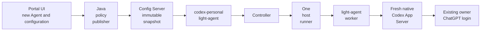

# Create codex-personal locally

This tutorial creates a **new** `codex-personal` Agent through the Portal UI and
prepares it for a personal-subscription Codex worker in
`portal-config-loc/all-in-lt`. It uses the existing local Host, PostgreSQL,
Controller, Config Server, and qualified native Codex installation.

**Status checked September 5, 2026:** Agent registration, configuration editing,
policy preview/publication, and typed coding implementation requests are available
in Portal View. The Java publisher accepts coding profiles. Use the updated
`portal-view` frontend as well as the rebuilt Java services; reload the browser
once your frontend development server or deployment serves the updated bundle.

The native runner compatibility fix has been tested, rebuilt, installed, and
registered locally. Its generated admission and live backend now include
`personal-subscription-auth-v1`, and preparation reports `codingSchedulable: true`.
This feature is advertised only when native worker credential configuration is
present and no enterprise broker or sandbox launcher is configured. Keep the
feature checks below: stale binaries or admission can still prevent placement.
The new Agent and its first real coding turn remain steps for you to perform;
this tutorial does not claim they have already passed.

## What you will create

| Item | Value |
| --- | --- |
| Portal Host | `dev.lightapi.net` |
| Host ID | `01964b05-552a-7c4b-9184-6857e7f3dc5f` |
| API ID and name | `codex-personal` |
| API version / type | `1.0.0` / Agent (`agt`) |
| Service ID | `com.networknt.agent.codex-personal-1.0.0` |
| Environment / Env Tag | `dev` / `dev` |
| Runtime instance name | `codex-personal-local` |
| Runtime product | current active `agt` product version |
| Compose service/container | `light-agent-codex-personal` |
| Local Agent endpoint | `http://127.0.0.1:8089` |
| Coding adapter / native version | `codex-app-server-v1` / qualified `0.153.4` |
| Authentication profile | `personal-subscription` |
| Authoring module / property | `agent-policy-authoring` / `codingProfile` |
| Generated runtime property | `agent.agentPolicy.execution.codingProfile` in `values.yml` |

The new API version UUID is also its Agent Definition UUID. The runtime
Instance UUID is a **different**, newly created identifier. Never substitute
the account Agent's UUIDs. Runtime configuration is selected by
`(host, serviceId, envTag)`; the Instance UUID proves the Portal association.



Codex is a child process launched for an execution. This introductory request
omits thread control and therefore uses a fresh ephemeral thread. Workflow coding
jobs can explicitly create, resume, and close stage-scoped threads; a new process
can resume a persisted conversation. It does not attach to the Codex
CLI session used to read this tutorial. Personal model traffic uses the native
login; an ordinary Agent chat request is a separate gateway-backed path.

## 1. Check the installation before creating records

Use `/home/steve/workspace` as the workspace root throughout. The Java Portal
services must contain the coding-profile publisher change. A Java rebuild does
not update the Rust Agent, runner, or worker.

```bash
cd /home/steve/workspace
export CODEX_TUTORIAL_RUNTIME="$PWD/portal-config-loc/all-in-lt/light-workflow-runner-personal/.runtime/codex-personal"
export CODEX_TUTORIAL_EXAMPLES="$PWD/light-portal-doc/src/tutorial/light-agent/examples"
umask 077
mkdir -p "$CODEX_TUTORIAL_RUNTIME"
chmod 700 "$CODEX_TUTORIAL_RUNTIME"
docker compose -f portal-config-loc/all-in-lt/docker-compose.yml ps
docker inspect light-agent --format '{{.Config.Image}}'
systemctl --user status light-workflow-runner-personal --no-pager
curl -fsS http://127.0.0.1:9444/readyz
```

The account Agent was still running image
`networknt/light-agent:2.3.5-dev.20260903.1403` when this tutorial was checked.
Build a separate local Agent image from the source containing the qualified
0.153.4 contract; leave the existing account/advisor/support images alone:

```bash
cd /home/steve/workspace/light-fabric
./apps/light-agent/build.sh codex-personal-local --local --skip-latest
cd /home/steve/workspace
docker image inspect networknt/light-agent:codex-personal-local --format '{{.Id}}'
```

The helper below checks the installed worker, native executable, template, and
qualification evidence against `light-fabric` source. It fails on version/hash
mismatches; do not change the expected hashes to make an unqualified binary pass.

Run the independent native smoke before touching enrollment. Keep unrelated
LLM traffic quiet while it checks the audit row count:

```bash
LIGHT_CODEX_NATIVE_EXECUTABLE="$PWD/portal-config-loc/all-in-lt/light-workflow-runner-personal/.runtime/codex-0.153.4/bin/codex" \
LIGHT_CODEX_SMOKE_MODEL=gpt-6-astra \
  ./portal-config-loc/all-in-lt/light-workflow-runner-personal/run-smoke.sh
stat -c '%a %n' "$HOME/.codex"
```

Expected: `Pinned Codex App Server personal-subscription turn passed without
llm-gateway routing.` The credential directory must be owner-only (`700`).
This proves the native path, not Portal scheduling. For worker turns the
personal adapter uses native Codex's configured default model; confirm
`model = "gpt-6-astra"` in the owner's Codex configuration if that is the model
you want. `LIGHT_CODEX_SMOKE_MODEL` selects the smoke's model, not the runner's.

Use the existing **Host Admin → Operational Storage** registration for
`dev.lightapi.net`: database `operations`, server `postgres`, and its configured
credential-file path. It must be active. This tutorial does not create another
database or replace that Host-wide binding. See
[Operational Storage](../../help/portal-view/pages/operational-storage.md).

## 2. Create the new Agent through Task Center

Sign into your local Portal UI, select `dev.lightapi.net`, open **Task Center**,
and choose **Register AI Agent** (`/app/tasks/register-ai-agent`). Use an account
with the required API, instance, configuration, OAuth, and publication permissions.
Wait for each command's record to appear on the query side before continuing.

### Create or select API

Choose **Create new API → Continue to Create API**.

| Field | Enter |
| --- | --- |
| Api Id | `codex-personal` |
| Api Name | `codex-personal` |
| Api Desc | `Local single-user Codex coding agent` |
| Api Status | the local development status from the dropdown |
| Owners | your local Portal user/position, as required by your Host |

Save and return to the task. Reuse this new record if you resume a partially
completed tutorial; do not create another API with the same ID.

### Create agent API version

| Field | Enter |
| --- | --- |
| Api Version | `1.0.0` |
| Api Type | Agent (`agt`) |
| Service Id | `com.networknt.agent.codex-personal-1.0.0` |
| Env Tag | `dev` |
| Protocol | `http` for the local native Agent listener |
| Target Host | `light-agent-codex-personal` |

No MCP transport or OpenAPI specification is needed for this Agent version.
Record the returned **API Version ID**. The task carries it into the profile.

### Configure agent profile

Select **Model Alias**, then the existing active `assistant-dev` alias used by
the local Agent demo. If that alias is unavailable, select another authorized,
active local public alias and record its name. Use temperature `0.7` and Max
Tokens `4096` for this small smoke. Leave legacy provider/model/key fields unset.

The current publisher resolves an active **alias** row; use the alias branch
for this tutorial rather than the model-policy-only branch. This top-level
Agent alias is separate from the coding profile's `coding-implementer` and
`coding-reviewer` role aliases. It does not send ChatGPT credentials to a gateway.

Verify **API Version ID = Agent Definition ID**. Skip **Assign skills** and
**Review tools** for this first test. They are not how the built-in typed coding
profile is enabled. Review **Configure access** for your user; keep the new
endpoint private to the local test rather than publishing a public Gateway/A2A
route.

### Choose runtime deployment

Choose **Create new Agent runtime → Continue to Create Agent Runtime**.

| Field | Enter |
| --- | --- |
| Instance Name | `codex-personal-local` |
| Product Version | preselected current `agt` version; locked by the task |
| Service Id | prefilled new service ID; locked by the task |
| Environment | `dev` |
| Env Tag | `dev` |
| Current | checked |
| Readonly | unchecked |

Save, return to the task, and complete the linking step. Verify the new instance
has exactly one active **Instance API** association, pointing to your new Agent
API version. Do not attach it to the account runtime.

Record these IDs in your notes:

```text
API ID: codex-personal
API version ID = Agent definition ID: <new UUID>
Runtime instance ID: <different new UUID>
Product version ID: <current agt UUID>
Instance API ID: <new association UUID>
```

The task's **Complete Task** action finishes registration, not policy activation
or container deployment. Retain the IDs before clearing the task context.

## 3. Create a service credential in the UI

From **Instance Admin**, find `codex-personal-local` and use its OAuth client
creation action (the route is `/app/form/createClient`, prefilled with the
Instance ID). Bind the client to this **instance only**; leave App ID and API
Version ID empty.

Use the existing local OAuth provider, client name `codex-personal-local`,
client type `confidential`, profile `service`, and scopes:

```text
portal.r portal.w execution.invoke
```

For this dedicated single-user test, use the local provider's supported custom
claims to bind the token to your Portal user, for example
`{"uid":"<your actual Portal user UUID>","uty":"F"}`. Obtain your real user
ID from User Admin. The coding session needs a user/principal identity present
in the local operational projections. Do not copy an unrelated user's identity.

Keep the returned client ID and secret privately. On its OAuth client row,
choose the token creation action, supply the client secret, and save the
returned long-lived JWT. The client/instance association supplies the new
service ID; changing the name of an account token does not change its authority.

Paste the raw JWT, without `Bearer `, into this owner-only file using your editor:

```text
$CODEX_TUTORIAL_RUNTIME/service.jwt
```

```bash
chmod 600 "$CODEX_TUTORIAL_RUNTIME/service.jwt"
```

Decode claims locally without printing the token or signing material. This is
an inspection, not cryptographic verification; the services verify signatures:

```bash
python3 - <<'PY'
import base64, json, os, pathlib, time
p = pathlib.Path(os.environ['CODEX_TUTORIAL_RUNTIME']) / 'service.jwt'
t = p.read_text().strip()
c = json.loads(base64.urlsafe_b64decode(t.split('.')[1] + '=='))
assert c['host'] == '01964b05-552a-7c4b-9184-6857e7f3dc5f'
assert c['sid'] == 'com.networknt.agent.codex-personal-1.0.0'
s = c.get('scp', c.get('scope', []))
s = s.split() if isinstance(s, str) else s
assert {'portal.r', 'portal.w', 'execution.invoke'} <= set(s)
assert c['exp'] > time.time()
assert c.get('uid'), 'Confirm the local single-user token carries your user identity'
print({k:c.get(k) for k in ['host', 'sid', 'uid', 'aud', 'exp']})
PY
```

If the provider does not emit the expected claims/scopes, fix the client and
reissue its token through the UI. Do not edit the JWT or copy the account Agent's
token. Keep this runtime token out of the coding profile, Git, and screenshots.

## 4. Generate the exact profile and deployment files

The [preparation helper](examples/prepare-codex-personal.py) creates files only.
It does not publish, deploy, modify the current runner, or issue credentials.
Run it with your **new runtime Instance ID**:

```bash
cd /home/steve/workspace
python3 "$CODEX_TUTORIAL_EXAMPLES/prepare-codex-personal.py" \
  --instance-id '<new runtime Instance UUID>' \
  --agent-image networknt/light-agent:codex-personal-local
```

Generated under `$CODEX_TUTORIAL_RUNTIME`:

| File | Purpose |
| --- | --- |
| `coding-profile.json` | complete JSON to paste into the instance authoring property |
| `runner.yml` | same enrolled runner identity, new Agent origin, separate journal directory |
| `admission.json` | generated by the exact installed runner executable |
| `compose.yml` | new loopback Agent service plus Controller admission override |
| `preflight.json` | feature comparison and version evidence |
| `repositories/` | owner-local immutable bundle spool |

`productProfileDigest` is derived from the new Host/Instance/service/Env Tag
identity, exactly as the Java compiler derives it. A random SHA-256 value or
the account Agent's digest will fail turn-policy authorization. The contract
digest binds the exact template, compatibility, capability, executable, and
qualification fields. For this native profile, `imageDigest` records the exact
native worker binary artifact; it is not the Agent container's image ID and
does not claim a worker-container isolation boundary.

The contract executable remains `/usr/local/bin/codex`. The runner's
`agentWorker.codexExecutable` points to the actual pinned host executable.
These two fields have different purposes; do not replace the contract path
with your npm launcher path.

Inspect `preflight.json`. With the rebuilt local runner, expect:

```json
{
  "missingRunnerFeatures": [],
  "codingSchedulable": true
}
```

**Gate:** do not dispatch if any required feature is missing. The runner's
`admitted_backend_capability` builder supplies both generated admission and live
registration. If you still see `personal-subscription-auth-v1` missing, install
the updated `light-workflow-runner` binary, regenerate admission with that exact
binary, recreate Controller with the new mount, and restart the runner. Rerun
preparation after installing it. Do not remove the Agent requirement or edit
admission/preflight flags to bypass the check.

The helper reuses the existing runner JWT. Its subject, audience, Host, runner
ID, enrollment ID, scope, and expiration must still match. The current token
was issued for 30 days. If it has expired, renew enrollment first. The existing
`configure-local.py` is account-specific: running it again restores the account
origin, so rerun this tutorial's preparation afterward and inspect the result.

## 5. Author the coding profile in the UI

Open **Configuration Admin** (`/app/config/configAdmin`). Search first to avoid
duplicate catalog entries. If missing, create:

| Configuration field | Value |
| --- | --- |
| Config Name | `agent-policy-authoring` |
| Config Phase | Runtime (`R`) |
| Config Type | Module |
| Description | `Portal-only authoring inputs for Agent policy publication` |

Open that configuration's **Properties** action and create:

| Property field | Value |
| --- | --- |
| Property Name | `codingProfile` |
| Property Type | `Config` |
| Value Type | `map` |
| Resource Type | `none` |
| Property Value | `{}` |
| Required | false |
| Display Order | `1` |

Use a Light4j Version supported by the current local `agt` catalog if the form
requires it. The config/property catalog is shared; adding this optional empty
property does not enable coding on every Agent.

In **Product Admin**, open the selected `agt` product version's configuration
and property assignments (`/app/product/config` and `/app/product/property`).
Assign the new module and its `codingProfile` property to that exact product
version. Verify the assignment appears as active. Merely creating a catalog
property is insufficient.

From **Instance Admin → codex-personal-local → Config Properties**
(`/app/config/configInstance`), create or update the instance property for
`agent-policy-authoring / codingProfile`. Paste the **complete contents** of
`$CODEX_TUTORIAL_RUNTIME/coding-profile.json` as its JSON map value. Save and
verify the property is active at **instance scope**.

Do not put the value in the catalog default, product defaults, Instance API
properties, or an `agentPolicyAuthoring` section inside `agent.yml`. Do not
manually write `agentPolicy.execution.codingProfile`: the publisher owns that
output. The separate module avoids introducing unknown fields into the strict
Agent runtime configuration.

The instance property must contain `authenticationProfile: personal-subscription`,
`enterpriseGateway: null`, all 13 qualification dimensions, and the generated
contract digest. It contains no login credentials. The `requiredFeatures` array
is not a way to override what the runner can actually execute.

## 6. Preview and publish through the UI

Open **Instance Admin** and locate the new `codex-personal` runtime instance.
Click its **Publish Agent policy** action. The action is available for active,
current Agent instances you can modify. If it is absent, verify that the updated
Portal View frontend is loaded and that the instance product is `agt`.

Select **Local demo** for this local installation. The dialog defaults to
**Bounded**; `LOCAL_DEMO` is an explicit local choice, not a production lease.
Wait for the preview, then review:

- Status is `READY_TO_PUBLISH`; `ERROR` includes the validation problem.
- `serviceId`, `hostId`, and `instanceId` identify your new Agent.
- `agentPolicy.execution.codingProfile` is populated.
- Its `productProfileDigest` equals
  `agentPolicy.policySnapshot.productProfileDigest`.
- `propertyWrites` contains one `agentPolicy.execution.codingProfile` map write,
  with no expanded `codingProfile.*` leaf properties.
- `candidateDigest`, `contentDigest`, `policyDigest`, and `policySnapshotId` are
  present. Save these non-secret identifiers for verification.

Check **I reviewed this policy and its property writes**, then click
**Publish and activate**. Expect an active publication and snapshot ID. Click
**Refresh preview** and expect `CURRENT` (allow the normal event projection to
finish before retrying the read).

The UI uses the authenticated Portal API with the selected candidate digest;
it does not submit edited property writes. The server recomputes the candidate
and rejects stale previews. On `source changed after preview`, click
**Refresh preview**, review again, and check the review box again. Errors and
uncertain publication outcomes discard the old preview.

Open the new instance's **Config Snapshots** page and inspect the current
snapshot. Confirm its ID and populated coding profile. Publication creates and
activates the complete snapshot through the normal event path. Start or reload
the Agent with that snapshot in the next step.

## 7. Start the separate local Agent and switch the personal runner

This tutorial reuses the **one existing runner enrollment** and owner Codex
login, rather than running two same-user workers concurrently. Stop the old
runner first; its account-oriented configuration remains saved for rollback.

```bash
systemctl --user stop light-workflow-runner-personal
cd /home/steve/workspace/portal-config-loc/all-in-lt
docker compose -f docker-compose.yml \
  -f "$CODEX_TUTORIAL_RUNTIME/compose.yml" config --quiet
```

Review the generated overlay in your editor. The new Agent listens only on
`127.0.0.1:8089`, uses the new service identity and `service.jwt`, and mounts the
existing Agent operational secret volume. It starts no worker container and
mounts no Codex login directory into the Agent container. The runner alone
reads the owner Codex directory and the repository spool.

The Controller override mounts the new generated admission at
`/run/runner-admission.json` and enables runner admission. Applying it recreates
the Controller, briefly interrupting its connections:

```bash
docker compose -f docker-compose.yml \
  -f "$CODEX_TUTORIAL_RUNTIME/compose.yml" \
  up -d --no-deps --force-recreate controller
docker compose -f docker-compose.yml \
  -f "$CODEX_TUTORIAL_RUNTIME/compose.yml" \
  up -d --no-deps light-agent-codex-personal
```

In a separate terminal, start the host runner in the foreground:

```bash
cd /home/steve/workspace
export CODEX_TUTORIAL_RUNTIME="$PWD/portal-config-loc/all-in-lt/light-workflow-runner-personal/.runtime/codex-personal"
SSL_CERT_FILE="$PWD/portal-config-loc/all-in-lt/light-controller-rust/ca.pem" \
LIGHT_WORKFLOW_RUNNER_CONFIG_FILE="$CODEX_TUTORIAL_RUNTIME/runner.yml" \
  ./portal-config-loc/all-in-lt/light-workflow-runner-personal/.runtime/light-workflow-runner
```

Keep this terminal open. `SSL_CERT_FILE` supplies controller CA trust; an
unimplemented `controllerTlsCaFile` YAML key does not. The runner connects to
`wss://localhost:8438/ws/runner`, with hostname verification. Its admission
Agent origin must be `com.networknt.agent.codex-personal-1.0.0`.
`print-admission`'s second positional argument is the **workflow** origin, not
the Agent origin.

Do not run the old personal runner's `start.sh` during this tutorial: it
reapplies the account-oriented overlay and restarts its user service. After a
baseline deployment, reapply this tutorial's overlay explicitly. A bare base
Compose deployment can remove controller enrollment settings.

## 8. Verify publication, configuration, and enrollment separately

```bash
curl -fsS http://127.0.0.1:8089/health
curl -fsS http://127.0.0.1:9444/readyz
docker logs --since=5m light-agent-codex-personal
docker logs --since=5m controller
```

Expected: Agent `ok`, runner `{"ready":true}`, registration accepted, and no
repeated TLS/authentication or execution-result transport failures. The Agent
must not report an unsupported pinned Codex contract or content digest mismatch.

Copy the loaded Config Server values from the **new** container into the
private tutorial directory, then inspect only the relevant non-secret fields:

```bash
docker cp light-agent-codex-personal:/app/config-cache/values.yml \
  "$CODEX_TUTORIAL_RUNTIME/loaded-values.yml"
python3 - <<'PY'
import json, os, pathlib, yaml
p = pathlib.Path(os.environ['CODEX_TUTORIAL_RUNTIME'])
v = yaml.safe_load((p / 'loaded-values.yml').read_text())
for k in ['agent.runtimePolicy.serviceId', 'agent.runtimePolicy.publicationId',
          'agent.runtimePolicy.policySnapshotId', 'agent.runtimePolicy.contentDigest',
          'agent.portalAssociation.runtimeInstanceId']:
    print(k, v.get(k))
c = v['agent.agentPolicy.execution.codingProfile']
c = json.loads(c) if isinstance(c, str) else c
c.setdefault('enterpriseGateway', None)
assert c == json.loads((p / 'coding-profile.json').read_text())
assert c['productProfileDigest'] == v['agent.agentPolicy.policySnapshot.productProfileDigest']
print('Loaded coding profile matches authored profile')
PY
```

Compare these IDs/digests with the publication preview. If the cache file is
absent, inspect startup failure; do not manufacture the file. A successful
health response alone is not proof that the intended profile was loaded.

Read the enrolled backend capabilities from the operational database. First
locate the execution schema rather than assuming an obsolete database layout:

```bash
docker exec postgres psql -U postgres -d operations -c \
  "SELECT table_schema,table_name FROM information_schema.tables WHERE table_name IN ('runner_session_t','runner_backend_t','runner_scheduling_request_t','execution_attempt_t');"
```

The checked local schema is `execution_ops`. In the returned schema, inspect
`runner_session_t` and `runner_backend_t` for
`personal-codex-runner`: current connection generation, healthy backend, one
available slot, matching compatibility digest and supported features. Use
`\d <schema>.runner_backend_t` to inspect the current columns before querying.
Compare the live backend to the generated admission; a cached or rejected
registration must not count as success.

**Gate:** all required features must be present, including
`personal-subscription-auth-v1`. A green `/readyz` does not override this gate.
The rebuilt local runner passed this comparison. Verify it again after switching
to the new Agent origin and admission in this tutorial.

## 9. Submit one small coding turn after the runner gate passes

Use a disposable, tiny repository first. The worker reconstructs it from an
immutable Git bundle and returns a patch; it does not edit your workspace
checkout directly. Run once in a new test directory:

```bash
cd /home/steve/workspace
mkdir -p "$CODEX_TUTORIAL_RUNTIME/smoke-source"
git -C "$CODEX_TUTORIAL_RUNTIME/smoke-source" init --initial-branch=main
printf '# Codex personal smoke\n' > "$CODEX_TUTORIAL_RUNTIME/smoke-source/README.md"
git -C "$CODEX_TUTORIAL_RUNTIME/smoke-source" add README.md
git -C "$CODEX_TUTORIAL_RUNTIME/smoke-source" \
  -c user.name='Local smoke' -c user.email='smoke@example.invalid' \
  commit -m 'Initial smoke input'
git -C "$CODEX_TUTORIAL_RUNTIME/smoke-source" bundle create \
  "$CODEX_TUTORIAL_RUNTIME/repositories/smoke.bundle" --all
git -C "$CODEX_TUTORIAL_RUNTIME/smoke-source" bundle verify \
  "$CODEX_TUTORIAL_RUNTIME/repositories/smoke.bundle"
chmod 400 "$CODEX_TUTORIAL_RUNTIME/repositories/smoke.bundle"
```

The bundle URI is a **host-runner-local** path under the published spool prefix.
Its SHA-256 and size must describe the actual bundle bytes, not the repository
directory or commit hash. `baseRevision` is the full Git commit hash.
`workspaceRoot` remains the logical worker path `/workspace/repository`.

Build and inspect the typed request without sending it:

```bash
python3 "$CODEX_TUTORIAL_EXAMPLES/coding-smoke.py" \
  --runtime "$CODEX_TUTORIAL_RUNTIME" \
  --repository "$CODEX_TUTORIAL_RUNTIME/smoke-source"
```

Inspect `coding-request.json`. It uses `profile: coding`, a typed `coding`
object, `role: implement`, the exact immutable bundle, and the supported tool
set `fs.read`, `fs.write`, `process.exec`. It requests one README change, at most
one changed file and 64 KiB of patch output. A request containing only `text`
selects the ordinary Agent model loop instead.

Keep unrelated gateway traffic quiet and record the audit count before sending:

```bash
docker exec postgres psql -U postgres -d llm_audit -Atc \
  'SELECT count(*) FROM llm_audit_event_t;' > "$CODEX_TUTORIAL_RUNTIME/audit-before.txt"
```

In **Instance Admin**, click **Open Agent chat** on the new runtime instance.
Alternatively, open **GenAI Chat** and enter
`com.networknt.agent.codex-personal-1.0.0` as **Agent**, with **Env Tag** `dev`.
Keep the same signed-in Portal user and selected Host used for authoring.

1. Select **Coding implementation** under **Turn type**.
2. Click **Import coding request JSON** and select the generated
   `$CODEX_TUTORIAL_RUNTIME/coding-request.json`. This fills the prompt, bundle
   URI, digest, byte size, base commit, workspace root, and output limits.
3. Review the values. The form uses the supported implementation role and fixed
   tool set; worker/model/authentication authority comes from the published policy.
4. Click **Connect**. Expect `Session initialized: …` before sending. The browser
   uses the existing authenticated Gateway WebSocket with session cookies and
   CSRF protection; do not paste the service JWT into the browser.
5. Send the prompt once. Expect **Accepted request** with its request ID.
6. Click **Download acceptance** and save the file as
   `$CODEX_TUTORIAL_RUNTIME/accepted.json` for the next step. If the browser uses
   its Downloads directory, move that specific downloaded file to this path.

**Acceptance is not completion.** The WebSocket does not currently return the
reconciled patch as a final chat message. Use the durable verification below.
If connection fails, verify the new Agent's Controller registration, selected
service/Env Tag, and your Portal session before retrying.

### Optional terminal transport check

The terminal helper remains available for diagnosing the direct loopback Agent
WebSocket independently of browser/Gateway routing. Use it instead of the UI for
a separate test, not as a second send of the same verification turn:

```bash
python3 -m venv "$CODEX_TUTORIAL_RUNTIME/client-venv"
"$CODEX_TUTORIAL_RUNTIME/client-venv/bin/pip" install websocket-client
"$CODEX_TUTORIAL_RUNTIME/client-venv/bin/python" \
  "$CODEX_TUTORIAL_EXAMPLES/coding-smoke.py" \
  --runtime "$CODEX_TUTORIAL_RUNTIME" \
  --repository "$CODEX_TUTORIAL_RUNTIME/smoke-source" --send
```

This client reads the private service credential, refuses missing-feature
preflight, and saves `accepted.json`. It does not qualify the browser route.

## 10. Verify the terminal result and patch

After the worker finishes, query the new session only. This is a read-only
operator check, not a database mutation:

```bash
python3 - <<'PY'
import json, os, pathlib, subprocess, uuid
p = pathlib.Path(os.environ['CODEX_TUTORIAL_RUNTIME'])
a = json.loads((p / 'accepted.json').read_text())
session = str(uuid.UUID(a['sessionId']))
sql = f"""SELECT row_to_json(r) FROM (
 SELECT turn_id,state,scheduling_request_id,execution_attempt_id,
        terminal_result,terminal_error
 FROM agent_ops.agent_turn_t
 WHERE host_id='01964b05-552a-7c4b-9184-6857e7f3dc5f'
   AND session_id='{session}' ORDER BY turn_sequence DESC LIMIT 1) r"""
raw = subprocess.check_output(['docker','exec','postgres','psql','-U','postgres',
                              '-d','operations','-Atc',sql], text=True).strip()
if not raw: raise SystemExit('No durable turn found for the accepted session')
r = json.loads(raw)
(p / 'terminal-result.json').write_text(json.dumps(r, indent=2) + '\n')
print({k:r[k] for k in ['turn_id','state','scheduling_request_id','execution_attempt_id']})
if r['state'] != 'COMPLETED':
    raise SystemExit('Not completed; inspect terminal-result.json and runner/Controller logs')
def find_patch(v):
    if isinstance(v, dict):
        if 'codingPatch' in v: return v['codingPatch']
        for x in v.values():
            found = find_patch(x)
            if found is not None: return found
    if isinstance(v, list):
        for x in v:
            found = find_patch(x)
            if found is not None: return found
patch = find_patch(r['terminal_result'])
if not patch: raise SystemExit('Completed without expected coding patch evidence')
(p / 'result.patch').write_text(patch['patch'])
print('Canonical patch saved; inspect base revision, digest, changed paths, and validation evidence')
PY

git -C "$CODEX_TUTORIAL_RUNTIME/smoke-source" diff --exit-code
git -C "$CODEX_TUTORIAL_RUNTIME/smoke-source" apply --check \
  "$CODEX_TUTORIAL_RUNTIME/result.patch"
docker exec postgres psql -U postgres -d llm_audit -Atc \
  'SELECT count(*) FROM llm_audit_event_t;' > "$CODEX_TUTORIAL_RUNTIME/audit-after.txt"
diff "$CODEX_TUTORIAL_RUNTIME/audit-before.txt" "$CODEX_TUTORIAL_RUNTIME/audit-after.txt"
```

If the state is still `WAITING_RECONCILIATION`, wait briefly and rerun the
read-only check. A terminal `FAILED`, `CANCELLED`, or `UNKNOWN` is a failed test,
not permission to rewrite the state. The local coding deadline is bounded; do
not repeatedly submit new turns to diagnose one stuck request.

Inspect `terminal-result.json` and `result.patch` in your editor. Success means:

- the durable turn is `COMPLETED`, with scheduling and execution IDs;
- the normalized execution result is `SUCCEEDED`;
- worker evidence identifies `codex-app-server-v1`, the qualified version, and
  personal authentication;
- `codingPatch` changes only `README.md`, from the admitted base revision;
- `codingImplementation` binds the repository, contract and patch digests and
  includes observed validation evidence;
- the original checkout stayed clean, and `git apply --check` accepts the patch;
- no LLM gateway audit rows were added during the quiet test window;
- the runner returns to available capacity with no stale running lease.

No patch is applied or committed by these verification commands. Review the
artifact before deciding to apply it. A separate independent `role: review`
turn requires the implementation artifact and a typed `reviewInput`; an
implementer saying it reviewed its own work is not independent review. The
first tutorial qualifies one implementation turn, not the full review,
remediation, PR, or deployment lifecycle.

## Failure guide

| Symptom | Check |
| --- | --- |
| API version absent in the next task step | query-side projection/Notifications; avoid duplicate creates |
| No active Agent publication source | exact instance link, active `agt` product/version, active Agent definition and selected public alias |
| Missing projected property assignment | assign the named existing `agent` catalog property to the selected product version; do not invent a differently named property |
| Coding profile stays `{}` | input must be instance-scoped `agent-policy-authoring / codingProfile` with an active product assignment |
| Qualification or digest mismatch | regenerate from the exact installed binaries and reviewed source; do not change expected pins |
| Turn policy does not authorize coding | profile's `productProfileDigest` must equal the new instance policy's digest |
| Agent startup fails on operational storage | Host registration, schema generations, Agent secret volume and the configured credential-file path |
| `/chat` returns 401/403 | signature, expiry, Host, exact new `sid`, user identity and caller access; a browser session cookie is not an Agent bearer token |
| Session fails to initialize | user identity projections, operational schema and session limits; inspect Agent logs |
| Runner ready but no eligible backend | full requirements/features, especially `personal-subscription-auth-v1`, compatibility digest, healthy slots |
| Runner enrollment rejected | exact runner/config/allowlist digests, JWT claims, old runner stopped, current admission mounted |
| Repository cannot be staged | runner-local URI, real regular bundle file, correct size/hash, spool prefix and readable permissions |
| Worker cannot use Codex | exact executable/hash, owner login directory, single-user concurrency and native account status |
| Accepted but no terminal result | request/lease state, worker error, result reconciler authentication and bounded deadline |
| LLM audit count changed | unrelated traffic or ordinary chat was sent; inspect the affected audit records before concluding routing leakage |

## Stop and restore the previous local setup

Wait for the accepted execution to terminate before stopping its runner. Stop
the foreground runner with Ctrl-C, then:

```bash
cd /home/steve/workspace/portal-config-loc/all-in-lt
docker compose -f docker-compose.yml \
  -f "$CODEX_TUTORIAL_RUNTIME/compose.yml" stop light-agent-codex-personal
cd /home/steve/workspace
./portal-config-loc/all-in-lt/light-workflow-runner-personal/start.sh
```

The existing `start.sh` restores its saved Controller overlay and starts the
account-oriented user runner. Review its saved image pins before using it after
any unrelated redeployment. Do not run both runner configurations concurrently.

To disable coding for the new Agent, set its **authoring** property to `{}` in
the UI, preview/publish a new policy, and restart the new Agent if you continue
running it. Keep the registration and artifacts for troubleshooting; stopping a
container does not delete Portal records or revoke issued tokens. Revoke the
new OAuth client/token through the UI if retiring the test permanently.

## Verification record

Record the new API/definition/instance IDs, publication and snapshot IDs,
contract/content digests, image ID, runner preflight, accepted request ID,
terminal result, patch check, and audit counts. Avoid including JWTs, client
secrets, or the Codex credential directory in shared evidence.

The runner fix passed its unit and transport tests. The rebuilt installed
runner registered as `CONNECTED` with a `HEALTHY` backend, one available slot,
and `personal-subscription-auth-v1`; its readiness endpoint succeeded. Running
preparation into a throwaway `/tmp` directory then reported no missing features
and `codingSchedulable: true`.

Focused frontend tests cover publication preview/review, exact command payload,
stale previews and Host changes, typed coding validation, authenticated WebSocket
routing, acceptance export, and ordinary chat compatibility. The frontend
production build and documentation build passed. The repository-wide TypeScript
check still reports existing errors outside the changed production files.

The new Agent was **not** created or deployed while implementing these fixes.
The real signed-in UI authoring/publication and coding turn are for the operator
to perform; record them as passed only after the checks above succeed.
