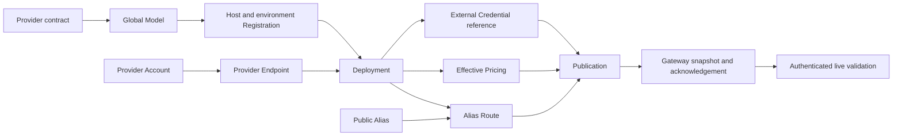

# Onboard an LLM Through `llm-gateway`

This tutorial onboards a hosted model into the Light Portal LLM control plane,
publishes it to a dedicated `llm-gateway`, and validates it through a stable
Public Alias. The worked example uses Groq's `qwen/qwen3.6-27b`, but the same
workflow applies to other hosted or OpenAI-compatible providers, including the
compatible APIs offered by Amazon Bedrock.

Applications must use the Public Alias created in this tutorial. They must not
depend on the provider name, Deployment ID, or physical model ID. That
separation makes later provider and model migrations a routing change instead
of an application release.

> [!IMPORTANT]
> Provider availability, limits, capabilities, and prices change. The Qwen
> values below were verified against Groq's documentation on August 14, 2026.
> Recheck the provider's current model catalog and contract before creating or
> updating records.

## Recommendation for free-tier demos

Groq will stop serving `llama-3.3-70b-versatile` to free and developer-tier
customers on August 16, 2026. Groq recommends either
`openai/gpt-oss-120b` or `qwen/qwen3.6-27b`.

The two replacements have different operational profiles. The published prices
are included because the LLM control plane requires effective Pricing metadata;
they are not the deciding factor for a free-plan development demo.

| Groq model | Lifecycle | Input/output price per 1M tokens | Context / maximum completion | Distinguishing features |
| --- | --- | --- | --- | --- |
| `openai/gpt-oss-120b` | Production | $0.15 / $0.60 | 131,072 / 65,536 | Text generation, reasoning, tool use, JSON modes, and Groq built-in browser/code tools |
| `qwen/qwen3.6-27b` | Preview | $0.60 / $3.00 | 131,072 / 16,384 | Text and image input, reasoning/non-reasoning modes, tool use, JSON Object Mode, vision, multilingual use, and strong coding benchmarks |

For a development host whose main purpose is demonstrating local tool calling,
onboard both models under separate Aliases and select the Alias per agent. Do
not assume that benchmark or marketing claims make either model universally
better at tool calling. In the August 14, 2026 dev-host qualification, both
models produced a valid `get_weather` tool call with `tool_choice` set to
`auto` and `required`. GPT-OSS also accepted an OpenAI named-function
`tool_choice` object and followed a short exact-answer instruction more
predictably. Qwen rejected that named-function form and a request that required
two parallel tool calls, and its normal text response included a visible
`<think>` block. The checked Qwen capability therefore keeps
`parallelTools: false`.

This is one bounded compatibility test, not a general quality ranking. Qwen's
vision and multilingual capabilities may still make it the better Alias for
some agents, while GPT-OSS is a useful default for agents that need predictable
OpenAI-style text and tool behavior. Score both against the product's real tool
schemas, arguments, results, and multi-step conversations.

Qwen's preview lifecycle is acceptable for a non-production demonstration as
long as the demo does not promise an availability SLA. Groq currently lists
Qwen 3.6 27B on its Free Plan with the same published request and token limits
as GPT-OSS 120B: 30 requests per minute, 1,000 requests per day, 8,000 tokens
per minute, and 200,000 tokens per day. Users should verify the exact limits in
their own Groq organization before testing.

Reconsider lifecycle guarantees, paid rates, sustained quotas, privacy,
residency, support, and fallback design when this moves from a demo to a
commercial cloud service. That future production decision does not need to
constrain the free-tier tutorial.

A suitable development migration is therefore:

1. Onboard Qwen as `assistant-qwen` and GPT-OSS as `assistant-gpt-oss`.
2. Run the same tool-calling acceptance matrix against both Aliases.
3. Assign each agent the Alias that passes its workload-specific cases.
4. Keep the existing application Alias stable if users already depend on it.
5. Route that stable development Alias to the selected model only after its
   demo cases pass.

The current Alias Route form fixes weight at `1` and canary percentage at `0`.
Use a separate demo Alias or an external test split; do not claim that
the current control plane performs percentage-based canary routing.

Sources:

- [Groq deprecation schedule](https://console.groq.com/docs/deprecations)
- [Groq supported models](https://console.groq.com/docs/models)
- [Groq Qwen 3.6 27B model page](https://console.groq.com/docs/model/qwen/qwen3.6-27b)
- [Groq GPT-OSS 120B model page](https://console.groq.com/docs/model/openai/gpt-oss-120b)
- [Groq tool-use compatibility](https://console.groq.com/docs/tool-use/overview)
- [Groq Free Plan rate limits](https://console.groq.com/docs/rate-limits)

## What the workflow creates



These records have deliberately different responsibilities:

| Record | Responsibility |
| --- | --- |
| Model | Global provider/model identity, limits, modalities, operations, and static capabilities |
| Registration | Approval to use that Model on one host and in one logical environment |
| Provider Account | Non-secret billing, quota, and capacity ownership |
| Provider Endpoint | Wire protocol, base URL, authentication mode, and network transport |
| Deployment | Exact callable model runtime plus capacity and readiness declarations |
| Credential | Versioned reference to a secret resolved by the gateway; never the secret value |
| Public Alias | Stable client-facing model name and required policy/capability contract |
| Alias Route | Ordered connection from an Alias to a compatible Deployment |
| Pricing | Effective-dated rates for the Deployment operation |
| Publication | Immutable projection delivered to one selected gateway instance |

Policies and Bindings are optional governance records. They are not required
to establish the provider connection or publish a normal public generation
Alias. Add them only when a subject needs policy-based model selection,
budgets, or other supported governance behavior.

## Before you begin

You need:

- permission to manage the global LLM catalog and the selected host's LLM
  records;
- an active `gtw` instance for the target instance environment tag;
- a running dedicated `llm-gateway` that loads
  `com.networknt.llm.gateway-1.0.0` configuration;
- a provider account with permission to use the physical model;
- a protected secret-injection path for the target gateway process; and
- a gateway caller token for the final `/v1/models` and
  `/v1/chat/completions` validation.

Do not put a provider key in Portal, a Model, Endpoint headers, a Deployment,
an Alias, a command line, source control, or this documentation. Portal stores
only a reference such as `env:GROQ_API_KEY`. The provider key is resolved
inside the target gateway process. The bearer token used by an application to
call `llm-gateway` is a different credential.

## 1. Qualify the provider contract

Record the following information from primary provider documentation before
opening Portal:

| Question | Why it matters |
| --- | --- |
| What is the exact physical model ID? | The gateway sends this value upstream without translating the provider's catalog. |
| Is the model production, preview, or deprecated? | Determines rollout and fallback requirements. |
| Which API operation and wire format serve it? | Selects the gateway Provider Protocol. |
| What base URL ends immediately before the operation path? | The gateway appends `/chat/completions`, `/responses`, `/messages`, or `/embeddings`. |
| What authentication scheme is required? | Selects `NONE`, `BEARER`, or `API_KEY`; the current generic client does not sign AWS SigV4 requests. |
| Which regions and data classifications are approved? | Constrains the Registration, Deployment, and Route. |
| What are the context and output limits? | Bounds the Model and Alias. |
| Which modalities and features were actually tested? | Controls declared and required capabilities. |
| What are the current input, output, and cached-input rates? | Creates an auditable Pricing record. |

The current gateway accepts these provider wire contracts:

| Provider Protocol | Gateway appends | Operation |
| --- | --- | --- |
| `openai_chat` | `/chat/completions` | `generate` |
| `openai_responses` | `/responses` | `generate` |
| `anthropic_messages` | `/messages` | `generate` |
| `openai_embeddings` | `/embeddings` | `embed` |

Provider identity and provider protocol are independent. Groq uses Provider
Type `groq` and Provider Protocol `openai_chat`. An OpenAI-compatible Amazon
Bedrock endpoint uses Provider Type `bedrock` and, for Chat Completions,
Provider Protocol `openai_chat`.

Do not select `openai_chat` merely because a provider has an HTTP API. Verify
that it implements the compatible request, response, error, and streaming
contract. Native Bedrock `Converse` and `InvokeModel`, for example, are not
`openai_chat`.

## 2. Prepare the reference catalog

The Model and Deployment forms use dependent reference-data dropdowns. Before
creating the Model, confirm that these values are selectable:

| Reference table | Qwen value | GPT-OSS value |
| --- | --- | --- |
| `model_provider` | `groq` | `groq` |
| `model_name` | `qwen/qwen3.6-27b` | `openai/gpt-oss-120b` |
| `model_family` | `qwen` | `gpt` |

The following active reference relations are also required:

- `provider_name`: from `groq` to each exact model name;
- `model_name_family`: from each model name to its `qwen` or `gpt` family.

The current LLM forms query this catalog without a host parameter, so these
are platform-global catalog values. A host-only reference value will not make
the Model dropdown work. If a value is missing, ask a reference-data/platform
administrator to add the table only if the table itself is absent, then add
the value, its locale label, and both relations. Event-based bootstrap jobs
must query first and generate only the missing aggregates. Do not
substitute a similar model ID; provider IDs are exact and case-sensitive unless
the provider explicitly documents otherwise.

See [Reference Table Admin](../../help/portal-view/pages/ref-table-admin.md) for
the global reference-data model.

## 3. Verify the physical model directly

Use the provider's console or an approved direct probe from the same egress
zone as the gateway. For Groq, first verify that the project can see the exact
model:

```bash
set -euo pipefail
umask 077

provider_header_file=$(mktemp)
trap 'rm -f -- "$provider_header_file"' EXIT
read -rsp 'Groq API key: ' provider_api_key
printf '\n'
printf 'Authorization: Bearer %s\n' "$provider_api_key" >"$provider_header_file"
unset provider_api_key

curl --fail-with-body --silent --show-error \
  --header @"$provider_header_file" \
  --header 'Content-Type: application/json' \
  https://api.groq.com/openai/v1/models
```

Then send one bounded Chat Completions request. It consumes provider quota and
may be billable if the account is not on the Free Plan:

```bash
curl --fail-with-body --silent --show-error \
  --header @"$provider_header_file" \
  --header 'Content-Type: application/json' \
  --data '{
    "model": "qwen/qwen3.6-27b",
    "messages": [{"role": "user", "content": "Reply with exactly: provider-ok"}],
    "reasoning_effort": "none",
    "temperature": 0,
    "max_completion_tokens": 16,
    "stream": false
  }' \
  https://api.groq.com/openai/v1/chat/completions
```

Stop if the model is absent, blocked by organization/project permissions, or
does not accept the required operation. Fix provider access before creating
Portal records. A successful provider probe does not validate gateway
authentication, policy, publication, or routing; it validates only the
upstream premise.

Groq API keys are scoped to the Groq project, not minted per model. The same
`GROQ_API_KEY` can serve Qwen, GPT-OSS, and other models visible to that project
and allowed by its permissions. Create additional keys only for deliberate
rotation, isolation, or separate projects—not because this tutorial creates a
second Deployment.

## 4. Create the global Model

Open **Marketplace > LLM Model Catalog**, choose **Create**, and enter:

| Field | Qwen example |
| --- | --- |
| Provider Type | `groq` |
| Physical Model Id | `qwen/qwen3.6-27b` |
| Model Family | `qwen` |
| Model Version | Leave empty unless the provider publishes a separate stable version identifier |
| Context Token Limit | `131072` |
| Output Token Limit | `16384` |
| Modalities | `["text", "image"]` |
| Operations | `["generate"]` |

Use this conservative static capability contract:

```json
{
  "operations": ["generate"],
  "generation": {
    "content": {
      "text": true,
      "images": true,
      "tools": true,
      "parallelTools": false,
      "structuredJson": true,
      "reasoningUsage": false
    },
    "streaming": true
  }
}
```

The Qwen model page documents vision, tool use, JSON Object Mode, reasoning,
and text output. This contract deliberately leaves `parallelTools` and
`reasoningUsage` false because the checked Groq path rejected the parallel
two-tool case and exposed reasoning inside normal message content. Declared
capability means the provider path is allowed to satisfy that requirement; it
is not descriptive marketing metadata. Set a capability to `true` only after
the full gateway path proves the exact behavior required by the application.

Choose **Apply** after editing each structured JSON or YAML value, then create
the Model. See [Create LLM Model](../../help/portal-view/pages/create-llm-model.md)
for editor behavior and field-level troubleshooting.

## 5. Create the host Registration

Open **Administration > GenAI Admin > LLM Models**, select the target host, and
open **Registrations**. Choose **Create registration**.

Use:

- LLM Model: the new `groq / qwen/qwen3.6-27b` catalog Model;
- Environment: the logical LLM environment served by the target gateway, such
  as `dev` or `prod`;
- Regions: empty for Groq's public global endpoint unless an approved provider
  region is part of the contract;
- Data Classifications: only classifications approved for this provider path;
- Capability Restrictions: `{}` unless the host must narrow the global Model
  contract.

The Registration environment must match the Public Alias environment and the
logical environment of the selected gateway instance at publication time.

## 6. Create or reuse the Provider Account

Open **Accounts**. Reuse an existing Groq Account only when it represents the
same billing principal and quota pool. Otherwise create one with values such
as:

```json
{
  "accountName": "groq-developer",
  "providerType": "groq",
  "billingPrincipal": "groq-project-llm-platform",
  "quotaGroupId": "groq-developer-capacity",
  "capacityMetadata": {
    "modelLifecycle": "preview"
  }
}
```

`billingPrincipal` and `quotaGroupId` are operator-assigned governance names,
not secrets. Record actual approved rate-limit metadata when useful; do not
copy catalog defaults that differ from the account's real limits.

See [Create Provider Account](../../help/portal-view/forms/create-provider-account.md).

## 7. Create or reuse the Provider Endpoint

One Groq OpenAI-compatible Endpoint can be reused by compatible Groq chat
Deployments under the same Provider Account. In **Provider Endpoints**, use:

```json
{
  "endpointName": "groq-openai-chat-public",
  "providerProtocol": "openai_chat",
  "baseUrl": "https://api.groq.com/openai/v1",
  "headers": {},
  "endpointAuthMode": "BEARER",
  "apiKeyHeader": null,
  "networkProfileMode": "PUBLIC_TLS",
  "networkTermination": "NATIVE",
  "networkZoneId": null,
  "trustBundleReference": null,
  "poolIdleTimeoutMs": 30000,
  "clientRefreshIntervalMs": 300000,
  "plaintextRiskAcknowledged": false
}
```

Select the Provider Account created or reused in the previous step. Do not add
`/chat/completions` to `baseUrl`; the gateway appends it. Do not add an
`Authorization` header or API key. The Credential supplies the bearer token at
runtime.

See [Create Provider Endpoint](../../help/portal-view/forms/create-llm-provider-endpoint.md).

## 8. Create the Deployment

In **Deployments**, select the new Registration, Groq Account, and Groq
Endpoint. Use a distinct Deployment rather than rewriting the existing Llama
Deployment:

```json
{
  "deploymentName": "groq-qwen3-6-27b-dev",
  "providerType": "groq",
  "providerProtocol": "openai_chat",
  "physicalModelId": "qwen/qwen3.6-27b",
  "baseUrl": "https://api.groq.com/openai/v1",
  "deploymentRevisionId": "groq-qwen3-6-27b-dev/r1",
  "physicalRuntimeId": "groq/qwen-qwen3-6-27b",
  "capacityDomainId": "groq-developer-capacity",
  "runtimeCapacity": {
    "maxParallelRequests": 2,
    "maxQueuedRequests": 32,
    "coldStartTimeoutMs": 30000,
    "streamSetupTimeoutMs": 10000,
    "requestTimeoutMs": 120000
  },
  "readinessPolicy": "IMMEDIATE",
  "expectedSidecar": null,
  "region": null,
  "transportBounds": {}
}
```

Capacity values are bounded starting assumptions, not a claim about Groq
entitlement. Set them from measured latency, the selected account's rate
limits, and the application's timeout budget. Increase
`deploymentRevisionId` when the callable runtime contract changes.

See [Create Provider Deployment](../../help/portal-view/forms/create-provider-deployment.md).

## 9. Provision and reference the Credential

Provision `GROQ_API_KEY` in the secret manager or protected environment of the
target `llm-gateway` workload. In the local `portal-config-loc` and
`portal-config-dev` Compose paths, the key can be supplied through the private
`~/.config/lightapi/light-portal.env` file and is passed to the dedicated
`llm-gateway` container. Never commit that file or print its value.

An `ENDPOINT` credential belongs to the shared endpoint contract. Before
creating anything, look for an active credential with the same host, Provider
Endpoint, and Credential Version. Reuse it for every compatible Groq
Deployment. Do not create one credential per model or Deployment; the control
plane enforces endpoint/version uniqueness.

If no matching endpoint credential exists, create one in **Credentials**:

| Field | Value |
| --- | --- |
| Credential Purpose | `ENDPOINT` |
| Provider Endpoint | `groq-openai-chat-public` |
| Provider Deployment | Select one Deployment attached to the Endpoint if the form requires it; resolution remains endpoint-level |
| Credential Version | `1` |
| Secret Reference | `env:GROQ_API_KEY` |
| Effective Time | A current or earlier ISO-8601 UTC timestamp |
| Expiration Time | Empty unless the provider key has a known expiry |

Restart or explicitly reload the gateway after changing its injected secret.
Portal cannot determine whether the referenced environment variable exists.

See [Create Provider Credential](../../help/portal-view/forms/create-provider-credential.md).

## 10. Create a demo Alias and Route

In **Aliases**, create a new Alias for the tool-calling demo:

```json
{
  "environment": "dev",
  "aliasName": "assistant-qwen",
  "operations": ["generate"],
  "requiredCapabilities": {
    "tools": true,
    "streaming": true
  },
  "requireExpectedEmbeddingSpace": false,
  "embeddingWorkloadLane": "standard",
  "maxInputTokens": 65536,
  "maxOutputTokens": 16384,
  "maxRequestBytes": 1048576,
  "dataClassification": "internal",
  "loggingMode": "METADATA",
  "piiMode": "REDACT",
  "aliasVisibility": "PUBLIC"
}
```

Adjust classification, logging, PII handling, and visibility to the workload's
approved policy. The conservative input bound leaves substantial room for the
completion inside the provider context window; applications may choose lower
limits.

In **Routes**, connect `assistant-qwen` to
`groq-qwen3-6-27b-dev`:

```json
{
  "routePriority": 0,
  "routeWeight": 1,
  "fallbackEnabled": false,
  "canaryPercent": 0,
  "residencyConditions": {}
}
```

The form supplies the selected Alias and Deployment UUIDs. A Route is not
eligible until the Deployment also has an effective Credential and Pricing.

See [Create Public Alias](../../help/portal-view/forms/create-public-alias.md)
and [Create Alias Route](../../help/portal-view/forms/create-alias-route.md).

## 11. Create effective Pricing

In **Pricing**, select the Qwen Deployment and enter the rates verified on the
Groq model page:

```json
{
  "operation": "generate",
  "pricingVersion": 1,
  "pricingBasis": "EXTERNAL_PROVIDER",
  "inputMicrosPerMillion": 600000,
  "outputMicrosPerMillion": 3000000,
  "effectiveTs": "2026-08-14T00:00:00Z",
  "expiresTs": null,
  "source": "https://console.groq.com/docs/model/qwen/qwen3.6-27b",
  "approvedBy": "llm-platform-owner"
}
```

Rates are integer micros per one million tokens: one currency unit is
`1,000,000` micros. Leave Cached Input Micros empty because the cited Qwen
page does not publish a cached-input rate. Replace the values when the
provider contract changes, create a new Pricing Version, and publish again.

See [Create Pricing Version](../../help/portal-view/forms/create-pricing-version.md).

### Repeat the records for GPT-OSS

Reuse the same Groq Provider Account, Endpoint, and active endpoint Credential.
Create separate Model, Registration, Deployment, Pricing, Alias, and Route
records with these differences:

| Field | GPT-OSS value |
| --- | --- |
| Physical Model Id | `openai/gpt-oss-120b` |
| Model Family | `gpt` |
| Context / Output Token Limit | `131072` / `65536` |
| Modalities / Operations | `["text"]` / `["generate"]` |
| Deployment Name | `groq-gpt-oss-120b-dev` |
| Runtime Capacity | Start with `maxParallelRequests: 2` |
| Alias | `assistant-gpt-oss` |
| Alias Input / Output Limit | `65536` / `32768` |
| Input / Output Micros per Million | `150000` / `600000` |

Use the same conservative generation capability object as Qwen except set
`images: false`. Keep `parallelTools: false` until a workload-specific
parallel test passes through the full gateway path.

## 12. Generate and publish the gateway projection

Open **Publication** in the LLM Model Control Plane:

1. Select the target **Instance Env Tag**.
2. Select the active `gtw` **LLM Gateway Instance**.
3. Confirm that the displayed **LLM environment** matches the Registration and
   Alias environment.
4. Choose **Generate from active records**.
5. Review the read-only V3 projection. It must contain the exact model ID,
   `openai_chat`, the Groq base URL, declared capabilities, Alias Route,
   effective Pricing, and only the credential reference.
6. Confirm that no raw provider key appears anywhere in the preview.
7. Choose **Publish to instance**.
8. Create and promote the corresponding configuration snapshot, then reload or
   restart the selected gateway as required by the deployment.
9. Confirm that the intended running replica has an `ACKNOWLEDGED` publication
   with the expected publication ID and root digest. Do not send an upstream
   validation request while acknowledgement is absent, `PENDING`, `FAILED`, or
   `DIVERGENT`.

Publication proves that the configuration is internally consistent and was
delivered. It does not prove that Groq accepted a request or that the model
meets the workload's quality requirements.

The Portal V3 publication path requires a frozen replica inventory and
acknowledgement. A development Compose repository may instead provide a
reviewed, importable instance-publication event and a scoped snapshot-refresh
script. Use that repository's supported workflow only for the exact host,
environment, service, and instance; the normal operator path remains the
Portal UI.

## 13. Validate through the live gateway

Prepare a protected header file containing the gateway caller token. This is
not `GROQ_API_KEY`:

```bash
set -euo pipefail
umask 077

gateway_header_file=$(mktemp)
trap 'rm -f -- "$gateway_header_file"' EXIT
read -rsp 'Gateway client bearer token: ' gateway_client_token
printf '\n'
printf 'Authorization: Bearer %s\n' "$gateway_client_token" >"$gateway_header_file"
unset gateway_client_token
```

List the Aliases visible to this caller:

```bash
curl --fail-with-body --silent --show-error \
  --header @"$gateway_header_file" \
  --cacert /path/to/gateway-ca.pem \
  https://localhost:8444/v1/models
```

Then send a small request through the Alias:

```bash
curl --fail-with-body --silent --show-error \
  --header @"$gateway_header_file" \
  --header 'Content-Type: application/json' \
  --cacert /path/to/gateway-ca.pem \
  --data '{
    "model": "assistant-qwen",
    "messages": [{"role": "user", "content": "Reply with exactly: gateway-ok"}],
    "temperature": 0,
    "max_tokens": 512,
    "stream": false
  }' \
  https://localhost:8444/v1/chat/completions
```

Because this demo depends on tool calling, also send a request containing a
realistic function schema:

```bash
curl --fail-with-body --silent --show-error \
  --header @"$gateway_header_file" \
  --header 'Content-Type: application/json' \
  --cacert /path/to/gateway-ca.pem \
  --data '{
    "model": "assistant-qwen",
    "messages": [{
      "role": "user",
      "content": "Use the supplied tool to get the status of the MCP demo."
    }],
    "tools": [{
      "type": "function",
      "function": {
        "name": "get_demo_status",
        "description": "Get the readiness status of a product demo feature.",
        "parameters": {
          "type": "object",
          "properties": {
            "feature": {
              "type": "string",
              "enum": ["mcp", "workflow"]
            }
          },
          "required": ["feature"],
          "additionalProperties": false
        }
      }
    }],
    "tool_choice": "required",
    "temperature": 0,
    "max_tokens": 512,
    "stream": false
  }' \
  https://localhost:8444/v1/chat/completions
```

The response must contain `choices[0].message.tool_calls`, select
`get_demo_status`, and encode `{"feature":"mcp"}` as valid JSON arguments.
For full acceptance, let the application execute the tool, append the returned
assistant message and a `tool` message with the matching `tool_call_id`, then
send the conversation back through the same Alias. The model must consume the
tool result and either produce the final answer or request the next valid tool.

Use the real production origin and system trust store in production. Never use
`-k`, disable certificate verification, or point the client at the provider
URL. A successful response proves one normal routed request through gateway
authentication, authorization, Alias selection, credential resolution,
provider dispatch, response decoding, usage, pricing, and audit.

For the checked local smoke suite, use:

```bash
cd /home/steve/workspace/light-portal-test
make llm LLM_PUBLIC_ALIAS=assistant-qwen
```

The suite consumes provider quota and may be billable depending on the account
plan. Keep load and token counts bounded.

## 14. Run a workload acceptance matrix

Test the behavior the application actually uses, not only a greeting:

| Area | Minimum evidence |
| --- | --- |
| Basic chat | Representative prompts return usable answers without unsupported fields. |
| Streaming | Valid SSE frames terminate cleanly and preserve usage/audit behavior. |
| Tool calling | Tool names and JSON arguments are valid; required and parallel-tool cases behave as declared. |
| Structured output | Required JSON mode/schema behavior is valid for the selected protocol. |
| Reasoning controls | If provider-specific reasoning controls are exposed and policy-allowlisted, supported values behave correctly and hidden reasoning is not exposed unexpectedly. |
| Vision | Required image formats, sizes, counts, and response behavior pass if the workload uses images. |
| Context/output limits | Requests near the approved application bounds fail or complete predictably. |
| Safety and PII | Prompt-injection, sensitive-data, logging, and redaction expectations pass. |
| Reliability | Rate limits, timeouts, cancellation, retryability, and fallback behavior are understood. |
| Quality | A fixed representative tool set is scored against both Qwen and GPT-OSS before assigning an agent Alias. |
| Quota/latency | Observed token use, time to first token, and completion latency fit the Free Plan demo limits. |

If a test fails, narrow the declared capabilities or fix the provider path. Do
not leave an unproven capability set to `true` merely to make an Alias eligible.

## 15. Promote on the development host

After the replacement passes:

1. Ensure the stable development Alias has a compatible Qwen
   Deployment, effective Credential, and Pricing.
2. Move the old primary Route to a higher unique priority and mark it as a
   fallback, or remove it if it can no longer serve traffic.
3. Add Qwen at priority `0` with fallback disabled.
4. A fallback is optional for a non-production demo. If continuity matters,
   use another currently served and tested model rather than the
   soon-to-be-decommissioned Llama model.
5. Generate a fresh projection, inspect the route order, publish, promote the
   snapshot, and confirm replica acknowledgement.
6. Run the same smoke request through the unchanged stable Alias.
7. Retain the old records for audit until the rollback window closes; do not
   rewrite the Qwen Deployment to represent another physical model.

After August 16, 2026, `llama-3.3-70b-versatile` is not a functional rollback
for affected Groq tiers. Complete the replacement and fallback publication
before the shutdown date.

## Adapt the workflow to Amazon Bedrock

Amazon Bedrock now offers OpenAI-compatible Chat Completions and Responses APIs
and an Anthropic-compatible Messages API. Prefer the `bedrock-mantle` endpoint
when the selected model supports it. The Portal mapping for compatible Chat
Completions is:

| Portal field | Bedrock-compatible value |
| --- | --- |
| Provider Type | `bedrock` |
| Provider Protocol | `openai_chat` |
| Base URL | `https://bedrock-mantle.{region}.api.aws/v1` |
| Endpoint Authentication | `BEARER` |
| Secret Reference | `env:AWS_BEARER_TOKEN_BEDROCK` |
| Region | The approved AWS Region |
| Physical Model Id | Exact model or inference-profile ID returned for that endpoint/account |

Use an Amazon Bedrock API key for this generic bearer path. The current
`llm-gateway` provider client can send no authentication, bearer authentication,
or an API key in `authorization`/`x-api-key`; it does not generate AWS SigV4
signatures. If the selected Bedrock model is available only through native
`Converse`/`InvokeModel`, or organizational policy requires SigV4, configuration
alone is insufficient. First deploy an approved TLS adapter/sidecar that
exposes one of the supported gateway protocols, or add and qualify a native
provider adapter. Never mislabel the native Bedrock API as `openai_chat`.

Bedrock model IDs, inference profiles, regional availability, capabilities,
and pricing are account- and region-specific. Discover them from the chosen
endpoint and AWS account, then create the reference values, global Model,
Registration, Account, Endpoint, Deployment, Credential, Alias, Route, and
Pricing exactly as above.

See:

- [Amazon Bedrock endpoints](https://docs.aws.amazon.com/bedrock/latest/userguide/endpoints.html)
- [Amazon Bedrock API compatibility by model](https://docs.aws.amazon.com/bedrock/latest/userguide/models-api-compatibility.html)
- [Amazon Bedrock Chat Completions](https://docs.aws.amazon.com/bedrock/latest/userguide/inference-chat-completions-mantle.html)
- [Local Model Provider Transport](../../design/light-gateway/local-model-provider-transport.md)

## Troubleshooting

| Symptom | Likely cause and correction |
| --- | --- |
| Provider, model, or family dropdown is empty | Add the missing global reference value, locale, `provider_name` relation, and `model_name_family` relation. |
| Provider returns 404 | Check the exact base URL and physical model ID. The base URL must not already contain the operation path. |
| Provider returns 401 or 403 | Confirm model permission and that the provider key is injected into the selected `llm-gateway` process under the variable named by `secretReference`. |
| Publish reports no eligible Credential | Check purpose, Endpoint/Deployment references, version, database-clock effective time, and expiration. |
| Publish reports no effective Pricing | Create a `generate` price for a chat/responses/messages Deployment and make its effective window current. |
| Route is incompatible | Align host, logical environment, provider type, physical model, protocol operation, Registration restrictions, and required capabilities. |
| Gateway returns Alias not found | Confirm the caller can see the Alias and the intended acknowledged snapshot is active on that replica. |
| Gateway returns 503 after publication | Inspect the complete projection and gateway logs. One malformed Deployment capability/protocol/pricing contract can invalidate configuration beyond the new Alias. |
| Gateway reports `LLM_CONFIG_INVALID` | Inspect every provider in the published snapshot. A missing environment variable such as an unused provider's secret reference can invalidate the complete router; omit that provider from the snapshot or inject its secret. |
| Qwen returns a provider 400 for tool choice | Use the portable string form `"tool_choice":"auto"` or `"required"`; the checked Groq Qwen path rejected a named-function object. |
| Qwen exhausts a small output budget or returns `<think>` text | Reasoning can consume completion tokens and may appear in message content. Allow a bounded larger completion budget and make the application handle or reject visible reasoning explicitly. |
| A parallel tool request fails | Keep `parallelTools: false`, avoid requiring parallel calls on the Alias, and sequence tool calls until the exact provider/model path is qualified. |
| A provider-specific request field is rejected | The gateway rejects unknown extensions by default. Use only a reviewed field explicitly permitted by the applicable native-extension Policy, or omit it. |
| Structured JSON editor looks correct but Create is disabled | Choose **Apply** to commit the JSON/YAML draft to the form model. |
| Secret appears in a preview, event, log, or ticket | Stop, revoke and rotate it, remove the exposed material through the approved incident process, and retain only an external reference. |

For the complete control-plane record order and publication behavior, see
[LLM Model Control Plane](../../help/portal-view/pages/llm-model-control-plane.md).
