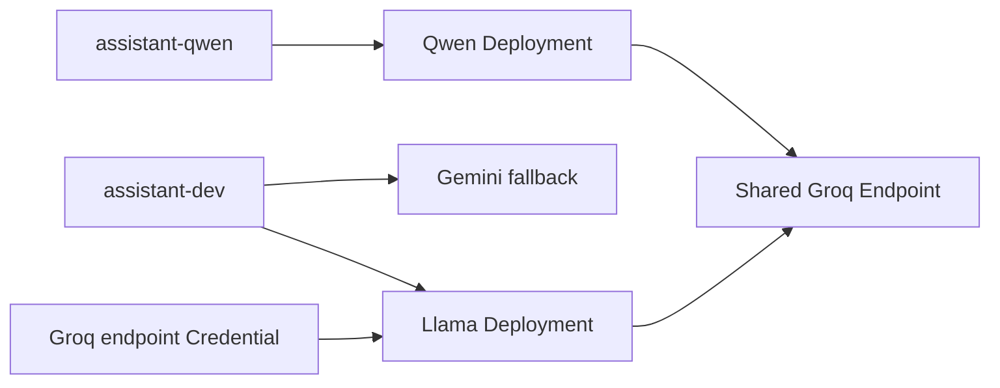

# Retire an LLM from `llm-gateway`

This tutorial removes a provider model from active routing without changing the
model name used by applications. The worked example retires Groq's
`llama-3.3-70b-versatile` before its August 16, 2026 decommission date and
moves the existing `assistant-dev` Alias to `qwen/qwen3.6-27b`.

Use the same workflow for a Bedrock model, a provider migration, or any other
model lifecycle change. The important sequence is always **qualify, cut over,
publish, validate, delete, and publish again**. Do not begin with Delete.

Applications and agents should call a stable Public Alias such as
`assistant-dev`. If they call a physical model ID directly, change them to an
Alias before retiring the model.

## What retirement means

Retirement is a soft deletion from the active LLM control-plane configuration. It
preserves event history for audit and replay, but excludes the retired records
from new publications.

Deleting a global Model also soft-deletes its active dependent records:

- Model Registrations;
- Provider Deployments;
- Alias Routes that still target those Deployments;
- Provider Credentials that still belong to those Deployments; and
- Pricing Versions for those Deployments.

The cascade is useful for model-exclusive data, but it makes deletion the last
step. Move every shared or reusable dependency first.

> [!WARNING]
> A Credential is resolved through a Provider Endpoint, but the control-plane
> record also belongs to a Provider Deployment. If the active Credential still
> names the retiring Deployment, deleting the Model deactivates that
> Credential and can break other models using the same Endpoint. Reassign or
> replace the Credential before deleting the Model.

Do not delete a shared Provider Account or Provider Endpoint when only one
model is retiring. Do not delete the model's global reference-table values or
locale labels merely to hide an inactive model; they can be needed for event
history, audit, and replay.

## 1. Inventory the dependency graph

Open **Administration > GenAI Admin > LLM Models**, select the target host and
environment, and identify:

1. the global Model and its current Aggregate Version;
2. every Registration for that Model;
3. every Deployment under those Registrations;
4. every Alias Route targeting those Deployments;
5. every Credential and Pricing Version attached to those Deployments; and
6. every Agent, policy binding, workflow, or test that uses the affected
   Public Alias.

Record the current publication version and export or retain a tested event
baseline before changing anything. Aggregate versions shown in the control
plane are required for update and delete commands; do not guess them from an
older event file.

For the Groq example, the initial relationships are:



The Alias Route and Credential must move from the Llama Deployment to the
Qwen Deployment before Llama is deleted.

## 2. Qualify the replacement

Complete [Onboard an LLM Through llm-gateway](./llm-gateway.md) for the
replacement model before changing an existing Alias. Confirm that its Model,
Registration, Deployment, Credential, Pricing, Alias, and Route are active.

Publish the replacement under a temporary or model-specific Alias, then run
the acceptance cases used by the real agents:

- a normal non-streaming response;
- a streaming response;
- every required tool schema and representative arguments;
- the tool-result continuation turn;
- structured JSON, if used;
- input and output limits; and
- expected provider errors, timeouts, and rate limits.

Do not infer compatibility from a provider benchmark. Retirement is safe only
after the replacement passes the application's actual request shapes.

## 3. Cut over the stable Alias

In **Alias Routes**, update the route that currently targets the retiring
Deployment:

| Field | Groq example |
| --- | --- |
| Public Alias | existing `assistant-dev` Alias |
| Provider Deployment | `groq-qwen3-6-27b-dev` |
| Route Priority | `0` |
| Route Weight | `1` |
| Fallback Enabled | `false` |
| Canary Percent | `0` |

Keep the existing Alias ID. Consumers should not need configuration or code
changes. If a second compatible route remains, verify its priority explicitly;
do not rely on row insertion order.

If the replacement has lower context or output limits, update the Public Alias
limits before the cutover or ensure callers already stay within the replacement
contract.

## 4. Preserve shared credentials

If the retiring Deployment owns a Credential needed by a retained model, use
one of these approaches:

- update the existing Credential so `Provider Deployment` names a retained
  Deployment on the same Endpoint; or
- create a new active Credential version for the retained Deployment and
  verify it is the effective Endpoint credential.

Keep `Provider Endpoint`, `Credential Purpose`, and the external secret
reference consistent unless this change also rotates credentials. For the
Groq example, the reference remains `env:GROQ_API_KEY`; no API key value is
stored in Portal or in an event file.

Before proceeding, confirm the retained Qwen and GPT-OSS Deployments resolve an
active, effective, unexpired Credential through the shared Groq Endpoint.

## 5. Publish and validate the cutover

Open **Publication**, regenerate the candidate, validate it, and publish it to
the selected `llm-gateway` instance. Check that:

- `assistant-dev` resolves to the replacement Deployment first;
- the retiring Deployment is no longer referenced by an active route;
- provider, credential, pricing, and capability validation succeeds; and
- the target gateway starts from the promoted snapshot or successfully reloads
  `llm-router`.

Call `/v1/models` and `/v1/chat/completions` through `llm-gateway` with the
stable Alias. Repeat the agent tool-calling tests. Keep this routed state for a
short observation window when the environment is shared with other users.

If validation fails, move the Alias Route back to the previous Deployment and
publish again. This is the simplest rollback and is available only while the
provider still serves the old model.

## 6. Delete the global Model

After the stable Alias is proven on the replacement, open **LLM Models**, find
the exact provider and physical model ID, and choose **Delete**. Confirm the
current Aggregate Version.

For this example, delete only:

```text
providerType: groq
physicalModelId: llama-3.3-70b-versatile
```

Do not delete `qwen/qwen3.6-27b`, `openai/gpt-oss-120b`, the Groq Provider
Account, or the shared Groq Endpoint.

The delete event deactivates the Model and any dependents that still point to
its Deployment. Verify that the previously moved Alias Route and Credential
remain active. If they were unexpectedly deactivated, stop and repair the
control-plane rows before publishing.

## 7. Publish the retired state

Generate and publish the next immutable gateway revision. The candidate must:

- omit the retired Model and Deployment;
- omit its inactive Registration and Pricing;
- retain the replacement routes and effective credentials;
- contain no Alias that references the retired Deployment; and
- pass the expected provider, deployment, and Alias counts.

Validate `/v1/models`, normal generation, streaming, and tool calling once
more. A database row marked inactive is not sufficient: retirement is complete
only when the gateway is running a publication that no longer contains the
model.

## 8. Preserve the local baseline

Portal control-plane changes are authored and validated only in the local
`portal-config-loc/all-in-lt` database. Import the reviewed retirement event
file there, verify the read models and live gateway behavior, and then export a
new global snapshot to recreate the canonical `events.json`.

Use that exported `events.json` to recreate the databases for
`portal-config-dev` and `light-portal-install`. Do not maintain a separate
development-only copy of the LLM gateway control-plane records; those
environments are downstream consumers of the local global snapshot.

After recreating a database, verify that event replay produces the same active
Models, Deployments, Aliases, Routes, Credentials, Pricing Versions, and latest
publication as the local baseline.

## Event-file checklist

An import-ready retirement event file normally contains, in this order:

1. updates or creates that move routes and credentials to retained
   Deployments;
2. `LlmModelDeletedEvent` with the Model's current Aggregate Version; and
3. `LlmGatewayInstancePublicationCreatedEvent` containing the post-retirement
   properties and the next application version.

Before import, validate that:

- every randomly generated event or entity ID is UUID v7, while deterministic
  publication IDs match the control-plane derivation contract;
- `subject`, payload identity, Aggregate Type, and versions agree;
- update/delete versions match the current local event streams;
- the importer will allocate each `nonce: "0"` sentinel atomically;
- event IDs and subject/version pairs do not already exist; and
- the publication contains neither the retired Deployment nor a stale Alias
  route to it.

Generate the file from current local read models immediately before the
change. A previously generated retirement file becomes stale as soon as one of
its aggregates or the publication version changes.

## Rollback after deletion

Deleting the Model cascades across several independently versioned aggregates.
Updating only the Model does not reactivate all of them. A rollback after
deletion therefore requires either:

- explicit, version-correct reactivation or recreation of the Model and every
  required dependent aggregate, followed by a new publication; or
- restoration and replay of a previously tested canonical event baseline.

Prefer routing rollback before deletion. Once the provider's decommission date
passes, the old physical model is not a usable fallback even if its Portal
records are restored.
